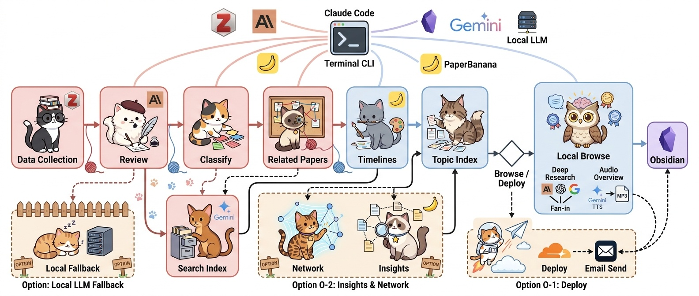
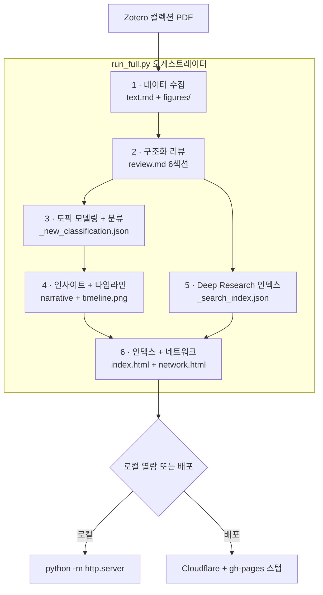
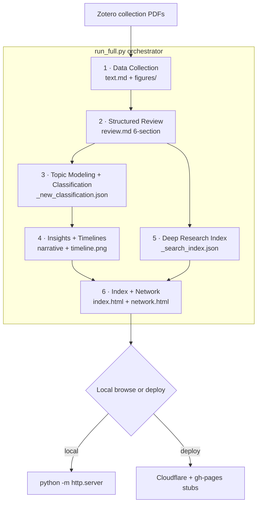

# Paper Curation

**Zotero에 논문 PDF만 모아두었다면, 나머지는 자동입니다.**

논문 수백 편을 한국어 구조화 리뷰로 변환하고, AI가 자동 분류하고, 자연어로 질문하면 논문을 근거로 답변하는 **개인 연구 지식 시스템**을 만듭니다. 로컬에서 동작하며 배포는 선택입니다.

<a href="#english">English</a>

---

## 이런 걸 할 수 있습니다

| 기능 | 설명 |
|------|------|
| **구조화 리뷰** | PDF에서 텍스트/Figure를 추출하고, Claude가 Essence-Motivation-Achievement-How-Originality-Evaluation 6개 섹션의 한국어 리뷰를 자동 작성 |
| **자동 분류** | Bottom-up 토픽 모델링(HDBSCAN + UMAP)으로 카테고리를 자동 생성하고 논문을 분류 |
| **Deep Research** | 자연어 질의 + 임베딩 검색 + Claude 답변. 논문 원문까지 참조하여 정량적 디테일 포함 |
| **타임라인 시각화** | 카테고리별 연구 동향 내러티브 + 다이어그램 자동 생성 (PaperBanana) |
| **네트워크 시각화** | UMAP 2D/3D 인터랙티브 네트워크. 카테고리 필터, Ego Network, Hub/Bridge 하이라이트 |
| **지식 축적** | Obsidian 연동으로 메모가 다음 질의에 반영되는 compounding knowledge |
| **논문 검색/등록** | arXiv, Semantic Scholar, OpenAlex 병렬 검색 + Zotero 자동 등록 (선택) |

**필요한 것**: Zotero 컬렉션 + PDF + API 키 (Anthropic, Google, OpenAI)

---

## 설치: 명령어 한 줄

[Claude Code](https://claude.ai/code)에서 아래 한 줄이면 클론, 의존성 설치, Zotero 연결, 첫 파이프라인 실행까지 자동으로 완료됩니다:

> *"여기에 paper-curation을 설치해줘: https://github.com/jehyunlee/paper-curation"*

<details>
<summary><b>수동 설치</b></summary>

```bash
git clone https://github.com/jehyunlee/paper-curation.git
cd paper-curation
pip install anthropic google-genai openai numpy pymupdf Pillow requests opendataloader-pdf
python pipeline/setup.py
```

`setup.py`가 대화형으로 config.json 생성, Zotero 연결 테스트, API 키 확인, 첫 파이프라인 실행을 안내합니다.

</details>

### 사전 준비

- **Zotero**: [API Key 발급](https://www.zotero.org/settings/keys) + 큐레이션할 컬렉션에 논문 PDF 준비
- **환경변수**: `ANTHROPIC_API_KEY`, `GOOGLE_API_KEY`, `OPENAI_API_KEY`
- **Python 3.14 권장** (3.12+ 동작). macOS 표준 셋업은 conda env `py314` — UMAP/HDBSCAN/sentence-transformers 휠 모두 3.14 지원. Windows 에서 Smart App Control 이 numba/llvmlite DLL 을 차단하면 Python 3.12 전용 fallback env 가 필요할 수 있음.

---

## 워크플로우





### 1. 데이터 수집

| | 설명 |
|---|---|
| **입력** | <ul><li>Zotero 컬렉션의 PDF</li><li>선택: arXiv / Semantic Scholar / OpenAlex 병렬 검색 + Zotero 자동 등록</li></ul> |
| **처리** | <ul><li>PyMuPDF로 텍스트 추출</li><li>Figure 렌더링 (3× zoom, 최대 5장)</li><li>Gemini가 Figure 품질 검증</li></ul> |
| **출력** | <ul><li><code>papers/{slug}/text.md</code></li><li><code>papers/{slug}/figures/*.webp</code></li></ul> |

### 2. 구조화 리뷰

| | 설명 |
|---|---|
| **입력** | 추출된 텍스트 + Figure |
| **처리** | <ul><li>Claude Haiku가 한국어 리뷰 6개 섹션 작성 (Essence · Motivation · Achievement · How · Originality · Evaluation)</li><li>기술 용어는 원문 그대로 유지</li><li>병렬 4건 동시 처리</li></ul> |
| **출력** | <ul><li><code>papers/{slug}/review.md</code></li><li><code>papers/{slug}/index.html</code></li></ul> |
| **활용** | 브라우저에서 리뷰 열람, Figure 인라인 표시, Related Papers 자동 연결 |

### 3. 토픽 모델링 + 분류

| | 설명 |
|---|---|
| **입력** | 전체 리뷰의 Essence + Title |
| **처리** | Bottom-up, LLM 호출 최소화:<ul><li>SPECTER2 임베딩 → HDBSCAN fine-grained 클러스터링</li><li>TF-IDF 키워드 추출 → Claude Sonnet이 클러스터 작명</li><li>Ward linkage로 카테고리 그룹핑</li><li>논문당 1~3개 카테고리 복수 분류 (Node-based Hybrid C: KNN-vote primary + qualified-vote multi)</li></ul> |
| **출력** | <ul><li><code>_new_classification.json</code></li><li><code>_papers_index.json</code></li></ul> |

### 4. 인사이트 + 타임라인

| | 설명 |
|---|---|
| **입력** | 카테고리별 논문 목록 + 리뷰 |
| **처리** | <ul><li>Claude Sonnet이 카테고리 요약·세부 주제·카테고리 간 논문 연결 관계 추출</li><li>Claude Opus가 카테고리별 연구 동향 내러티브 작성</li><li>PaperBanana가 타임라인 다이어그램 자동 생성</li></ul> |
| **출력** | <ul><li><code>_category_summaries.json</code></li><li><code>_timeline_narrative.json</code></li><li><code>category_timeline_*.png</code></li></ul> |

### 5. Deep Research 인덱스

| | 설명 |
|---|---|
| **입력** | 전체 리뷰 + 개인 메모(<code>notes/</code>) |
| **처리** | <ul><li>Section-aware chunking</li><li>OpenAI <code>text-embedding-3-small</code> 임베딩 (int8 L2 양자화)</li><li>개인 메모도 인덱싱되어 다음 질의에 반영</li></ul> |
| **출력** | <code>_search_index.json</code> |
| **활용** | 토픽 페이지에서 자연어 질의 → 임베딩 유사도 검색 → Claude(Extended Thinking)가 논문 근거 답변 생성 |

### 6. 인덱스 + 네트워크

| | 설명 |
|---|---|
| **입력** | 전체 분류 + 리뷰 + 타임라인 + UMAP 좌표 |
| **처리** | <ul><li>카테고리 카드·검색·타임라인·Deep Research UI를 하나의 HTML로 조립</li><li>UMAP 2D/3D 좌표로 D3.js + Three.js 인터랙티브 네트워크 생성</li></ul> |
| **출력** | <ul><li><code>{topic}/index.html</code></li><li><code>{topic}/network.html</code></li></ul> |
| **활용** | <code>cd docs && python -m http.server 8000</code> → 브라우저에서 바로 사용 |

### 배포 (선택)

로컬 사용이 기본입니다. 외부 공유가 필요하면 **3-계층 split-host** 구조로 자동 배포됩니다:

| 계층 | 역할 | 내용 |
|------|------|------|
| **Cloudflare Workers (Static Assets)** | 사용자 콘텐츠 서빙 | `docs/` 전체 업로드 (`docs/.assetsignore`로 로컬 전용 토픽 제외) |
| **GitHub `gh-pages` 브랜치** | 진입 URL → Cloudflare 리다이렉트 | 토픽별 리다이렉트 스텁 (1KB 미만), `jehyunlee.github.io/paper-curation/{topic}/` → `workers.dev/{topic}/` |
| **GitHub `master` 브랜치** | 코드·설정·README | 대용량 `docs/papers/`, `docs/{topic}/` 콘텐츠는 `.gitignore`로 제외 |

```bash
# 배포 (환경변수 필요: CF_API_TOKEN + CLOUDFLARE_ACCOUNT_ID)
PYTHONUTF8=1 python pipeline/run_full.py --topic my_topic --mode deploy
```

자동 처리:
- PNG → WebP 변환 (용량 ~60% 절감)
- 배포용 HTML에서 API 키 제거 후 로컬 working tree 자동 복원
- `npx wrangler deploy` → Cloudflare 업로드 (해시 기반 증분 업로드)
- gh-pages 리다이렉트 스텁 idempotent 동기화 (새 토픽 자동 감지, 변경 없으면 푸시 스킵)
- Cloudflare 200 OK 검증 (최대 5분 폴링)
- master에는 **코드·설정 변경만** commit + push (대용량 콘텐츠는 `.gitignore`)

환경변수 발급: Cloudflare Dashboard → My Profile → API Tokens → "Edit Cloudflare Workers" 템플릿.
```cmd
setx CF_API_TOKEN "..."
setx CLOUDFLARE_ACCOUNT_ID "..."
```

---

## 사용 모드 — 단일 오케스트레이터 `run_full.py`

3축(`--mode` / `--source` / `--images`)으로 SKILL.md의 구 Recipe A~H를 한 줄로 통합. `--source web`이면 검색·등록·sync까지 자동 체인.

```bash
# 주간 운영 — 검색 → Zotero 등록 → sync → 신규만 리뷰
PYTHONUTF8=1 python pipeline/run_full.py --topic my_topic --mode curate --source web --days 7

# 로컬 업데이트 — 검색 스킵, sync만 후 신규 리뷰
PYTHONUTF8=1 python pipeline/run_full.py --topic my_topic --mode curate --source zotero

# 특정 슬러그만 재리뷰 (감사·복구 시)
PYTHONUTF8=1 python pipeline/run_full.py --topic my_topic --mode rebuild --slugs 088,1093 --strict-pdf

# 분류만 재실행 (Phase 3 node-based Hybrid C, LLM 호출 없음)
PYTHONUTF8=1 python pipeline/run_full.py --topic my_topic --mode reclassify

# 타임라인 narrative + 이미지 재생성
PYTHONUTF8=1 python pipeline/run_full.py --topic my_topic --mode retime --images all

# 배포만
PYTHONUTF8=1 python pipeline/run_full.py --topic my_topic --mode deploy

# 실행 계획 미리보기
PYTHONUTF8=1 python pipeline/run_full.py --topic my_topic --mode curate --source web --dry-run

# 로컬 서버
cd docs && python -m http.server 8000
```

`--mode` 의미:
- **curate** — 신규 논문만 리뷰, 기존 유지 (가장 자주 사용)
- **rebuild** — 전체 review.md 재생성. `--yes` 또는 `--slugs`와 조합해서만 실행
- **reclassify** — review.md 유지, 카테고리만 재배정 (node-based)
- **retime** — narrative + 타임라인 이미지 재생성
- **deploy** — `prepare_deploy.py`만 실행

`--source` 매핑:
- **web** → `search_papers + register_zotero + sync_zotero + run_update_force`
- **zotero** → `sync_zotero + run_update_force`

명시 override: `--with-search` / `--no-search` / `--with-register` / `--no-register` / `--with-sync` / `--no-sync`

주요 안전 플래그:
- `--strict-pdf`: fuzzy PDF 매칭 차단 — ID(Zotero/DOI/arXiv) 매칭 안 되면 skip
- `--slugs A,B,C`: 특정 슬러그만 처리
- `--dry-run`: 실행 계획만 출력
- `--skip-dedup`: Zotero dedup preflight 스킵
- `--dedup-execute`: preflight가 실제 삭제까지 수행 (기본은 dry-run 리포트)
- `--yes`: rebuild 모드 확인 게이트 우회

### Concurrency 가이드 — Anthropic Tier 기준

리뷰 단계의 `--concurrency N` 은 paper 단위 ThreadPoolExecutor 워커 수. 작업은 I/O bound (Anthropic + Gemini API) 라 하드웨어보다 **Anthropic 레이트 리밋(RPM / ITPM)** 이 천장. paper 당 input ~30~50K tokens / output ~5~10K tokens / 약 60초 소요 가정:

| Tier | Sonnet RPM (approx) | ITPM (approx) | 권장 `--concurrency` | 비고 |
|------|---------------------|---------------|----------------------|------|
| Free / 1 | 50 | 30K | **2~4** | ITPM 이 먼저 막힘. 보수적으로 |
| 2 | 1,000 | 80K | **6~8** | 안전권 |
| 3 | 2,000 | 200K | **10~12** | 429 거의 없음 |
| **4** | **4,000** | **400K+** | **16~20 (default 16)** | 새 default. 더 올리면 ITPM 한계 근처 |

기본값 `--concurrency 16` 은 **Tier 4 기준**. Tier 1~3 사용자는 명시적으로 `--concurrency 4` (또는 위 표 값) 으로 낮추세요 — 429 발생 시 자동 재시도되지만 체크포인트 재개 오버헤드가 누적됩니다.

```bash
# Tier 1 (가장 보수적)
PYTHONUTF8=1 python pipeline/run_full.py --topic my_topic --mode curate --source web --concurrency 4
# Tier 4 (기본값과 동일, 생략 가능)
PYTHONUTF8=1 python pipeline/run_full.py --topic my_topic --mode curate --source web --concurrency 16
```

하드웨어는 사실상 천장이 아님 — M-series Mac 18코어/64GB+ 정도면 워커 30개도 메모리 여유 충분 (워커당 ~수백 MB). 진짜 한계는 위 표의 ITPM.

`run_update_force.py`는 `run_full.py`의 review + post-processing 단계로 호출됩니다 — legacy 진입점으로 직접 호출도 가능.

### 한국 망 환경 우회 — SPECTER2 / arXiv

한국 ISP 에서 종종 다음 두 가지가 막힙니다 (다른 국가에선 보통 무문제):

**1. `huggingface.co` LFS 다운로드 차단** — `topic_modeling.py` 가 SPECTER2 임베딩 모델을 받아오지 못함. AWS S3 미러에서 한 번 받아 `<project_root>/.cache/base/` 에 두면 `topic_modeling.py` 가 자동 인식 (HF Hub 호출 우회):

```bash
mkdir -p .cache && cd .cache
curl -L -o specter2_0.tar.gz "https://ai2-s2-research-public.s3.amazonaws.com/specter2_0/specter2_0.tar.gz"
tar -xzf specter2_0.tar.gz   # base/ 와 adapters/ 가 풀림
cd ..
```

확인:
```bash
PYTHONUTF8=1 python -c "from pipeline.topic_modeling import SPECTER2_MODEL; print(SPECTER2_MODEL)"
# /Users/.../paper-curation/.cache/base 가 찍히면 OK
```

**2. arXiv API chronic 429/timeout** — `export.arxiv.org` 가 첫 요청에 응답 못 주면 그 IP 를 한동안 throttle. User-Agent 명시도 도움이 안 될 때가 있음. 그 경우 `--skip-arxiv` 로 arXiv 건너뛰고 OpenAlex + Semantic Scholar 만으로 검색 (윈도우당 ~8분 절약):

```bash
PYTHONUTF8=1 python pipeline/search_papers.py --topic scisci --since 2026-04-01 --until 2026-04-10 --skip-arxiv
```

OpenAlex(1k+건/키워드) 가 압도적으로 큰 소스라 arXiv 누락이 결과 품질에 큰 영향 주지 않습니다.

---

## Reliability (v2+)

최근 리팩터링으로 추가된 안전장치:

| 장치 | 설명 |
|------|------|
| `run_full.py` 오케스트레이터 | 3축(`--mode/--source/--images`) 단일 진입점. 검색·등록·sync·리뷰·후처리·배포 자동 체인. dry-run plan 출력 |
| `find_pdf()` ID-first | Zotero attachment → DOI → arXiv → fuzzy(강화) 순서. 과거 fuzzy 오매칭 근본 원인 제거 |
| `--strict-pdf` | fuzzy 완전 차단 모드. 신규/복구 리뷰에 권장 |
| `classify_papers.py` (Phase 3) | node-based Hybrid C — SPECTER2 + KNN-vote primary + qualified-vote multi (LLM 호출 없음, HDBSCAN density 의도에 충실) |
| `audit_matching.py` | 동일 text.md 해시 공유 슬러그 탐지 (duplicate PDF) + 4축 cross-check |
| `fix_matching.py` | 감사 결과 기반 리뷰 삭제 + 재리뷰 명령 자동 출력 (기본 dry-run) |
| `dedup_zotero.py` | Zotero 컬렉션 중복 탐지/삭제 (제목 60자 + DOI + arXiv + PDF 공유). `run_update_force` preflight 자동 통합 |
| `validate_papers.py --strict` | 카테고리↔timeline 이미지 매치, duplicate text.md 탐지. 배포 게이트 |
| `cleanup.py` | stale 카테고리 timeline/캐시 삭제 + narrative JSON 내 stale 엔트리 pruning. 후처리 단계에 자동 통합 |
| `prepare_deploy.py` | split-host 배포 자동화: `wrangler deploy` → Cloudflare, gh-pages 리다이렉트 스텁 idempotent 동기화, Cloudflare 200 OK 폴링, master에 코드 변경만 push. API 키 메모리 제거 후 로컬 원복 |
| 21600s timeout | `generate_timelines` 후처리 호출 타임아웃 1h → 6h (PaperBanana 다중 카테고리 완주) |

**오매칭 감사·복구 워크플로우**:
```bash
PYTHONUTF8=1 python pipeline/audit_matching.py --topic my_topic          # 1. 탐지
PYTHONUTF8=1 python pipeline/fix_matching.py --topic my_topic            # 2. dry-run
PYTHONUTF8=1 python pipeline/fix_matching.py --topic my_topic --execute  # 3. 삭제
# 4. fix_matching이 출력한 run_update_force --slugs ... --strict-pdf 실행
PYTHONUTF8=1 python pipeline/audit_matching.py --topic my_topic          # 5. 검증
```

---

## Karpathy LLM Wiki와의 비교

[Karpathy의 LLM Wiki](https://gist.github.com/karpathy/442a6bf555914893e9891c11519de94f)는 "LLM이 정리하고 사람이 큐레이션하는 persistent knowledge base"라는 강력한 개념을 제안했습니다. Paper Curation은 이 철학을 공유하면서, 학술 논문에 특화된 자동화 파이프라인을 결합합니다.

| | Karpathy LLM Wiki | Paper Curation |
|---|---|---|
| **핵심 개념** | LLM이 정보를 정리하고 사람이 큐레이션 | 동일 + 자동 파이프라인 |
| **입력** | 자유 형식 텍스트, 웹 페이지 등 | Zotero PDF (학술 논문 특화) |
| **구조화** | 사용자가 직접 마크다운 작성 | 6개 섹션 자동 생성 (Essence~Evaluation) |
| **분류** | 수동 태깅/폴더 | Bottom-up 자동 분류 (HDBSCAN + UMAP) |
| **검색** | 키워드/전문 검색 | 임베딩 RAG + 자연어 질의 + Claude 답변 |
| **Figure** | 지원하지 않음 | PDF에서 자동 추출 + 인라인 표시 |
| **시각화** | 없음 | 타임라인 다이어그램 + UMAP 2D/3D 네트워크 |
| **지식 축적** | wiki-link 기반 | Obsidian wiki-link + 메모 -> 인덱스 재반영 |
| **배포** | 로컬 파일 | 로컬 + 정적 호스팅 (선택) |
| **설치** | 직접 구성 | Claude Code 한 줄 설치 |
| **장점** | 범용, 가벼움, 어떤 주제든 적용 가능 | 논문 특화 자동화, Figure/분류/시각화 내장 |
| **단점** | 논문 메타데이터/Figure 수동 처리 | 학술 논문 외 콘텐츠에는 과도할 수 있음 |

Paper Curation의 Obsidian 연동은 LLM Wiki의 compounding 개념을 그대로 구현합니다:

```
Deep Research 질의 -> Obsidian 메모 작성 -> 인덱스 재빌드 -> 다음 질의에 내 메모가 인용됨
```

---

## 요구사항

| 구분 | 항목 |
|------|------|
| **필수** | Python 3.14 권장 (3.12+ 동작; macOS conda env `py314` 표준), Zotero (API Key + 컬렉션 + PDF) |
| **API** | Anthropic (Claude Haiku/Sonnet/Opus), Google (Gemini), OpenAI (text-embedding-3-small), Zotero Web API |
| **Python** | anthropic, google-genai, openai, numpy, PyMuPDF, Pillow, requests, scikit-learn, umap-learn |
| **선택** | Obsidian (메모/Graph View), PaperBanana (타임라인 이미지), Zotero Desktop (PDF 원클릭) |

---

<details>
<summary><h2 id="english">English</h2></summary>

# Paper Curation

**If you have PDFs in a Zotero collection, the rest is automatic.**

Turn hundreds of papers into structured Korean reviews, auto-classify them with AI, and ask natural-language questions grounded in the actual papers. A **personal research knowledge system** that runs locally. Deployment is optional.

---

## What It Does

| Feature | Description |
|---------|-------------|
| **Structured Review** | Extracts text/figures from PDF. Claude generates 6-section Korean reviews (Essence-Motivation-Achievement-How-Originality-Evaluation) |
| **Auto-Classification** | Bottom-up topic modeling (HDBSCAN + UMAP) creates categories and assigns papers automatically |
| **Deep Research** | Natural-language Q&A with embedding search + Claude answers grounded in paper text. Includes quantitative details |
| **Timeline Visualization** | Per-category research trend narratives + auto-generated diagrams (PaperBanana) |
| **Network Visualization** | Interactive UMAP 2D/3D network with category filters, ego network, hub/bridge highlighting |
| **Knowledge Compounding** | Obsidian integration: your notes feed back into future queries |
| **Paper Discovery** | Parallel search across arXiv, Semantic Scholar, OpenAlex + auto-registration to Zotero (optional) |

**What you need**: A Zotero collection with PDFs + API keys (Anthropic, Google, OpenAI)

---

## Install: One Line

In [Claude Code](https://claude.ai/code), just say:

> *"Install paper-curation here: https://github.com/jehyunlee/paper-curation"*

Clone, dependencies, Zotero setup, and the first pipeline run — all handled automatically.

<details>
<summary><b>Manual Installation</b></summary>

```bash
git clone https://github.com/jehyunlee/paper-curation.git
cd paper-curation
pip install anthropic google-genai openai numpy pymupdf Pillow requests opendataloader-pdf
python pipeline/setup.py
```

`setup.py` interactively creates config.json, tests Zotero connectivity, checks API keys, and kicks off the first pipeline run.

</details>

### Prerequisites

- **Zotero**: [API Key](https://www.zotero.org/settings/keys) + a collection with paper PDFs
- **Environment variables**: `ANTHROPIC_API_KEY`, `GOOGLE_API_KEY`, `OPENAI_API_KEY`
- **Python 3.14 recommended** (3.12+ works). Standard setup on macOS is a conda env named `py314` — UMAP/HDBSCAN/sentence-transformers all ship wheels for 3.14. On Windows, if Smart App Control blocks numba/llvmlite DLLs, a Python 3.12 fallback env may be needed.

---

## Workflow




### 1. Data Collection

| | Description |
|---|---|
| **Input** | <ul><li>PDFs from Zotero collection</li><li>Optional: parallel search (arXiv / Semantic Scholar / OpenAlex) + auto-registration to Zotero</li></ul> |
| **Processing** | <ul><li>PyMuPDF extracts text</li><li>Figure rendering (3× zoom, up to 5 per paper)</li><li>Gemini validates figure quality</li></ul> |
| **Output** | <ul><li><code>papers/{slug}/text.md</code></li><li><code>papers/{slug}/figures/*.webp</code></li></ul> |

### 2. Structured Review

| | Description |
|---|---|
| **Input** | Extracted text + figures |
| **Processing** | <ul><li>Claude Haiku writes 6-section Korean reviews (Essence · Motivation · Achievement · How · Originality · Evaluation)</li><li>Technical jargon kept verbatim</li><li>4 concurrent workers</li></ul> |
| **Output** | <ul><li><code>papers/{slug}/review.md</code></li><li><code>papers/{slug}/index.html</code></li></ul> |
| **Usage** | Browse reviews in browser with inline figures and auto-linked related papers |

### 3. Topic Modeling + Classification

| | Description |
|---|---|
| **Input** | Essence + title from all reviews |
| **Processing** | Bottom-up, minimal LLM calls:<ul><li>SPECTER2 embeddings → HDBSCAN fine-grained clustering</li><li>TF-IDF keywords → Claude Sonnet names each cluster</li><li>Ward linkage groups clusters into categories</li><li>1–3 categories per paper (Node-based Hybrid C: KNN-vote primary + qualified-vote multi)</li></ul> |
| **Output** | <ul><li><code>_new_classification.json</code></li><li><code>_papers_index.json</code></li></ul> |

### 4. Insights + Timelines

| | Description |
|---|---|
| **Input** | Per-category paper lists + reviews |
| **Processing** | <ul><li>Claude Sonnet extracts category summaries, sub-themes, cross-category connections</li><li>Claude Opus writes research-trend narratives per category</li><li>PaperBanana auto-generates timeline diagrams</li></ul> |
| **Output** | <ul><li><code>_category_summaries.json</code></li><li><code>_timeline_narrative.json</code></li><li><code>category_timeline_*.png</code></li></ul> |

### 5. Deep Research Index

| | Description |
|---|---|
| **Input** | All reviews + personal notes (<code>notes/</code>) |
| **Processing** | <ul><li>Section-aware chunking</li><li>OpenAI <code>text-embedding-3-small</code> embeddings (int8 L2 quantized)</li><li>Personal notes are indexed and reflected in future queries</li></ul> |
| **Output** | <code>_search_index.json</code> |
| **Usage** | Natural-language query on topic page → embedding similarity search → Claude (Extended Thinking) generates grounded answer |

### 6. Index + Network

| | Description |
|---|---|
| **Input** | All classifications + reviews + timelines + UMAP coordinates |
| **Processing** | <ul><li>Assembles category cards, search, timeline narratives, and Deep Research UI into a single HTML</li><li>D3.js + Three.js interactive network from UMAP 2D/3D coordinates</li></ul> |
| **Output** | <ul><li><code>{topic}/index.html</code></li><li><code>{topic}/network.html</code></li></ul> |
| **Usage** | <code>cd docs && python -m http.server 8000</code> — browse locally |

### Deployment (Optional)

Local use is the default. For sharing, a **3-tier split-host** architecture deploys automatically:

| Tier | Role | Contents |
|------|------|----------|
| **Cloudflare Workers (Static Assets)** | Serves user-facing content | Full `docs/` uploaded (local-only topics excluded via `docs/.assetsignore`) |
| **GitHub `gh-pages` branch** | Entry-URL → Cloudflare redirect | Per-topic redirect stubs (<1KB), `jehyunlee.github.io/paper-curation/{topic}/` → `workers.dev/{topic}/` |
| **GitHub `master` branch** | Code / config / README only | Large `docs/papers/`, `docs/{topic}/` content is `.gitignore`'d |

```bash
# Deploy (requires env: CF_API_TOKEN + CLOUDFLARE_ACCOUNT_ID)
PYTHONUTF8=1 python pipeline/run_full.py --topic my_topic --mode deploy
```

Automatic:
- PNG → WebP conversion (~60% size reduction)
- API keys stripped from deployed HTML, local working tree restored after push
- `npx wrangler deploy` → Cloudflare (hash-based incremental upload)
- gh-pages redirect stub idempotent sync (auto-discovers new topics; no-op when unchanged)
- Cloudflare 200 OK verification (polls up to 5 min)
- Only code/config changes pushed to master (content is gitignored)

Token setup: Cloudflare Dashboard → My Profile → API Tokens → "Edit Cloudflare Workers" template.
```cmd
setx CF_API_TOKEN "..."
setx CLOUDFLARE_ACCOUNT_ID "..."
```

---

## Usage Modes — Single Orchestrator `run_full.py`

Three axes (`--mode` / `--source` / `--images`) replace the legacy Recipe A–H. `--source web` auto-chains search → register → sync.

```bash
# Weekly — search → register to Zotero → sync → review new papers
PYTHONUTF8=1 python pipeline/run_full.py --topic my_topic --mode curate --source web --days 7

# Local update — skip search, sync only, then review new papers
PYTHONUTF8=1 python pipeline/run_full.py --topic my_topic --mode curate --source zotero

# Re-review specific slugs (audit/recovery)
PYTHONUTF8=1 python pipeline/run_full.py --topic my_topic --mode rebuild --slugs 088,1093 --strict-pdf

# Reclassify only (Phase 3 node-based Hybrid C, no LLM calls)
PYTHONUTF8=1 python pipeline/run_full.py --topic my_topic --mode reclassify

# Regenerate timelines (narratives + images)
PYTHONUTF8=1 python pipeline/run_full.py --topic my_topic --mode retime --images all

# Deploy only (requires CF_API_TOKEN + CLOUDFLARE_ACCOUNT_ID)
PYTHONUTF8=1 python pipeline/run_full.py --topic my_topic --mode deploy

# Dry run — show execution plan
PYTHONUTF8=1 python pipeline/run_full.py --topic my_topic --mode curate --source web --dry-run

# Local server
cd docs && python -m http.server 8000
```

`--mode` meanings:
- **curate** — review new papers only, preserve existing (most common)
- **rebuild** — regenerate all review.md. Requires `--yes` or `--slugs`
- **reclassify** — keep reviews, reassign categories (node-based)
- **retime** — regenerate narratives + timeline images
- **deploy** — run `prepare_deploy.py` only (split-host: Cloudflare + gh-pages stubs + master code push)

Safety flags: `--strict-pdf` (block fuzzy PDF match), `--slugs A,B,C`, `--dry-run`, `--skip-dedup`, `--dedup-execute`, `--yes`.

### Concurrency Tuning by Anthropic Tier

`--concurrency N` in the review step controls a paper-level `ThreadPoolExecutor`. Work is I/O bound (Anthropic + Gemini APIs), so the ceiling is **Anthropic's rate limits (RPM / ITPM)**, not the machine. Assume ~30–50K input tokens, ~5–10K output tokens, ~60 s per paper:

| Tier | Sonnet RPM (approx) | ITPM (approx) | Recommended `--concurrency` | Notes |
|------|---------------------|---------------|-----------------------------|-------|
| Free / 1 | 50 | 30K | **2–4** | ITPM caps you first. Be conservative. |
| 2 | 1,000 | 80K | **6–8** | Safe |
| 3 | 2,000 | 200K | **10–12** | 429s are rare |
| **4** | **4,000** | **400K+** | **16–20 (default 16)** | New default. Pushing higher risks ITPM ceiling. |

Default `--concurrency 16` targets **Tier 4**. Tier 1–3 users should pass `--concurrency 4` (or another table value) explicitly — 429s are retried via the checkpoint, but the resume overhead accumulates.

```bash
# Tier 1 (most conservative)
PYTHONUTF8=1 python pipeline/run_full.py --topic my_topic --mode curate --source web --concurrency 4
# Tier 4 (matches default, can be omitted)
PYTHONUTF8=1 python pipeline/run_full.py --topic my_topic --mode curate --source web --concurrency 16
```

Hardware is effectively unbounded — an M-series Mac with 18 cores / 64GB+ has plenty of headroom even at 30 workers (~few hundred MB each). The real ceiling is the ITPM column above.

### Korean-network workarounds — SPECTER2 / arXiv

From Korean ISPs two endpoints occasionally fail (other regions usually fine):

**1. `huggingface.co` LFS blocked** — `topic_modeling.py` cannot fetch the SPECTER2 embedding model. Download once from the AWS S3 mirror into `<project_root>/.cache/base/` and `topic_modeling.py` will auto-detect it (skipping the HF Hub call):

```bash
mkdir -p .cache && cd .cache
curl -L -o specter2_0.tar.gz "https://ai2-s2-research-public.s3.amazonaws.com/specter2_0/specter2_0.tar.gz"
tar -xzf specter2_0.tar.gz   # extracts base/ and adapters/
cd ..
```

Verify:
```bash
PYTHONUTF8=1 python -c "from pipeline.topic_modeling import SPECTER2_MODEL; print(SPECTER2_MODEL)"
# Should print /Users/.../paper-curation/.cache/base
```

**2. arXiv API chronic 429/timeout** — once `export.arxiv.org` fails to respond to the first request, the IP gets throttled for a while; even a proper User-Agent does not always help. Pass `--skip-arxiv` to skip arXiv entirely and search via OpenAlex + Semantic Scholar (saves ~8 min per window):

```bash
PYTHONUTF8=1 python pipeline/search_papers.py --topic scisci --since 2026-04-01 --until 2026-04-10 --skip-arxiv
```

OpenAlex returns 1k+ items per keyword and dominates the result pool, so missing arXiv rarely degrades coverage in practice.

---

## Comparison with Karpathy's LLM Wiki

[Karpathy's LLM Wiki](https://gist.github.com/karpathy/442a6bf555914893e9891c11519de94f) proposes a powerful concept: "LLM organizes, human curates — persistent knowledge base." Paper Curation shares this philosophy while adding an automated pipeline specialized for academic papers.

| | Karpathy LLM Wiki | Paper Curation |
|---|---|---|
| **Core concept** | LLM organizes, human curates | Same + automated pipeline |
| **Input** | Free-form text, web pages, etc. | Zotero PDFs (academic paper-focused) |
| **Structuring** | User writes markdown manually | 6-section auto-generation (Essence~Evaluation) |
| **Classification** | Manual tagging/folders | Bottom-up auto-classification (HDBSCAN + UMAP) |
| **Search** | Keyword/full-text search | Embedding RAG + natural-language Q&A + Claude answers |
| **Figures** | Not supported | Auto-extracted from PDF + inline display |
| **Visualization** | None | Timeline diagrams + UMAP 2D/3D network |
| **Knowledge compounding** | Wiki-link based | Obsidian wiki-links + notes re-indexed into answers |
| **Deployment** | Local files | Local + static hosting (optional) |
| **Installation** | Manual setup | One-line Claude Code install |
| **Strength** | General-purpose, lightweight, any topic | Paper-specific automation, figures/classification/visualization built-in |
| **Weakness** | Paper metadata/figures need manual handling | May be overkill for non-academic content |

Paper Curation's Obsidian integration implements the LLM Wiki compounding concept directly:

```
Deep Research query -> Obsidian note -> re-index -> your notes cited in next query
```

---

## Requirements

| Category | Items |
|----------|-------|
| **Required** | Python 3.14 recommended (3.12+ works; macOS conda env `py314` is the standard), Zotero (API Key + collection + PDFs) |
| **APIs** | Anthropic (Claude Haiku/Sonnet/Opus), Google (Gemini), OpenAI (text-embedding-3-small), Zotero Web API |
| **Python** | anthropic, google-genai, openai, numpy, PyMuPDF, Pillow, requests, scikit-learn, umap-learn |
| **Optional** | Obsidian (notes/Graph View), PaperBanana (timeline images), Zotero Desktop (one-click PDF) |

</details>

---

*Built with Claude Code*.
