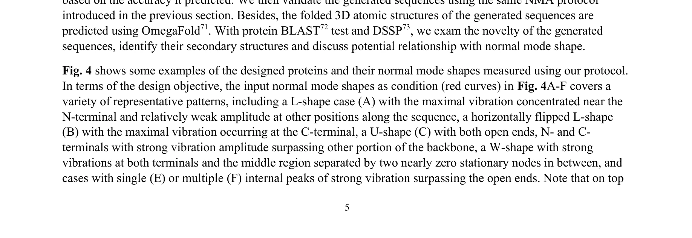

# Agentic End-to-End De Novo Protein Design for Tailored Dynamics Using a Language Diffusion Model

> **저자**: Bo Ni, Markus J. Buehler | **날짜**: 2025 | **DOI**: [10.48550/arXiv.2502.10173](https://doi.org/10.48550/arXiv.2502.10173)

---

## Essence

*Fig. 1. Workflow of developing the end-to-end protein generation model based on dynamics signature, featuring an*

VibeGen은 language diffusion model을 사용하여 지정된 normal mode 진동을 기반으로 단백질을 de novo로 설계하는 agentic 이중 모델 프레임워크로, protein designer와 protein predictor가 협력하여 정확하고 다양한 설계를 실현한다.

## Motivation

- **Known**: AlphaFold2와 RoseTTAFold 같은 deep learning 기반 folding 도구들이 3D 구조 예측에 성공했으며, diffusion model 기반의 RFdiffusion 등이 de novo 단백질 설계를 수행하고 있다. 단백질의 dynamics가 효소 활성, allosteric 메커니즘 등 생물학적 기능에 필수적임이 알려져 있다.
- **Gap**: 기존 단백질 설계 방법들은 주로 정적 구조에 초점을 맞추고 dynamics를 직접 조건으로 하지 않으며, 현재까지 dynamics 정보를 체계적으로 활용한 효율적인 end-to-end 설계 방법이 부족하다.
- **Why**: 단백질의 동적 성질은 촉매 반응, 신호 전달, 기계적 반응 등 핵심 기능을 결정하므로, dynamics 기반 설계는 유연한 효소, 동적 scaffold, 바이오재료 등 새로운 단백질 엔지니어링 경로를 열 수 있다.
- **Approach**: Normal mode analysis (NMA)를 통해 PDB 단백질들의 low-frequency vibrational mode를 추출하고, protein language diffusion model 기반의 dual-agent 아키텍처(protein designer와 protein predictor)를 학습하여 normal mode 형태를 조건으로 하는 sequence 생성과 성능 예측을 동시에 수행한다.

## Achievement

*Fig. 4 shows some examples of the designed proteins and their normal mode shapes measured using our protocol.*

- **Sequence-dynamics 양방향 연결**: Sequence에서 normal mode를 예측하고, 반대로 normal mode 형태로부터 sequence를 생성하는 bidirectional 관계를 학습하여 직접 검증했다.
- **De novo 단백질 설계**: 생성된 모든 sequence가 de novo이며 천연 단백질과 유의미한 유사성을 보이지 않아 진화 제약을 벗어난 단백질 공간을 확장했다.
- **설계 정확도 검증**: 생성된 단백질들이 full-atom MD 시뮬레이션을 통해 지정된 normal mode 진폭을 정확하게 재현하면서도 안정적이고 기능 관련 구조를 채택함을 확인했다.
- **다양성과 정확도의 균형**: Dual-agent 협력 구조가 단일 모델 대비 diversity, accuracy, novelty의 synergy를 달성했다.

## How

*Fig. 1. Workflow of developing the end-to-end protein generation model based on dynamics signature, featuring an*

- PDB 단백질 데이터베이스에서 normal mode analysis 및 full-atom MD를 통해 low-frequency vibrational mode 특성(mode shape, 진폭 분포)을 수집하여 dataset 구성
- Protein language diffusion model (pLDM) 기반으로 두 개의 에이전트 학습: (1) Protein Designer (PD) - normal mode shape가 주어졌을 때 sequence 생성, (2) Protein Predictor (PP) - sequence로부터 normal mode shape 예측
- 배포 시 PD와 PP의 iterative 협력: PD가 생성한 sequence에 대해 PP가 실시간으로 normal mode 성능을 예측하고 feedback을 제공하여 설계 정확도 향상
- 설계된 sequence에 대해 3D 구조 fold 및 relaxation, NMA를 통한 normal mode 추출, 설계 목표 달성도 평가
- De novo 여부 판정, 구조적 특성 분석, novelty 평가를 통한 다각적 검증

## Originality

- 단백질 설계에 normal mode 진동을 직접 design objective로 도입한 최초의 end-to-end 접근법
- Language diffusion model을 활용한 sequence-dynamics 양방향 매핑의 구현
- Agentic dual-model 아키텍처를 통해 diversity, accuracy, novelty를 동시에 최적화하는 collaborative 프레임워크 제안
- De novo 단계에서의 dynamics 조건부 설계로 기존 진화 제약을 초월한 단백질 공간 탐색

## Limitation & Further Study

- **계산 비용**: Full-atom MD 검증이 필요하여 대규모 고속 스크리닝에는 제한이 있음. 향후 더 빠른 dynamics 예측 모델 개발 필요.
- **생물학적 기능 검증 부재**: 설계된 단백질의 실제 효소 활성, 결합능, 신호 전달 등 생물학적 기능을 실험적으로 검증하지 않음. 생체 외 실험 검증 필요.
- **Normal mode 단독 초점**: 저주파 진동만을 고려하여 고주파 dynamics나 다중 시간 스케일 동작(millisecond domain rearrangements)은 미처리 상태.
- **다중 모드 설계 제한**: 단일 normal mode 조건부 설계만 시연하였고, 복합 dynamics 특성(여러 mode의 조합, 특정 동역학 경로)을 동시에 지정하는 능력 미구현.
- **일반화성**: 특정 protein family나 구조 type에 대한 일반화 성능 평가 부재. 향후 diverse한 단백질 클래스에 대한 성능 검토 필요.

## Evaluation

- Novelty: 4/5
- Technical Soundness: 3/5
- Significance: 4/5
- Clarity: 4/5
- Overall: 4/5

**총평**: 본 논문은 단백질 설계에 dynamics 정보를 직접 통합한 혁신적인 end-to-end 프레임워크를 제시하며, language diffusion model과 agentic 협력 구조를 통해 de novo 단백질 생성에서 sequence-dynamics 관계의 양방향 매핑을 성공적으로 구현했다. 설계된 단백질들이 MD 검증을 통해 목표 dynamics를 정확히 재현하면서도 진화 제약을 벗어난 완전 신규 sequence임을 입증한 점에서 단백질 엔지니어링에 상당한 기여를 하나, 생물학적 기능 실험 검증과 복합 dynamics 설계까지 확장하는 것이 향후 과제이다.

## Related Papers

- 🔄 다른 접근: [[papers/403_Highly_accurate_protein_structure_prediction_with_AlphaFold/review]] — 단백질 구조 예측에서 구조 기반 설계로 패러다임을 전환한 다른 접근법을 보여준다
- 🔗 후속 연구: [[papers/112_Atomically_accurate_de_novo_design_of_antibodies_with_RFdiff/review]] — 기존 단백질 설계 방법을 동역학 기반의 더 정교한 설계 프레임워크로 발전시켰다
- 🏛 기반 연구: [[papers/686_Robust_deep_learning_based_protein_sequence_design_using_Pro/review]] — 단백질 서열 설계의 기본적인 딥러닝 접근법에 대한 기초적 이해를 제공한다
