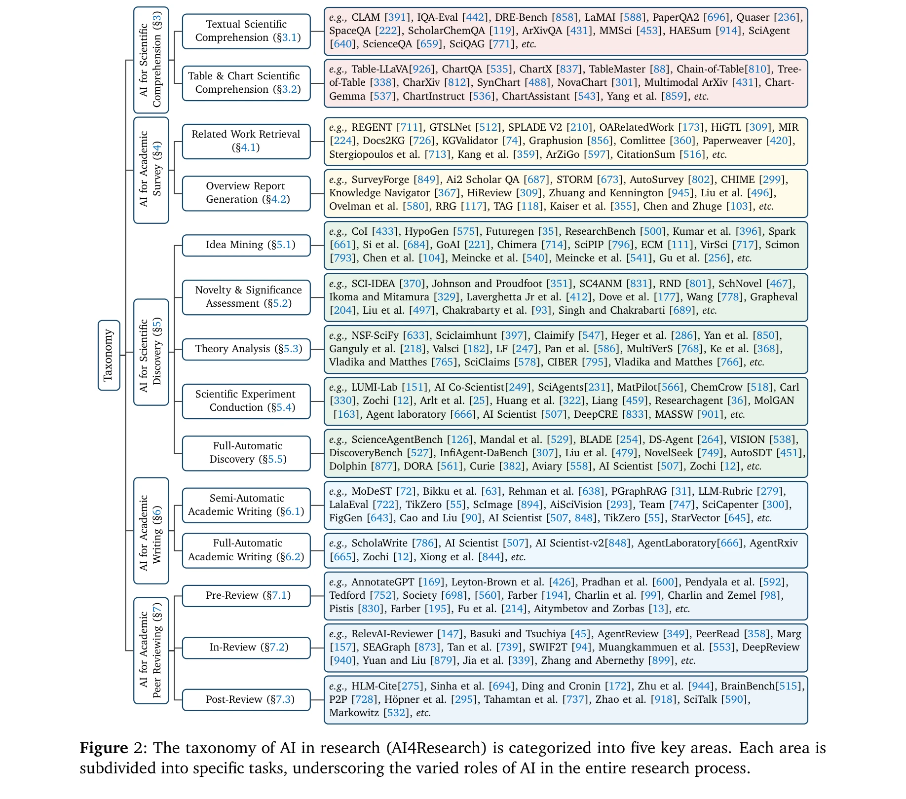
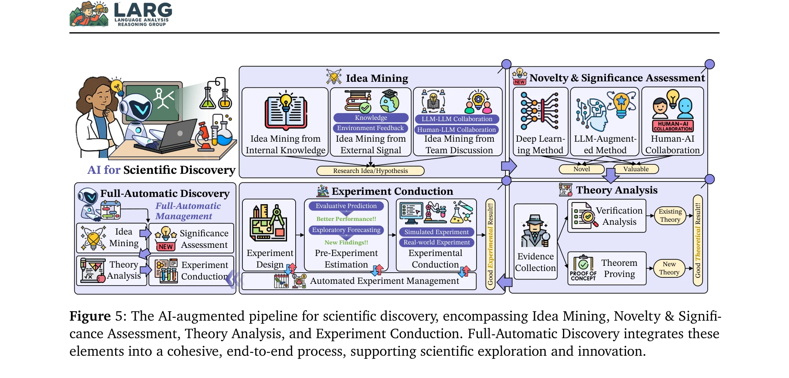

# AI4Research: A Survey of Artificial Intelligence for Scientific Research

> **저자**: Qiguang Chen, Mingda Yang, Libo Qin, Jinhao Liu, Zheng Yan, Jiannan Guan, Dengyun Peng, Yiyan Ji, Hanjing Li, Mengkang Hu, Yimeng Zhang, Yihao Liang, Yuhang Zhou, Jiaqi Wang, Zhi Chen, Wanxiang Che | **날짜**: 2025-07-02 | **DOI**: [10.48550/arXiv.2507.01903](https://doi.org/10.48550/arXiv.2507.01903)

---

## Essence

*Figure 2: The taxonomy of AI in research (AI4Research) is categorized into five key areas. Each area is*

본 논문은 과학 연구 프로세스의 자동화를 위한 AI 시스템(AI4Research)에 대한 종합 설문을 제시하며, 과학적 이해, 학술 조사, 과학적 발견, 학술 저술, 동료 심사 등 5가지 주요 작업을 체계적으로 분류한다.

## Motivation

- **Known**: 최근 LLM(OpenAI-o1, DeepSeek-R1)의 발전으로 논리 추론과 실험 코딩 능력이 향상되었으며, AI Scientist, Carl, Zochi 등의 자동 연구 시스템이 아이디어 채굴, 실험 수행, 학술 저술을 자동화하는 단계적 접근을 시도하고 있다.
- **Gap**: AI4Research에 대한 포괄적인 설문이 부재하여 이 분야의 이해와 발전이 저해되고 있으며, 자동화된 실험의 엄밀성과 확장성, 사회적 영향에 대한 충분한 논의가 이루어지지 않고 있다.
- **Why**: AI를 통한 자동 연구 시스템의 개발은 과학적 발견의 속도와 효율성을 혁신적으로 향상시킬 수 있으며, 다양한 학문 분야에 걸친 통합적 접근이 필요하기 때문이다.
- **Approach**: 본 논문은 AI4Research의 5가지 주요 작업에 대한 체계적 분류체계(taxonomy)를 제시하고, 각 분야의 관련 응용, 데이터 코퍼스, 도구를 종합적으로 정리하며, 향후 연구 방향과 열린 문제들을 식별한다.

## Achievement

*Figure 2: The taxonomy of AI in research (AI4Research) is categorized into five key areas. Each area is*

- **체계적 분류체계**: AI for Scientific Comprehension, Academic Survey, Scientific Discovery, Academic Writing, Academic Peer Reviewing의 5가지 주요 작업을 계층적으로 분류
- **다학제적 응용 사례**: 물리학, 생물학, 의학, 화학, 재료과학, 로봇공학, 소프트웨어 공학, 사회과학 등 다양한 분야에서의 AI 활용 사례 종합
- **포괄적 자원 컬렉션**: 데이터셋, 벤치마크, 오픈소스 도구 및 플랫폼을 체계적으로 정리한 풍부한 자원 제공
- **미래 방향 제시**: 학제간 AI 모델, 윤리 및 안전성, 협력 연구, 설명가능성, 동적 최적화, 멀티모달/다중언어 통합 등 7가지 핵심 미래 방향 제시

## How

*Figure 5: The AI-augmented pipeline for scientific discovery, encompassing Idea Mining, Novelty & Signifi-*

- 과학적 이해: 텍스트 기반 자동/반자동 이해와 테이블/차트 이해를 별도로 분류하여 LLM과 multimodal 모델의 적용 구분
- 학술 조사: Related Work Retrieval과 Overview Report Generation(연구 로드맵, 섹션별 생성, 전체 문서 생성)으로 단계화
- 과학적 발견: Idea Mining(내부 지식, 외부 신호, 팀 토론), Novelty Assessment, Theory Analysis(형식화, 증거 수집, 검증, 정리 증명), Scientific Experiment Conduction(설계, 사전 추정, 관리, 수행, 분석)의 다층 구조
- 학술 저술: 원고 준비/작성/완성 단계별 반자동 지원과 전자동 저술 분리
- 동료 심사: Pre-Review(desk-review, reviewer matching), In-Review(peer-review, meta-review), Post-Review(영향 분석, 홍보 강화)의 3단계 분류

## Originality

- AI4Research vs AI4Science의 명확한 개념 정의: 과학적 발견(Science) vs 전체 연구 프로세스 자동화(Research)의 구분
- 완전 자동화 발견(Full-Automatic Discovery)이라는 새로운 범주 도입으로 시스템적 자동화 수준 정의
- 학술 동료 심사 자동화의 체계적 분류 제시(기존 논문은 주로 writing/discovery에 집중)
- 5개 작업 영역 간의 상호작용을 명시적으로 모델링하여 통합적 관점 제공

## Limitation & Further Study

- 실제 엔드-투-엔드 AI4Research 시스템의 성공 사례가 제한적이며, 대부분 파이프라인의 특정 단계에만 적용되고 있음
- 자동 실험의 엄밀성(rigor) 평가 지표와 재현성 검증 방법론이 부족함
- 윤리적 고려사항(연구 데이터 소유권, AI 생성 콘텐츠 귀속, 학술 부정행위 위험)에 대한 심화 논의 필요
- 후속 연구에서는 다양한 학문 분야별 맞춤형 AI4Research 프레임워크 개발과 실제 적용 효과 측정이 필요함
- LLM의 hallucination 문제와 과학적 정확성 보증 메커니즘 개발이 긴급 과제

## Evaluation

- Novelty: 4/5
- Technical Soundness: 3/5
- Significance: 4/5
- Clarity: 4/5
- Overall: 4/5

**총평**: 본 논문은 급속히 발전하는 AI4Research 분야에 대한 첫 번째 포괄적 설문으로서, 5가지 주요 작업의 체계적 분류, 다학제적 응용 사례, 풍부한 자원 컬렉션을 제공하여 이 분야의 발전을 촉진할 것으로 기대된다. 다만 실제 시스템 구현과 엄밀성 검증에 관한 심화 논의가 추가되면 더욱 가치 있을 것이다.

## Related Papers

- 🏛 기반 연구: [[papers/075_AI_for_Science_2025/review]] — 과학 연구 자동화의 기반이 되는 AI for Science의 전반적 패러다임과 발전 방향을 제공한다
- 🧪 응용 사례: [[papers/794_The_AI_Scientist-v2_Workshop-Level_Automated_Scientific_Disc/review]] — 과학 연구 자동화 이론을 완전 자동화된 과학적 발견이라는 구체적 구현으로 발전시켰다
- 🔗 후속 연구: [[papers/352_From_AI_for_Science_to_Agentic_Science_A_Survey_on_Autonomou/review]] — 연구 자동화를 넘어 자율적 과학이라는 더 포괄적이고 미래지향적 비전으로 확장한다
- 🔗 후속 연구: [[papers/075_AI_for_Science_2025/review]] — AI4Science를 과학 연구 프로세스 자동화라는 더 구체적이고 실용적 관점으로 발전시켰다
- 🔄 다른 접근: [[papers/076_AI_for_Science_An_Emerging_Agenda/review]] — 과학적 연구를 위한 AI 서베이가 AI for Science의 신흥 의제와는 다른 관점에서 AI의 과학적 활용을 종합 분석한다
- 🏛 기반 연구: [[papers/875_What_are_the_best_AI_tools_for_research_Natures_guide/review]] — 과학 연구를 위한 AI의 포괄적 조사로서 도구 가이드의 이론적 기반을 제공한다
