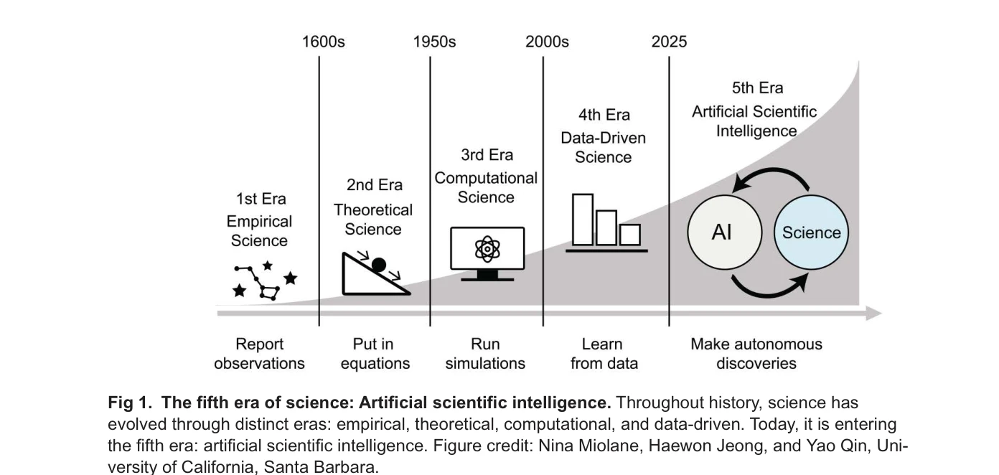

# The fifth era of science: Artificial scientific intelligence

> **저자**: N. Miolane | **날짜**: 2025 | **DOI**: [10.1371/journal.pbio.3003230](https://doi.org/10.1371/journal.pbio.3003230)

---

## Essence

*Fig 1.  The fifth era of science: Artificial scientific intelligence. Throughout history, science has*

AlphaFold의 Nobel Prize 수상을 계기로, AI가 과학 발견의 주요 동인이 되는 '제5의 과학 시대'를 논의하며, 이 시대에 인간 과학자의 역할이 AI 지도 및 데이터 큐레이션에 있음을 주장한다.

## Motivation

- **Known**: 과학은 경험적 시대, 이론적 시대, 계산 시대, 데이터 주도 시대를 거쳐 왔으며, AlphaFold가 단백질 폴딩 문제를 해결함으로써 AI의 능력을 입증했다.
- **Gap**: AI가 제한되고 잡음이 많으며 전문화된 과학 데이터를 처리할 수 있는지, 그리고 이러한 도메인에서 인간 과학자의 역할이 무엇인지에 대한 명확한 이해가 부족하다.
- **Why**: AI 과학의 시대에 과학적 발견이 어떻게 이루어질 것인지, 인간 전문성이 여전히 필수적인지를 이해하는 것은 미래 과학 연구의 방향성을 결정한다.
- **Approach**: 화학, 재료 과학, 생의학 이미징, cryo-EM 등 다양한 분야의 구체적 사례를 통해 AI 단독으로는 불충분한 이유를 설명하고, 인간-AI 협력 모델을 제시한다.

## Achievement

*Fig 1.  The fifth era of science: Artificial scientific intelligence. Throughout history, science has*

- **AI 과학의 5단계 역사 체계화**: 경험적-이론적-계산-데이터 주도-AI 과학 시대를 통시적으로 정리
- **도메인별 AI 적용 가능성 분석**: 화학의 organic synthesis와 재료 과학은 자율 AI 탐색에 적합하나, 생의학 이미징은 그렇지 않음을 구체적으로 입증
- **인간-AI 협력의 필연성 제시**: 제한된 데이터, 높은 잡음, 전문화된 데이터의 특성상 인간 전문성이 AI 설계 및 데이터 큐레이션에서 필수적임을 논증
- **구체적 사례 제시**: cryo-EM의 denoising-reconstruction autoencoder, 529개 cryo-EM 데이터셋 통합 등 인간 전문성과 AI의 시너지 사례 제공

## How

- 화학과 재료 과학에서 AI의 자율성이 높은 이유(풍부한 구조화된 데이터, 성숙한 시뮬레이션)를 분석
- 생의학 이미징의 데이터 부족 문제 정량화(MedPix 59,000장, Allen Cell 32,000장 vs 필요량 수십억 장)
- 신경망 아키텍처의 수학적 재설계로 소규모 데이터 학습 가능성 제시
- cryo-EM의 극도로 잡음이 많은 이미지(신호대잡음비 1/100) 처리 방식 설명
- 데이터 큐레이션, 정제, 주석 작업에서의 인간 전문성 역할 강조

## Originality

- 과학사의 5단계 진화 프레임워크를 최초로 체계화하고 'artificial scientific intelligence'라는 신조어 도입", 'AlphaFold 같은 성공 사례에 대한 자동 낙관주의에 대항하여, 도메인별 조건 분석을 통한 비판적 관점 제시
- 기존 'AI가 과학을 대체할 것인가'라는 이분법적 질문에서 벗어나 '어떻게 협력할 것인가'로 재정의", 'biomedical imaging과 cryo-EM의 구체적 데이터 제약을 정량화하여 추상적 논의를 구체화

## Limitation & Further Study

- 논문이 관점(perspective) 형식으로, 데이터-기반의 정량적 증거보다는 사례 기반 논의에 의존
- 인간-AI 협력의 최적 구조(역할 분담, 의사결정 프로세스)에 대한 구체적 메커니즘 제시 부재
- 사회경제적 영향(과학자 고용, 자금 배분)에 대한 논의 미흡
- 후속 연구로는 도메인별 인간-AI 협력 효율성 비교 연구, 데이터 큐레이션 비용-효과 분석, 교육 커리큘럼 개발 등이 필요

## Evaluation

- Novelty: 4/5
- Technical Soundness: 3/5
- Significance: 4/5
- Clarity: 4/5
- Overall: 4/5

**총평**: AlphaFold의 Nobel Prize 수상이라는 시의적절한 계기로 과학의 새로운 시대를 선언하면서도, 균형잡힌 비판적 관점으로 AI의 한계를 도메인별로 분석한 설득력 있는 관점 논문이다. 특히 데이터 부족과 잡음 문제를 구체적으로 제시함으로써 무조건적 AI 낙관주의에 대한 필요한 경고를 제공한다.

## Related Papers

- 🔗 후속 연구: [[papers/075_AI_for_Science_2025/review]] — AI for Science를 넘어 AI가 과학 발견을 주도하는 새로운 패러다임으로 확장한 미래 비전이다
- 🏛 기반 연구: [[papers/040_AAAI_Presidential_Panel_Report_on_the_Future_of_AI_Research/review]] — 제5의 과학 시대를 뒷받침하는 AI 연구 커뮤니티의 현재 상황과 미래 방향에 대한 실증적 분석을 제공한다
- 🧪 응용 사례: [[papers/795_The_AI_Scientist_Towards_Fully_Automated_Open-Ended_Scientif/review]] — 과학의 새로운 패러다임 이론을 완전 자동화된 과학적 발견이라는 구체적 구현 사례로 보여준다
- 🔗 후속 연구: [[papers/040_AAAI_Presidential_Panel_Report_on_the_Future_of_AI_Research/review]] — AI 연구의 미래 전망을 과학의 새로운 패러다임 변화라는 더 근본적 관점에서 확장한다
- 🏛 기반 연구: [[papers/075_AI_for_Science_2025/review]] — AI가 주도하는 과학의 새로운 패러다임에 대한 철학적이고 근본적인 관점을 제공한다
- 🏛 기반 연구: [[papers/1098_BloClaw_An_Omniscient_Multi-Modal_Agentic_Workspace_for_Next/review]] — 인공 과학 지능의 다섯 번째 시대 개념을 멀티모달 AI 과학자 워크스페이스의 이론적 배경으로 제공한다
