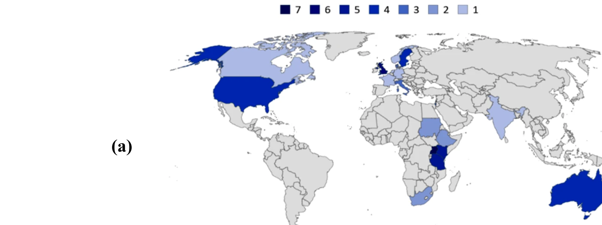
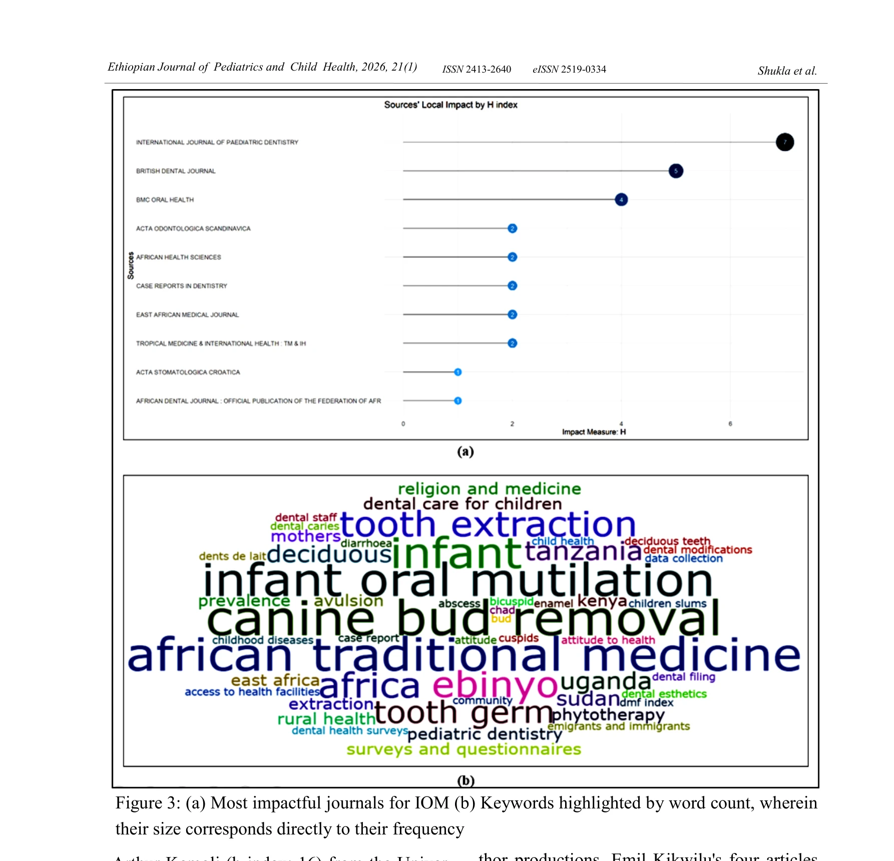
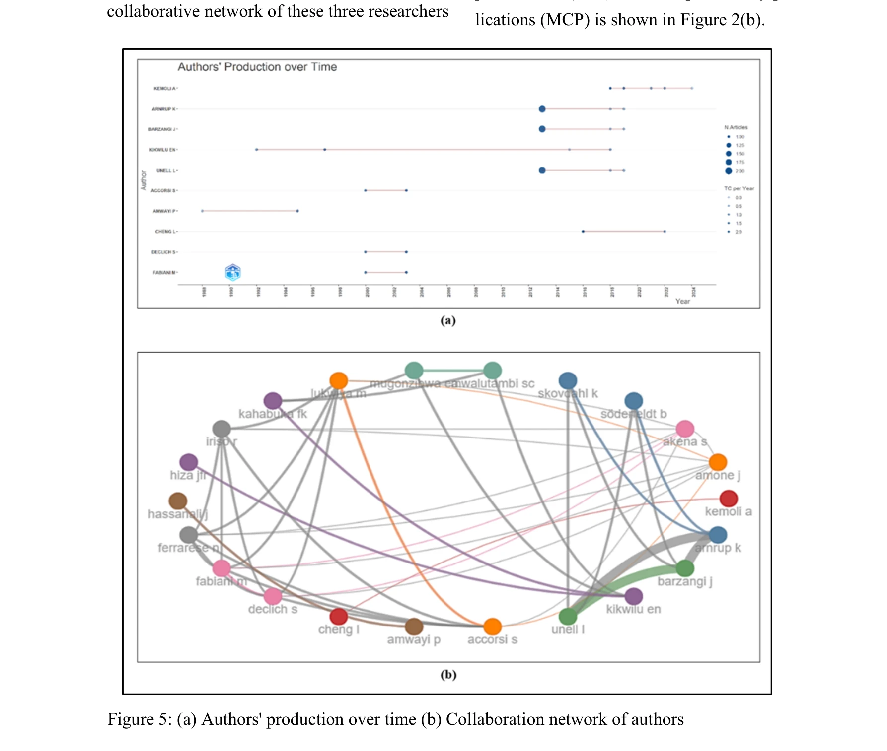

# A bibliometric analysis of the traditional African dental practice of infant oral mutilation

> **저자**: Balraj Shukla, Anup Panda | **날짜**: 2026-01-01 | **DOI**: [10.4314/ejpch.v21i1.8](https://doi.org/10.4314/ejpch.v21i1.8)

---

## Essence

*Figure 2(a) shows that the countries with the*

본 연구는 영아 경구 절제(Infant Oral Mutilation, IOM)에 관한 1969년부터 2024년까지의 62개 출판물을 bibliometric 분석하여 이 전통 의료 관행의 학술적 기여도, 지역적 분포, 그리고 주요 연구 주제들을 체계적으로 파악했다.

## Motivation

- **Known**: 영아 경구 절제는 아프리카 전통의학의 일부로 보고되어 왔으며, 무균 도구와 마취 없이 미분출 유치나 치아 싹을 제거하는 해로운 관행이다. 이 행위는 tetanus, osteomyelitis, HIV/AIDS, malnutrition 등 단기 및 장기 합병증을 초래할 수 있다.
- **Gap**: IOM에 관한 많은 동의어 용어들(ebinyo, gidog, lawalawa 등)과 21세기의 광범위한 인구 분포에도 불구하고, 이 주제에 대한 종합적인 학술 동향 분석 및 주요 기여자들의 체계적 파악이 부재했다.
- **Why**: IOM은 이주로 인해 선진국으로 확산되고 있으며, 장기적 구강 건강 손상을 초래하므로, 학술 커뮤니티의 연구 현황과 주요 기여 기관을 파악하여 예방 및 대응 전략을 수립할 필요가 있다.
- **Approach**: PubMed, LENS.org, ScienceDirect, Semantic Scholar에서 IOM 관련 출판물을 수집하여 Rayyan으로 중복 제거 및 포함 기준 적용 후, Bibliometrix 소프트웨어를 이용해 출판 지표, 협력 네트워크, 개념 네트워크, 인용 분석을 수행했다.

## Achievement

*Figure 3: (a) Most impactful journals for IOM (b) Keywords highlighted by word count, wherein*

- **출판 현황 파악**: 1969-2024년 간 62개 논문이 41개 서로 다른 저널에 게재되었으며, 2000년대 초반 이후 IOM 관련 발표가 변동적 추세를 보임
- **지역적 기여도 분석**: 영국과 우간다가 가장 많은 IOM 관련 출판물을 발표했으며, 나이로비 대학, 하다싸 치과 의학 스쿨 등이 주요 활동 기관임을 확인
- **신뢰성 있는 출판처 확인**: International Journal of Pediatric Dentistry, BMC Oral Health, British Dental Journal이 IOM 연구의 가장 신뢰성 있는 출판처로 식별됨
- **개념적 네트워크 도출**: 공동 발생 분석, 키워드 매핑, 클러스터링을 통해 canine bud removal, infant, African traditional medicine, tooth germ, tooth extraction 간의 강한 연결성 규명

## How

*Figure 5: (a) Authors' production over time (b) Collaboration network of authors*

- 4개 학술 데이터베이스(PubMed, LENS.org, ScienceDirect, Semantic Scholar)에서 IOM의 다양한 동의어 용어를 포함한 구조화된 검색 전략 수립
- Rayyan SaaS 애플리케이션을 이용한 중복 제거 및 포함/제외 기준 적용(저자, 소속, 키워드, 출판사 정보 필수)
- Bibliometrix(버전 4.1) 소프트웨어로 저자 통일, 동의어 키워드 정리 등 데이터 정제 수행
- Co-author 분석, Co-word 분석, 출판 영향력 분석, Co-citation 분석을 통한 과학 지도 및 성능 분석 실행
- Biblioshiny를 이용한 시각화 생성으로 협력 네트워크, 개념 네트워크, 인용 분석 결과 표현

## Originality

- IOM과 같은 국한된 주제에 대한 최초의 bibliometric 분석으로, 이전에 체계적으로 다루어지지 않던 전통 의료 관행의 학술적 구조를 파악
- 다양한 동의어 용어(ebinyo, gidog, lawalawa 등)를 포함한 포괄적 검색 전략으로 산재된 문헌들을 통합
- 저자, 기관, 국가, 저널 수준의 다층적 분석을 통해 IOM 연구 커뮤니티의 리더십 및 협력 구조를 시각화
- 개념 네트워크 분석을 통해 IOM 관련 주요 학술 주제들 간의 내재적 연결성 규명

## Limitation & Further Study

- 영어로 출판된 논문만 포함하여 비영어권 학술 성과(특히 아프리카 지역)의 누락 가능성
- 회색 문헌(학위논문, 보고서 등) 및 conference proceedings 미포함으로 전체 학술 활동의 대표성 제한
- 62개의 소규모 샘플 크기로 인해 통계적 신뢰성 및 장기 추세 예측의 한계
- 후속 연구로 IOM의 근절을 위한 실제 임상 개입 및 정책 수립 방안에 대한 심화 분석 필요
- 개발도상국 및 아프리카 내 미등록 또는 미발표 연구의 발굴을 위한 대면 조사 또는 지역 기관과의 협력 강화

## Evaluation

- Novelty: 4/5
- Technical Soundness: 3/5
- Significance: 4/5
- Clarity: 4/5
- Overall: 4/5

**총평**: 본 연구는 IOM이라는 심각한 전통 의료 해악에 대해 체계적 bibliometric 분석을 최초로 수행하여, 관련 학술 커뮤니티의 구조, 주요 기여자, 개념적 네트워크를 명확히 규명했다. 방법론의 엄밀성과 결과의 명확성은 우수하나, 언어 제한과 표본 규모 측면에서 개선의 여지가 있다.

## Related Papers

- 🔄 다른 접근: [[papers/1138_Arts_and_Humanities_Citation_Index_for_Research_Evaluation_i/review]] — 둘 다 특정 의료 분야의 bibliometric 분석이지만 1132는 전통 치과 관행, 1138은 종교학 연구 평가를 다룬다.
- 🏛 기반 연구: [[papers/1145_Bibliometric_analysis_of_randomized_controlled_trials_in_ora/review]] — 구강 관련 임상연구의 bibliometric 분석이 전통 아프리카 구강 치료 관행 연구의 방법론적 기반을 제공한다.
- 🔗 후속 연구: [[papers/970_Historical_Comparison_of_Gender_Inequality_in_Scientific_Car/review]] — 과학 경력에서의 성별 불평등 역사적 비교가 전통 의료 관행 연구에서의 지역별 기여도 차이를 이해하는 틀을 확장한다.
- 🏛 기반 연구: [[papers/1138_Arts_and_Humanities_Citation_Index_for_Research_Evaluation_i/review]] — 의료 분야 전통 관행의 bibliometric 분석이 종교학 연구 평가의 문화적 맥락을 이해하는 기반을 제공한다.
- 🔄 다른 접근: [[papers/1133_A_bibliometric_and_visualized_analysis_of_choriocapillaris_f/review]] — 둘 다 의학 분야의 특정 주제에 대한 bibliometric 분석이지만 서로 다른 의학 영역을 다룬다.
- 🏛 기반 연구: [[papers/1145_Bibliometric_analysis_of_randomized_controlled_trials_in_ora/review]] — 전통 아프리카 치과 관행의 bibliometric 분석이 구강 점막하 섬유증 RCT 분석의 구강 의학 연구 맥락을 제공한다.
- 🔄 다른 접근: [[papers/926_A_bibliometric_analysis_of_bouldering_and_climbing_research/review]] — 볼더링/클라이밍 연구의 서지분석과 아프리카 전통 치과 실습 연구 분석이 모두 특정 도메인에 특화된 서지계량학적 접근을 보여줍니다.
