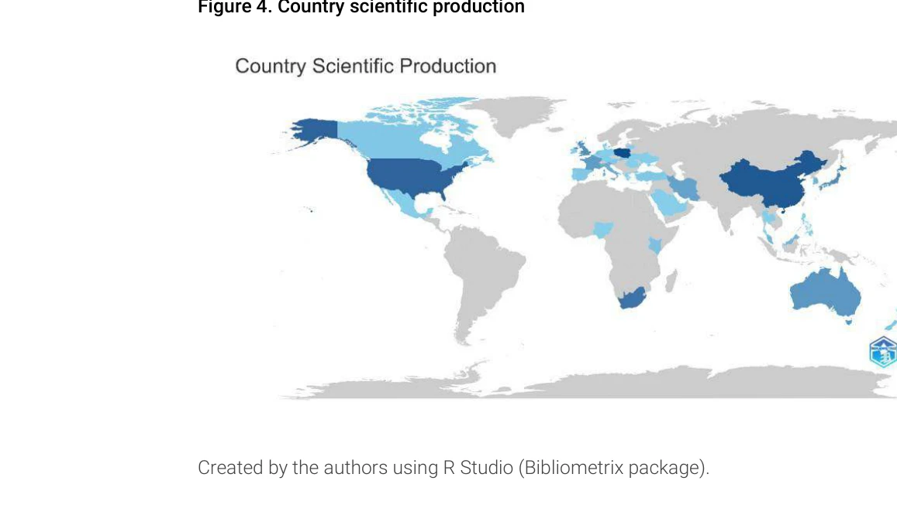
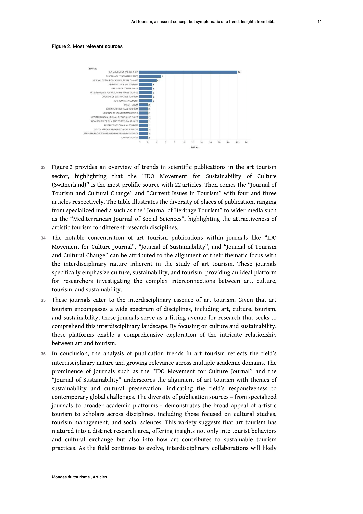

# A bibliometric and visualized analysis of choriocapillaris from 2013 to 2023

> **저자**: Pu-Ying Wei, Jin-Ming Han,  | **날짜**: 2026-3-18 | **DOI**: [10.18240/ijo.2026.03.22](https://doi.org/10.18240/ijo.2026.03.22)

---

## Essence

*Figure 4. Country scientific production*

2013년부터 2023년까지 맥락삭(choriocapillaris) 관련 1563편의 논문을 bibliometric 분석하여 연구 현황과 신흥 트렌드를 파악했다.

## Motivation

- **Known**: 망막 질환 연구에서 맥락막 영상화 기술이 발전했으며, 맥락막의 역할이 다양한 안과 질환에서 중요하다는 것이 알려져 있다.
- **Gap**: 지난 10년간 맥락삭 연구의 전반적인 동향과 주요 주제, 국가별 기여도, 저널의 영향력 등을 종합적으로 분석한 bibliometric 연구가 부족했다.
- **Why**: Bibliometric 분석은 연구 분야의 발전 궤적과 미래 방향을 체계적으로 파악하여 새로운 연구 기회와 협력 가능성을 제시할 수 있다.
- **Approach**: Web of Science Core Collection에서 검색한 논문들을 bibliometrix, CiteSpace, VOSviewer 등의 도구를 사용하여 bibliometric 및 시각화 분석을 수행했다.

## Achievement

*Figure 2. Most relevant sources*

- **주요 출판 현황**: 1563편의 논문이 분석되었으며 지속적인 출판 증가 추세를 보였다
- **주도 국가**: 미국이 맥락삭 연구 분야에서 가장 선도적인 국가로 확인되었다
- **영향력 높은 저널**: Retina와 Investigative Ophthalmology & Visual Science가 높은 임팩트와 생산성을 보였다
- **핵심 연구 주제**: 맥락막신생혈관화, 맥락막 두께, 중심성 장액성 맥락망막병증, 나이 관련 황반변성, 근시, choroidal vascularity index, 당뇨망막병증이 주요 주제로 도출되었다
- **신흥 키워드**: 'high myopia'가 2023년까지 지속적인 burst를 보이며 관심 증가 추세를 나타냈다

## How

*Figure 5. The most frequent keywords*

- Web of Science Core Collection에서 2013년 1월부터 2023년 5월까지의 논문 검색
- Bibliometrix를 사용한 계량서지학적 분석으로 출판 동향, 국가별 기여도, 저널 영향력 분석
- CiteSpace를 활용한 co-citation 분석으로 주요 연구 주제와 개념 간 관계 파악
- VOSviewer를 통한 네트워크 시각화로 키워드, 저자, 기관 간 협력 관계 시각화

## Originality

- 맥락삭 연구 분야에 대한 최초의 포괄적 bibliometric 분석으로, 과거 10년간의 연구 진화를 체계적으로 추적했다
- Co-citation 분석과 네트워크 매핑을 결합하여 단순한 통계 분석을 넘어 분야의 구조적 이해를 제공했다
- 최신 choroidal imaging 기술의 발전과 함께 연구 패러다임의 변화(질병 메커니즘에서 임상 응용으로의 전환)를 명확히 제시했다

## Limitation & Further Study

- Web of Science Core Collection만을 데이터 소스로 사용하여 다른 데이터베이스(PubMed, Scopus 등)의 논문이 제외될 가능성
- 2023년 5월까지만 포함하여 최근 동향의 일부가 누락되었을 수 있다
- 언어 편향 가능성으로 영어로 출판되지 않은 중요 연구가 분석에서 제외될 수 있다
- 후속 연구로 다중 데이터베이스 통합 분석 및 정성적 평가를 통한 연구 질의 심화 분석이 필요하다

## Evaluation

- Novelty: 4/5
- Technical Soundness: 3/5
- Significance: 4/5
- Clarity: 4/5
- Overall: 4/5

**총평**: 맥락삭 연구 분야의 현황과 동향을 포괄적으로 분석한 견고한 bibliometric 연구로, 신흥 주제들을 명확히 파악하고 향후 연구 방향을 제시하는 가치 있는 기여를 한다.

## Related Papers

- 🔄 다른 접근: [[papers/1132_A_bibliometric_analysis_of_the_traditional_African_dental_pr/review]] — 둘 다 의학 분야의 특정 주제에 대한 bibliometric 분석이지만 서로 다른 의학 영역을 다룬다.
- 🏛 기반 연구: [[papers/1141_Assistive_technology_for_developmental_conditions_A_scientom/review]] — 발달장애 보조기술의 scientometric 분석이 의학 분야 연구 동향 분석의 방법론적 모델을 제공한다.
- 🔄 다른 접근: [[papers/997_Polymer_Science_Research_in_India_A_Scientometrics_Study/review]] — 인도의 폴리머 과학 연구와 맥락삭 연구 모두 특정 국가나 지역의 과학 연구 현황을 scientometric으로 분석한다.
- 🔄 다른 접근: [[papers/1141_Assistive_technology_for_developmental_conditions_A_scientom/review]] — 둘 다 의료 기술 분야의 scientometric 분석이지만 1141은 보조기술, 1133은 안과학 연구를 다룬다.
- 🔄 다른 접근: [[papers/1145_Bibliometric_analysis_of_randomized_controlled_trials_in_ora/review]] — 둘 다 의학 분야의 특정 질환에 대한 bibliometric 분석이지만 서로 다른 의학 세부 영역을 다룬다.
