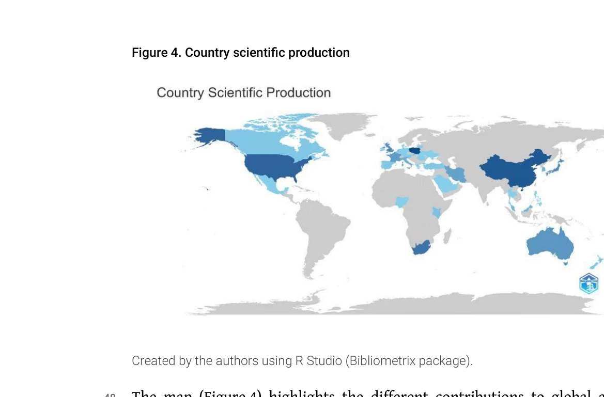
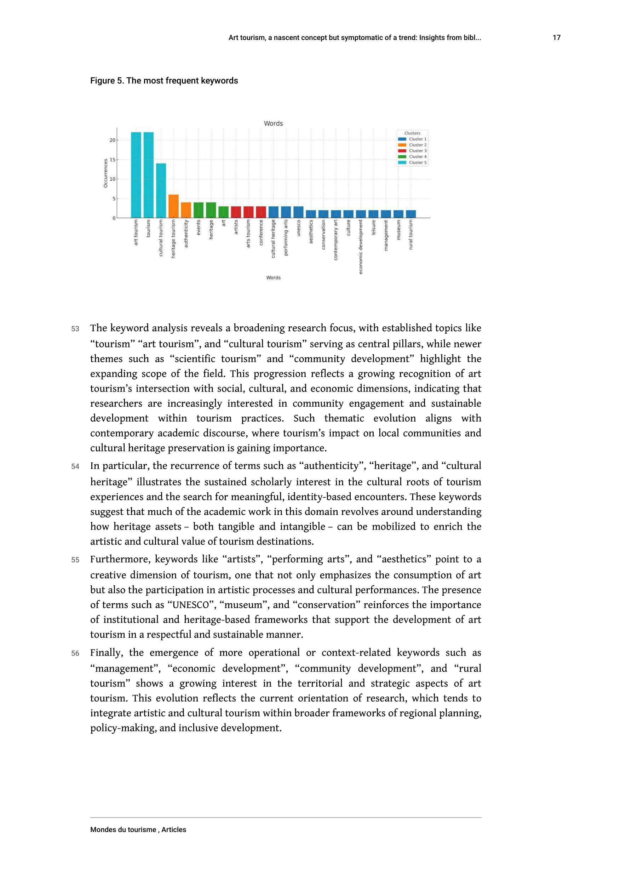

# Art tourism, a nascent concept but symptomatic of a trend: Insights from bibliometric analysis (1988-2022)

> **저자**: Soufiane Benhaida, Larbi Safaa, Jihane Benmassoud | **날짜**: 2026 | **DOI**: [10.4000/15qsp](https://doi.org/10.4000/15qsp)

---

## Essence

*Figure 4. Country scientific production*

1988년부터 2022년까지의 학술 문헌에 대한 서지학적 분석을 통해 예술 관광이 문화 및 헤리티지 관광에서 독립적인 연구 분야로 진화하는 과정을 추적하고, 주요 기여자와 주제적 경계를 정의한다.

## Motivation

- **Known**: 예술 관광은 아트 갤러리, 박물관, 공연 등을 통해 문화 체험을 제공하는 여행 형태로 오랜 역사를 가지고 있으며, 구겐하임 빌바오 박물관 개관과 같은 주요 문화 이벤트를 통해 관심이 증가해왔다.
- **Gap**: 예술 관광은 문화 관광이나 창의 관광과 혼동되는 개념으로, 이 분야의 학술적 경계와 진화 과정을 체계적으로 분석한 종합적 서지학적 연구가 부재했다.
- **Why**: 예술 관광은 경제 발전의 수단이자 문화 지속가능성을 촉진하는 매개체로서 중요성이 증대되고 있으며, 디지털 혁명과 팬데믹 이후 가상 예술 경험 등 새로운 분야의 탐색이 필요하다.
- **Approach**: 102개의 Scopus 데이터베이스 논문을 대상으로 co-citation analysis와 network mapping 등 고급 서지학적 기법을 적용하여 예술 관광 문헌의 진화, 주요 기여자, 주제적 경계를 분석한다.

## Achievement

*Figure 4. Country scientific production*

- **학술 관심 증가의 추적**: 예술 관광에 대한 과학적 관심의 증가 궤적을 명확히 하였으며, 문화·헤리티지 관광에서 독립적 연구 분야로의 진화 과정을 입증했다.
- **주제적 경계의 명확화**: 예술 관광 개념을 명확히 정의하고 문화 관광, 창의 관광 등 유사 개념과의 구분을 시도하여 개념적 혼동을 해소했다.
- **영향력 있는 기여자 식별**: Adrian Franklin 등 주요 저자와 기관의 기여도를 파악하고 연구 커뮤니티의 구조를 시각화했다.
- **국가별 과학 생산 분석**: 예술 관광 연구에 가장 활발한 국가들을 식별하고 국제 협력 패턴을 분석했다.
- **신흥 연구 방향의 발견**: 지속가능성, 디지털 혁신, 공동창작(co-creation) 등 미래 연구 방향을 제시했다.

## How

*Figure 5. The most frequent keywords*

- Scopus 데이터베이스에서 1988-2022년 기간의 예술 관광 관련 102개 논문 추출
- Co-citation analysis를 통해 문헌 간의 인용 관계를 분석하고 영향력 있는 저작 식별
- Network mapping 기법을 활용하여 저자, 기관, 국가 간의 협력 구조 시각화
- 주제별 키워드 빈도 분석을 통해 연구 주제의 진화 과정 추적
- 시간대별 논문 발행 추세를 통해 학술적 관심도의 변화 패턴 분석
- 질적 문헌 분석을 통해 개념적 발전과 이론적 틀 검토

## Originality

- 예술 관광을 단독 연구 분야로 보는 첫 번째 종합적 서지학적 분석으로, 기존의 문화 관광 내 하위 개념 취급에서 벗어났다.
- Co-citation analysis와 network mapping을 결합하여 단순 문헌 계량 분석을 넘어 연구 커뮤니티의 구조적 특성까지 드러냈다.
- 디지털 혁명과 팬데믹 이후의 변화된 예술 관광 형태(가상 갤러리, AR 투어 등)를 분석 대상에 포함시켜 현대적 관점을 반영했다.
- 학술 논문 분석뿐만 아니라 정책 보고서와 실무 사례를 통합하여 이론과 실제의 연결고리를 제시했다.

## Limitation & Further Study

- **데이터 범위**: Scopus 데이터베이스만 사용하여 Web of Science, Google Scholar 등 다른 주요 인용 데이터베이스의 논문을 누락했을 가능성이 있다.
- **언어 제약**: 영어와 프랑스어 논문에 한정되어 다른 언어 문헌의 기여를 반영하지 못했다.
- **개념의 모호성**: 예술 관광의 명확한 정의가 아직도 학자들 사이에 혼재되어 있어, 검색 전략에 따라 결과가 달라질 수 있다.
- **시계열 분석의 한계**: 1988년 이전의 역사적 선행 연구와 2022년 이후의 최신 발전을 포착하지 못했다.
- **후속 연구 방향**: 지리적으로 저발전 지역의 예술 관광 연구 확대, 문화유산 보존과의 긴장 관계 분석, 지역 공동체의 주관적 경험에 대한 질적 연구 필요성.

## Evaluation

- Novelty: 4/5
- Technical Soundness: 3/5
- Significance: 4/5
- Clarity: 4/5
- Overall: 4/5

**총평**: 이 논문은 예술 관광을 독립적 연구 분야로 처음 종합적으로 분석한 서지학적 연구로서, 개념적 명확화와 학술 커뮤니티의 구조 파악이라는 점에서 의의가 있다. 다만 데이터 범위와 언어 제약의 한계가 있으며, 정책 입안자와 실무자를 위한 더욱 구체적인 인사이트 제시가 필요하다.

## Related Papers

- 🔄 다른 접근: [[papers/1216_Tour_guiding_technologies_a_bibliometric_analysis_mapping_tr/review]] — 둘 다 관광 분야의 bibliometric 분석이지만 1137은 예술 관광, 1216은 가이드 기술에 초점을 맞춘다.
- 🔗 후속 연구: [[papers/942_Bridging_the_gap_between_science_and_society_Mapping_librari/review]] — 도서관이 과학과 사회를 연결하는 역할 매핑이 예술 관광의 문화적 브리지 역할을 이해하는 틀을 확장한다.
- 🏛 기반 연구: [[papers/1184_Hamemayu_Hayuning_Nagara_A_Bibliometric_Analysis_of_the_Poli/review]] — 정치-문화 개념의 bibliometric 분석이 예술 관광의 문화적 진화 과정을 분석하는 방법론적 기반을 제공한다.
- 🏛 기반 연구: [[papers/1144_Bibliometric_analysis_of_publications_titled_culinary_arts_s/review]] — 예술 관광의 개념적 진화 분석이 요리 예술의 학술적 발전 과정을 이해하는 문화적 맥락을 제공한다.
