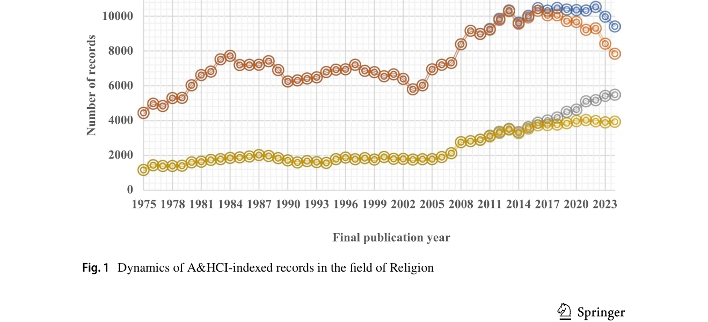

# Arts and Humanities Citation Index for Research Evaluation in the Field of Religion: Unusual Findings and Suggestions

> **저자**: Ruifeng Zhang, Weishu Liu | **날짜**: 2026 | **DOI**: [10.1007/s10943-025-02546-6](https://doi.org/10.1007/s10943-025-02546-6)

---

## Essence

*Fig. 1   Dynamics of A&HCI-indexed records in the field of Religion*

Arts & Humanities Citation Index (A&HCI)를 종교학 연구평가에 사용할 때 50년간의 데이터 분석을 통해 색인 기록의 정체, 저자 주소 정보 결손, 기여 국가/지역의 이상, 저널 집중도 과다 등의 문제점을 발견했다.

## Motivation

- **Known**: Web of Science Core Collection의 A&HCI는 전 세계적으로 연구평가, 대학순위, 펀딩 배분에 널리 사용되고 있다. 종교학은 학술저서가 중요한 역할을 하지만 A&HCI는 본질적으로 저널 인용 지수이다.
- **Gap**: A&HCI가 종교학 연구 평가에 사용될 때 저널 색인화 이외의 다른 결함이 무엇인지, 그리고 이를 어떻게 해결할 것인지가 명확하지 않다.
- **Why**: A&HCI는 권위 있는 데이터베이스로 널리 인정되고 있지만, 종교학 분야의 특성과 맞지 않는 구조적 문제가 있다면 연구평가의 신뢰성과 공정성에 영향을 미칠 수 있다.
- **Approach**: 1975-2024년의 전체 50년 기간과 2015-2024년의 최근 10년 기간에 대해 A&HCI 데이터를 종합적으로 분석하여 종교학 분야의 이상 현상을 파악했다.

## Achievement

*Fig. 1   Dynamics of A&HCI-indexed records in the field of Religion*

- **색인 기록의 정체 발견**: 2013-2024년 기간 약 10,000건의 기록에서 안정적 수준을 유지하고 있으며, 저널 Religions를 제외하면 실제로는 정체 또는 소폭 감소 추세를 보임
- **저자 주소 정보 결손 문제**: 서평 40.7%, 논문 16.0%, 리뷰 논문 18.8%에서 주소 정보가 누락되어 있어 지역 및 기관 분석의 신뢰성을 저해
- **기여 국가/지역의 이상 현상**: 종교학 분야의 주요 기여 국가/지역의 분포가 예상과 다른 패턴을 보임
- **저널 집중도 과다**: 특정 저널(특히 Religions)이 최근 성장을 주도하며 출판 다양성 부족

## How

- Web of Science Core Collection의 A&HCI 전체 데이터셋(1975-2024년) 활용
- 최종 발행년(FPY) 필드를 사용한 특정 기간 검색
- Web of Science 카테고리 'Religion'을 이용한 기록 식별", '저자 주소 필드(AD)의 알파벳·숫자·와일드카드 조합 검색으로 정보 결손 파악
- 모든 문헌 유형 분석 시나리오와 인용 가능 항목(articles, review articles)만 분석하는 시나리오 적용
- 기여 국가/지역 집계 시 완전 계산법(full counting) 적용
- Journal Citation Reports를 통한 저널의 오픈액세스 여부 및 출판사 정보 수집

## Originality

- A&HCI 데이터의 50년 장기 추적 분석으로 종교학 분야 고유의 문제점을 체계적으로 규명한 첫 번째 시도
- 저자 주소 정보 결손을 정량적으로 분석하여 지리적·기관적 분석의 편향 가능성을 구체적으로 제시
- 개별 대형 저널(Religions)의 영향을 제거하여 실제 분야 성장 추세와 허상을 구분

## Limitation & Further Study

- 분석이 A&HCI 범주의 'Religion'으로만 제한되어 있으며, Social Sciences Citation Index 등 다른 인덱스의 종교학 기록은 포함하지 않음", '최근 2년(2023-2024년)의 저자 주소 정보 결손 증가 원인이 규명되지 않았으며, 이에 대한 추가 조사 필요
- 기여 국가/지역의 이상 현상에 대한 원인 분석이 제한적이며, 문화·언어·학술 전통의 다양성에 대한 깊이 있는 검토 필요
- 학술저서의 중요성이 강조되지만 A&HCI의 저널 중심 구조에 대한 대안 제시가 명확하지 않음

## Evaluation

- Novelty: 4/5
- Technical Soundness: 3/5
- Significance: 4/5
- Clarity: 4/5
- Overall: 4/5

**총평**: 본 연구는 권위 있는 A&HCI의 종교학 분야 평가 신뢰성 문제를 데이터 기반으로 처음 체계적으로 규명했으며, 식별된 문제점들은 관련 이해관계자들에게 중요한 시사점을 제공한다. 다만, 문제의 원인 분석과 대안 제시가 보완되면 더욱 완성도 있는 연구가 될 것이다.

## Related Papers

- 🔄 다른 접근: [[papers/1115_Google_Scholar_Microsoft_Academic_Scopus_Dimensions_Web_of_S/review]] — 종교학 연구평가에서 A&HCI의 한계와 Google Scholar, Scopus 등 다양한 학술 데이터베이스의 비교 분석이라는 대안적 접근법을 제시합니다.
- 🏛 기반 연구: [[papers/997_Polymer_Science_Research_in_India_A_Scientometrics_Study/review]] — 특정 학문 분야에서 scientometric 연구의 사례로서 인도 폴리머 과학 연구가 종교학 A&HCI 분석의 방법론적 참고 기반을 제공합니다.
- 🔗 후속 연구: [[papers/1139_Assessing_data_quality_in_citation_analysis_A_case_study_of/review]] — A&HCI의 데이터 품질 문제를 인용 분석에서 일반적인 데이터 품질 평가 문제로 확장하여 분석합니다.
- 🔄 다른 접근: [[papers/1152_Citation_of_classical_research_by_doctoral-level_LIS_scholar/review]] — 둘 다 인문학 분야의 인용 분석이지만 1138은 종교학, 1152는 도서관정보학 분야를 다룬다.
- 🏛 기반 연구: [[papers/1132_A_bibliometric_analysis_of_the_traditional_African_dental_pr/review]] — 의료 분야 전통 관행의 bibliometric 분석이 종교학 연구 평가의 문화적 맥락을 이해하는 기반을 제공한다.
- 🔗 후속 연구: [[papers/972_Identifying_interdisciplinary_emergence_in_the_science_of_sc/review]] — 과학의 과학에서 학제간 출현을 식별하는 방법론이 종교학의 학제간 특성을 평가하는 데 확장 적용된다.
- 🔄 다른 접근: [[papers/1132_A_bibliometric_analysis_of_the_traditional_African_dental_pr/review]] — 둘 다 특정 의료 분야의 bibliometric 분석이지만 1132는 전통 치과 관행, 1138은 종교학 연구 평가를 다룬다.
- 🔄 다른 접근: [[papers/1152_Citation_of_classical_research_by_doctoral-level_LIS_scholar/review]] — 둘 다 인문사회 분야의 인용 분석이지만 1152는 도서관정보학, 1138은 종교학을 다룬다.
