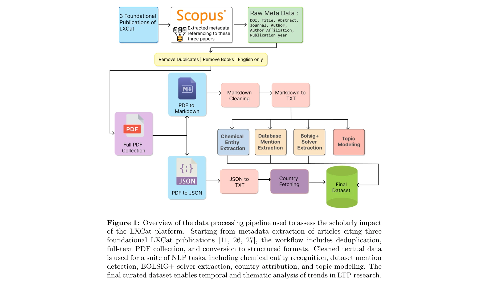
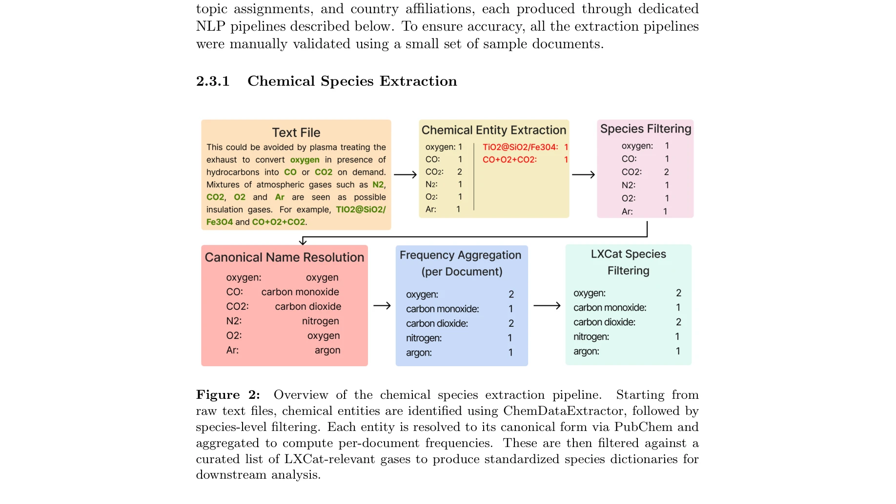
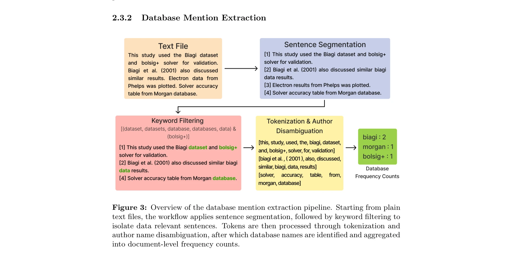

# Assessing the impact of Open Research Information Infrastructures using NLP driven full-text Scientometrics: A case study of the LXCat open-access platform

> **저자**: Kalp Pandya, Khushi Shah, Nirmal Shah, N. Shah, Bhaskar Chaudhury | **날짜**: 2026 | **DOI**: [10.48550/arXiv.2602.07664](https://doi.org/10.48550/arXiv.2602.07664)

---

## Essence

*Figure 1: Overview of the data processing pipeline used to assess the scholarly impact*

LXCat 오픈액세스 플랫폼의 저온 플라즈마 연구 커뮤니티에 대한 영향을 NLP 기반 전문 텍스트 scientometrics로 체계적으로 정량화한 연구이다. 인용 수를 넘어 데이터 사용 패턴, 화학 물질, 데이터베이스 활용도, 주제 진화 등을 추출하는 도메인 중립적이고 이전 가능한 평가 프레임워크를 제시한다.

## Motivation

- **Known**: open research information (ORI) 인프라는 과학 지식의 생산·유포·검증·재사용을 형성하며, PDB, SDSS 등 몇몇 저장소의 영향은 인용 수나 다운로드 통계로 평가되어 왔다. LXCat은 저온 플라즈마 연구의 중추적 오픈 데이터 플랫폼으로 널리 인정받고 있다.
- **Gap**: 기존 bibliometric 접근법(인용 수, 다운로드 통계)은 데이터 인프라의 가시성은 포착하지만 실제 사용 방식, 어떤 기체/데이터베이스가 활용되는지, 워크플로우 내 결합 방식 등의 세부적 데이터 실행 관행은 드러내지 못한다.
- **Why**: ORI 플랫폼의 실제 영향을 체계적으로 정량화하면 증거 기반 인프라 평가, 설계, 거버넌스, 지속성 보장이 가능하며, 이는 향후 오픈 사이언스 생태계 강화에 필수적이다.
- **Approach**: 약 400개의 LXCat 인용 논문의 전문(full-text)에 대해 chemical entity recognition, dataset·solver mention extraction, affiliation 기반 지리적 매핑, topic modeling 등의 NLP 기법을 통합 적용하여 데이터 사용 패턴, 기체 선호도, 데이터베이스 의존도, 시간적 진화를 추출한다.

## Achievement

*Figure 2:*

- **NLP 기반 scientometric 프레임워크 개발**: chemical entity recognition, dataset/solver mention extraction, geographic mapping, topic modeling을 통합한 자동화된 평가 파이프라인 구축
- **세밀한 데이터 사용 패턴 추출**: 가스 종별 선호도, 데이터베이스 간 차등 의존도, BOLSIG+ solver와의 결합 양식, 연간 및 학문 분야별 사용 추이 파악
- **도메인 중립적 이전 가능성**: LXCat 특화 분석 방법론을 다른 ORI 맥락에 적용 가능하도록 일반화
- **오픈소스 공개**: 전체 분석 파이프라인을 GitHub에 오픈소스로 공개하여 커뮤니티 재사용 및 확장 가능

## How

*Figure 3: Overview of the database mention extraction pipeline. Starting from plain*

- Scopus에서 세 개의 기초 LXCat 논문 인용자료 수집 및 정제(중복 제거, 도서/장 제외)
- 전문 문서 획득 및 chemical entity recognition (화학 물질 명명법 표준화)
- dataset mention extraction pipeline: Named Entity Recognition(NER) 및 domain-specific rule 기반 데이터베이스·solver 언급 추출
- 저자 소속(affiliation) 파싱 및 국가/지역 기반 지리적 매핑
- LDA(Latent Dirichlet Allocation) 또는 BERTopic 등의 topic modeling으로 주제 진화 추적
- 시간축 분석(연간 인용 추이, 사용 패턴 시간적 변화) 및 학문 분야별 세분화

## Originality

- 처음으로 ORI 플랫폼의 영향을 인용 수 이상의 full-text NLP 분석으로 평가한 사례
- chemical entity recognition과 dataset mention extraction을 결합하여 암묵적 데이터 사용 우선순위와 실행 관행의 세부성을 포착
- 단순 bibliometric 지표를 넘어 데이터 워크플로우 내 실제 결합 양식, 시간적 진화, 지리적 분포를 동시에 분석하는 통합 프레임워크
- 저온 플라즈마 도메인에 특화된 NLP 모델 및 규칙 기반 추출기 개발

## Limitation & Further Study

- Scopus 인용 데이터에만 의존하므로, 비Scopus 논문이나 그레이 리터러처(보고서, 프리프린트 등)는 미포함 가능성
- 세 개의 기초 논문만을 참조 세트로 사용하여, LXCat의 다른 출판물이나 간접 인용은 놓칠 수 있음
- NLP 기반 entity recognition의 정확도는 도메인 맞춤형 학습 데이터의 질에 의존하므로, 희귀 화학 물질이나 신규 데이터베이스는 누락될 위험
- 후속 연구: 더 큰 시간대 추적, 비논문 산출물(데이터 다운로드, 직접 플랫폼 접속 로그) 통합, 타 ORI 플랫폼(PDB, SDSS 등)에 대한 비교 분석
- 후속 연구: 저온 플라즈마 외 타 데이터 집약적 분야(생물정보학, 천문학 등)에 대한 프레임워크 적용 및 검증

## Evaluation

- Novelty: 4/5
- Technical Soundness: 4/5
- Significance: 4/5
- Clarity: 4/5
- Overall: 4/5

**총평**: 본 연구는 인용 기반 scientometrics의 한계를 NLP 기반 full-text 분석으로 극복한 선도적 사례로, ORI 인프라의 실질적 영향을 체계적으로 정량화하는 도메인 중립적 프레임워크를 제시한다. 오픈소스 공개와 높은 이전 가능성으로 향후 오픈 사이언스 정책 수립 및 인프라 평가에 실질적 기여할 것으로 기대된다.

## Related Papers

- 🏛 기반 연구: [[papers/1076_Predicting_research_trends_with_semantic_and_neural_networks/review]] — 연구 인프라의 영향력 평가에 NLP 기반 의미 네트워크 분석 방법론의 이론적 기반을 제공한다.
- 🧪 응용 사례: [[papers/1075_Open_Catalyst_2020_OC20_Dataset_and_Community_Challenges/review]] — 오픈 과학 인프라 영향력 평가 프레임워크를 다른 과학 데이터 플랫폼인 Open Catalyst에도 적용할 수 있는 방법론적 확장성을 보여준다.
- 🔗 후속 연구: [[papers/1044_The_State_of_OA_A_Large-Scale_Analysis_of_the_Prevalence_and/review]] — 일반적인 오픈액세스 영향 분석을 특정 도메인의 세부적이고 정량적인 평가 프레임워크로 발전시켰습니다.
- 🏛 기반 연구: [[papers/932_An_empirical_analysis_of_open_access_citation_advantages_in/review]] — 오픈액세스의 인용 우위 효과에 대한 기본적인 실증적 근거를 제공합니다.
