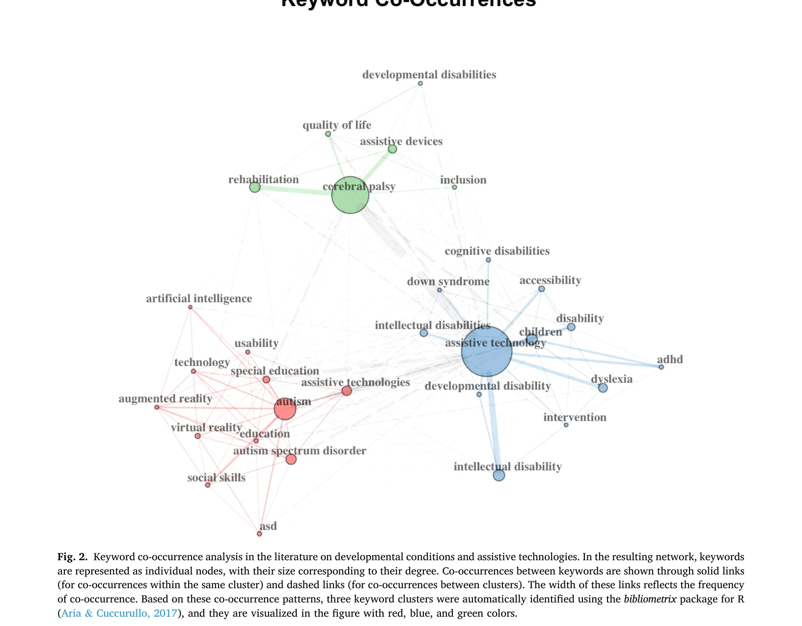
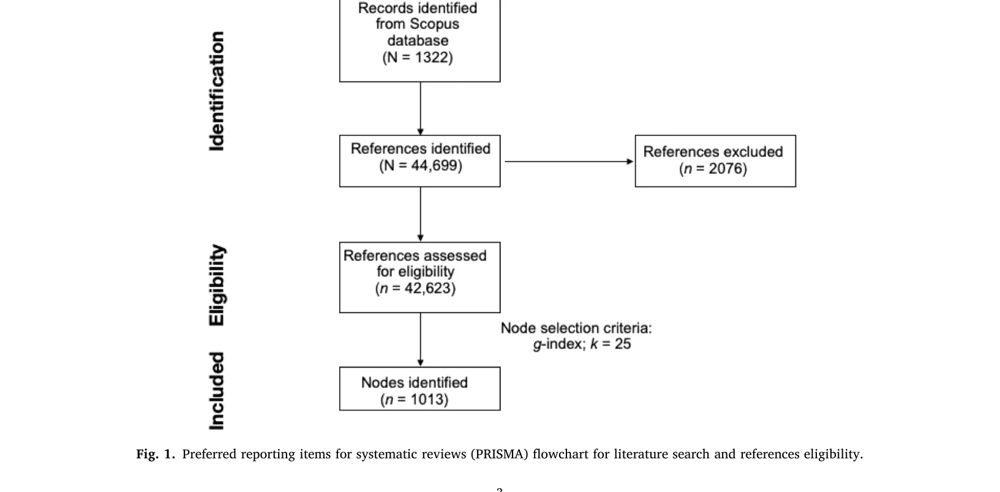

# Assistive technology for developmental conditions: A scientometric analysis.

> **저자**: Dorina Shermadhi, A. Carollo, Eman Gaad, D. Dimitriou, Anders Nordahl-Hansen, G. Iandolo, Gianluca Esposito | **날짜**: 2026 | **DOI**: [10.1016/j.ridd.2026.105210](https://doi.org/10.1016/j.ridd.2026.105210)

---

## Essence

*Fig. 2. Keyword co-occurrence analysis in the literature on developmental conditions and assistive technologies. In the *

본 논문은 발달장애 지원을 위한 보조기술의 연구 동향을 scientometric 분석으로 체계적으로 매핑하여, Scopus의 1,322개 문헌과 44,699개 참고문헌을 통해 세 가지 핵심 연구 클러스터와 주요 영향 논문들을 도출했다.

## Motivation

- **Known**: 보조기술이 발달장애 개인의 신체, 인지, 의사소통 영역에서 독립성을 증진시킨다는 것은 알려져 있으나, 높은 비용, 사용성 문제, 제한된 실제 적용성으로 인해 광범위한 채택이 미흡한 상황이다.
- **Gap**: 특정 기술이나 대상 집단에 대한 개별 선행연구는 존재하지만, 보조기술 연구 전체 분야의 지형을 체계적으로 매핑한 통합적, 데이터 기반 종합이 부족했다.
- **Why**: 발달장애 개인을 위한 보조기술 연구의 진화 양상, 영향력 있는 저작, 핵심 연구 영역을 명확히 함으로써 이 분야의 체계적 이해와 향후 연구 방향 설정에 기여하기 때문이다.
- **Approach**: Scopus 데이터베이스에서 developmental conditions과 assistive technology의 교집합 키워드로 1,322개 문헌을 수집한 후, co-citation analysis와 정성적 분석을 통해 주요 테마 클러스터를 식별했다.

## Achievement

- **세 가지 핵심 연구 테마 도출**: 심한 발달장애의 의사소통·이동성, 발달·지적장애의 인지 기능·자율성, 자폐증의 의사소통·사회인지 영역 규명
- **영향력 있는 논문 식별**: Lancioni와 Singh(2014)가 저술한 논문이 가장 영향력 있는 저작으로 확인되었으며, 추가 4개의 핵심 출판물 도출
- **신경다양성 기반 설계 윤리 강조**: 신경전형적 규범 강요를 피하고 사용자의 선호도와 경험을 존중하는 설계의 중요성 부각
- **협력적 설계(co-participation)의 부상**: 개인화되고 포용적이며 신경다양성 지향적 접근의 필요성 증대

## How

*Fig. 1. Preferred reporting items for systematic reviews (PRISMA) flowchart for literature search and references eligibi*

- Scopus에서 'developmental disabilit*' OR 'intellectual disabilit*' 등의 발달장애 키워드와 'assistive technolog*' OR 'assistive device*' 등의 보조기술 키워드를 AND 연산자로 결합한 종합 검색식 구성", '1,322개 문헌과 44,699개 참고문헌에 대한 document co-citation analysis(DCA) 수행
- co-citation clustering을 통해 주요 테마 클러스터 식별 및 log-likelihood ratio(LLR) 기반 라벨링
- 정성적 분석으로 각 클러스터의 연구 주제, 방법론, 이론적 기반 검토
- Global Citing Score(GCS)를 이용한 출판물 영향력 평가

## Originality

- 보조기술 분야의 기존 연구들은 특정 기술이나 대상에 제한된 반면, 본 연구는 scientometric 매핑을 통해 전체 연구 생태계의 구조와 역학을 데이터 기반으로 시각화함
- Co-citation analysis와 정성적 분석을 결합하여 단순한 문헌 통계를 넘어 개념적 클러스터와 연구 패러다임의 변화(신경다양성 지향 설계)를 동시에 포착
- 발달장애·지적장애·자폐증 등 다양한 신경발달 조건을 포괄하는 광범위한 분석으로 일반화 가능성 증대

## Limitation & Further Study

- Scopus 데이터베이스만 사용으로 인한 회색 문헌, 다른 출판사의 문헌 누락 가능성
- 2024년 10월까지의 데이터만 수집하여 이후 최신 동향 미반영
- Co-citation analysis는 개념적 유사성 기반이므로, 서로 다른 맥락에서 인용된 문헌들이 잘못된 클러스터로 분류될 수 있음
- 정성적 분석의 해석이 분석자 주관에 의존할 수 있으므로, 다중 평가자 신뢰도 검증 필요
- **후속연구**: 다중 데이터베이스(Web of Science, PubMed 등) 활용, 시계열 분석으로 시간 경과에 따른 연구 동향 변화 추적, 신경다양성 지향 설계의 실제 구현 사례 심층 조사 필요

## Evaluation

- Novelty: 4/5
- Technical Soundness: 3/5
- Significance: 4/5
- Clarity: 4/5
- Overall: 4/5

**총평**: 본 논문은 scientometric 분석이라는 체계적 방법론을 통해 보조기술 연구 분야의 전체 지형을 처음으로 종합적으로 매핑하였으며, 신경다양성 존중과 사용자 참여 설계라는 새로운 패러다임을 부각함으로써 학문적 및 실무적 가치가 높다.

## Related Papers

- 🔄 다른 접근: [[papers/1133_A_bibliometric_and_visualized_analysis_of_choriocapillaris_f/review]] — 둘 다 의료 기술 분야의 scientometric 분석이지만 1141은 보조기술, 1133은 안과학 연구를 다룬다.
- 🏛 기반 연구: [[papers/1166_Emerging_Trends_in_Cybersecurity_Machine_Learning_as_a_Game-/review]] — 사이버보안에서 머신러닝의 게임체인징 역할 분석이 발달장애 지원 기술 발전의 기술적 맥락을 제공한다.
- 🔗 후속 연구: [[papers/976_Intersectional_inequalities_in_science/review]] — 과학에서의 교차성 불평등 연구가 장애인을 위한 보조기술 개발에서의 다층적 배제를 이해하는 틀을 확장한다.
- 🧪 응용 사례: [[papers/1018_Science_Mapping_and_Science_Maps/review]] — 과학 매핑 방법론을 발달장애 보조기술이라는 특수 도메인에 구체적으로 적용한 실증 사례를 제공한다.
- 🏛 기반 연구: [[papers/930_A_Survey_on_Knowledge_Organization_Systems_of_Research_Field/review]] — 연구 분야의 지식 조직 체계에 대한 이해를 바탕으로 보조기술 연구의 체계적 분류와 매핑을 수행한다.
- 🔄 다른 접근: [[papers/1134_A_scientometrics_survey_of_machine_learning_and_neural_netwo/review]] — 기계학습 응용 연구의 scientometric 분석과 보조기술 연구 분석을 비교하여 서로 다른 기술 도메인의 연구 패턴을 탐구할 수 있다.
- 🔄 다른 접근: [[papers/1163_effect_of_poloxamer_and_hyaluronic_acid_administration_in_ne/review]] — 신경근 섬유화 치료와 발달 조건 보조 기술 모두 의료 기술 발전을 scientometric 분석으로 추적하는 방법론이 동일하다.
- 🔄 다른 접근: [[papers/1217_Tracing_the_Evolution_of_Sleep-Related_Behavioural_Outcomes/review]] — 발달 조건을 위한 보조 기술 연구와 자폐스펙트럼장애 수면 연구를 비교 분석할 수 있다
- 🏛 기반 연구: [[papers/1133_A_bibliometric_and_visualized_analysis_of_choriocapillaris_f/review]] — 발달장애 보조기술의 scientometric 분석이 의학 분야 연구 동향 분석의 방법론적 모델을 제공한다.
