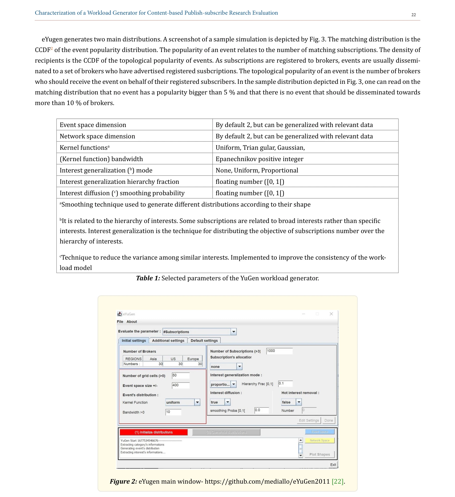
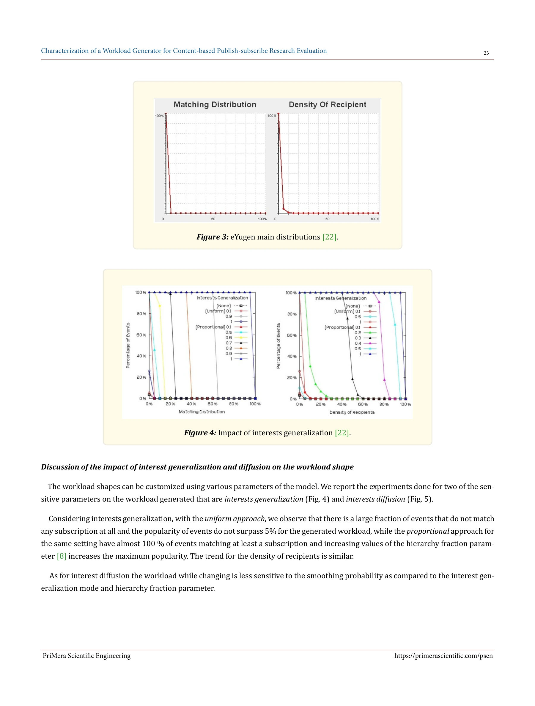
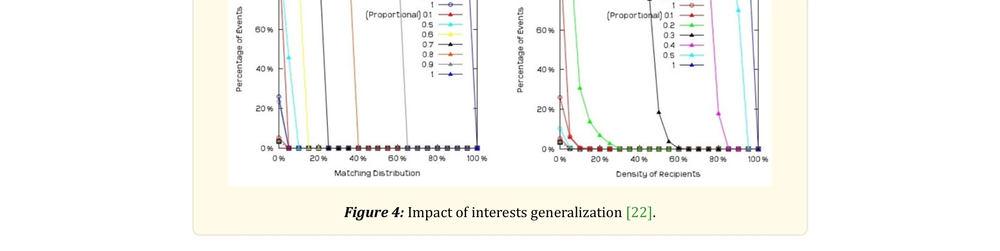

# Characterization of a Workload Generator for Content-based Publish-subscribe Research Evaluation

> **저자**:  | **날짜**: 2026 | **DOI**: [10.56831/psen-08-255](https://doi.org/10.56831/psen-08-255)

---

## Essence

*Figure 2: eYugen main window- https://github.com/mediallo/eYuGen2011 [22].*

본 논문은 content-based publish-subscribe (CBPS) 시스템 연구 평가를 위한 workload generator인 YuGen의 생성 workload를 특성화하고, popularity와 locality를 시각적으로 분석하는 enhanced 도구를 제시한다.

## Motivation

- **Known**: publish-subscribe는 분산 시스템의 기본 통신 패턴이며, 대규모 CBPS 연구는 시뮬레이션을 통해 평가되어 왔다. 기존 YuGen은 Google groups 데이터를 이용해 CBPS workload를 생성한다.
- **Gap**: 각 연구마다 자체 workload 가정과 생성 방법론을 사용하여 표준화가 부재하고, 생성된 workload의 특성(popularity, locality)이 명확히 알려지지 않아 결과 비교가 어렵다.
- **Why**: workload의 popularity와 locality 특성은 CBPS 솔루션의 성능 평가에 크게 영향을 미치므로, 이를 명확히 특성화하면 재현 가능하고 신뢰성 높은 연구 평가가 가능해진다.
- **Approach**: YuGen에 의해 생성된 scenario 파일들을 분석하여 popularity와 locality 분포를 시각적으로 characterize하고, 모델의 주요 파라미터가 이 분포에 미치는 영향을 조사한다.

## Achievement

*Figure 3: eYugen main distributions [22].*

- **YuGen의 workload 특성화**: Google groups 데이터 기반 CBPS workload의 popularity(matching distribution, density of recipients)와 locality 분포를 명확히 규명
- **시각적 characterization 도구**: enhanced eYuGen으로 파라미터 변화에 따른 workload 분포를 직관적으로 파악 가능
- **표준화 기여**: 잘 명시된 workload 생성으로 실험 재현성 향상 및 솔루션 비교 가능성 증대
- **평가 효율성**: 신중한 workload 모델링으로 CBPS 솔루션의 성능 평가 신뢰성 및 일관성 개선

## How

*Figure 4: Impact of interests generalization [22].*

- Google groups 데이터를 YuGen 기반으로 interpolate하여 CBPS workload 시나리오 생성
- 생성된 scenario 파일로부터 popularity(matching distribution) 분포 추출 및 분석
- locality 특성을 subscription/publication의 지리적 분산으로 정량화
- interests generalization과 interests diffusion 파라미터의 영향 실험적 평가
- eYuGen GUI를 통한 분포 시각화 및 대화형 특성화 제공

## Originality

- 기존 YuGen에 visual characterization 기능을 처음으로 추가하여 workload 특성의 투명성 확보
- popularity와 locality를 CBPS 평가의 핵심 특성으로 체계적으로 정의하고 분류
- attribute/value schema 기반 workload 생성 방법론을 세 가지 주요 클래스로 최초 분류
- Google groups 실제 데이터 기반 workload 생성으로 현실성 있는 시뮬레이션 환경 제공

## Limitation & Further Study

- Google groups 데이터의 특성이 모든 CBPS 응용 시나리오를 대표하지 못할 수 있음
- 시각화된 popularity/locality 분포가 다양한 네트워크 토폴로지에서의 성능 영향을 완전히 예측하지 못함
- attribute 수, constraint 수 등 schema 설계 파라미터에 대한 상세한 영향 분석 부족
- 후속 연구: 다양한 실제 시스템(예: Apache Kafka)으로부터 workload 특성 수집 및 비교 분석 필요
- 후속 연구: 생성된 workload가 실제 성능 결과에 미치는 영향을 다양한 CBPS 구현체에서 검증

## Evaluation

- Novelty: 3/5
- Technical Soundness: 3/5
- Significance: 4/5
- Clarity: 4/5
- Overall: 4/5

**총평**: 본 논문은 CBPS 연구 평가의 표준화를 위해 YuGen의 workload 특성을 체계적으로 characterize하고 시각화 도구를 제공함으로써, 분산 시스템 성능 평가의 신뢰성과 재현성을 향상시키는 실용적 기여를 한다.