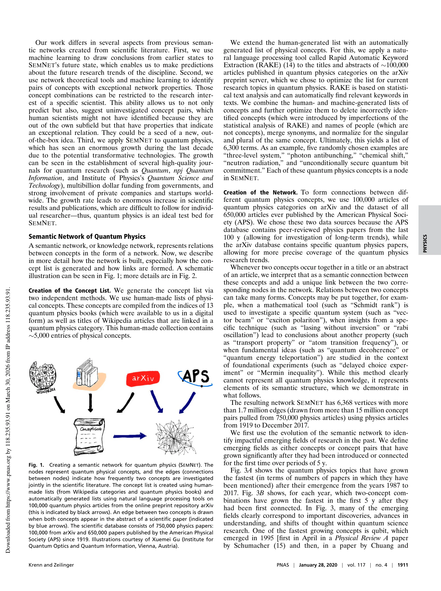

# Classical RAG for Semantic Search & Quantum Modules for Research Evaluation

> **저자**: A. R, Aman Fayazahmed Soudagar, Swetha M D | **날짜**: 2026 | **DOI**: [10.1109/IITCEE67948.2026.11394480](https://doi.org/10.1109/IITCEE67948.2026.11394480)

---

## Essence

*Fig. 1.*

본 논문은 RAG 기반 연구 평가 시스템에서 Vector RAG, Knowledge Graph RAG, Plain LLM 세 가지 아키텍처를 비교 분석하고, 고전적 방식의 한계를 극복하기 위해 QNLP 모듈을 통합한 하이브리드 프레임워크를 제안한다.

## Motivation

- **Known**: 의미론적 네트워크를 이용하여 대규모 과학 문헌에서 지식을 추출하고 연구 트렌드를 예측하는 것이 가능하며, RAG 기반 시스템은 문서 검색 및 생성에서 효과적이다.
- **Gap**: 고전적 RAG 방식들은 언어적 모호성 해결과 구조 생성 시 맥락 유지에 있어서 한계를 보이며, Knowledge Graph 기반 접근법은 자동 추출 단계에서 중요 정보 손실이 발생한다.
- **Why**: 급증하는 과학 문헌에서 의미론적 모호성을 정확히 처리하고 높은 정확도의 검색을 수행할 수 있는 견고한 연구 평가 시스템이 필요하다.
- **Approach**: 30,000개 문서 코퍼스 상에서 세 가지 RAG 아키텍처의 성능을 비교 분석하고, 고전적 방식의 실패를 양자 이론적 해결책에 매핑하여 QNLP 모듈을 통합한 하이브리드 프레임워크를 구축한다.

## Achievement

- **Vector RAG 성능 우위**: MongoDB 기반 Vector RAG가 다른 접근법 대비 사실 정확성과 일관성에서 현저히 우수한 성능을 입증
- **Knowledge Graph의 한계 파악**: KG 기반 접근법이 자동 추출 단계에서 중요 정보를 손실하는 구조적 문제 식별
- **양자 강화 프레임워크 제안**: 언어 모호성과 맥락 유지 문제를 해결하기 위해 QNLP 모듈을 통합한 하이브리드 아키텍처 제시

## How

*Fig. 1.*

- MongoDB Vector DB를 이용한 벡터 기반 의미론적 검색 구현
- 동적 Knowledge Graph 구성을 통한 개념 간 관계 추출
- Plain LLM 기반 baseline 시스템과의 비교 평가
- SEMNET 방식을 활용한 의미 네트워크 구축으로 750,000개 과학 논문 분석
- 신경망 기반 트렌드 예측 모델 훈련
- QNLP(Quantum Natural Language Processing) 모듈 통합

## Originality

- 고전적 RAG 방식의 명확한 한계점을 정량적으로 분석하고 이를 양자 이론과 연결한 점
- Vector RAG와 Knowledge Graph RAG의 직접 비교를 통해 각 방식의 트레이드오프 명확화
- QNLP를 연구 평가 시스템에 처음으로 적용하려는 시도
- 의미론적 네트워크와 RAG를 통합한 새로운 연구 평가 프레임워크 제시

## Limitation & Further Study

- 30,000개 문서 코퍼스 규모가 상대적으로 제한적일 수 있음
- QNLP 모듈의 실제 구현과 성능 평가 결과가 명확히 제시되지 않음
- 양자 이론적 해결책이 이론적 주장에 그치고 구체적 기술 검증 부족
- 각 아키텍처의 계산 복잡도와 확장성에 대한 분석 미흡
- 후속 연구에서는 더 대규모 데이터셋에서의 QNLP 통합 평가 및 실제 양자 컴퓨팅 구현 필요

## Evaluation

- Novelty: 4/5
- Technical Soundness: 3/5
- Significance: 3/5
- Clarity: 3/5
- Overall: 3/5

**총평**: 본 연구는 RAG 기반 연구 평가 시스템의 구체적 한계를 규명하고 양자 기반 해결책을 제안한 점에서 의의가 있으나, QNLP 모듈의 구체적 구현과 성능 평가가 불충분하여 제안된 하이브리드 프레임워크의 실질적 효과를 검증하기 어렵다.

## Related Papers

- 🏛 기반 연구: [[papers/1109_A_comprehensive_large-scale_biomedical_knowledge_graph_for_A/review]] — 대규모 생의학 지식 그래프가 Knowledge Graph RAG 아키텍처의 성능 향상을 위한 핵심 데이터 인프라를 제공한다.
- 🧪 응용 사례: [[papers/1015_S2ORC_The_Semantic_Scholar_Open_Research_Corpus/review]] — 의미론적 스콜라 오픈 연구 코퍼스를 RAG 기반 연구 평가 시스템의 벡터 검색 성능 개선에 활용할 수 있다.
- ⚖️ 반론/비판: [[papers/1057_Which_stylistic_features_fool_ChatGPT_research_evaluations/review]] — ChatGPT 연구 평가를 속이는 문체적 특성 연구와 QNLP 모듈을 통한 하이브리드 평가 시스템의 강건성을 대조 분석할 수 있다.
- 🔄 다른 접근: [[papers/1162_DREAM_Deep_Research_Evaluation_with_Agentic_Metrics/review]] — 양자 모듈과 에이전틱 메트릭스가 모두 기존 연구 평가의 한계를 극복하는 서로 다른 AI 기반 접근법을 제시함
- 🏛 기반 연구: [[papers/1192_Large_language_models_and_responsible_research_evaluation_an/review]] — 대형 언어 모델의 책임감 있는 연구 평가 적용이 RAG 기반 시스템의 윤리적 구현 방향을 제시함
- 🧪 응용 사례: [[papers/1033_The_Empowerment_of_Science_of_Science_by_Large_Language_Mode/review]] — 대형 언어 모델이 과학학을 강화하는 방식과 RAG 기반 평가 시스템의 발전 방향이 연결됨
