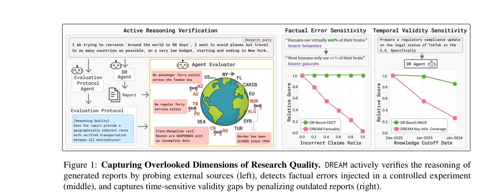
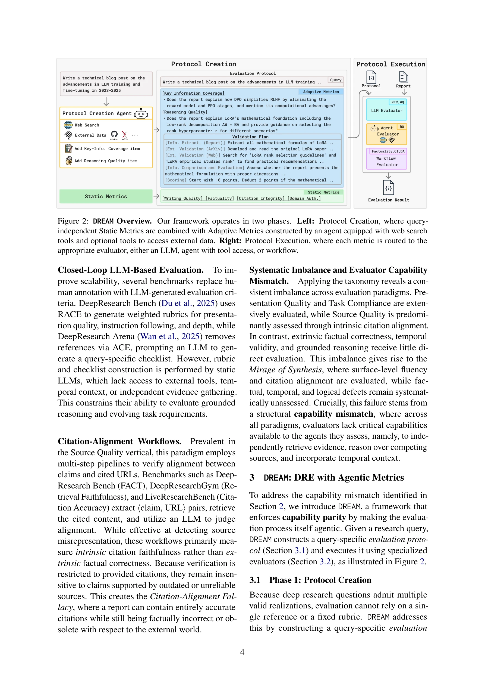

# DREAM: Deep Research Evaluation with Agentic Metrics

> **저자**: E. Avraham, Changhao Li, R. Dorfman, Roy Ganz, Oren Nuriel, Amir Dudai, Aviad Aberdam, Noah R. Flynn, Elman Mansimov, Aditya Kalyanpur, Ron Litman | **날짜**: 2026 | **DOI**: [10.48550/arXiv.2602.18940](https://doi.org/10.48550/arXiv.2602.18940)

---

## Essence

*Figure 1: Capturing Overlooked Dimensions of Research Quality. DREAM actively verifies the reasoning of*

Deep Research Agents가 생성한 분석가급 보고서 평가의 핵심 문제인 'Mirage of Synthesis'를 식별하고, 능력 균형 원칙에 기반한 DREAM 프레임워크를 제안하여 agentic evaluation으로 시간 민감도와 사실성을 효과적으로 검증한다.

## Motivation

- **Known**: Deep Research Agents는 외부 소스에서 정보를 검색하고 합성하여 장문의 보고서를 생성하지만, 단일 정답이 없고 연구 품질이 다차원적이어서 평가가 어렵다. 최근 벤치마크들은 표면적 유창성과 인용 정렬 기준으로는 높은 점수를 부여하지만 사실성과 추론 결함을 놓친다.
- **Gap**: 기존 static evaluators는 외부 도구 접근 능력이 없어 temporal validity와 factual correctness를 평가할 수 없으며, 이는 평가자와 연구자 간의 capability mismatch를 초래한다.
- **Why**: Deep Research Agents의 품질을 정확히 평가하지 못하면 잘못된 정보나 구식 내용이 포함된 보고서도 높은 점수를 받을 수 있어, 실제 분석가급 보고서의 신뢰성을 보장할 수 없다.
- **Approach**: Capability parity 원칙에 기반하여 평가 프로세스 자체를 agentic하게 만들어, tool-calling agent가 독립적으로 정보를 검색·검증하고 구조화된 평가 프로토콜(query-agnostic 메트릭과 적응형 메트릭 결합)을 통해 평가한다.

## Achievement

*Figure 1: Capturing Overlooked Dimensions of Research Quality. DREAM actively verifies the reasoning of*

- **Mirage of Synthesis 현상 식별**: 기존 벤치마크들이 표면적 유창성과 인용 정렬에 속아 사실성, 시간 유효성, 논리적 결함을 간과하는 문제를 체계화
- **통합 택소노미 제안**: Presentation Quality, Task Compliance, Analytical Depth, Source Quality의 4개 수직축으로 기존 DRE 벤치마크들을 분류하고 그들의 한계를 진단
- **DREAM 프레임워크 개발**: Capability parity 원칙을 구현한 agentic evaluation 시스템으로 Protocol Creation과 Execution의 2단계 워크플로우 수행
- **세 가지 agentic 메트릭 검증**: Key-Information Coverage, Reasoning Quality, Factuality 메트릭이 기존 벤치마크보다 temporal degradation과 factual error에 훨씬 더 민감함을 실증

## How

*Figure 2: DREAM Overview. Our framework operates in two phases. Left: Protocol Creation, where query-*

- Protocol Creation: 주어진 쿼리에 대해 agent가 tool-calling을 통해 독립적으로 연구를 수행하고 핵심 정보, 추론 기준, 검증 대상을 식별하여 평가 프로토콜 생성
- Protocol Execution: 생성된 보고서에 대해 LLM 기반 정적 메트릭(Writing Quality)과 agent 기반 동적 메트릭(Key-Information Coverage, Reasoning Quality, Factuality)을 병렬 실행
- Key-Information Coverage: 보고서가 검색된 핵심 정보를 포함했는지, 시간 민감도를 고려하여 평가
- Reasoning Quality: Agent가 보고서의 추론을 외부 소스와 교차 검증하여 논리적 일관성과 사실 기반성 확인
- Factuality & Citation Integrity: 워크플로우 기반으로 인용 충실성과 factual consistency를 검증
- 데이터 기반 택소노미 도출: Agentic pipeline이 기존 벤치마크의 평가 메트릭을 추출·임베딩·클러스터링하여 통합 택소노미 구성

## Originality

- **Capability parity 원칙의 도입**: 평가자도 연구자와 유사한 도구 사용 및 추론 능력을 갖춰야 한다는 새로운 평가 철학 제시
- **Mirage of Synthesis 개념화**: 표면적 품질 척도의 허상을 명명하고 체계화한 최초의 분석
- **Agentic evaluation 패러다임**: 평가 프로세스 자체를 능동적 agent로 구현하여 정적 평가의 한계 극복
- **Temporal awareness 통합**: 시간에 따른 정보 유효성 감소를 평가하는 dimension을 명시적으로 도입
- **Reference-free evaluation**: 단순 참조 데이터셋이 아닌 독립적 검증을 통한 확장 가능한 평가 방식

## Limitation & Further Study

- Agent 기반 평가의 계산 비용이 정적 LLM 평가보다 높을 것으로 예상되지만 상세한 비용 분석이 부족
- Evaluation protocol 생성의 품질이 최종 평가 결과에 미치는 영향을 분리하여 분석하지 않음
- 현재 실험이 특정 도메인(여행, 규제)에 국한되어 일반화 가능성에 대한 검증 필요
- Tool-calling agent의 오류(할루시네이션, 검색 실패 등)가 evaluation 결과에 미치는 영향 분석 부재
- Human expert와 DREAM 평가 결과의 상관성을 직접 검증하는 human evaluation이 논문에서 상세히 제시되지 않음
- 후속 연구에서는 다양한 도메인과 언어에 대한 DREAM의 적용 및 인간 평가자와의 비교, agent 오류 영향 분석, 평가 비용 최적화 방안을 추구할 필요

## Evaluation

- Novelty: 4/5
- Technical Soundness: 4/5
- Significance: 4/5
- Clarity: 4/5
- Overall: 4/5

**총평**: 이 논문은 Deep Research Evaluation의 근본적 문제를 'Mirage of Synthesis'로 명명하고 capability parity 원칙에 기반한 DREAM 프레임워크로 해결하여, 기존 벤치마크의 맹점을 구체적 데이터로 입증함으로써 평가 패러다임의 혁신적 전환을 제시한다.

## Related Papers

- 🔗 후속 연구: [[papers/1157_Critical_Review_with_Scientometrics_Approach_on_the_Retrofit/review]] — 논문 품질 검사에서 단일 모델을 넘어 다중 에이전트 평가 시스템으로 발전시킨 접근법임
- 🔄 다른 접근: [[papers/1214_The_Story_is_Not_the_Science_Execution-Grounded_Evaluation_o/review]] — 연구 평가에서 에이전트 기반 메트릭과 실행 기반 평가의 다른 접근법임
- 🔗 후속 연구: [[papers/1192_Large_language_models_and_responsible_research_evaluation_an/review]] — LLM의 책임감 있는 연구 평가를 멀티 에이전트 시스템으로 확장함
- 🧪 응용 사례: [[papers/1079_REFORMS_Consensus-based_Recommendations_for_Machine-learning/review]] — 기계학습 기반 과학 연구의 검증을 위한 REFORMS 체크리스트를 AI 에이전트 평가에 적용할 수 있는 자동화 도구를 제공한다.
- 🏛 기반 연구: [[papers/1057_Which_stylistic_features_fool_ChatGPT_research_evaluations/review]] — ChatGPT가 연구 평가에서 놓치는 문체적 특징 분석을 통해 agentic evaluation의 한계와 개선 방향을 제시한다.
- 🔄 다른 접근: [[papers/1022_SciSciGPT_advancing_humanAI_collaboration_in_the_science_of/review]] — AI 기반 연구 평가를 위해 SciSciGPT와는 다른 접근인 DREAM 시스템을 통한 심층 연구 평가 방법을 제안한다.
- 🔄 다른 접근: [[papers/1057_Which_stylistic_features_fool_ChatGPT_research_evaluations/review]] — ChatGPT의 스타일 편향 문제에 대한 대안으로 더 정교한 AI 기반 연구 평가 메트릭을 제안한다.
- 🧪 응용 사례: [[papers/1079_REFORMS_Consensus-based_Recommendations_for_Machine-learning/review]] — REFORMS 체크리스트를 AI 연구 평가에 적용할 때 DREAM 프레임워크가 제공하는 자동화된 검증 도구로 활용할 수 있다.
- 🔄 다른 접근: [[papers/1157_Critical_Review_with_Scientometrics_Approach_on_the_Retrofit/review]] — LLM을 활용한 연구 품질 평가에서 비판적 오류 식별과 연구 평가 에이전트 메트릭스는 상호 보완적인 접근법이다.
- 🔗 후속 연구: [[papers/1175_Figures_as_Interfaces_Toward_LLM-Native_Artifacts_for_Scient/review]] — LLM-native figures를 연구 평가 에이전트 시스템에 통합하여 더 정교한 평가가 가능하다.
- 🔄 다른 접근: [[papers/1192_Large_language_models_and_responsible_research_evaluation_an/review]] — LLM 기반 연구 평가를 서로 다른 관점에서 접근하여 책임성 원칙과 실용적 구현 방법을 비교 연구할 수 있다.
- 🔗 후속 연구: [[papers/1153_Classical_RAG_for_Semantic_Search__Quantum_Modules_for_Resea/review]] — RAG 시스템을 에이전틱 메트릭을 활용한 심층 연구 평가로 발전시켜 더 정교한 평가가 가능하다.
