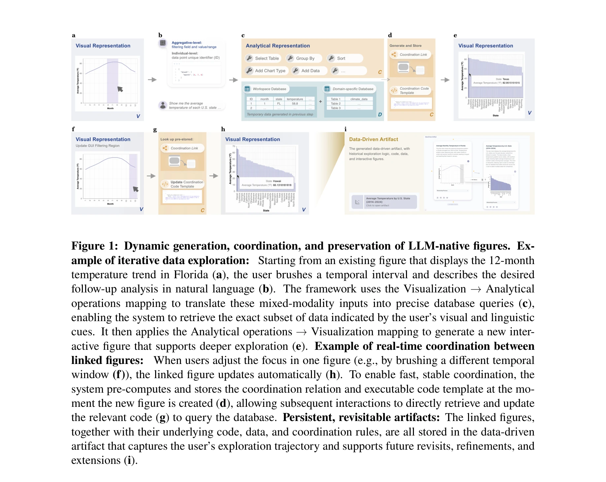
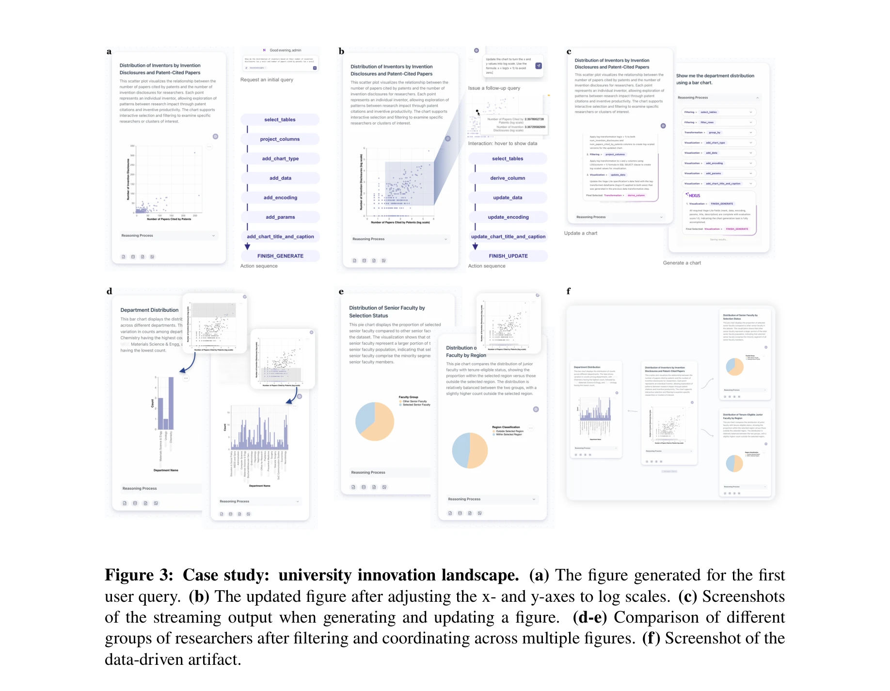
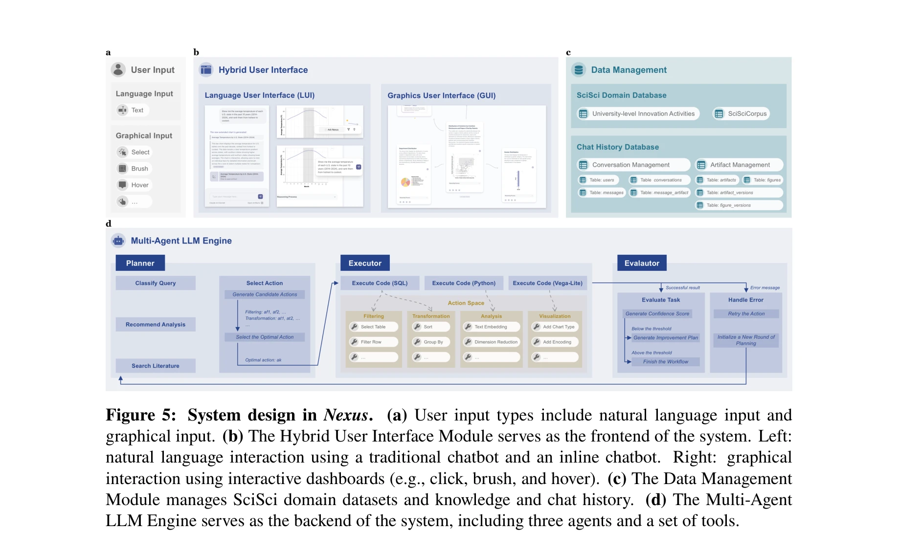

# Figures as Interfaces: Toward LLM-Native Artifacts for Scientific Discovery

> **저자**: Yifang Wang, Rui Sheng, Erzhuo Shao, Yifan Qian, Haotian Li, Nan Cao, Dashun Wang | **날짜**: 2026-04-09 | **URL**: [https://arxiv.org/pdf/2604.08491v1](https://arxiv.org/pdf/2604.08491v1)

---

## Essence

*Figure 1: Dynamic generation, coordination, and preservation of LLM-native figures. Ex-*

이 논문은 LLM이 완전한 데이터 출처 정보를 포함하는 기계 판독 가능한 과학 도형을 생성하고 조작할 수 있도록 LLM-native figures 개념을 제안한다. 이를 통해 도형을 정적 시각 요약에서 인터랙티브한 발견의 인터페이스로 재정의한다.

## Motivation

- **Known**: LLM은 텍스트 생성, 도구 사용, 복잡한 분석 작업 조율 능력을 보유하고 있다. 그러나 기존 인간-AI 협업에서 도형은 정적 이미지로 처리되어 LLM이 픽셀이나 캡션에서 다시 해석해야 한다.
- **Gap**: 현재의 LLM 기반 과학 시스템들은 선형적 end-to-end 워크플로우나 일회성 대화형 인터페이스에 제한되어 있으며, 반복적이고 비선형적인 과학적 추론의 본질을 포착하지 못한다. 또한 도형의 완전한 출처와 분석 프로세스 추적이 어렵다.
- **Why**: 도형을 기계 해석 가능한 구조로 설계하면 LLM이 데이터 선택을 추적하고, 분석을 확장하는 코드를 생성하며, 자연어로 새로운 시각화를 조율할 수 있어 발견 가속, 재현성 향상, 투명한 추론이 가능해진다.
- **Approach**: LLM-native figures 개념을 hybrid language-visual interface로 구현하고, Nexus 시스템을 과학 도메인에서 개발한다. 이는 LLM 에이전트와 도형, 데이터 간의 양방향 매핑을 통해 자연언어 및 직접 조작을 지원한다.

## Achievement

*Figure 3: Case study: university innovation landscape. (a) The figure generated for the first*

- **LLM-native figures 프레임워크**: 데이터, 분석 작업, 코드, 시각화 명세를 단일 구조로 캡슐화하는 기계 판독 가능한 도형 설계
- **Nexus 시스템 개발**: science of science 도메인에서 LLM-native figures를 실현하는 proof-of-concept 시스템 구현
- **재현성 및 투명성 개선**: 모든 분석 단계(사용자 지시, 코드 실행, 시각화 생성)를 기록하고 버전 히스토리 보존
- **반복적 탐색 지원**: 연결된 도형들을 통해 비선형적 과학적 발견의 궤적을 보존하는 data-driven artifacts 지원

## How

*Figure 5: System design in Nexus. (a) User input types include natural language input and*

- LLM 에이전트가 자연언어 지시를 분석 작업으로 변환하고 직접 조작을 executable 작업으로 디코딩하는 양방향 매핑 구현
- 도형에 전체 provenance(데이터 부분집합, 분석 연산, 코드, 시각화 명세) 임베드
- 사용자 의도 해석, 데이터 분석, analytic steps 기록을 통합하는 hybrid interface 설계
- science of science 도메인에서 사례 연구 및 computational evaluation을 통해 시스템 검증
- 버전 히스토리와 full reproducibility를 지원하는 artifact 구조 설계

## Originality

- 도형을 정적 엔드포인트가 아닌 queryable, extensible, reproducible 분석 객체로 재정의하는 근본적 개념 전환
- LLM의 완전한 provenance 지식을 활용하여 기계가 도형을 통해 '볼 수 있도록' 하는 설계", '반복적 과학적 탐색의 비선형 로직을 보존하는 linked figures 메커니즘
- generative UI 패러다임과 과학적 재현성/추론 투명성을 결합하는 새로운 인터랙션 모델

## Limitation & Further Study

- Nexus는 science of science 도메인 특화로 다른 과학 분야에 대한 일반화 가능성 검증 필요
- computational evaluation이 bidirectional mapping의 fidelity만 측정하며, 실제 발견 가속 정도에 대한 정량적 증거 부족
- 대규모 복잡한 데이터셋이나 고차원 분석에서의 scalability 평가 미흡
- LLM 에이전트의 할루시네이션이나 오류가 embedded provenance의 정합성을 해칠 가능성에 대한 대응 방안 부재
- 후속 연구로는 (1) 다양한 과학 도메인으로 확장, (2) 복잡한 분석 시나리오에서의 대규모 실험, (3) 사용자 연구를 통한 인지적 부하 평가 필요

## Evaluation

- Novelty: 4/5
- Technical Soundness: 3/5
- Significance: 4/5
- Clarity: 4/5
- Overall: 4/5

**총평**: 이 논문은 LLM의 emerging capabilities를 과학 아티팩트 설계에 통합하는 창의적이고 시의적절한 접근을 제시하며, LLM-native figures 개념은 인간-AI 협업 발견의 패러다임을 재정의할 잠재력을 가지고 있다. 다만 proof-of-concept 수준의 시스템 검증과 도메인 특화 구현이 일반화 가능성에 대한 의문을 남긴다.

## Related Papers

- 🏛 기반 연구: [[papers/1051_Unsupervised_Word_Embeddings_Capture_Latent_Knowledge_from_M/review]] — LLM이 과학적 도형에서 잠재 지식을 추출하고 조작하는 능력의 이론적 기반을 제공한다.
- 🔗 후속 연구: [[papers/1162_DREAM_Deep_Research_Evaluation_with_Agentic_Metrics/review]] — LLM-native figures를 연구 평가 에이전트 시스템에 통합하여 더 정교한 평가가 가능하다.
- 🧪 응용 사례: [[papers/962_Forecasting_high-impact_research_topics_via_machine_learning/review]] — 기계 학습을 통한 연구 동향 예측에 인터랙티브 도형 인터페이스를 활용할 수 있다.
