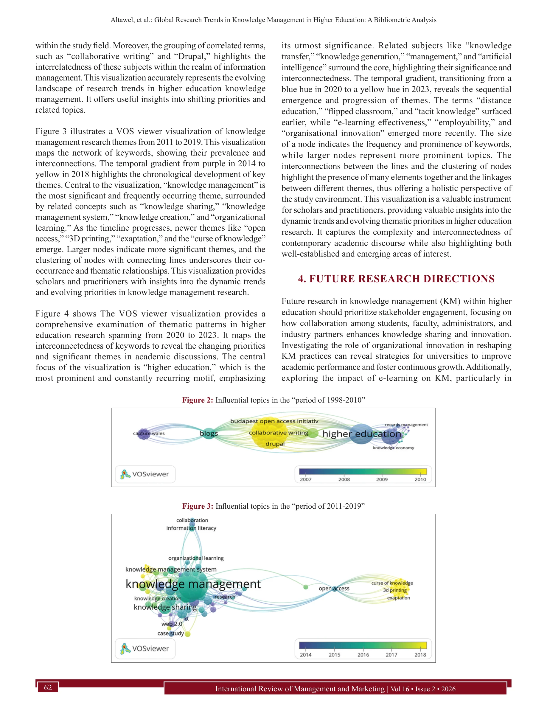

# Global Research Trends in Knowledge Management in Higher Education: A Bibliometric Analysis

> **저자**: Mohamed Aghel Altawe, M. A. Yakhlf, Aza Azalina Binti Md Kassim | **날짜**: 2026 | **DOI**: [10.32479/irmm.21392](https://doi.org/10.32479/irmm.21392)

---

## Essence

*Figure 1: Knowledge management in higher education research*

본 연구는 1998-2024년 Scopus 색인 논문 696개를 분석하여 고등교육기관(HEIs)의 지식관리(KM) 연구 동향을 파악하고, AI와 디지털 변환을 미래 연구 방향으로 제시한 종합적 bibliometric 분석이다.

## Motivation

- **Known**: KM은 조직 성과 향상에 중요하며, Knowledge-Based View(KBV)는 지식을 전략적 자산으로 강조한다. 그러나 기존 연구들은 제한된 저널이나 좁은 영역에만 집중되어 있다.
- **Gap**: HEIs의 KM 연구에 대한 포괄적이고 시계열적 분석이 부족하며, 특히 여성 관리자의 KM 역할과 지역별 지속가능성 연구가 미흡하다.
- **Why**: KM은 고등교육의 혁신과 경쟁력 강화에 필수적이며, 글로벌 연구 동향 파악을 통해 기관과 정책입안자들의 전략적 의사결정을 지원할 수 있다.
- **Approach**: Scopus 데이터베이스에서 696개 논문을 수집하여 performance analysis와 science mapping(VOS-viewer 활용)을 통해 publication/citation 분석, co-authorship networks, keyword co-occurrence를 수행했다.

## Achievement

*Figure 3 illustrates a VOS viewer visualization of knowledge*

- **연구 성장 추이**: 2023년에 최고 72개 논문 출판으로 KM 연구가 지속적 성장 중
- **영향력 있는 기관 식별**: Northwestern Polytechnical University가 인용 영향력에서 두드러졌으며, UK가 가장 생산적인 국가
- **주요 출판 매체**: Computers and Education 저널이 KM 연구 출판 주도
- **가장 인용된 논문**: KM readiness in HEIs 주제의 논문이 높은 인용도 기록
- **미래 연구 방향**: AI와 digital transformation이 유망한 연구 영역으로 떠옴

## How

*Figure  4 shows The VOS viewer visualization provides a*

- Scopus 데이터베이스에서 키워드 기반 논문 검색 및 필터링(1998-2024)
- Publication and citation analysis로 시간 경과에 따른 연구 추이 분석
- Co-authorship networks 분석을 통해 연구자 간 협력 구조 파악
- Keyword co-occurrence 분석으로 emerging themes 식별
- VOS-viewer를 활용한 science mapping으로 지적 구조와 연구 클러스터 시각화
- Performance analysis(h-index, 생산성, 인용도 등)로 영향력 평가

## Originality

- HEIs 맥락에 특화된 포괄적 bibliometric 분석으로, 기존의 단편적 연구를 확장
- 1998-2024 장기간(26년)의 시계열 데이터로 KM 연구의 진화 과정을 동적으로 추적
- KBV를 이론적 프레임워크로 삼아 bibliometric 방법론과 통합한 창의적 접근
- AI 통합 KM과 지속가능성 개발의 연관성을 국제 사례(Lebanon, Syria 등)로 구체화

## Limitation & Further Study

- Scopus 데이터베이스만 사용하여 다른 색인 데이터베이스(Web of Science, Google Scholar 등)의 논문 누락 가능성
- 인용도 기반 영향력 평가의 방법론 의존성—저명도 편향이나 분야별 인용 문화 차이 미반영
- 여성 관리자의 KM 역할과 비영어권 연구의 대표성 부족으로 지역적 편향 존재
- 후속 연구는 다중 데이터베이스 통합, 질적 분석 추가, 실제 HEI 사례 연구와 AI-KM 통합 영향 실증 필요

## Evaluation

- Novelty: 4/5
- Technical Soundness: 3/5
- Significance: 4/5
- Clarity: 4/5
- Overall: 4/5

**총평**: 본 연구는 HEI의 KM 연구에 대한 최초의 포괄적 26년 시계열 bibliometric 분석으로, AI와 digital transformation이라는 새로운 연구 방향을 제시하여 학계와 정책 입안자에게 전략적 통찰을 제공한다. 다만 단일 데이터베이스 의존성과 인용도 기반 평가의 한계를 보완한 후속 연구가 필요하다.

## Related Papers

- 🔄 다른 접근: [[papers/1184_Hamemayu_Hayuning_Nagara_A_Bibliometric_Analysis_of_the_Poli/review]] — 고등교육 지식관리와 VAT 정책 연구 모두 조직 차원에서 지식과 정책의 조화를 추구하는 bibliometric 접근법을 사용한다.
- 🔗 후속 연구: [[papers/1110_A_cross-disciplinary_research_framework_at_institution_level/review]] — 고등교육기관의 지식관리 연구가 기관 차원의 학제간 연구 프레임워크로 발전할 수 있다.
- 🧪 응용 사례: [[papers/1018_Science_Mapping_and_Science_Maps/review]] — 과학 매핑 방법론을 고등교육 지식관리 연구에 구체적으로 적용하여 특정 분야의 연구 동향과 미래 방향을 제시한다.
- 🔄 다른 접근: [[papers/1135_AI-Augmented_Mobile_and_Data-Driven_Decision_Making_in_Busin/review]] — AI와 디지털 변환을 다루는 두 bibliometric 연구로서 교육 분야와 비즈니스 분야에서 AI 연구 동향을 비교 분석할 수 있다.
- 🔗 후속 연구: [[papers/1114_GoAI_Enhancing_AI_Students_Learning_Paths_and_Idea_Generatio/review]] — AI 시대 학생 학습 경로 향상 연구를 고등교육기관의 지식관리 맥락으로 확장하여 교육혁신의 제도적 접근을 탐구한다.
