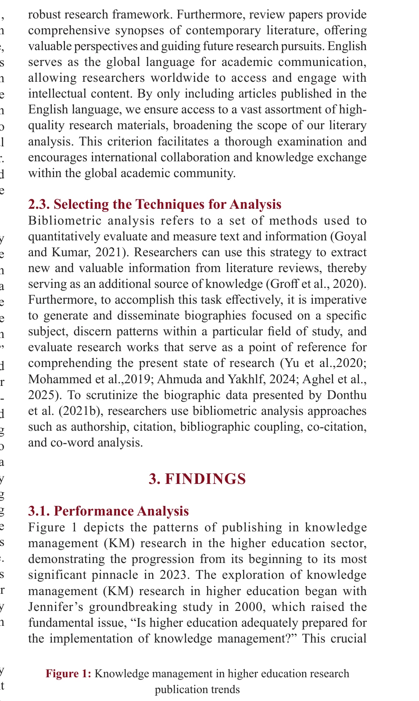
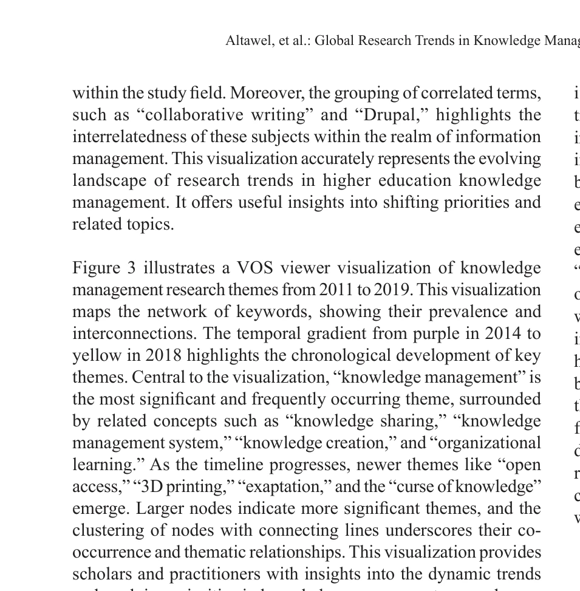

# Global research trends on depression-related stigma in the 21st century: a bibliometric analysis

> **저자**: L. Zhamaliyeva, Assemgul Batyrova, N. Ablakimova, G. Veklenko, Botakoz Malsova, A. Tautanova, A. M. Grjibovski | **날짜**: 2026 | **DOI**: [10.1080/16549716.2025.2612390](https://doi.org/10.1080/16549716.2025.2612390)

---

## Essence

*Figure 1: Knowledge management in higher education research*

본 연구는 1998-2024년 Scopus 데이터베이스에 696개 논문을 분석하여 고등교육기관의 Knowledge Management 연구 동향을 파악하고, AI와 디지털 변환이 미래 연구 방향임을 제시한다.

## Motivation

- **Known**: Knowledge Management는 조직 성과 향상에 중요하며, Knowledge-Based View 이론은 지식을 경쟁 우위의 핵심 자원으로 강조한다.
- **Gap**: 기존 연구들은 특정 저널이나 좁은 영역에 집중되어 있어 고등교육 부문에서 KM의 포괄적 분석이 부족하며, 여성 매니저의 역할과 지역별 KM 전략에 대한 연구가 제한적이다.
- **Why**: 고등교육기관에서 효과적인 KM 실천은 교수·학습 최적화, 혁신 촉진, 경쟁력 확보에 필수적이며, 글로벌 KM 연구 동향 파악은 기관의 전략적 의사결정을 지원한다.
- **Approach**: Scopus 데이터베이스 기반 계량서지 분석을 통해 논문·인용 분석, 공저 네트워크, 키워드 동시 발생 분석을 수행하고, VOS-viewer를 활용한 과학지도로 지식 구조를 시각화한다.

## Achievement

*Figure 3 illustrates a VOS viewer visualization of knowledge*

- **연구 성장 추이**: 2023년 72편으로 피크를 기록하며 KM 연구가 지속적 성장을 보임
- **주요 기여자 식별**: Northwestern Polytechnical University가 인용 영향력에서 두드러졌으며, 영국이 가장 많은 출판 기여
- **상위 저널**: Computers and Education 저널이 KM 고등교육 연구에서 선도적 역할
- **신흥 주제**: AI와 디지털 변환이 미래 연구의 유망 방향으로 부상
- **HEI 준비도**: KM readiness in HEIs를 다룬 논문이 최다 인용 기여

## How

*Figure 2: Influential topics in the “period of 1998-2010”*

- Scopus 데이터베이스에서 1998-2024년 KM 관련 논문 696편 수집
- 성과 분석(performance analysis)으로 h-index, 생산성, 인용 수 산출
- 과학지도(science mapping)로 키워드 분석, 공인용 분석, 주제 매핑 수행
- 공저 네트워크 분석으로 국가·기관·저자 간 협력 패턴 파악
- VOS-viewer 소프트웨어를 통한 지식 구조 및 연구 클러스터 시각화

## Originality

- Knowledge-Based View 이론과 계량서지 방법론의 통합으로 KM 연구의 전략적 의의 강화
- AI와 디지털 변환 등 신기술을 KM 고등교육 맥락에 연계하여 분석한 점
- 포괄적 시간 범위(27년)와 대규모 데이터셋(696편)을 활용한 장기 동향 분석
- 고등교육 부문에 특화된 KM 연구 지형도 작성으로 기존 연구의 협소함 극복

## Limitation & Further Study

- Scopus 데이터베이스만 사용으로 Web of Science 등 타 데이터베이스의 논문 누락 가능
- h-index, 인용 수 등 계량서지 지표의 방법론 의존성으로 인한 해석의 불확실성
- 여성 관리자의 KM 역할, 중동부 지역(레바논, 시리아) 연구 부재 등 지역적·젠더 격차 미흡
- 후속 연구에서는 정성적 사례 연구와 지역별 심층 분석으로 KM 실제 효과 검증 필요
- AI 도입의 학술 윤리 문제와 자원 할당 이슈에 대한 더 깊은 탐구 요청

## Evaluation

- Novelty: 3/5
- Technical Soundness: 3/5
- Significance: 4/5
- Clarity: 4/5
- Overall: 4/5

**총평**: 본 연구는 고등교육 부문의 KM 연구 지형을 체계적으로 매핑하고 AI·디지털 변환 등 신흥 주제를 제시하여 정책입안자와 연구자에게 전략적 통찰을 제공하는 가치 있는 계량서지 분석이다. 다만 다중 데이터베이스 활용과 질적 심화 연구로 보완할 필요가 있다.

## Related Papers

- 🔄 다른 접근: [[papers/1172_Exploring_Strategies_for_Addressing_Weight_Stigma_An_Analysi/review]] — 둘 다 건강 관련 사회적 낙인을 다루지만 우울증과 체중이라는 서로 다른 낙인 유형을 분석합니다.
- 🏛 기반 연구: [[papers/976_Intersectional_inequalities_in_science/review]] — 우울증 낙인 연구에서 교차적 불평등 관점이 성별, 인종 등 다중 정체성의 복합적 영향을 이해하는 데 필요합니다.
- 🔄 다른 접근: [[papers/1146_BIBLIOMETRIC_ANALYSIS_ON_PARENTING_STYLES_AND_ADOLESCENTS_HA/review]] — 둘 다 심리학 관련 주제를 다루지만 청소년 행복과 우울증 낙인이라는 서로 다른 측면을 분석합니다.
- 🔗 후속 연구: [[papers/1172_Exploring_Strategies_for_Addressing_Weight_Stigma_An_Analysi/review]] — 체중 낙인에서 우울증 낙인으로 정신건강 관련 사회적 편견 연구 영역을 확장합니다.
