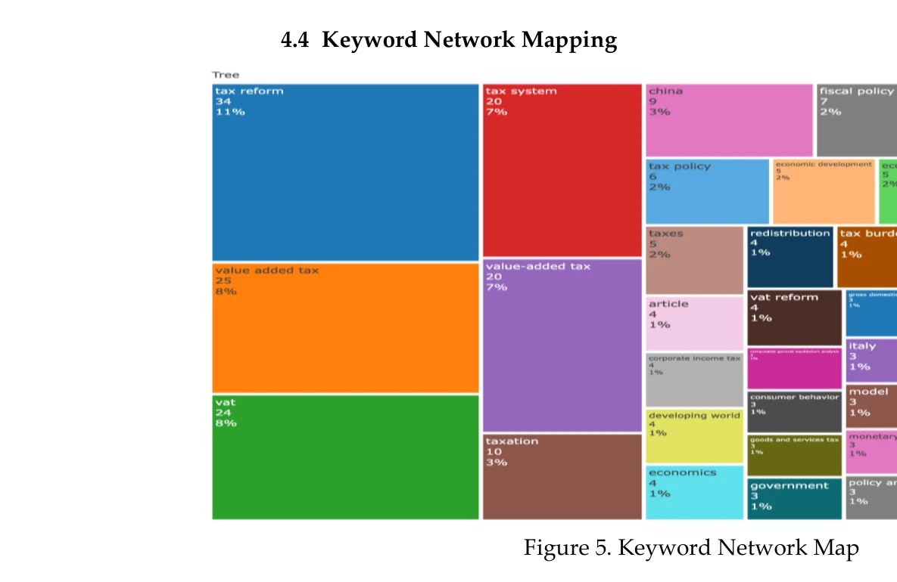
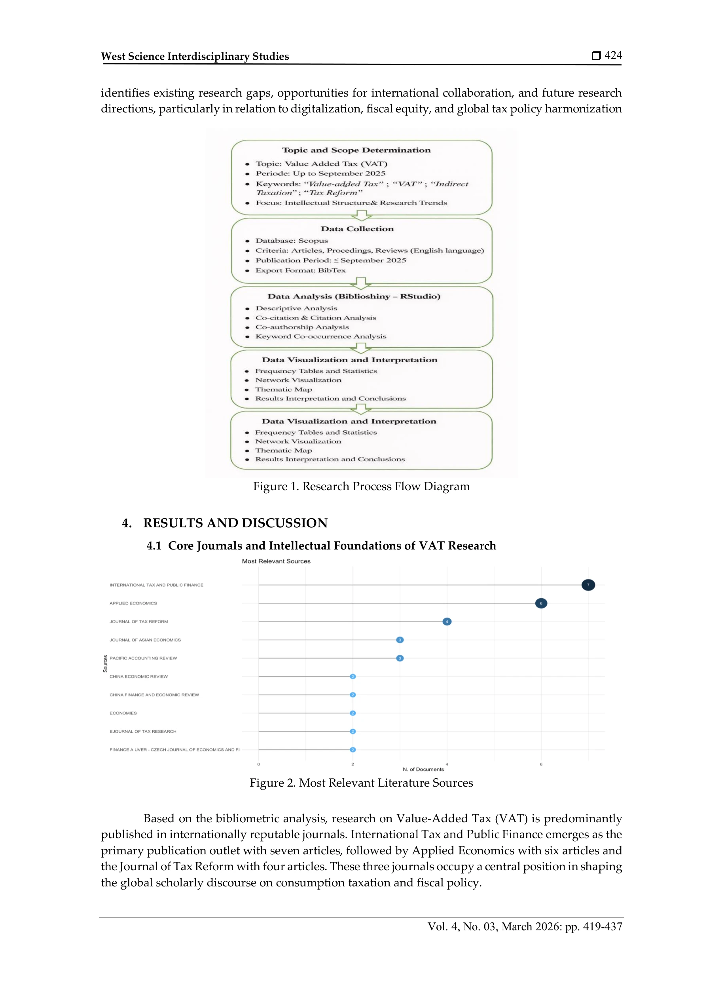
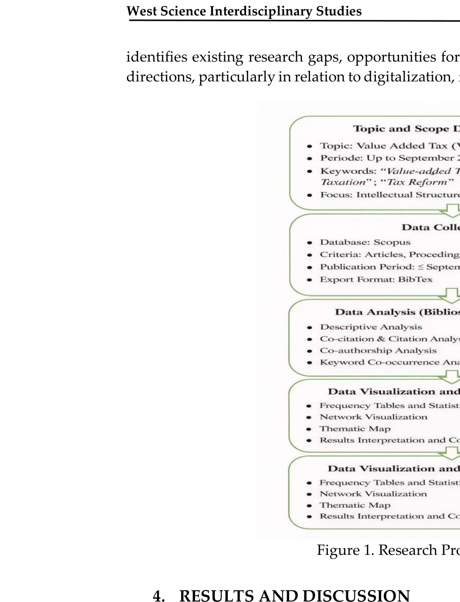

# Hamemayu Hayuning Nagara: A Bibliometric Analysis of the Policy on Increasing the Value Added Tax Rate as a Means of Welfare and Social Justice

> **저자**: Dinda Amelia Kusumastuti, Puspa Ratri Prajnasari, Pramita Sukma Wardani | **날짜**: 2026 | **DOI**: [10.58812/wsis.v4i03.2644](https://doi.org/10.58812/wsis.v4i03.2644)

---

## Essence

*Figure 5. Keyword Network Map*

본 연구는 2014-2024년 Scopus 데이터베이스의 856개 VAT 논문을 bibliometric 분석으로 검토하고, Javanese 철학인 Hamemayu Hayuning Nagara를 통해 VAT 정책을 국가 재정과 공공 복지의 조화로 해석한다.

## Motivation

- **Known**: VAT는 전 세계적으로 주요 정부 수입원으로 광범위한 세금 기반과 안정적인 수익 기여로 인해 효율적인 재정 수단으로 인식된다. 기존 연구는 VAT 개혁의 경제적, 정책적 측면을 광범위하게 검토했다.
- **Gap**: 사회 정의와 복지 함의를 다루는 VAT 연구가 상대적으로 제한적이며, bibliometric 분석을 가치 기반 및 문화적 접근과 통합하는 연구는 거의 없다. 인도네시아의 경우 기술적 재정 차원과 윤리적·문화적 차원을 연결하는 연구가 부족하다.
- **Why**: VAT 정책의 효과성은 경제적 고려뿐 아니라 사회 정의 원칙과의 일치 정도에 따라 결정되며, 개발도상국에서는 VAT 인상이 세무 준수와 공공 복지에 미치는 다양한 영향을 균형있게 평가할 필요가 있다.
- **Approach**: Bibliometric 분석을 통해 전 지구적 VAT 연구의 구조, 동향, 방향을 매핑하고, Javanese 지역 지혜의 도덕적 틀인 Hamemayu Hayuning Nagara와 연결하여 현대 재정 정책의 윤리적 해석을 제공한다.

## Achievement

*Figure 2. Most Relevant Literature Sources*

1. **VAT 연구의 주요 테마 규명**: 전 지구적 VAT 담론이 세금 개혁, 재정 정책에서 형평성, 재분배, 빈곤, 불평등 이슈로 초점이 이동하고 있음을 확인
2. **VAT의 다중 기능 입증**: VAT가 단순 재정 수단이 아니라 정부가 형평성 증진과 사회 정의 달성을 위해 사용하는 사회·경제적 개입 도구임을 규명
3. **인도네시아의 위치 파악**: 글로벌 VAT 연구에서 인도네시아와 다른 개발도상국의 상대적 위치 비교
4. **윤리적 정책 프레임워크 제시**: Hamemayu Hayuning Nagara를 통해 VAT 정책을 국가 수익 필요성과 공공 복지 보호의 도덕적 의무 사이의 균형으로 해석

## How

*Figure 1. Research Process Flow Diagram*

- Scopus 데이터베이스에서 2014-2024년 기간 856개 논문 수집
- Biblioshiny in RStudio를 활용한 keyword mapping 수행
- 저자 및 국가 협력 네트워크 분석
- Co-citation 분석 및 document coupling 실시
- Thematic mapping으로 연구 주제 영역 식별
- Javanese 철학적 관점으로 실증 분석 결과 해석

## Originality

- Bibliometric 분석과 문화적·가치 기반 접근의 통합으로 세제 정책 연구에 새로운 관점 제시
- 발전된 아시아 국가의 로컬 지혜(Hamemayu Hayuning Nagara)를 현대 조세 정책 평가의 도덕적 기초로 활용
- 기술적 재정 차원과 윤리적·사회 정의 차원을 동시에 다루는 통합적 접근법 개발

## Limitation & Further Study

- Bibliometric 분석은 정량적 트렌드를 제시하나 인도네시아의 12% VAT 인상에 대한 정성적 사회 영향 평가는 실증적 증거가 부족
- Hamemayu Hayuning Nagara의 현대적 적용에 대한 이해 다양성으로 인해 정책 권장사항의 보편성 제한
- 2025년 VAT 인상 실행 후의 장기 영향에 대한 후속 실증 연구 필요
- 취약 계층 보호, 재정 투명성, 사회 정책 효과성 강화라는 프레임워크의 구체적 이행 메커니즘 개발 필요

## Evaluation

- Novelty: 4/5
- Technical Soundness: 3/5
- Significance: 4/5
- Clarity: 4/5
- Overall: 4/5

**총평**: 본 연구는 VAT 정책의 사회정의적 함의를 bibliometric 분석으로 체계적으로 규명하고, 지역 철학적 가치를 현대 세제 정책의 도덕적 기초로 제시함으로써 개발도상국의 공정하고 지속가능한 세정 설계에 기여하는 의미 있는 연구이다.

## Related Papers

- 🔗 후속 연구: [[papers/964_Funding_the_Frontier_Visualizing_the_Broad_Impact_of_Science/review]] — VAT 정책과 공공 복지 조화 분석이 과학 연구 자금 지원의 광범위한 영향 시각화로 확장될 수 있다.
- 🏛 기반 연구: [[papers/1003_Quantifying_Long-term_Scientific_Impact/review]] — Javanese 철학을 통한 정책 분석의 장기적 영향을 측정하기 위해 과학적 영향력의 장기 정량화 방법이 필요하다.
- 🔄 다른 접근: [[papers/1155_Corporate_Governance_in_Accounting_A_Bibliometric_Analysis_o/review]] — 회계 분야와 세무 정책 분야의 서로 다른 bibliometric 접근법을 비교하여 경제학 관련 연구 분석의 다양한 관점을 제공한다.
- 🧪 응용 사례: [[papers/1018_Science_Mapping_and_Science_Maps/review]] — 과학 매핑 방법론을 VAT 정책 연구에 적용하고 Javanese 철학으로 해석하는 독특한 문화적 접근을 보여준다.
- 🏛 기반 연구: [[papers/980_Linking_Global_Science_Funding_to_Research_Publications/review]] — 글로벌 과학 펀딩과 연구 결과의 연결 분석 방법론을 국가 재정 정책(VAT) 연구에 적용할 수 있는 기초를 제공한다.
- 🔄 다른 접근: [[papers/1179_Global_Research_Trends_in_Knowledge_Management_in_Higher_Edu/review]] — 고등교육 지식관리와 VAT 정책 연구 모두 조직 차원에서 지식과 정책의 조화를 추구하는 bibliometric 접근법을 사용한다.
- 🏛 기반 연구: [[papers/1137_Art_tourism_a_nascent_concept_but_symptomatic_of_a_trend_Ins/review]] — 정치-문화 개념의 bibliometric 분석이 예술 관광의 문화적 진화 과정을 분석하는 방법론적 기반을 제공한다.
