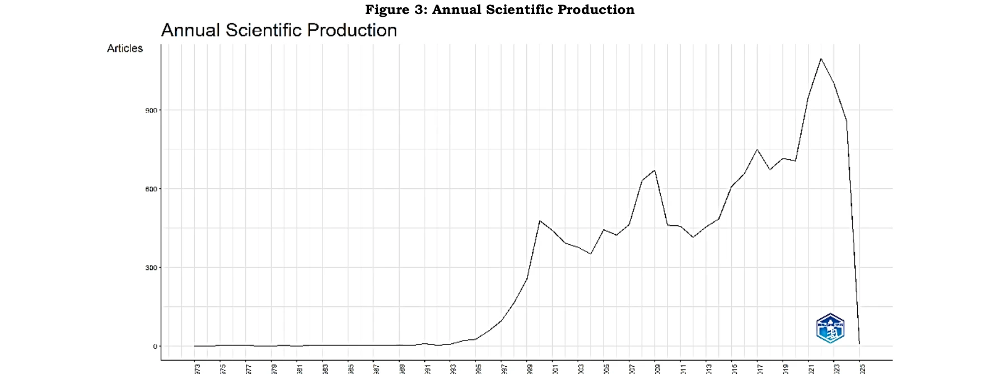
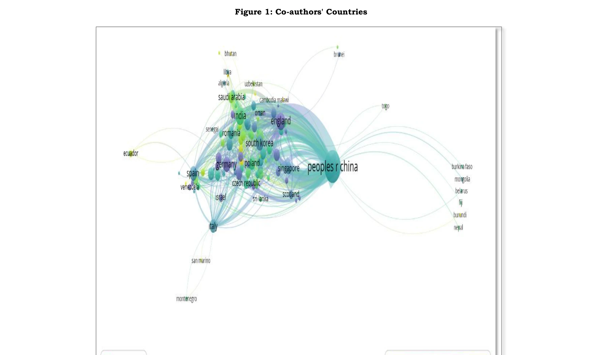
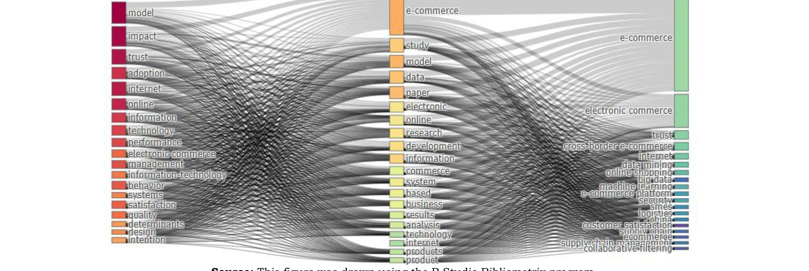

# Review of E-Commerce Literature: Inferences, Trends and Recommendations from Bibliometric Analysis

> **저자**: Yusuf Esmer | **날짜**: 2026-04-10 | **DOI**: [10.29216/ueip.1755296](https://doi.org/10.29216/ueip.1755296)

---

## Essence

*Figure 3: Annual Scientific Production*

Web of Science 데이터베이스의 15,670개 논문(1973-2025)을 VOSviewer와 R Studio Bibliometrix로 분석하여 e-commerce 문헌의 구조, 동향 및 연구 격차를 체계적으로 파악했다. 기술 인프라, 경영 및 사회적 맥락에 중점을 두고 있으며, 중국·미국·영국의 국제 협력 네트워크와 SDG와의 연계성을 확인했다.

## Motivation

- **Known**: e-commerce는 디지털화 가속화로 인해 전 지구적 경제의 기본 요소가 되었고, 다양한 분야(경영학, 정보기술, 마케팅, 물류 등)에서 학문적 관심이 증가하고 있다. 최근 국내외 선행 연구들이 e-commerce 관련 논문의 증가 추세를 보고했으나 포괄적인 WoS 기반 분석이 부재했다.
- **Gap**: 기존 국내 문헌은 학위논문 중심의 분석에 머물렀으며, 전 세계 학술 출판 데이터베이스인 WoS를 활용한 종합적인 bibliometric 분석이 없었다. 국제 협력 네트워크, 인용 동향, 주제별 분포 및 SDG와의 연계성에 대한 체계적 분석 결과가 부족했다.
- **Why**: e-commerce 분야의 연구 현황, 지역적 격차, 학제 간 통합 수준을 파악하는 것은 향후 연구 방향 설정과 정책 입안자들의 전략 수립에 필수적이다. bibliometric 분석은 연구 동향, 협력 네트워크, 인용 패턴을 시각화하여 학술 커뮤니티와 정책 결정자에게 전략적 인사이트를 제공한다.
- **Approach**: WoS 데이터베이스에서 'e-commerce' 관련 검색어로 1973-2025년 기간의 15,670개 논문을 수집하고, VOSviewer와 R Studio Bibliometrix 소프트웨어를 활용하여 저자-국가 협력 네트워크, 키워드 공출현, 연간 학술 생산성, 인용 추이, 주제별 분포를 분석했다.

## Achievement

*Figure 1: Co-authors' Countries*

- **국제 협력 네트워크 식별**: 중국, 미국, 영국이 e-commerce 연구의 주요 협력자로 확인되었으며, 학제 간 연구가 글로벌 규모에서 진행되고 있음을 증명했다.
- **주요 연구 초점 파악**: e-commerce 연구가 기술 인프라, 경영(비즈니스 모델, 마케팅) 및 사회적 맥락(사용자 경험, 소비자 보안)에 집중되어 있음을 확인했다.
- **SDG 연계성 규명**: e-commerce가 SDG 8(양질의 일자리와 경제 성장), SDG 9(산업, 혁신 및 인프라), SDG 12(책임감 있는 소비와 생산)와 연계되어 윤리적, 환경적, 사회적 가치를 창출할 수 있음을 입증했다.
- **연간 생산성 및 인용 동향**: 1973년부터 2025년까지의 학술 출판 추이와 인용 밀도의 분포를 시각화하여 분야의 성숙도와 영향력 변화를 추적했다.
- **연구 격차 및 권장사항 도출**: 학제 간 통합 강화, 지역 중심 연구 장려, 오픈 액세스 정책 확대, 데이터 기반 방법론 전환 등의 구체적 권고안을 제시했다.

## How

*Figure 5: Three Field Analysis*

- Web of Science 데이터베이스 검색: 2025년 4월 9일 수행, 시간 범위 1973-2025년으로 설정
- 데이터 수집: 'e-commerce' 관련 검색어를 활용하여 총 15,670개 학술 논문 수집", 'VOSviewer 활용: 저자-국가 협력 네트워크 시각화, 키워드 공출현 분석, 저자 간 협력 강도 측정
- R Studio Bibliometrix 패키지 활용: 연간 학술 생산성 추이, 연간 평균 인용 수, 출판 유형별 분포 분석
- 메타데이터 분석: 논문 제목, 초록, 키워드, 저자 정보, 인용 빈도를 정규화 및 코딩
- 3-field 분석: 저자, 키워드, 학문 분야 간 관계를 삼각형 네트워크로 시각화
- 정성적 검증: 선행연구와 결과 비교(Wulfert & Karger 2022, Sağtaş & Ercoşkun 2022 등)를 통한 신뢰성 확보

## Originality

- WoS 기반 포괄적 분석: 기존 국내 연구가 학위논문이나 제한된 데이터베이스에 집중한 반면, 이 연구는 전 지구적 학술 출판의 약 52년 데이터(15,670개 논문)를 분석하여 규모와 깊이 면에서 혁신적이다.
- SDG 연계성 규명: e-commerce 분야의 연구를 처음으로 UN의 지속가능개발목표와 체계적으로 연결하여 학술적·정책적 의의를 확대했다.
- 다층 네트워크 분석: 국가-저자-키워드-학문 분야 간 연결성을 동시에 분석하여 e-commerce의 학제 간 특성을 다각적으로 입증했다.
- 전략적 권고안의 실용성: 단순 현황 파악을 넘어 '학제 간 통합 강화
- 지역 중심 연구
- 데이터 기반 방법론 전환' 등 행동 가능한 권고안을 제시했다.", '동적 인용 분석: 연간 평균 인용 추이를 추적하여 연구 주제의 활성도와 영향력 변화를 시간축 상에서 가시화했다.

## Limitation & Further Study

- **데이터베이스 한정성**: WoS는 영어 중심이고 특정 학문 분야에 편향되어 있어, 현지 언어 출판물이나 회색 문헌(학위논문, 정부 보고서)이 누락될 수 있다.
- **시간적 한계**: 2025년 4월 이후의 논문은 분석에 포함되지 않았으며, 최신 동향(특히 AI, 블록체인 기반 e-commerce)의 반영이 제한적일 수 있다.
- **키워드 정의의 모호성**: 'e-commerce'의 정의가 명확하지 않아 관련 용어('digital commerce
- online retail
- platform economy')를 포함할지 여부에 따라 결과가 달라질 수 있다.", '**인과관계 파악 불가**: bibliometric 분석은 상관관계를 보여주지만 어떤 논문이 이후 연구에 영향을 미쳤는지는 추적할 수 없다.
- **후속연구 제안**: (1) 현지 언어 데이터베이스(중국어, 터키어 학술지)의 추가 분석, (2) 정성적 내용 분석을 결합하여 주요 이론적 기여도 평가, (3) 5년 단위로 정기적 업데이트하는 시계열 bibliometric 연구 수행, (4) 특정 주제(AI in e-commerce, 블록체인)에 대한 심층 분석

## Evaluation

- Novelty: 4/5
- Technical Soundness: 3/5
- Significance: 4/5
- Clarity: 4/5
- Overall: 4/5

**총평**: 이 연구는 52년간의 15,670개 WoS 논문을 VOSviewer와 R Studio Bibliometrix로 종합 분석하여 e-commerce 분야의 국제 협력 네트워크, 주요 연구 초점, SDG 연계성을 체계적으로 규명했다. 학제 간 통합, 지역 중심 연구, 오픈 액세스 확대, 데이터 기반 방법론 전환 등 실행 가능한 권고안을 제시하여 학계 및 정책 입안자에게 전략적 가치를 제공한다.

## Related Papers

- 🏛 기반 연구: [[papers/1023_SciSciNet_A_large-scale_open_data_lake_for_the_science_of_sc/review]] — 대규모 e-commerce 연구 분석을 위해 과학 연구의 오픈 데이터 레이크가 제공하는 인프라를 활용할 수 있음
- 🔗 후속 연구: [[papers/1038_The_Oligopoly_of_Academic_Publishers_in_the_Digital_Era/review]] — e-commerce 연구의 출판 패턴이 학술 출판 산업의 과점 구조에 어떤 영향을 받는지 분석할 수 있음
- 🔄 다른 접근: [[papers/1179_Global_Research_Trends_in_Knowledge_Management_in_Higher_Edu/review]] — 고등교육 지식관리의 bibliometric 분석과 유사한 방법론으로 e-commerce 연구 동향의 비교 관점을 제공한다.
- 🏛 기반 연구: [[papers/1134_A_scientometrics_survey_of_machine_learning_and_neural_netwo/review]] — 기계학습 응용의 scientometric 조사를 통해 e-commerce 연구에서 AI 기술 도입의 학술적 맥락을 보여준다.
- 🔗 후속 연구: [[papers/1147_Bibliometric_Analysis_on_the_Research_Trends_and_Collaborati/review]] — 연구 동향과 협력 패턴 분석의 방법론을 e-commerce 분야로 확장하여 학제간 협력의 구체적 사례를 제시한다.
- 🔄 다른 접근: [[papers/1179_Global_Research_Trends_in_Knowledge_Management_in_Higher_Edu/review]] — e-commerce 문헌의 bibliometric 분석과 유사한 방법론을 사용하여 고등교육 지식관리 연구의 비교 관점을 제공한다.
- 🔄 다른 접근: [[papers/1212_Shifts_in_Biotechnology_Research_Fronts_20002026_A_Bibliomet/review]] — e-commerce 연구 동향과 유사한 bibliometric 분석 방법론을 생명공학 분야에 적용하여 연구 전선 변화의 비교 관점을 제공한다.
