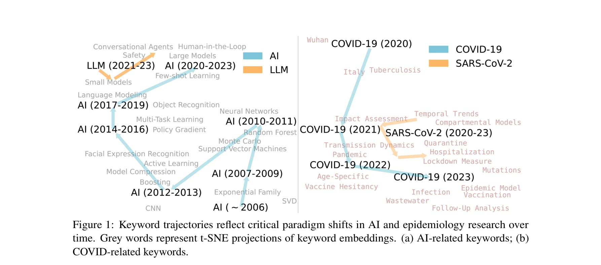
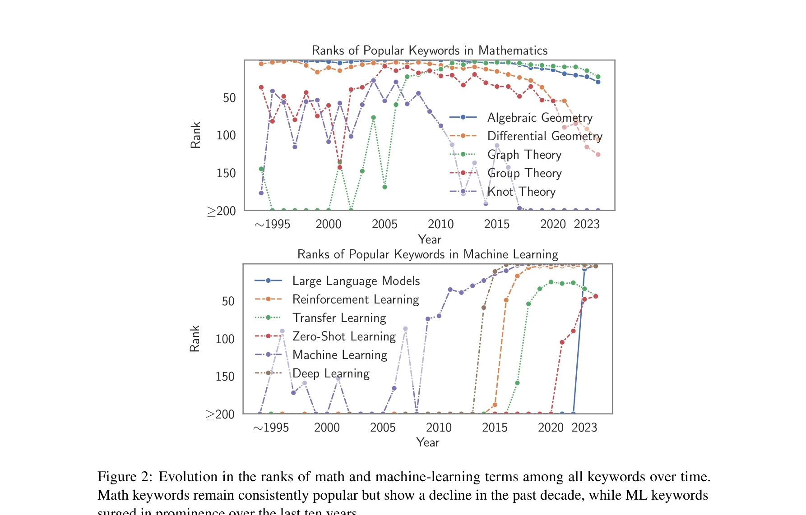

# Scientometric Analysis of Data Privacy and Cloud Security: Research Trends in Access Control and Encryption Techniques

> **저자**: R. Reddy, Syed Nawaz Pasha, D. Kumari | **날짜**: 2026 | **DOI**: [10.1109/ICAECT68478.2026.11426087](https://doi.org/10.1109/ICAECT68478.2026.11426087)

---

## Essence

*Figure 1: Keyword trajectories reflect critical paradigm shifts in AI and epidemiology research over*

arXiv의 210만 개 논문(1991-2024)을 포함한 대규모 scientometric 데이터셋 Scito2M을 소개하고, 30년간의 종단 분석을 통해 학문 용어, 인용 패턴, 학제간 지식 교환의 진화를 분석한다.

## Motivation

- **Known**: Scientometrics는 학술 문헌의 정량적·정성적 분석을 통해 과학 지식의 생성, 확산, 진화를 이해하는 데 사용된다. 기존 연구는 제한된 시간 범위, 특정 분야, 또는 특정 학회에 집중되어 있다.
- **Gap**: 대규모 종단 scientometric 데이터셋의 부재로 인해 학문 용어, 인용 행태, 학제간 지식 교환의 장기적 진화를 포괄적으로 분석하기 어렵다. 기존 데이터셋은 콘텐츠와 인용 정보를 함께 제공하지 않는다.
- **Why**: 과학 지식의 진화 과정을 이해하는 것은 팬데믹, 기후 변화, 윤리적 AI와 같은 글로벌 과제 해결을 위한 학제간 협력의 기초가 된다. 학문 분야별 인식론적 문화와 지식 생산 방식의 차이를 파악하는 것이 중요하다.
- **Approach**: arXiv에서 2.1백만 개의 학술 논문을 수집하고 Semantic Scholar API를 통해 인용 정보를 추가하며, GPT-4o를 이용하여 키워드를 추출한 후 temporal snapshots으로 나누어 diachronic 분석을 수행한다.

## Achievement

*Figure 2: Evolution in the ranks of math and machine-learning terms among all keywords over time.*

- **Scito2M 데이터셋**: 1991-2024년 arXiv 논문 2.1백만 개, 8개 그룹 156개 카테고리, 제목, 초록, 전문, 키워드, 인용 그래프 포함
- **패러다임 시프트 발견**: 1990년대 이론 물리학 중심에서 2010년대 이후 머신러닝 중심으로 급격한 전환 (ML 관련 키워드가 연간 상위 20개 키워드의 0.31개에서 9.5개로 증가)
- **인용 행태 분석**: LLM 연구는 평균 인용 나이 2.48년, 구전사는 9.71년으로 응용 연구가 기초 연구보다 최신 문헌에 의존
- **학제간 인용 패턴**: 인용의 91% 이상이 같은 분야 내에서 발생하는 강한 homophily 현상 확인
- **분석 도구 제공**: 과학 용어 진화와 인용 패턴 추적을 위한 분석 및 시각화 도구 제공

## How

*Figure 2: Evolution in the ranks of math and machine-learning terms among all keywords over time.*

- arXiv API를 통해 Creative Commons 라이선스 논문 전체 텍스트, 메타데이터 수집
- 각 논문에 대해 Semantic Scholar API로 인용 정보, 출판 장소, 저자 정보 추출
- GPT-4o를 사용하여 제목과 초록에서 키워드 자동 추출
- 시간별 snapshots으로 데이터 분할하여 시간적 변화 추적
- Graph Convolutional Network (GCN) 모델로 키워드 co-occurrence 패턴 분석
- t-SNE embedding으로 키워드 궤적 시각화하여 개념 진화 추적
- Simpson's Diversity Index, Shannon Diversity 등으로 인용 다양성 정량화

## Originality

- 아카이브(arXiv)의 전체 30년 데이터를 한 번에 분석한 최초의 대규모 longitudinal scientometric 연구
- 콘텐츠(제목, 초록, 전문, 키워드)와 인용 그래프를 통합한 데이터셋 제공
- LLM 기반 키워드 추출로 자동화된 고품질 과학 용어 추출
- Thomas Kuhn의 패러다임 시프트 이론과 연결하여 이론적 프레임워크 제시
- Epistemic cultures 개념으로 분야별 지식 생산 방식의 차이를 정량화한 처음의 연구

## Limitation & Further Study

- arXiv 데이터에 제한되어 전체 학술 출판물의 대표성이 부족할 수 있음 (특히 사회과학, 인문학 저조)
- Semantic Scholar API를 통한 인용 정보 수집으로 인한 누락 가능성 및 완성도 문제
- GPT-4o 기반 키워드 추출의 일관성과 정확성에 대한 검증 부재
- 시간적 snapshot 분할 방식이 자의적이어서 경계 부근의 현상 포착 한계
- 후속 연구: 다양한 출판 플랫폼(PubMed, IEEE Xplore 등)으로 확장하여 크로스 플랫폼 비교 분석
- 후속 연구: 논문의 실제 영향(인용수 증가, 정책 영향 등)과 용어 변화의 인과관계 분석
- 후속 연구: 저자 협력 네트워크와 지식 전파 경로의 시간적 진화 추적

## Evaluation

- Novelty: 4/5
- Technical Soundness: 4/5
- Significance: 4/5
- Clarity: 4/5
- Overall: 4/5

**총평**: Scito2M은 scientometric 연구를 위한 가장 포괄적인 대규모 데이터셋을 제공하며, 30년에 걸친 용어 진화와 인용 패턴 분석으로 학문 분야의 패러다임 시프트, epistemic cultures, 인용 행태의 차이를 정량적으로 입증한 중요한 기여 작업이다.

## Related Papers

- 🏛 기반 연구: [[papers/1023_SciSciNet_A_large-scale_open_data_lake_for_the_science_of_sc/review]] — 데이터 프라이버시와 클라우드 보안 연구를 위한 대규모 과학 데이터 레이크의 체계적 구축이 필요하다.
- 🔗 후속 연구: [[papers/1051_Unsupervised_Word_Embeddings_Capture_Latent_Knowledge_from_M/review]] — 과학 논문에서 데이터 보안 관련 잠재 지식을 무감독 임베딩으로 추출하는 방법으로 확장될 수 있다.
- 🏛 기반 연구: [[papers/1015_S2ORC_The_Semantic_Scholar_Open_Research_Corpus/review]] — 대규모 과학 문헌 코퍼스 구축과 처리에 필요한 기술적 기반을 제공한다
- 🔗 후속 연구: [[papers/1071_Data_measurement_and_empirical_methods_in_the_science_of_sci/review]] — 과학의 과학 분야에서 데이터 측정과 실증 방법론의 발전을 보여준다
- 🔗 후속 연구: [[papers/1166_Emerging_Trends_in_Cybersecurity_Machine_Learning_as_a_Game-/review]] — 사이버보안에서 머신러닝의 emerging trends가 데이터 프라이버시와 클라우드 보안 연구로 자연스럽게 확장된다.
