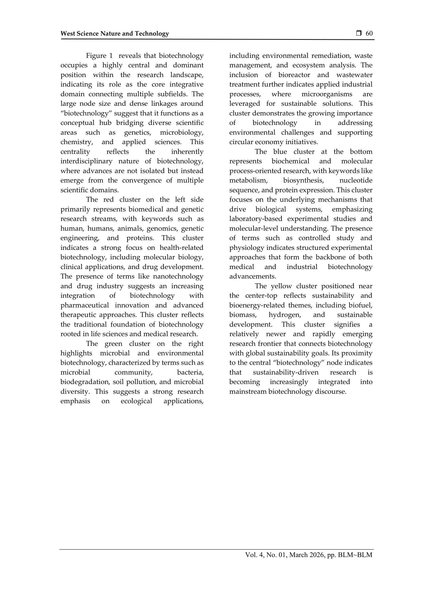

# Shifts in Biotechnology Research Fronts 2000–2026: A Bibliometric Study of Topic Emergence and Citation Landscapes

> **저자**: L. Judijanto | **날짜**: 2026 | **DOI**: [10.58812/wsnt.v4i01.2738](https://doi.org/10.58812/wsnt.v4i01.2738)

---

## Essence

*Figure 1  reveals that biotechnology*

2000-2026년 생명공학 연구의 진화를 bibliometric 분석으로 추적하여 분자생물학에서 지속가능성 지향적이고 학제간 응용 중심 영역으로의 전환을 입증한 연구다.

## Motivation

- **Known**: 생명공학은 genomics, proteomics, 합성생물학, CRISPR 기술 등으로 발전했으며, 의료, 농업, 산업 분야에서 혁신을 주도해왔다. 선행 연구들은 특정 분야에 초점을 맞춰왔으나 포괄적 장기 추적이 부족했다.
- **Gap**: 2000-2026년 기간 동안 생명공학 연구 전선(research fronts)의 전체적 변화, 주제 출현, 인용 구조의 포괄적 종단 분석이 부재하여 신흥 트렌드와 학제간 연계를 파악하기 어렵다.
- **Why**: 연구 기금 배분, 정책 수립, 기관의 전략적 계획 수립을 위해 신흥 기술과 지식 격차를 체계적으로 파악하는 것이 필수적이다.
- **Approach**: Scopus, Web of Science, PubMed 데이터베이스에서 생명공학 관련 peer-reviewed 논문을 수집하고 VOSviewer를 이용해 keyword co-occurrence, co-citation analysis, 시간적 발전을 분석했다.

## Achievement

*Figure 1  reveals that biotechnology*

- **핵심 연구 주제의 지속성과 변화**: 인간 생물학, 대사, 생화학 과정은 중심적으로 유지되면서 미생물 시스템, 생분해성, 바이오에너지, 지속가능발전이 신흥 주제로 부상
- **학제간 수렴의 증대**: 생명공학과 화학, nanotechnology, 전산과학 간의 수렴 증가로 biotechnology가 core integrative domain 역할 수행
- **인용 구조의 전환**: 기초 이론 작업에서 혁신 중심, 응용 지향 연구로의 shift 확인
- **환경·사회 대응성**: 미생물 커뮤니티, 생분해성, 폐수 처리 등 환경 문제 대응 관련 연구의 활성화

## How

*Figure 1  reveals that biotechnology*

- Scopus, Web of Science, PubMed로부터 biotechnology, molecular biology, genetic engineering, synthetic biology, bioinformatics 관련 keyword로 데이터 수집
- 영문 peer-reviewed journal 논문, review, 학술대회 논문으로 필터링
- 데이터 전처리: 중복 제거, 저자명 표준화, 기관 소속 정규화
- Keyword co-occurrence analysis로 연구 주제와 thematic cluster 식별
- Co-citation analysis와 bibliographic coupling으로 논문 간 관계 시각화
- Betweenness centrality, citation count, cluster density 등 network metrics 계산
- 26년 기간 동안 연구 전선의 출현, 성장, 쇠퇴를 temporal analysis로 검토

## Originality

- 2000-2026년 26년간의 포괄적 종단 분석으로 기존 단편적 시간 분석을 초월
- 전체 생명공학 영역의 통합적 mapping으로 산업·의료·환경 분야 간 연결고리 포착
- research fronts의 시간적 진화를 citation landscape 변화와 함께 분석하여 이론에서 응용으로의 전환 과정 체계화
- Keywords network visualization을 통해 biotechnology의 hub 역할과 cluster별 특성 차별화

## Limitation & Further Study

- 분석 대상이 영문 peer-reviewed 논문으로 제한되어 비영문 국가 연구와 회색문헌(grey literature) 미포함
- Scopus, Web of Science 데이터베이스의 주제 분류 기준에 따른 편향 가능성
- 데이터 수집 및 분석 시점(2026년 3월)으로 인한 최근 발전 미반영 가능성
- Keyword 기반 분석으로 인한 신흥 분야의 용어 표준화 부족 시 누락 위험
- 후속 연구: 비영문 논문 포함 확대, 특정 부분 분야(예: 정밀의료, 합성생물학)의 심화 분석, 인용 지연(citation lag)을 고려한 시간 스케일 조정

## Evaluation

- Novelty: 4/5
- Technical Soundness: 3/5
- Significance: 4/5
- Clarity: 4/5
- Overall: 4/5

**총평**: 생명공학 연구의 26년 변화를 체계적으로 추적한 종합적 bibliometric 연구로, 신흥 영역 파악과 정책 수립에 실질적 가치를 제공한다. 다만 데이터 범위 제한과 최신성 보완이 필요하다.

## Related Papers

- 🧪 응용 사례: [[papers/1032_The_Diversity-Innovation_Paradox_in_Science/review]] — 생명공학 연구의 다양성-혁신 패러독스가 지속가능성 중심 전환에 미치는 영향을 분석할 수 있음
- 🏛 기반 연구: [[papers/1071_Data_measurement_and_empirical_methods_in_the_science_of_sci/review]] — 생명공학 연구 동향의 경험적 분석을 위해 과학학 연구의 데이터 측정 방법론을 적용할 필요가 있음
- 🔄 다른 접근: [[papers/1206_Review_of_E-Commerce_Literature_Inferences_Trends_and_Recomm/review]] — e-commerce 연구 동향과 유사한 bibliometric 분석 방법론을 생명공학 분야에 적용하여 연구 전선 변화의 비교 관점을 제공한다.
- 🏛 기반 연구: [[papers/1134_A_scientometrics_survey_of_machine_learning_and_neural_netwo/review]] — 기계학습 응용의 scientometric 조사를 통해 생명공학 연구에서 AI 기술 도입과 학제간 응용의 학술적 배경을 보여준다.
- 🔗 후속 연구: [[papers/1076_Predicting_research_trends_with_semantic_and_neural_networks/review]] — 의미론적 네트워크를 통한 연구 동향 예측 방법론을 생명공학 분야의 지속가능성 지향적 전환 예측에 적용한 사례를 제시한다.
