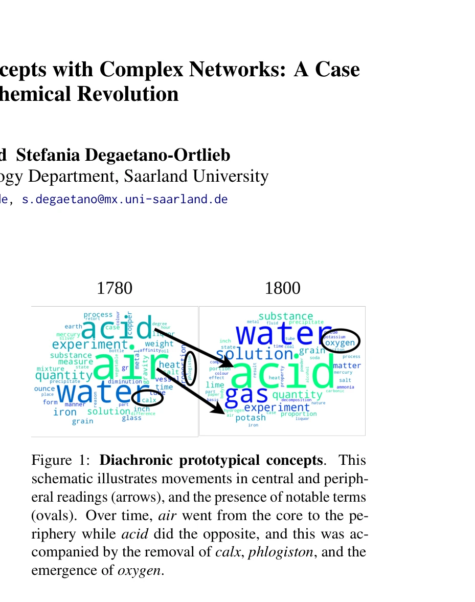
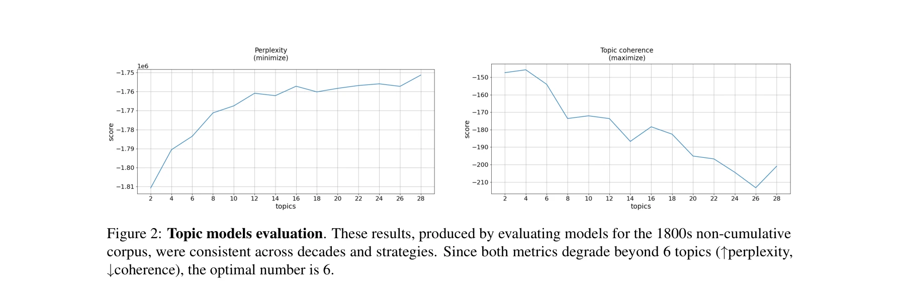

# The evolution of international scientific collaboration networks in science diplomacy: a scientometric analysis

> **저자**: Guillermo Armando Ronda-Pupo | **날짜**: 2026 | **DOI**: [10.1007/s11192-025-05479-9](https://doi.org/10.1007/s11192-025-05479-9)

---

## Essence

*Figure 1: Diachronic prototypical concepts. This*

본 논문은 prototype semantics와 complex networks를 활용하여 과학 혁명 시기의 개념 변화(phlogiston vs. oxygen)를 모델링하며, 온마시올로지적 변화가 높은 엔트로피와 위상 밀도와 연관됨을 보인다.

## Motivation

- **Known**: LLM 기반 context embeddings로 개념 변화를 추정할 수 있으나 해석 가능성과 시간 인식이 부족하며, 역사 데이터의 편향 증대가 Digital Humanities 연구에 위험을 초래한다.
- **Gap**: 기존 diachronic word embeddings와 semantic change 감지 방법은 변화의 근본 메커니즘을 설명하지 못하며, 개념의 적응 가능한 구조를 정량화하고 온마시올로지적 변화를 시간 축 그래프로 모델링하는 방법이 부재하다.
- **Why**: 과학 혁명 시기 언어 사용의 변화는 광범위한 인식론적 전환을 반영하므로, 개념 진화 메커니즘을 이해하는 것은 과학사와 Digital Humanities 연구에 필수적이며 역사적 변화의 보편적 센서로 기능한다.
- **Approach**: Royal Society Corpus를 활용하여 scientific texts를 prototype semantics 기반의 복잡 네트워크로 모델링하고, core-periphery 구조로 개념의 어휘를 조직화하여 온마시올로지적 변화를 시간 축 그래프로 평가한다.

## Achievement

*Figure 1: Diachronic prototypical concepts. This*

- **개념 네트워크 프레임워크**: prototype semantics를 복잡 네트워크로 표현하여 과학 개념의 중심부(core)와 주변부(periphery) 구조를 시간에 따라 모델링
- **온마시올로지적 변화 지표**: 엔트로피와 위상 밀도가 높을수록 아이디어 다양성과 연결성 노력이 증가함을 정량적으로 입증
- **해석 가능한 개념 추적**: LLM 기반 방법과 달리 도메인 전문가가 개념 궤적을 질적으로 평가하고 모델을 조정할 수 있는 투명한 접근법 제시
- **화학 혁명 사례 연구**: phlogiston에서 oxygen으로의 패러다임 전환을 네트워크 구조 변화(air의 중심→주변, acid의 주변→중심)로 시각화

## How

*Figure 2: Topic models evaluation. These results, produced by evaluating models for the 1800s non-cumulative*

- Royal Society Corpus에서 1750s-1800s 시기 과학 논문 수집
- topic model을 기반으로 개념의 어휘들(lexemes)을 topic으로 표현
- 각 시간 슬라이스(decade)별로 prototype semantics 구조에 따른 core-periphery 네트워크 구성
- 시간 축 그래프(temporal graphs)에서 네트워크 위상 특성(entropy, density) 계산
- 온마시올로지적 변화(어휘 표현 다양화)와 네트워크 구조 시프트 간 상관관계 분석
- phlogiston과 oxygen 이론에 대한 competing readings의 경쟁과 대체 패턴 추적

## Originality

- 개념적 구조 시프트 감지(Conceptual Structure Shift Detection Task)를 새롭게 정의하여 기존 lexical-semantic change detection과 구분
- prototype semantics의 radial structure를 복잡 네트워크로 직접 구현하여 core-periphery 다이나믹스를 시간에 따라 추적
- 온마시올로지적 변화(onomasiological change)를 엔트로피와 위상 밀도 같은 네트워크 메트릭으로 정량화한 최초 시도
- 과학 혁명이라는 구체적 역사적 사례를 통해 개념 변화 메커니즘의 일반화 가능한 모델 제시

## Limitation & Further Study

- 단일 사례(화학 혁명의 phlogiston vs. oxygen)에만 적용되었으므로 다른 과학 분야와 혁명에서의 일반화 가능성 미검증
- topic model의 품질과 시간 슬라이스 크기(decade) 선택에 따른 민감도 분석 부재
- bias augmentation in historical data에 대한 구체적인 완화 전략이 충분히 제시되지 않음
- 네트워크 위상 지표(entropy, density)와 실제 개념 변화의 인과 관계 입증이 아직 상관 분석 수준
- **후속 연구**: 다양한 시간대·학문 영역의 데이터셋에서 모델 재현성 검증, 역사 데이터 편향 교정 알고리즘 개발, 네트워크 구조 변화와 과학적 진전의 정량적 인과관계 규명 필요

## Evaluation

- Novelty: 4/5
- Technical Soundness: 3/5
- Significance: 4/5
- Clarity: 4/5
- Overall: 4/5

**총평**: 본 논문은 prototype semantics와 complex networks를 창의적으로 결합하여 과학 개념의 시간적 진화를 해석 가능하게 모델링하는 새로운 접근법을 제시하며, 화학 혁명이라는 풍부한 역사적 사례를 통해 온마시올로지적 변화의 네트워크 메커니즘을 규명한 점에서 Digital Humanities와 과학사 연구에 중요한 기여를 한다.

## Related Papers

- 🏛 기반 연구: [[papers/1046_The_structure_of_scientific_collaboration_networks/review]] — 과학 혁명 시기의 협업 네트워크 진화를 이해하기 위해 과학 협력 네트워크의 구조적 특성 연구가 필수적임
- 🔗 후속 연구: [[papers/936_Atypical_Combinations_and_Scientific_Impact/review]] — 비정형적 개념 결합이 과학 혁명 시기의 새로운 패러다임 형성에 미치는 영향을 분석할 수 있음
- 🔄 다른 접근: [[papers/935_Atlas_of_Science_Collaboration_19712020/review]] — 과학 혁명의 개념 변화를 네트워크로 모델링한 접근법과 국제 협력 네트워크 시각화는 모두 과학 지식의 진화를 네트워크로 분석한다.
- 🏛 기반 연구: [[papers/989_Modeling_Changing_Scientific_Concepts_with_Complex_Networks/review]] — 복잡 네트워크를 통한 과학적 개념 변화 모델링은 과학 개념의 변화 구조를 네트워크로 매핑한 연구의 방법론적 기반을 제공한다.
- 🔄 다른 접근: [[papers/935_Atlas_of_Science_Collaboration_19712020/review]] — 국제 협력 관계 시각화와 과학 혁명 개념 변화 모델링은 모두 과학 지식의 진화를 네트워크 관점에서 분석한다.
