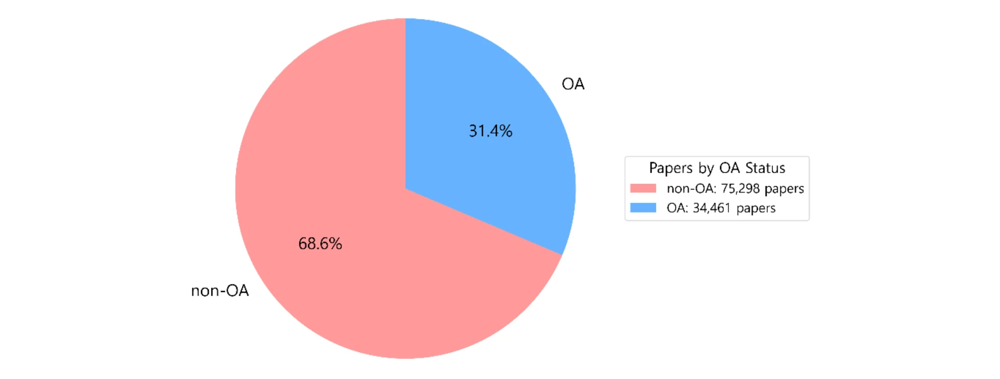
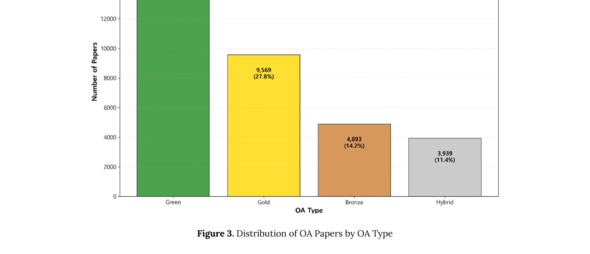

# Evaluating Open Access Advantages for Citations and Altmetrics (2011-21): A Dynamic and Evolving Relationship

> **저자**: Mike Taylor | **날짜**: 2026 | **DOI**: [10.1162/qss.a.470](https://doi.org/10.1162/qss.a.470)

---

## Essence

*Figure 2. Distribution of OA status in LIS articles (2001–2024)*

2011-2021년 출판된 3,330만 개 논문에서 Open Access 논문과 비OA 논문의 인용 및 altmetric 지표를 비교하여, OA 이점(OAA)이 학문분야와 지표에 따라 다양하게 나타나는 동적 관계를 실증적으로 분석했다.

## Motivation

- **Known**: Open Access가 연구 영향력을 증대시킨다는 'Open Access Advantage'가 초기 연구들에서 널리 보고되었으나, 학문분야와 지표에 따라 일관성 없는 결과가 보고되고 있다.
- **Gap**: 과학 전체를 아우르는 장기간(10년 이상) 다중 지표 분석이 부족했으며, 특히 LIS(Library and Information Science) 분야에서는 OA 인용 이점에 대한 실증 연구가 상대적으로 매우 제한적이었다.
- **Why**: OA 정책 수립 및 학술커뮤니케이션 전략 수립 시 학문분야별 맥락을 고려해야 하며, OA의 실제 영향을 정확히 이해하는 것이 중요하다.
- **Approach**: WoS Core Collection에서 2001-2024년 LIS 분야 109,759개 논문 데이터를 수집하여 OA 유형(Gold, Green, Hybrid, Bronze)별로 분류하고, t-test, ANOVA, time-series analysis 등 통계분석을 적용했다.

## Achievement

*Figure 3. Distribution of OA Papers by OA Type*

1. **조건부 OA 이점**: LIS 분야에서 비OA 논문(평균 18.83 인용)이 OA 논문(평균 17.9 인용)보다 약간 더 많은 인용을 받았으며, Green OA가 가장 큰 이점(28.55 인용) 제시
2. **시간에 따른 감소**: OA 인용 이점이 2001-2004년 9.75에서 2020-2024년 0.74로 급격히 감소
3. **다학제적 효과**: 다학제 논문이 단일분야 논문보다 더 나은 성과 보임
4. **일반화 불가**: OA 인용 이점은 OA 유형, 학문분야, 발표 시기에 따라 크게 변동

## How

*Figure 2. Distribution of OA status in LIS articles (2001–2024)*

- Web of Science (WoS) Core Collection에서 LIS 분야 저널 데이터 추출
- 각 논문을 OA 상태 및 유형(Gold, Green, Hybrid, Bronze)으로 분류
- 매개변수 및 비매개변수 검정으로 OA 유형, 학문분야, 발표 연도, 저널 사분위수별 인용 영향력 비교
- 효과 크기(effect size) 계산하여 실질적 관련성 평가
- time-series analysis로 시간에 따른 OA 이점 변화 추적

## Originality

- LIS 분야의 OA 효과 연구 공백을 직접적으로 해결한 최초의 포괄적 장기 실증 연구
- 다양한 OA 유형의 상대적 효과를 체계적으로 비교 분석
- 시간에 따른 OA 이점의 동적 변화를 명시적으로 검증하여 초기 연구와의 불일치 원인 규명
- 단순한 OA vs 비OA 비교를 넘어 학문분야, 발표연도, 저널 사분위수 등 다층적 변수 분석

## Limitation & Further Study

- Web of Science만 사용하여 다른 인용 데이터베이스의 차이 미반영
- LIS 분야에 국한되어 다른 학문분야에의 일반화 제한적
- 논문의 질적 특성(저자 명성, 연구 주제 인기도 등)을 통제하지 못함
- OA 채택 동기와 선택 편향(selection bias) 고려 미흡
- 후속연구: 다양한 데이터베이스와 학문분야로 확대, 인과관계 규명을 위한 실험설계 도입, OA 유형별 시간적 지연 효과 상세 분석 필요

## Evaluation

- Novelty: 4/5
- Technical Soundness: 3/5
- Significance: 4/5
- Clarity: 4/5
- Overall: 4/5

**총평**: 본 논문은 OA의 광범위한 이점을 가정하던 기존 인식에 대한 중요한 실증적 반박을 제공하며, 특히 LIS 분야에서의 OA 효과에 대한 주요 근거를 제시함으로써 학술커뮤니케이션 정책 수립에 실질적 기여를 한다.

## Related Papers

- 🔗 후속 연구: [[papers/1044_The_State_of_OA_A_Large-Scale_Analysis_of_the_Prevalence_and/review]] — 기존 OA 우위 연구를 확장하여 altmetric 지표와 더 긴 시간대의 동적 관계를 분석한다.
- ⚖️ 반론/비판: [[papers/932_An_empirical_analysis_of_open_access_citation_advantages_in/review]] — 도서관정보학에서 발견한 조건부 OA 효과와 대조하여 전체 학문 분야의 다양성을 보여준다.
- 🔗 후속 연구: [[papers/1044_The_State_of_OA_A_Large-Scale_Analysis_of_the_Prevalence_and/review]] — OA 인용 우위 효과를 더 최근 시기(2011-2021)와 altmetric 지표까지 확장하여 종합적으로 분석한다.
- 🏛 기반 연구: [[papers/932_An_empirical_analysis_of_open_access_citation_advantages_in/review]] — 특정 학문분야에서의 OA 효과 분석이 전체적인 OA 우위 연구의 기반이 되는 세부 사례를 제공한다.
- 🔗 후속 연구: [[papers/954_Do_novel_papers_attract_more_social_attention/review]] — 논문의 혁신성이 전통적 인용도뿐만 아니라 오픈액세스를 통한 사회적 주목도에도 영향을 미치는지 확장 검증할 수 있다.
- 🔗 후속 연구: [[papers/1140_Assessing_the_impact_of_Open_Research_Information_Infrastruc/review]] — 오픈액세스의 인용과 altmetric 이점 평가가 오픈 연구 인프라의 영향을 측정하는 방법론을 확장한다.
- ⚖️ 반론/비판: [[papers/1234_The_Open_Science_promise_vs_the_Author-pays_reality_The_Hidd/review]] — Open Access의 인용과 알트메트릭 이점에 대해 저자 부담 비용의 윤리적 문제를 제기한다
- 🔄 다른 접근: [[papers/1152_Citation_of_classical_research_by_doctoral-level_LIS_scholar/review]] — 오픈 액세스의 인용과 altmetrics 장점 분석과 철회 논문의 지속적 주목을 비교하여 학술 커뮤니케이션의 복잡성을 탐구한다.
