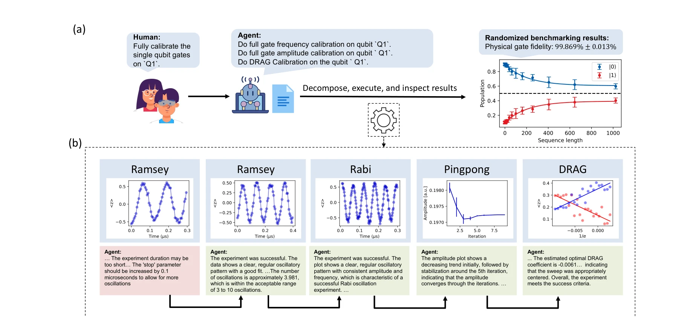

# Automating quantum computing laboratory experiments with an agent-based AI framework

> **저자**: Shuxiang Cao, Zijian Zhang, Mohammed Alghadeer, S. Fasciati, M. Piscitelli | **날짜**: 2024 | **DOI**: [10.1016/j.patter.2025.101372](https://doi.org/10.1016/j.patter.2025.101372)

---

## Essence

*Figure 1: (a) Overview of the k-agents framework. Given a procedure in natural language, the execution agent first*

k-agents 프레임워크는 대규모 언어모델 기반의 멀티에이전트 시스템으로 실험실 지식을 구조화하고 양자 컴퓨팅 실험을 자동화한다. 초전도 양자 프로세서의 캘리브레이션과 얽힌 양자 상태 생성을 인간 과학자 수준으로 자율 실행했다.

## Motivation

- **Known**: 실험 자동화는 과학적 발견을 가속화할 수 있으나 전통적 방식은 인간 전문가가 실험실 지식을 코드로 번역해야 한다. LLM과 multi-agent 시스템의 발전으로 효율적 자동화가 가능해지고 있다.
- **Gap**: 기존 LLM 기반 에이전트는 맥락 윈도우 제한, 독점적 실험실 지식의 부재, 이질적 멀티모달 지식 통합의 어려움, 장기 순차 작업 수행 능력 부족 등의 문제가 있다. RAG 방식도 실험실의 복잡한 멀티모달 지식에는 직접 적용이 어렵다.
- **Why**: 양자 컴퓨팅 및 복잡한 과학 실험의 자동화는 고처리량의 대규모 과학적 발견을 가능하게 하며, 반복적 노동을 제거하고 인간 전문가의 효율성을 극대화할 수 있다.
- **Approach**: k-agents 프레임워크는 실험 절차를 에이전트 기반 상태 머신으로 분해하고, translation agents가 지시문을 실행 코드로 변환하며, inspection agents가 결과를 분석하여 폐쇄 루프 피드백 제어를 실현한다.

## Achievement

*Figure 4: Automated single qubit parameter recalibration automated by k-agents. The human scientist instructs the*

- **k-agents 프레임워크 설계**: 실험실 지식(사용 가능한 작업, 결과 분석 방법)을 캡슐화하는 LLM 기반 에이전트 시스템으로, 미세 조정 없이 동적 지식 업데이트 가능
- **에이전트 기반 상태 머신**: 복잡한 다단계 실험 절차를 자동 분해하고 결과 분석 기반 상태 전이로 폐쇄 루프 제어 구현
- **선택적 활성화 메커니즘**: characterizing vectors를 사용하여 관련 translation agents만 선택적으로 활성화, 에이전트 수 증가에도 효율적 확장
- **양자 실험 자동화 성공**: 초전도 양자 프로세서의 단일 및 이중 qubit 매개변수 캘리브레이션, 얽힌 양자 상태 생성을 수 시간 자율 실행하며 인간 과학자 수준 달성
- **표준 RAG 대비 성능 향상**: 17개 translation agents 설정에서 정확한 experiment class 선택에 80 instruction 테스트 셋으로 표준 RAG 방식 초과

## How

*Figure 2: (a) Translation agents. Translation agents are responsible for translating an incoming instruction into*

- Execution agent가 자연언어 절차를 에이전트 기반 상태 머신으로 분해하며, 각 단계는 독립적 실험 지시문 포함
- Translation agent group은 지시문 벡터와 characterizing vectors의 유사도로 관련 agents 활성화 후 여러 제안 생성
- Inspection agents가 실험 결과를 텍스트 리포트로 변환하여 상태 전이 규칙 기반 다음 단계 결정
- Retrieval-augmented generation (RAG) 원칙을 적용하되 실험실 지식의 이질성과 멀티모달 특성에 맞게 적응
- Vector-based agent selection으로 context window 제약 극복 및 메모리 효율성 확보

## Originality

- 실험실 지식의 이질적 멀티모달 특성을 처리하기 위해 characterizing vectors 기반 선택적 agent 활성화 메커니즘 제시
- 에이전트 기반 상태 머신으로 복잡한 실험 절차의 자동 분해와 폐쇄 루프 피드백 제어 통합
- Knowledge agents를 분산적으로 설계하여 지식 업데이트의 동적성과 시스템 확장성 동시 달성
- 양자 컴퓨팅 실험 자동화에 multi-agent LLM 시스템을 처음 적용하여 인간 수준의 자율 실험 실현

## Limitation & Further Study

- LLM의 맥락 윈도우 제약은 여전히 존재하며, 초장시간 복잡한 실험 자동화에는 추가 최적화 필요
- 독점 실험실 지식의 접근성 부족으로 다른 분야나 기관으로의 일반화 적용에 한계
- visual inspection agent의 정확도와 복잡한 이미지 해석 능력의 추가 검증 필요
- 후속 연구로 다양한 과학 분야(화학, 재료과학 등)로 프레임워크 확대 적용 및 인간-에이전트 협업 최적화 필요

## Evaluation

- Novelty: 4/5
- Technical Soundness: 4/5
- Significance: 4/5
- Clarity: 4/5
- Overall: 4/5

**총평**: k-agents는 LLM 기반 multi-agent 시스템의 실험 자동화 적용에 새로운 패러다임을 제시하며, 양자 컴퓨팅 실험에서 인간 수준의 자율 성능을 달성했다. 선택적 agent 활성화와 상태 머신 아키텍처는 복잡한 실험실 지식 관리의 확장 가능한 솔루션을 제공한다.

## Related Papers

- 🔗 후속 연구: [[papers/072_Agents_for_self-driving_laboratories_applied_to_quantum_comp/review]] — 동일한 k-agents 프레임워크를 실험실 자동화에서 양자 컴퓨팅 실험이라는 특화 도메인으로 확장했다
- 🏛 기반 연구: [[papers/501_LLM-based_Multi-Agent_Copilot_for_Quantum_Sensor/review]] — 양자 센서 다중 에이전트 시스템의 기반이 되는 양자 컴퓨팅 실험 자동화 방법론을 제공한다
- 🧪 응용 사례: [[papers/816_Toward_a_Fully_Autonomous_AI-Native_Particle_Accelerator/review]] — 실험실 자동화를 입자가속기라는 대규모 물리 시설의 완전 자율 운영으로 확장한 응용 사례이다
- 🔄 다른 접근: [[papers/084_Ai-driven_robotics_for_free-space_optics/review]] — 광학 실험 자동화와 유사하게 실험실 전체를 자동화하는 다른 접근법을 제시한다.
- 🏛 기반 연구: [[papers/072_Agents_for_self-driving_laboratories_applied_to_quantum_comp/review]] — 동일한 k-agents 프레임워크를 기반으로 하여 양자 컴퓨팅 실험 자동화의 기본 원리를 제공한다
- 🔄 다른 접근: [[papers/139_Autonomous_microscopy_experiments_through_large_language_mod/review]] — 둘 다 실험실 자동화를 위한 AI 에이전트를 다루지만, AILA는 현미경 실험에, 양자 컴퓨팅 논문은 양자 실험에 특화되어 있다
- 🏛 기반 연구: [[papers/099_An_autonomous_laboratory_for_the_accelerated_synthesis_of_in/review]] — 양자 컴퓨팅 실험 자동화 기술이 A-Lab의 실험 자동화 프레임워크 구축에 기반이 된다.
- 🏛 기반 연구: [[papers/816_Toward_a_Fully_Autonomous_AI-Native_Particle_Accelerator/review]] — 양자컴퓨팅 실험 자동화 경험이 입자 가속기 AI 시스템 구축의 기반 지식을 제공한다.
