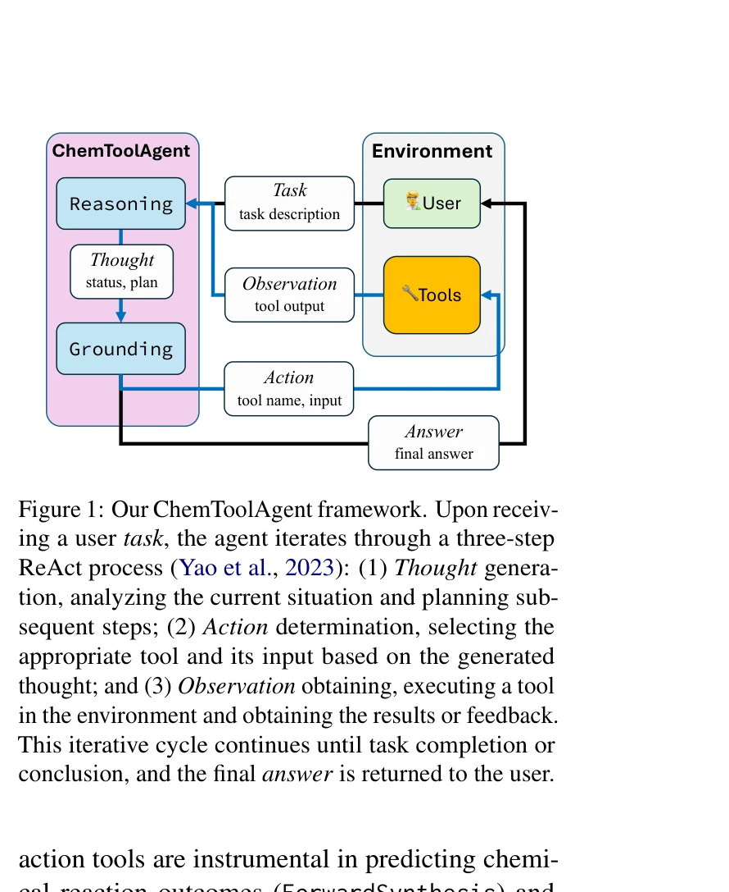
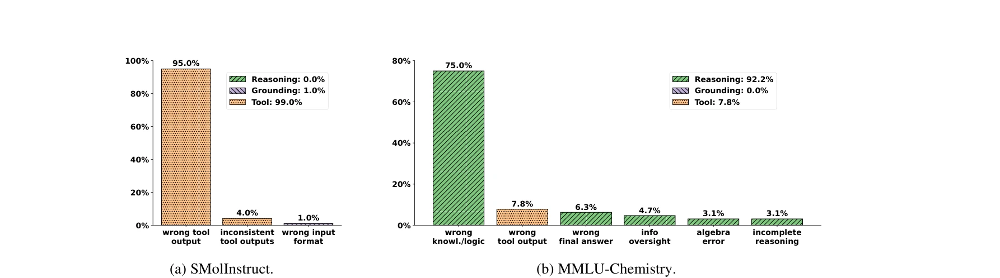

# ChemToolAgent: The Impact of Tools on Language Agents for Chemistry Problem Solving

> **저자**: Botao Yu, Frazier N. Baker, Ziru Chen, Garrett Herb, Boyu Gou | **날짜**: 2024 | **URL**: [https://arxiv.org/abs/2411.07228](https://arxiv.org/abs/2411.07228)

---

## Essence

*Figure 1: Our ChemToolAgent framework. Upon receiv-*

ChemToolAgent는 29개의 도구를 통합한 화학 문제 해결 LLM 에이전트이며, 전문화된 작업에서는 도구 증강의 효과가 있지만 일반 화학 문제에서는 기본 LLM을 능가하지 못함을 보여준다.

## Motivation

- **Known**: LLM 기반 에이전트에 ChemCrow와 Coscientist 같은 도구를 통합하면 화학 문제 해결 능력이 향상될 수 있다. 그러나 기존 평가는 정성적이고 범위가 제한적이다.
- **Gap**: 도구 증강 에이전트가 다양한 화학 작업 전체에서 어떻게 성능하는지에 대한 포괄적 이해가 부족하다. 특히 도구가 항상 성능을 개선하는지에 대한 체계적 평가가 없다.
- **Why**: 화학 분야에서 LLM의 실제 적용 가능성을 파악하기 위해 도구 증강의 이점과 한계를 명확히 이해하는 것이 중요하다.
- **Approach**: ChemToolAgent를 개발하여 29개의 도구로 강화하고, 전문화된 작업(SMolInstruct)과 일반 질문(MMLU, SciBench, GPQA 화학 부분)을 포함한 포괄적 평가를 수행한다.

## Achievement

*Figure 2: The error statistics of CTA (GPT) on SMolInstruct (102 errors) and MMLU-Chemistry (64 errors).*

- **도구의 차별적 영향**: 전문화된 화학 작업에서는 도구 증강이 상당한 성능 향상을 제공하지만, 일반 화학 문제에서는 기본 LLM보다 성능이 떨어진다
- **ChemToolAgent 개발**: ChemCrow를 개선하여 16개의 새로운 도구를 추가하고 6개의 기존 도구를 강화하여 더 광범위한 화학 문제 해결 능력 구현
- **오류 분석**: 전문가 분석을 통해 도구 증강이 인지 부하를 증가시켜 추론 능력을 저해할 수 있음을 발견
- **종합 벤치마크**: 700개의 전문화된 작업과 386개의 일반 화학 문제로 구성된 다양한 평가 데이터셋 구축

## How

*Figure 1: Our ChemToolAgent framework. Upon receiv-*

- ReAct 프레임워크를 기반으로 Thought-Action-Observation 반복 루프 구현
- 29개의 도구를 일반(검색, 코드 실행), 분자(성질 분석, 예측), 반응(합성 경로 예측) 도구로 분류
- PubchemSearchQA, BBBPPredictor, SideEffectPredictor 등 신규 도구 개발
- SMolInstruct(분자 및 반응 중심 작업 14종), MMLU/SciBench/GPQA 화학 부분으로 구성된 다층 평가 실시
- GPT-4o와 Claude-3.5-Sonnet을 백본 LLM으로 사용하여 에이전트 구현

## Originality

- 기존 ChemCrow의 좁은 범위 평가(14개 작업)를 넘어 1,086개 샘플의 포괄적 평가 수행
- 전문화된 작업과 일반 질문의 이분법적 구분을 통해 도구 증강의 효과를 차별화하여 분석
- 도구 증강이 항상 성능을 향상시키지 않음을 경험적으로 입증하는 반직관적 발견
- 화학 도메인 전문가와의 협력을 통한 정성적 오류 분석으로 근본 원인 규명

## Limitation & Further Study

- 평가가 영어 기반 벤치마크에 한정되어 다국어 성능 평가 부재
- 도구 증강의 인지 부하 증가 현상은 정량적으로 측정되지 않았으며 정성적 분석만 제공
- 일반 화학 문제의 성능 저하 원인이 완전히 해결되지 않아 향후 연구에서 추론 능력 강화 필요
- 도구 선택의 최적화 전략이 제시되지 않아 작업별 도구 적응 메커니즘 개발 필요
- ChemCrow와의 비교가 주요하나 Coscientist 등 다른 최신 에이전트와의 비교 부재

## Evaluation

- Novelty: 4/5
- Technical Soundness: 3/5
- Significance: 4/5
- Clarity: 4/5
- Overall: 4/5

**총평**: ChemToolAgent는 도구 증강 에이전트의 장단점을 명확히 규명한 중요한 실증적 연구이며, 도구가 항상 성능을 개선하지 않는다는 반직관적 발견은 향후 화학 LLM 에이전트 설계에 중요한 함의를 제공한다.

## Related Papers

- 🔄 다른 접근: [[papers/210_ChemCrow_Augmenting_large-language_models_with_chemistry_too/review]] — 화학 문제 해결에서 도구 영향 분석과 화학 도구 증강이라는 서로 다른 접근 방식을 통해 LLM의 화학 능력을 평가한다
- 🏛 기반 연구: [[papers/115_Augmenting_large_language_models_with_chemistry_tools/review]] — 화학 도구로 대형 언어 모델을 증강하는 기본 방법론을 도구 에이전트의 영향 분석에 활용한다
- 🧪 응용 사례: [[papers/701_Scholarchemqa_Unveiling_the_power_of_language_models_in_chem/review]] — 화학 도구 에이전트의 성능을 화학 질의응답이라는 구체적인 벤치마크를 통해 평가할 수 있다
- 🔗 후속 연구: [[papers/209_ChemAgent_Self-updating_Library_in_Large_Language_Models_Imp/review]] — 도구 사용 능력을 동적 라이브러리 시스템으로 확장하여 화학 추론을 강화한다
- 🔄 다른 접근: [[papers/176_CACTUS_Chemistry_Agent_Connecting_Tool_Usage_to_Science/review]] — 화학 에이전트에서 도구 통합과 도구 영향 평가라는 서로 다른 관점에서 LLM 기반 화학 문제 해결을 다룬다
