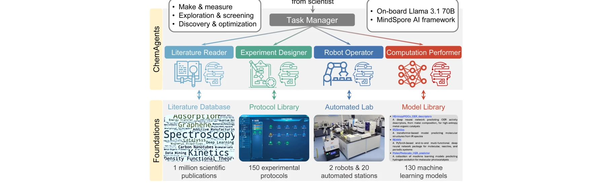
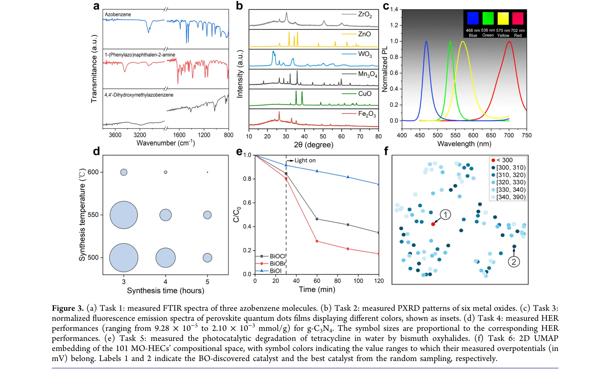

# A Multiagent-Driven Robotic AI Chemist Enabling Autonomous Chemical Research On Demand

> **저자**: Tao Song, Man Luo, Xiaolong Zhang, Linjiang Chen, Yan Huang, Jiaqi Cao, Qing Zhu, Daobin Liu, Baicheng Zhang, Gang Zou, Guoqing Zhang, Fei Zhang, Weiwei Shang, Yao Fu, Jun Jiang, Yi Luo | **날짜**: 2025-04-16 | **DOI**: [10.1021/jacs.4c17738](https://doi.org/10.1021/jacs.4c17738)

---

## Essence

*Figure 1. The LLM-based multiagent system, ChemAgents, comprises a Task Manager agent, which manages four role-specific *

LLM 기반 계층적 멀티에이전트 시스템인 ChemAgents를 이용한 자율 화학 로봇이 복잡한 다단계 실험을 최소한의 인간 개입으로 자동 수행할 수 있는 시스템을 개발했다. 이는 온디맨드 자율 화학 연구를 실현하여 화학 발견을 가속화하고 고급 실험 능력에 대한 접근성을 민주화한다.

## Motivation

- **Known**: LLM은 자연어 처리와 자율적 작업 실행에 뛰어나며, 로봇 자동화는 실험실 작업 수행에 효과적이다. GPT-4 기반의 ChemCrow 같은 에이전트와 Coscientist 같은 자율 연구 시스템들이 개별적으로 성공을 보였다.
- **Gap**: 기존 LLM 기반 접근법들은 다단계, 다스테이션, 다로봇 설정을 포함한 복잡한 실험 시나리오를 처리하는 데 제한이 있으며, 단일 LLM 프롬프트로는 가설 생성부터 실험 실행, 로봇 제어, 결과 분석까지 전체 자율 화학 프로세스를 원활하게 처리할 수 없다.
- **Why**: 자율 화학 연구의 자동화는 고처리량 탐색을 통해 발견을 가속화하고, 전문가가 아닌 연구자도 고급 실험 도구에 접근할 수 있게 하며, 학계와 산업계 전반에 걸쳐 협업과 혁신을 촉진한다.
- **Approach**: 계층적 멀티에이전트 구조로 Task Manager 에이전트가 Literature Reader, Experiment Designer, Computation Performer, Robot Operator 네 개의 역할 특화 에이전트를 조율하고, 각 에이전트는 Literature Database, Protocol Library, Model Library, Automated Lab 중 하나 이상의 자원을 활용한다. Llama-3.1-70B를 기반 LLM으로 사용한다.

## Achievement

*Figure 3. (a) Task 1: measured FTIR spectra of three azobenzene molecules. (b) Task 2: measured PXRD patterns of six met*

- **멀티에이전트 아키텍처**: Task Manager가 네 개의 역할 특화 에이전트를 효과적으로 조율하여 복잡한 화학 작업을 분해하고 실행한다.
- **세 가지 복잡도 수준 실증**: 화합물 합성/특성화(make & measure), 실험 변수 탐색/스크리닝(exploration & screening), 문헌 마이닝과 폐루프 최적화를 통한 기능성 물질 발견(discovery & optimization)을 성공적으로 수행했다.
- **일곱 가지 실험 작업**: 기본 합성 및 특성화부터 복잡한 매개변수 탐색과 기능성 물질 발견 및 최적화, 그리고 새로운 로봇 화학 실험실에서의 광촉매 유기 반응 수행까지 보여주었다.
- **확장성과 적응성**: 새로운 로봇 화학 실험실 환경에 배포하여 자율적으로 광촉매 유기 반응을 수행함으로써 시스템의 확장 가능성을 입증했다.
- **지식 자원 통합**: 과학 문헌 데이터베이스, 실험 프로토콜 라이브러리, 기계학습 모델 라이브러리, 자동화 실험실을 통합하여 포괄적인 자율 연구 능력을 제공한다.

## How

*Figure 1. The LLM-based multiagent system, ChemAgents, comprises a Task Manager agent, which manages four role-specific *

- Llama-3.1-70B를 MindSpore 오픈소스 AI 프레임워크에 구현하여 기본 LLM으로 사용
- Task Manager 에이전트에 시스템 프롬프트를 정의하여 역할, 작업, 함수 및 모든 하위 에이전트의 인터페이스 설명 포함
- 각 역할 특화 에이전트(Literature Reader, Experiment Designer, Computation Performer, Robot Operator)에 고유한 도구와 기능 부여
- 외부 소프트웨어 도구, 계산 플랫폼, 로봇 하드웨어를 통합하여 에이전트가 실행 가능한 출력을 생성하도록 설계
- 텍스트 지시사항을 수신하고 구조화된 형식의 출력을 생성하여 다른 에이전트의 입력 또는 인간 연구자의 해석으로 사용 가능하게 함
- 문헌 검색, 프로토콜 조회, 계산 모델 실행, 로봇 제어 등의 작업을 멀티에이전트 협력을 통해 조율

## Originality

- **계층적 멀티에이전트 아키텍처의 혁신**: 단일 LLM 에이전트의 한계를 극복하기 위해 Task Manager를 중심으로 역할 특화 에이전트들을 조율하는 체계적 구조 제안
- **포괄적 자원 통합**: Literature Database, Protocol Library, Model Library, Automated Lab을 하나의 시스템으로 통합하여 자율 화학 연구의 전체 파이프라인을 구현
- **다양한 복잡도의 작업 수행**: 기초적인 합성부터 폐루프 최적화를 포함한 발견까지 세 가지 복잡도 수준의 작업을 단일 시스템으로 처리
- **실제 로봇 시스템 통합**: 개념 검증 수준을 넘어 실제 자동화 실험실 환경에서 다수의 작업을 실행하고, 새로운 환경에의 적응성 시연
- **개방형 LLM 활용**: GPT-4와 같은 독점 모델 대신 Llama-3.1-70B를 사용하여 재현성과 접근성 향상

## Limitation & Further Study

- **스케일 제한**: 보고된 작업들이 대부분 제한된 범위의 화학 반응과 매개변수 공간에서 수행되었으며, 매우 다양한 화학 도메인으로의 일반화 가능성이 불명확함
- **에러 복구 메커니즘**: 실험 실패나 예상치 못한 결과에 대한 자동 에러 처리 및 재계획 능력의 세부 구현이 명확하지 않음
- **계산 비용 및 응답 시간**: Llama-3.1-70B 모델의 온보드 실행으로 인한 계산 오버헤드와 실시간 의사결정이 필요한 작업에서의 응답 지연 가능성
- **안전성 및 검증**: 자율 로봇 화학실에서의 안전성 프로토콜, 위험한 화학 반응에 대한 제어 메커니즘, 결과의 신뢰성 검증 절차가 충분히 논의되지 않음
- **후속 연구 방향**: 더 복잡한 합성 경로, 다중 병렬 작업 조율, 예측 불가능한 실험 결과에 대한 적응적 재계획, 여러 도메인 간의 전이 학습 능력 개발 필요

## Evaluation

- Novelty: 4/5
- Technical Soundness: 3/5
- Significance: 4/5
- Clarity: 4/5
- Overall: 4/5

**총평**: 이 연구는 계층적 멀티에이전트 시스템으로 LLM의 능력을 증폭시켜 실제 로봇 화학실에서 자율 연구를 효과적으로 수행하는 혁신적 시스템을 제시했다. 화학 자동화 분야에서 LLM과 로봇 하드웨어의 통합 모델로서 높은 가치가 있지만, 안전성 검증과 다양한 화학 도메인으로의 일반화 가능성에 대한 추가 연구가 필요하다.