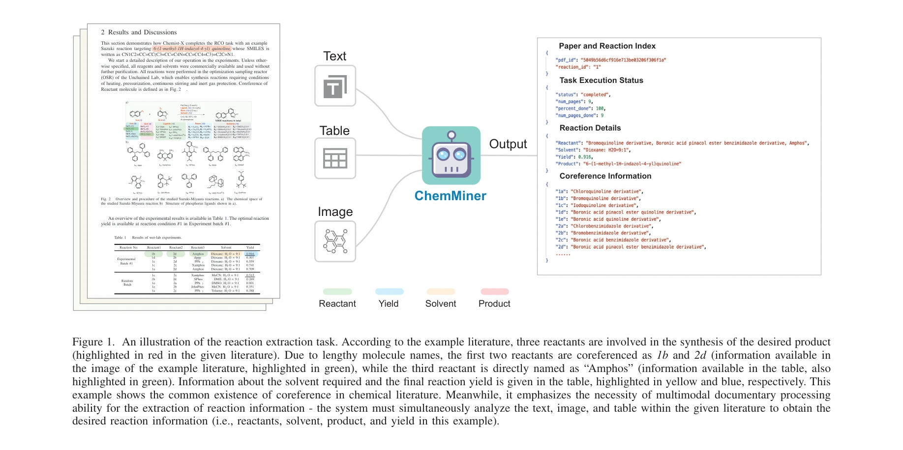
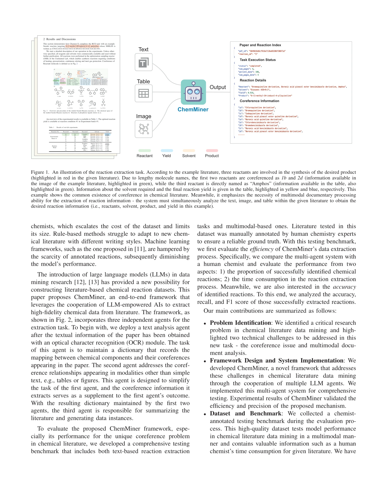

# ChemMiner: A Large Language Model Agent System for Chemical Literature Data Mining

> **저자**: Kexin Chen, Yuyang Du, Junyou Li, Hanqun Cao, Menghao Guo, Xilin Dang, Lanqing Li, Jiezhong Qiu, Pheng Ann Heng, Guangyong Chen | **날짜**: 2025-06-30 | **DOI**: [10.48550/arXiv.2402.12993](https://doi.org/10.48550/arXiv.2402.12993)

---

## Essence

*Figure 1. An illustration of the reaction extraction task. According to the example literature, three reactants are invo*

ChemMiner는 LLM 기반 다중 에이전트 시스템으로 화학 문헌에서 반응 정보를 자동 추출하며, coreference 해결 및 멀티모달 정보 처리를 통해 고품질 화학 데이터셋 구축을 가능하게 한다.

## Motivation

- **Known**: AI 기반 화학 합성 도구 개발에는 다양한 반응 유형을 포함한 대규모 데이터셋이 필요하며, 고처리량 실험(HTE)은 비용이 높고 범위가 제한적이다.
- **Gap**: 화학 문헌에서 반응 정보 추출은 다양한 작성 스타일, 복잡한 분자 coreference, 그리고 텍스트·이미지·표로 구성된 멀티모달 정보 처리의 어려움으로 인해 미해결 상태이다.
- **Why**: 화학 문헌은 매년 수천 개의 다양한 반응을 포함하는 거대한 미개발 데이터 소스이며, 효율적 활용으로 저비용에 다양한 반응 데이터셋 구축이 가능하다.
- **Approach**: ChemMiner는 text analysis agent(coreference 매핑), multimodal agent(멀티모달 정보 추출), synthesis analysis agent(데이터 생성)로 구성된 LLM 기반 다중 에이전트 협력 시스템으로 문헌 분석을 수행한다.

## Achievement

- **반응 식별 성능**: 인간 화학자와 유사한 반응 식별률 달성
- **처리 효율성**: 반응 추출 시간을 크게 단축
- **정량적 지표**: 높은 정확도, 재현율, F1 스코어 달성
- **벤치마크 개발**: 화학자 주석 데이터를 포함한 포괄적 평가 데이터셋 구축
- **오픈소스 공개**: 향후 화학 문헌 데이터 마이닝 연구 촉진

## How

*Fig. 2*

- OCR 모듈로 논문 텍스트 정보 추출
- Text analysis agent: 문맥 분석을 통한 분자-coreference 매핑 딕셔너리 유지
- Multimodal agent: 표, 그림 등 멀티모달 데이터에서 coreference 관계 추출
- Synthesis analysis agent: 추출된 정보 기반 반응 데이터 인스턴스 생성
- LLM prompt engineering으로 각 에이전트의 전문화된 작업 수행
- 멀티모달 정보 통합을 통한 고충실도 데이터 생성

## Originality

- 화학 문헌에서 반응 추출의 고유한 문제(coreference, 멀티모달 정보)를 처음으로 체계적으로 정의
- LLM 기반 다중 에이전트 협력 프레임워크로 화학 데이터 마이닝에 적용
- 화학자 주석을 포함한 멀티모달 벤치마크 최초 개발
- 분자 coreference 문제를 LLM 에이전트로 해결하는 새로운 접근

## Limitation & Further Study

- 현재 평가는 특정 유형의 화학 문헌에 제한될 수 있으며, 다양한 문헌 스타일에 대한 일반화 검증 필요
- OCR 품질에 의존하여 저품질 스캔 문헌에서 성능 저하 가능성
- 화학 도메인 외 과학 문헌에의 적용 가능성 미탐색
- **후속연구**: 다국어 문헌 처리, 더 복잡한 유기합성 반응 처리, 실시간 문헌 스트림 처리 시스템 개발 필요

## Evaluation

- Novelty: 4/5
- Technical Soundness: 3/5
- Significance: 4/5
- Clarity: 4/5
- Overall: 4/5

**총평**: ChemMiner는 화학 문헌 데이터 마이닝의 실질적 문제를 명확히 정의하고 LLM 기반 다중 에이전트 시스템으로 효과적으로 해결하며, 전문가 주석 벤치마크 공개로 해당 분야의 중요한 기여를 제공한다.