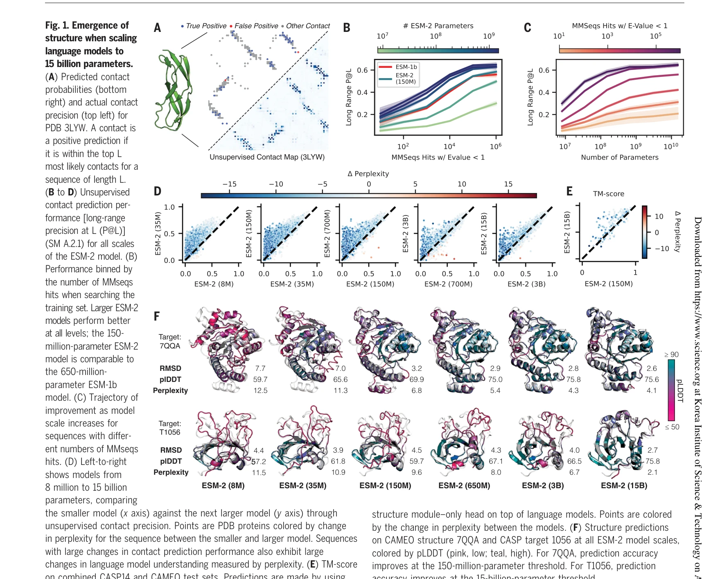
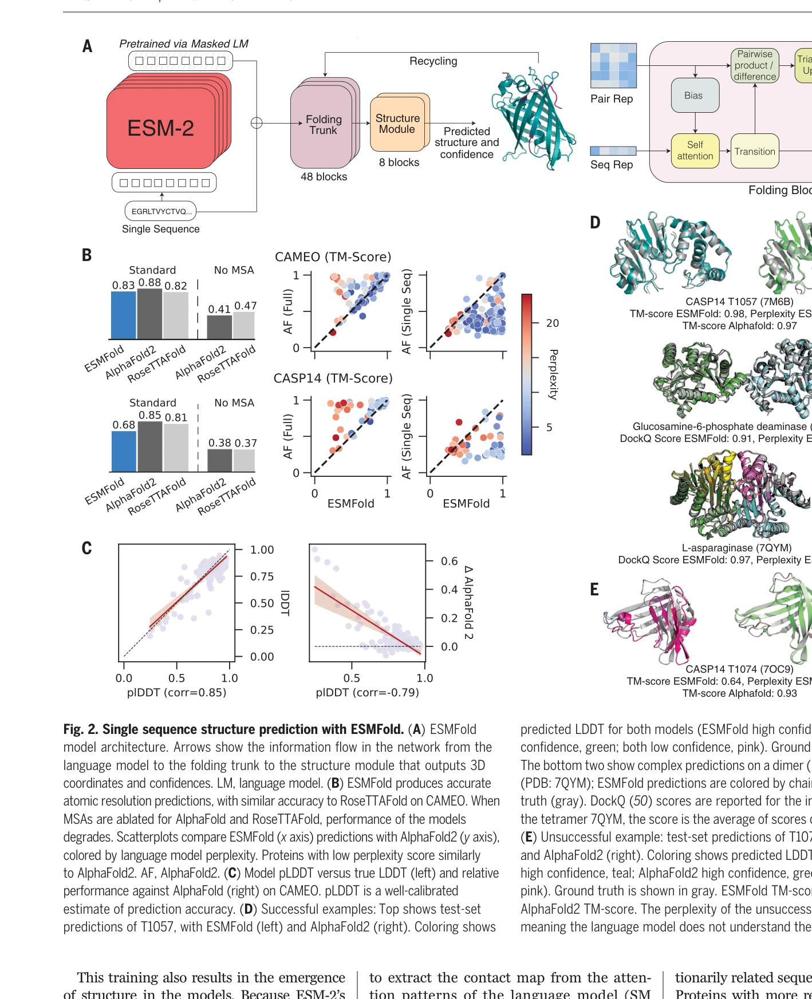

# Evolutionary-scale prediction of atomic-level protein structure with a language model

> **저자**: Zeming Lin, Halil Akin, Roshan Rao, Brian Hie, Zhongkai Zhu, Wenting Lu, Nikita Smetanin, Robert Verkuil, Ori Kabeli, Yaniv Shmueli, Allan Dos Santos Costa, Maryam Fazel-Zarandi, Tom Sercu, Salvatore Candido, Alexander Rives | **날짜**: 2023-03-17 | **DOI**: [10.1126/science.ade2574](https://doi.org/10.1126/science.ade2574)

---

## Essence

*Fig. 1. Emergence of*

15억 개 파라미터 규모의 protein language model을 훈련하여 다중 서열 정렬 없이 단일 서열에서 원자 수준의 단백질 구조를 직접 예측하는 ESMFold를 개발하고, 6억 개 이상의 메타게놈 단백질 구조를 예측하여 ESM Metagenomic Atlas를 구성했다.

## Motivation

- **Known**: protein language model이 규모 증가에 따라 이차, 삼차 구조 정보를 습득할 수 있으며, AlphaFold2와 RoseTTAFold 같은 진화 정보 기반 방법이 높은 정확도의 단백질 구조 예측을 달성했다.
- **Gap**: 기존 최첨단 방법들은 다중 서열 정렬(MSA) 계산과 관련 단백질 검색에 많은 시간이 소요되어 메타게놈 규모의 대량 구조 예측이 비현실적이며, 단일 서열만으로 MSA 없이 정확한 구조 예측을 하는 방법이 부족하다.
- **Why**: 메타게놈 데이터베이스가 기하급수적으로 증가하고 있는 상황에서 단백질 구조 예측을 대규모로 확장하려면 속도 향상이 필수적이며, 이를 통해 알려지지 않은 자연 단백질의 구조적 다양성을 규명할 수 있다.
- **Approach**: ESM-2라는 transformer 기반 protein language model을 8백만에서 150억 파라미터 규모로 확대 훈련하여 마스킹된 아미노산 예측 목표로 진화 패턴을 학습시키고, 언어 모델의 표현 위에 간단한 구조 모듈을 부착하여 ESMFold를 구성했다.

## Achievement

*Fig. 2. Single sequence structure prediction with ESMFold. (A) ESMFold*

- **구조 출현**: 파라미터 규모 증가(8M→15B)에 따라 원자 수준 단백질 구조 정보가 언어 모델의 표현에서 자동으로 출현하며, 모델의 sequence understanding(perplexity)과 구조 예측 정확도 간의 강한 상관관계를 발견
- **속도 향상**: MSA 검색 제거와 간단한 신경 아키텍처로 순전파에서만 최대 60배, 전체 파이프라인에서 1-2 자리수 배 속도 향상을 달성하여 실용적 대규모 예측 가능
- **메타게놈 구조 데이터베이스**: MGnify90의 6억 1700만 개 단백질 중 2억 2500만 개를 높은 신뢰도로 예측하여 ESM Metagenomic Atlas 구축
- **미지 구조 발견**: 고신뢰도 예측의 76.8%가 UniRef90과 90% 이상 서열 유사도 차이가 있고, 12.6%는 실험적 구조와의 매치 없는 완전히 새로운 구조 영역 규명
- **성능 유지**: MSA 없이도 CASP14/CAMEO 벤치마크에서 최첨단 방법 수준의 정확도(TM-score) 달성

## How

*Fig. 1. Emergence of*

- ESM-2를 UniRef 데이터베이스의 65백만 개 고유 서열로 훈련하되, 마스킹된 언어 모델링(MLM) 목표로 15%의 아미노산을 무작위 마스킹하고 주변 문맥에서 예측하도록 학습
- 언어 모델의 각 토큰 표현을 추출하여 구조 모듈 헤드(접촉 예측 + 삼각형 업데이트 + 구조 생성)에 입력하여 원자 좌표 직접 예측
- Perplexity와 contact precision 간의 상관 분석으로 언어 모델 능력과 구조 학습의 연결고리 검증
- 2000개 GPU의 이질적 클러스터에서 2주 내에 6억 개 메타게놈 단백질 대규모 예측 실행
- pLDDT 신뢰도 점수로 고신뢰도 예측(>70) 선별하여 데이터베이스 구축

## Originality

- Protein language model 규모의 명시적 구조 출현을 체계적으로 증명한 첫 연구로, 단순 MLM 훈련만으로 원자 수준 구조가 창발적으로 나타남을 시각화
- MSA 의존성을 완전히 제거한 단백질 구조 예측 방식으로, 기존 paradigm(진화 정보 활용) 대신 단일 서열의 패턴만으로 구조 추론 달성
- 메타게놈 규모(6억+) 단백질 구조 예측을 실제로 가능하게 한 첫 사례로, 기존에는 20만~2억 단백질 수준 제한

## Limitation & Further Study

- MSA 없는 구조 예측이 training set에 유사 서열이 충분한 경우에 의존할 수 있으며, 매우 새로운 폴드에 대해 정확도 검증 부족
- 메타게놈 데이터의 구조 예측 정확도를 실험적으로 검증한 사례가 제시되지 않아 신뢰도의 실제 신뢰성 불명확
- Membrane protein이나 복잡한 다중체 구조 예측 능력은 논문에서 상세히 다루지 않음
- 후속 연구로 저신뢰도 예측의 정확도 개선, dynamic/ensemble 단백질 구조 예측 확장, 새로운 폴드 발견 검증 필요

## Evaluation

- Novelty: 4/5
- Technical Soundness: 3/5
- Significance: 4/5
- Clarity: 4/5
- Overall: 4/5

**총평**: Language model의 규모 증가에 따른 단백질 구조의 창발적 출현을 체계적으로 증명하고, MSA 없이 단일 서열로 원자 수준 구조를 고속 예측하는 ESMFold를 통해 단백질 구조 예측의 패러다임을 전환했으며, 6억 개 메타게놈 단백질의 대규모 구조 데이터베이스 구축으로 자연 단백질의 구조적 다양성에 대한 새로운 생물학적 통찰을 제공하는 획기적 연구이다.