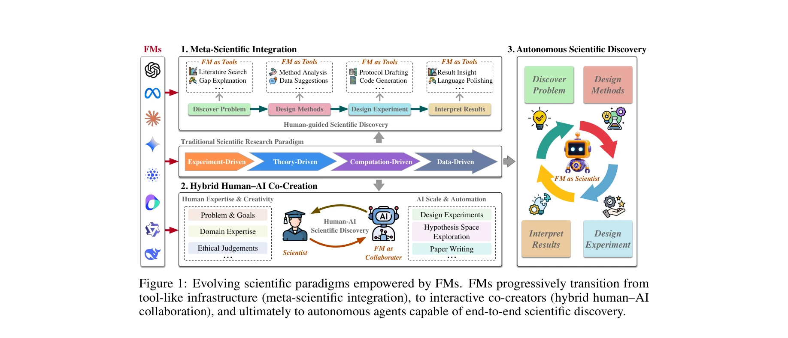

# Foundation Models for Scientific Discovery: From Paradigm Enhancement to Paradigm Transition

> **저자**: Fan Liu, Jindong Han, Tengfei Lyu, Weijia Zhang, Zhe-Rui Yang, Lu Dai, Cancheng Liu, Hao Liu | **날짜**: 2025-10-17 | **DOI**: [10.48550/arXiv.2510.15280](https://doi.org/10.48550/arXiv.2510.15280)

---

## Essence

*Figure 1: Evolving scientific paradigms empowered by FMs. FMs progressively transition from*

본 논문은 Foundation Models(FMs)이 과학 연구의 기존 방법론을 강화하는 것을 넘어 과학의 패러다임 자체를 전환하고 있다고 주장하며, 메타-과학 통합, 하이브리드 인간-AI 협력, 자율적 과학 발견의 세 단계 프레임워크를 제시한다.

## Motivation

- **Known**: FMs는 GPT-4, AlphaFold 같은 모델들이 과학 연구 작업들을 가속화하고 있으며, 기존 과학 패러다임은 실험, 이론, 계산, 데이터 기반의 네 가지 단계를 거쳐 발전해왔다.
- **Gap**: FMs가 기존 과학 방법론을 단순히 개선하는 도구인지, 아니면 과학 수행 방식 자체를 재정의하는 패러다임 전환의 촉매인지에 대한 명확한 개념적 프레임워크와 체계적 분석이 부족하다.
- **Why**: 복잡한 현상(의식 이해, 단백질 폴딩, 사회 극화 예측)과 조합 폭증 문제를 다루기 위해 기존 과학 패러다임의 한계를 극복할 새로운 접근이 필요하며, FMs의 변혁적 역할을 이해하는 것이 과학의 미래 방향을 결정하는 데 중요하다.
- **Approach**: 과학 발견의 역사적 패러다임 진화를 분석하고, FMs가 과학 연구에 점진적으로 통합되는 세 단계(인프라 통합 → 협력 → 자율성)를 정의하여 현재 응용과 미래 가능성을 체계적으로 검토한다.

## Achievement

*Figure 1: Evolving scientific paradigms empowered by FMs. FMs progressively transition from*

- **세 단계 진화 프레임워크**: Meta-Scientific Integration(전통 패러다임 내 워크플로우 강화) → Hybrid Human-AI Co-Creation(능동적 협력자로서 문제 정의 및 추론) → Autonomous Scientific Discovery(최소한의 인간 개입으로 새로운 지식 생성)을 통한 FM의 역할 변화를 명확히 정의
- **개념적 기여**: FMs가 단순한 도구를 넘어 과학의 에피스테믹 구조 자체를 변화시키고 있다는 입장 제시
- **체계적 분석**: 실험, 이론, 계산, 데이터 기반 워크플로우 전반에서 FM 적용 사례를 분석하고 분류
- **미래 연구 의제**: FMs 기반 과학 발견의 위험 요소와 향후 연구 방향을 식별

## How

*Figure 1: Evolving scientific paradigms empowered by FMs. FMs progressively transition from*

- 과학 발견 패러다임의 역사적 진화(실험-이론-계산-데이터 기반) 분석을 통해 패러다임 전환의 선례 제시
- FMs의 현재 능력(AlphaFold의 단백질 폴딩, FunSearch의 수학적 추론)을 사례로 제시하여 기존 도구와 차별성 강조
- 세 단계 프레임워크에서 각 단계별로 FMs의 역할, 인간의 역할, 상호작용 방식을 명시적으로 정의
- 에피스테믹 목표(문제 정의, 가설 생성, 실험 설계, 결과 해석)와 FM의 기능 매핑
- 전통 과학과 FM 기반 과학의 구조적 차이를 도식화(Figure 1)로 시각화

## Originality

- FMs의 역할을 단순한 도구 강화에서 패러다임 전환의 촉매로 재정의하는 새로운 시각 제시
- 세 단계 진화 프레임워크는 FM의 점진적 통합을 구조화한 최초의 체계적 분류
- 에피스테믹 관점에서 과학 발견 패러다임의 역사를 분석하고 미래 전망을 연결한 통합적 접근
- AI 기반 과학이 단순히 효율성을 높이는 것이 아니라 과학적 지식 생성 방식 자체를 변화시킨다는 주장의 철학적 근거 제시

## Limitation & Further Study

- **실증적 증거 부족**: 대부분 가정과 제안 중심이며, 실제로 현업 과학자 집단에서 각 단계의 채택과 영향을 정량적으로 검증하는 데이터 부재
- **자율적 발견 단계의 현실성**: Autonomous Scientific Discovery 단계가 과연 실현 가능한지, 어떤 과학 분야부터 가능할지에 대한 구체적 로드맵 부족
- **위험 요소 분석 미흡**: 논문이 위험과 미래 방향을 식별한다고 했으나 본문에서 상세하게 다루어지지 않음
- **검증 메커니즘의 미명확성**: FMs가 생성한 과학적 발견이 기존 과학의 검증 기준(재현성, 동료 평가 등)과 어떻게 조화될 수 있는지 명확하지 않음
- **후속 연구 방향**: (1) 실제 과학 팀에서 각 단계별 FM 적용 사례 연구, (2) 분야별 도입 현황과 장애 요인 분석, (3) FM 기반 발견의 신뢰성과 윤리성 평가 프레임워크 개발, (4) 인간-AI 협력의 최적 구조에 관한 실증 연구

## Evaluation

- Novelty: 4/5
- Technical Soundness: 3/5
- Significance: 4/5
- Clarity: 4/5
- Overall: 4/5

**총평**: 본 논문은 FMs의 역할을 패러다임 전환의 촉매로 재정의하는 새로운 개념적 프레임워크를 제시하여 AI와 과학의 관계를 철학적 차원에서 깊이 있게 논의한다. 다만 이러한 주장들이 실제 과학 커뮤니티의 현황과 미래 가능성에 대한 충분한 실증적 근거와 구체적 검증 메커니즘 논의로 뒷받침되어야 할 필요가 있다.