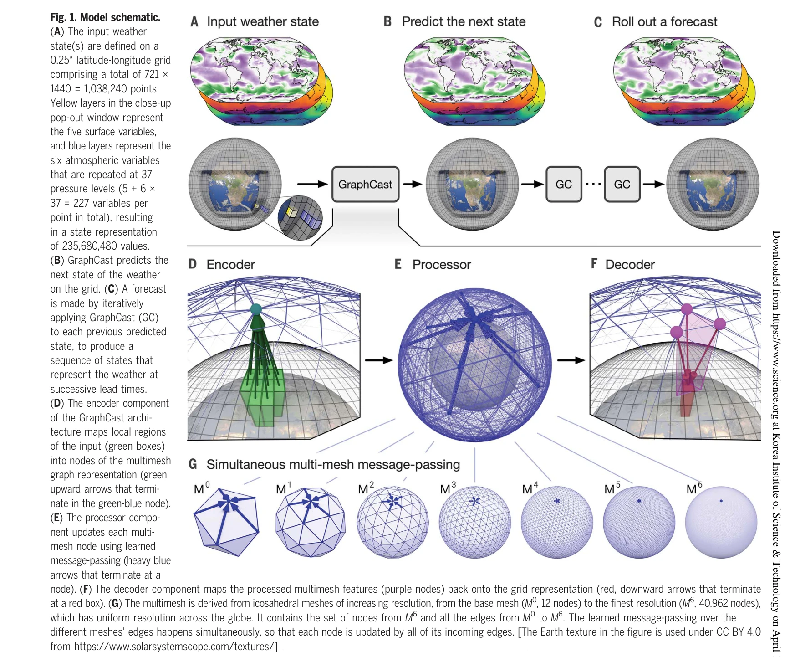
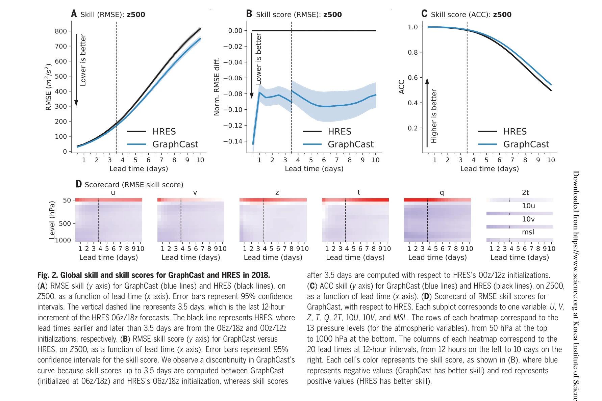

# Learning skillful medium-range global weather forecasting

> **저자**: Remi Lam, Alvaro Sanchez-Gonzalez, Matthew Willson, Peter Wirnsberger, Meire Fortunato, Ferran Alet, Suman Ravuri, Timo Ewalds, Zach Eaton-Rosen, Weihua Hu, Alexander Merose, Stephan Hoyer, George Holland, Oriol Vinyals, Jacklynn Stott, Alexander Pritzel, Shakir Mohamed, Peter Battaglia | **날짜**: 2023-12-22 | **DOI**: [10.1126/science.adi2336](https://doi.org/10.1126/science.adi2336)

---

## Essence

*Fig. 1. Model schematic.*

GraphCast는 Graph Neural Network 기반의 기계학습 모델로, 과거 재분석 데이터로부터 학습하여 10일 앞의 날씨를 0.25° 해상도로 1분 이내에 예측하며, 기존의 수치 기상 예보 시스템을 90% 이상의 검증 항목에서 능가한다.

## Motivation

- **Known**: 전통적인 수치 기상 예보(NWP)는 물리 방정식을 풀기 위해 슈퍼컴퓨터를 사용하며, 증가된 계산 자원으로 정확도를 개선할 수 있다. 최근 기계학습 기반 기상 예보는 강수 나우캐스팅이나 부계절 열파 예측 같은 특정 영역에서 NWP를 개선했다.
- **Gap**: 중기 기상 예보(10일 전)에서는 ECMWF의 IFS 같은 NWP 시스템이 여전히 가장 정확하지만, 과거 기상 데이터를 직접 활용하여 모델을 개선하는 방식의 기계학습 접근법이 필요하다. 0.25° 해상도에서 NWP를 능가하는 기계학습 방법은 아직 제한적이다.
- **Why**: 정확한 중기 기상 예보는 개인, 산업, 정책 결정에 매우 중요하며, 기계학습 기반 방법은 NWP보다 빠르고 효율적이면서도 과거 패턴으로부터 학습하여 예측 정확도를 개선할 수 있다.
- **Approach**: Graph Neural Network 기반 encoder-processor-decoder 구조로 설계된 GraphCast 모델을 사용하여, ERA5 재분석 데이터(1979-2017년)로 학습시키고, 입력으로부터 6시간 앞의 날씨 상태를 예측하는 autoregressive 방식을 적용한다.

## Achievement

*Fig. 2. Global skill and skill scores for GraphCast and HRES in 2018.*

- **기존 시스템 능가**: 1380개 검증 항목 중 90%에서 ECMWF의 HRES보다 더 정확한 예측 제공
- **고속 예측**: Google Cloud TPU v4 단일 기기에서 10일 예보를 1분 이내에 생성
- **극한 기상 현상 예측**: 열대 저기압 추적, 대기 강(atmospheric rivers), 극한 온도 예측에서 우수한 성능
- **광범위한 변수 예측**: 지표면 5개 변수와 37개 기압 레벨의 대기 6개 변수를 포함하여 총 227개 변수 예측
- **높은 해상도**: 0.25° 위도-경도 격자(약 28km × 28km)에서 전 지구적 예측 수행

## How

*Fig. 1. Model schematic.*

- 입력: 현재 시각과 6시간 이전의 두 가지 최근 날씨 상태를 0.25° 위도-경도 격자로 표현
- Encoder: 단일 GNN 레이어를 사용하여 입력 격자를 multimesh 그래프 표현의 노드 속성으로 변환
- Multimesh: 정이십면체(icosahedron)를 6번 반복적으로 정제하여 40,962개 노드를 가진 공간적으로 균질한 그래프 생성
- Processor: 16개의 비공유(unshared) GNN 레이어로 multimesh 상에서 learned message-passing 수행하여 효율적인 지역 및 장거리 정보 전파
- Decoder: 단일 GNN 레이어를 사용하여 처리된 특징을 위도-경도 격자로 역변환하고 잔차 업데이트로 출력 예측
- Autoregressive 롤아웃: 이전 예측을 입력으로 재투입하여 임의의 길이의 날씨 상태 시계열 생성
- 학습 목표: N 단계의 autoregressive 예측과 ERA5 상태 간의 평균 제곱 오차(MSE)를 수직 레벨로 가중치화하여 계산, 훈련 과정에서 N을 1에서 12로 점진적 증가

## Originality

- **Graph Neural Network 기반 설계**: Multimesh 구조를 통해 구체적 좌표계(위도-경도)로부터 내재적 그래프 표현으로 변환하여 구면 좌표에서의 대칭성과 효율성 확보
- **Multimesh 계층 구조**: 정이십면체 반복 정제로 생성된 다층 메시 구조를 단일 평면 그래프로 통합하여 다양한 공간 스케일에서 효율적인 정보 전파 가능
- **대규모 데이터 활용**: 39년의 ERA5 재분석 데이터를 직접 학습하여 과거 기상 패턴을 포착하고, 전통 NWP와 달리 역사적 데이터로부터 자동 개선
- **Residual 예측 방식**: 마지막 입력 상태로부터의 잔차로 출력을 예측하여 모델의 학습 안정성 및 정확도 향상

## Limitation & Further Study

- **Autoregressive 오류 누적**: 장시간 예측에서 이전 예측의 오류가 누적되어 7일 이후 성능 저하 가능성
- **재분석 데이터 의존성**: 학습이 ERA5 재분석 데이터에 의존하므로, 재분석 데이터의 편향과 오류가 모델에 전파될 수 있음
- **극한 사건 예측의 한계**: 열대 저기압, 대기 강 등 극한 기상 현상은 개별 사건의 스케일과 특이성으로 인해 통계적 학습의 어려움 존재
- **실시간 관측 데이터 미통합**: 모델이 재분석 데이터로만 학습되며, 최신 실시간 관측 동화(data assimilation)가 구현되지 않음
- **후속 연구**: 앙상블 예측, 확률적 불확실성 정량화, 극한 사건 특화 손실 함수, 실시간 관측 통합, 타 사이트 일반화 성능 향상 필요

## Evaluation

- Novelty: 4/5
- Technical Soundness: 4/5
- Significance: 4/5
- Clarity: 4/5
- Overall: 4/5

**총평**: GraphCast는 Graph Neural Network의 효율성과 기계학습의 데이터 기반 학습 능력을 결합하여, 전통 수치 기상 예보를 능가하는 혁신적인 중기 예보 시스템을 제시한다. 고속·고정확·고해상도의 실용적 성능과 극한 기상 예측 응용 가능성으로 기계학습 기반 복잡 동역학계 모델링의 큰 진전을 나타낸다.