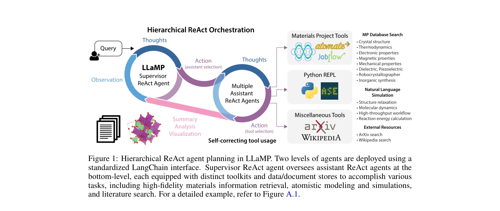
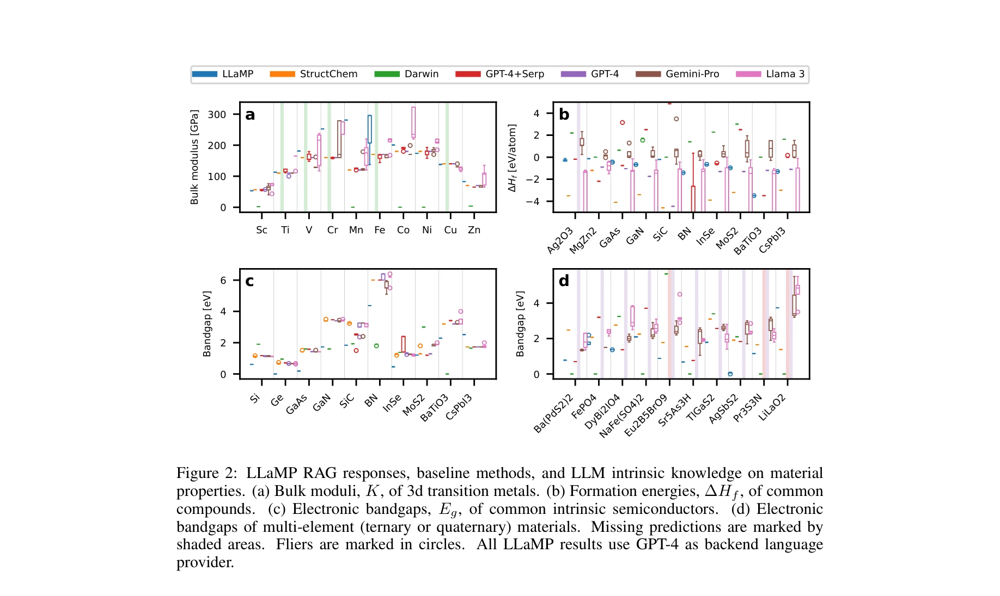

# LLaMP: Large Language Model Made Powerful for High-fidelity Materials Knowledge Retrieval and Distillation

> **저자**: Yuan Chiang, Elvis Hsieh, Chia-Hong Chou, Janosh Riebesell | **날짜**: 2024-10-09 | **DOI**: [10.48550/arXiv.2401.17244](https://doi.org/10.48550/arXiv.2401.17244)

---

## Essence

*Figure 1: Hierarchical ReAct agent planning in LLaMP. Two levels of agents are deployed using a*

LLaMP는 계층적 ReAct 에이전트 기반 multimodal RAG 프레임워크로, Materials Project와 atomistic simulation 도구를 활용하여 LLM의 hallucination을 줄이고 재료과학 분야에서 높은 신뢰도의 지식 검색과 복잡한 작업을 수행한다.

## Motivation

- **Known**: LLM은 domain-specific 지식이 부족하고 hallucination 문제가 있으며, fine-tuning과 prompt engineering은 재현성과 확장성 측면에서 한계가 있다는 것이 알려져 있다.
- **Gap**: 기존 RAG 및 tool-usage 방법은 flat planning을 사용하여 self-correcting 능력이 부족하고, higher-order materials data (tensor, crystal structure 등)를 정확히 처리하지 못한다.
- **Why**: 과학에서는 신뢰성과 재현성이 중요한데, 현재 LLM 기반 시스템이 domain-specific한 고충실도 데이터를 안정적으로 활용하지 못해 실제 연구에 적용하기 어렵다.
- **Approach**: Materials Project API, arXiv, Wikipedia 등의 외부 data source와 계층적 supervisor-assistant ReAct 에이전트 구조를 통해 LLM을 augment하고, uncertainty와 confidence를 결합한 self-consistency 메트릭을 도입한다.

## Achievement

*Figure 2: LLaMP RAG responses, baseline methods, and LLM intrinsic knowledge on material*

- **Hierarchical ReAct agent framework**: Supervisor agent가 assistant agent들을 조율하여 modularity, efficiency, context window 효율성을 동시에 달성
- **Self-consistency metric**: Uncertainty와 confidence 추정을 결합하여 고정밀 과학 응용에서 응답의 신뢰도를 평가
- **Material property prediction**: Bulk moduli, electronic bandgaps, formation energies, magnetic orderings 예측에서 vanilla LLM 대비 bias 감소를 정량화
- **Multi-modal data handling**: Crystal structure, elastic tensor 등 higher-order data를 처리하고 복합 materials informatics 작업 수행
- **Simulation integration**: Pre-trained ML force fields를 통해 crystal structure editing과 annealing molecular dynamics simulation 실행

## How

*Figure 1: Hierarchical ReAct agent planning in LLaMP. Two levels of agents are deployed using a*

- Supervisor ReAct agent가 사용자 요청을 분석하고 assistant agent들에게 routing
- Assistant agent들이 Materials Project API, robocrystallographer, simulation tools 등 specialized tools 활용
- Expanded action space  = A ∪ L을 통해 language space에서의 action도 가능하게 함
- 각 assistant는 domain-specific query에 집중하여 schema parsing과 context window 최소화
- Retrieved data를 바탕으로 higher-order data processing 및 multi-modal 개념 통합 수행
- Self-consistency metric으로 응답의 불확실성과 신뢰도를 평가하여 hallucination 감지

## Originality

- Hierarchical multi-agent planning을 RAG에 도입하여 기존 flat planning의 한계 극복
- Materials Project 같은 domain-specific large-scale database와 LLM을 체계적으로 통합
- Scientific setting을 위한 uncertainty-confidence 기반 self-consistency metric 제안
- Fine-tuning 없이도 고정밀 domain knowledge를 활용 가능한 실용적 프레임워크 구축
- Language-driven simulation workflows를 통해 scientific discovery의 자동화 수준을 제고

## Limitation & Further Study

- Materials Project와 같은 specific database에 의존하므로 다른 과학 분야 적용 시 equivalent data source 구축 필요
- ReAct agent의 성능이 기본 LLM (GPT-4)의 성능에 상당히 의존하여 더 약한 모델에서의 효과 미검증
- Hierarchical planning이 추가 latency를 야기할 수 있으므로 실시간 응용에서의 scalability 평가 부족
- 현재 벤치마크가 materials science 특정 property 예측에 한정되어 있으므로 다양한 scientific task에서의 generalization 검증 필요
- Assistant agent들 간의 error propagation 및 correction mechanism이 명확하게 기술되지 않음

## Evaluation

- Novelty: 4/5
- Technical Soundness: 3/5
- Significance: 4/5
- Clarity: 4/5
- Overall: 4/5

**총평**: LLaMP는 계층적 ReAct 에이전트와 domain-specific data source를 결합하여 과학 분야에서 LLM의 hallucination 문제를 실질적으로 완화하는 실용적이고 혁신적인 프레임워크를 제시하며, materials informatics에서의 구체적 성과로 scientific AI의 신뢰성 향상에 중요한 기여를 한다.