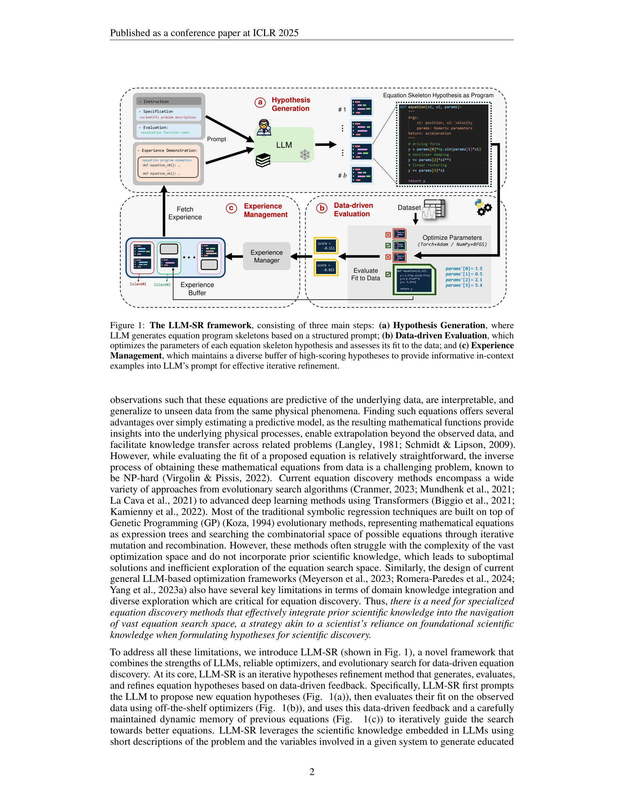
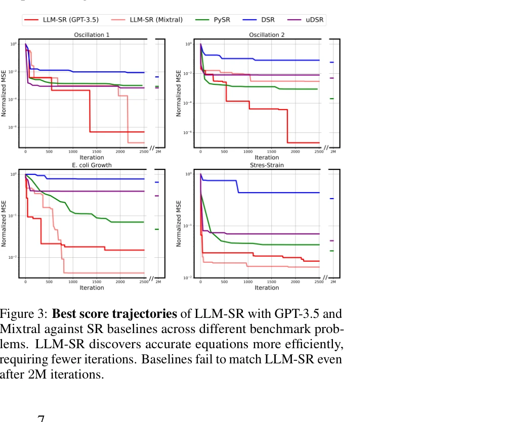

# LLM-SR: Scientific Equation Discovery via Programming with Large Language Models

> **저자**: Parshin Shojaee, Kazem Meidani, Shashank Gupta, Amir Barati Farimani, Chandan K Reddy | **날짜**: 2024 | **DOI**: [10.48550/ARXIV.2404.18400](https://doi.org/10.48550/ARXIV.2404.18400)

---

## Essence

*Figure 1: The LLM-SR framework, consisting of three main steps: (a) Hypothesis Generation, where*

LLM-SR은 대규모 언어모델의 과학 지식과 코드 생성 능력을 활용하여 데이터로부터 과학 방정식을 발견하는 프레임워크로, 방정식을 프로그램으로 표현하고 진화 탐색과 결합한다.

## Motivation

- **Known**: Symbolic regression은 유전 프로그래밍 기반의 진화 알고리즘으로 데이터에서 수학 방정식을 추출하며, expression tree 표현을 사용한다. LLM은 과학 문헌에서 광범위한 지식을 학습하여 다양한 과학 문제 해결에 활용될 수 있다.
- **Gap**: 기존 symbolic regression 방법들은 도메인 특화 사전 지식을 무시하고 제한된 표현(expression tree)만 사용하며, LLM 기반 최적화 프레임워크는 방정식 발견에 필요한 도메인 지식 통합과 다양한 탐색이 부족하다.
- **Why**: 정확한 수학 방정식의 발견은 복잡한 자연 현상을 해석 가능하게 설명하고, 관찰 데이터를 넘어 외삽을 가능하게 하며, 관련 문제들 간의 지식 이전을 촉진한다. 이는 순수 예측 모델보다 훨씬 높은 과학적 가치를 제공한다.
- **Approach**: LLM-SR은 구조화된 프롬프트를 통해 LLM이 과학적 사전 지식을 바탕으로 방정식 프로그램 스켈레톤을 반복적으로 제안하고, 데이터 기반 평가를 통해 매개변수를 최적화하며, 동적 메모리에서 고성능 가설들을 관리하여 탐색을 가이드한다.

## Achievement

*Figure 3: Best score trajectories of LLM-SR with GPT-3.5 and*

- **프레임워크 설계**: 세 가지 주요 단계(가설 생성, 데이터 기반 평가, 경험 관리)로 구성된 LLM-SR 프레임워크 개발으로 과학 지식과 진화 탐색의 통합
- **성능 우수성**: 물리학, 생물학, 재료과학 벤치마크에서 최신 symbolic regression 방법들을 크게 초과하는 성능 달성, 특히 도메인 외(OOD) 테스트 설정에서 우수
- **효율적 탐색**: 과학적 사전 지식의 통합으로 인해 정확한 방정식을 찾기 위해 필요한 반복 횟수 감소로 탐색 효율성 향상
- **벤치마크 설계**: LLM 암기 위험을 방지하고 실제 발견 과정을 모의하기 위한 4개의 커스텀 벤치마크 문제 생성

## How

*Figure 1: The LLM-SR framework, consisting of three main steps: (a) Hypothesis Generation, where*

- Python 프로그램으로 방정식 표현: 구조화되고 실행 가능한 코드 생성으로 기존 expression tree보다 높은 유연성과 표현력 확보
- 구조화된 프롬프트 엔지니어링: 문제 설명과 변수 정보를 포함하는 프롬프트를 통해 LLM의 과학적 사전 지식 활용
- 매개변수 최적화: Torch+Adam 또는 NumPy+BFGS와 같은 오프더셀프 최적화기를 사용하여 생성된 방정식 스켈레톤의 계수와 상수 최적화
- 경험 버퍼 관리: 높은 점수의 가설들을 동적 메모리에 유지하여 in-context 학습을 통한 반복적 개선 가이드
- 데이터 기반 피드백 루프: 각 가설의 데이터 맞춤 정도를 평가하고 이를 다음 반복의 LLM 프롬프트에 활용

## Originality

- LLM의 과학적 사전 지식을 symbolic regression에 체계적으로 통합한 최초 접근
- 프로그램 표현을 통해 expression tree보다 훨씬 광범위한 수학 관계식 표현 가능
- LLM의 in-context learning 능력을 활용한 반복적 가설 정제 메커니즘 설계
- LLM 암기 위험을 명시적으로 고려하여 설계한 4개 커스텀 벤치마크로 평가의 신뢰성 강화

## Limitation & Further Study

- **계산 비용**: LLM API 호출 횟수에 따른 계산 비용이 발생하며, 대규모 탐색에서의 경제성 미검증
- **LLM 선택 의존성**: GPT-3.5-turbo와 Mixtral-8x7B만 평가되었으며, 다른 LLM이나 더 작은 모델의 성능 미확인
- **복잡한 시스템**: 고차원 입력이나 매우 복잡한 비선형 관계를 포함한 더 도전적인 문제에 대한 성능 미평가
- **이론적 분석 부재**: LLM-SR의 수렴성 보장이나 샘플 효율성에 대한 이론적 분석 미흡
- **후속연구 방향**: (1) 더 작고 효율적인 모델 활용, (2) 더 복잡한 다변량 시스템에 대한 확장, (3) 실제 실험 데이터로의 검증, (4) 불확실성 정량화 메커니즘 추가

## Evaluation

- Novelty: 4/5
- Technical Soundness: 4/5
- Significance: 4/5
- Clarity: 4/5
- Overall: 4/5

**총평**: LLM-SR은 과학적 방정식 발견이라는 중요한 문제에 대해 LLM의 강점을 창의적으로 활용하는 혁신적인 접근법을 제시하며, 실험적으로 우수한 성능을 입증했다. LLM 암기 위험을 고려한 신중한 벤치마크 설계와 포괄적인 평가가 이 작업의 신뢰성을 높인다.