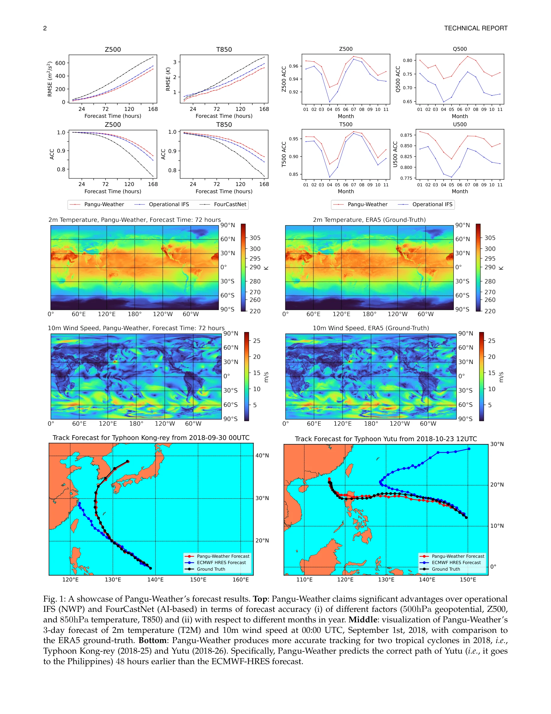
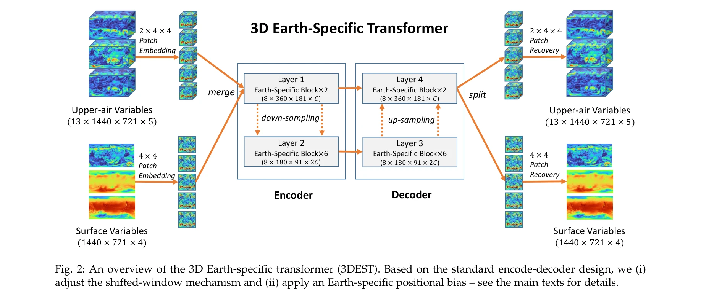

# Pangu-Weather: A 3D High-Resolution Model for Fast and Accurate Global Weather Forecast

> **저자**: Kaifeng Bi, Lingxi Xie, Hengheng Zhang, Xin Chen, Xiaotao Gu, Qi Tian | **날짜**: 2022 | **DOI**: [10.48550/ARXIV.2211.02556](https://doi.org/10.48550/ARXIV.2211.02556)

---

## Essence

*Fig. 1: A showcase of Pangu-Weather’s forecast results. Top: Pangu-Weather claims significant advantages over operational*

Pangu-Weather는 3D Earth-specific Transformer (3DEST) 아키텍처와 hierarchical temporal aggregation을 통해 처음으로 기존 numerical weather prediction (NWP) 방법을 능가하는 AI 기반 날씨 예측 시스템을 제시한다.

## Motivation

- **Known**: 기존 NWP 방법은 물리 방정식 기반으로 높은 정확도를 제공하지만 계산 속도가 매우 느리고, FourCastNet 등 기존 AI 방법은 빠르지만 정확도가 부족하다.
- **Gap**: AI 기반 방법이 모든 기상 요소(지위, 습도, 풍속, 온도 등)와 모든 예측 시간대(1시간~1주일)에서 NWP 방법을 초월할 수 있는지 미해결 상태였다.
- **Why**: 날씨 예측은 사회에 중요한 가치를 제공하며, 빠른 속도와 높은 정확도를 동시에 달성하면 일상 활동, 농업, 에너지, 교통, 극단 기후 예측 등 여러 분야에 큰 영향을 미칠 수 있다.
- **Approach**: 43년의 ERA5 reanalysis 데이터(1979-2021)로 약 2.56억 개 파라미터를 가진 심층 신경망을 학습하고, 높이(압력 수준) 정보를 3D 입력으로 통합하며 hierarchical temporal aggregation으로 누적 오차를 완화한다.

## Achievement

*Fig. 1: A showcase of Pangu-Weather’s forecast results. Top: Pangu-Weather claims significant advantages over operational*

- **NWP 초월 달성**: 5-day Z500 예측에서 296.7 RMSE로 operational IFS(333.7)와 FourCastNet(462.5)을 모두 초과하며, 모든 기상 요소와 1시간~1주일의 모든 시간 범위에서 우수한 성능 기록
- **초고속 추론**: 단일 GPU에서 1,400ms의 추론 속도로 operational IFS보다 10,000배 이상 빠름
- **높은 공간 해상도**: 0.25°×0.25° 해상도로 operational IFS 수준의 세밀한 예측 제공
- **극단 기후 예측**: Typhoon Kong-rey와 Yutu 추적에서 ECMWF-HRES보다 48시간 더 정확한 경로 예측
- **앙상블 예측 지원**: 실시간 대규모 앙상블 예측 가능

## How

*Fig. 2: An overview of the 3D Earth-specific transformer (3DEST). Based on the standard encode-decoder design, we (i)*

- **3D Earth-specific Transformer (3DEST)**: 13개 압력 수준 × 5개 변수(지위, 습도, 온도, 풍속 u/v 성분) + 지표면 4개 변수의 3D 입력을 처리하여 서로 다른 압력 수준 간 내재적 관계 포착
- **Hierarchical Temporal Aggregation**: 1시간, 3시간, 6시간, 24시간 예측 리드 타임을 가진 여러 모델을 학습하여 중거리 예측 시 반복 횟수 감소 및 누적 오차 완화
- **대규모 분산 학습**: Huawei Cloud의 192 NVIDIA Tesla-V100 GPUs에서 배치 크기 192로 100 에포크 학습(약 15일 소요)
- **ERA5 데이터 활용**: 43년(1979-2021) 시간별 전지구 기상 데이터로 학습(1979-2017), 검증(2019), 테스트(2018, 2020, 2021)

## Originality

- 처음으로 AI 기반 방법이 operational NWP 방법을 모든 기상 요소와 모든 예측 시간 범위에서 초과 달성
- 3D 입력 포맷과 3D Earth-specific Transformer로 압력 수준 간 수직 관계를 명시적으로 모델링하는 새로운 아키텍처 설계
- Hierarchical temporal aggregation으로 기존의 plain temporal aggregation이나 recurrent optimization보다 구현이 간단하고 안정적이며 정확도가 높은 방법 제시
- 단일 모델과 앙상블 예측, 극단 기후 예측 등 다양한 하위 작업으로의 전이 가능성 입증

## Limitation & Further Study

- **학습 미수렴**: 100 에포크로도 완전 수렴에 미달하므로 더 많은 데이터와 계산 리소스로 추가 개선 가능성
- **3D 모델 제약**: 3D 입력의 높은 메모리 비용으로 인해 전체 관측 요소와 매우 깊은 네트워크 아키텍처 사용 제약
- **중거리 예측 강점**: 1일~1주일 결정론적 예측에서는 우수하지만 2주 이상 장기 예측 성능은 제시되지 않음
- **후속 연구**: 시간·공간 해상도 증가, 더 강력한 계산 장치 활용, 더 많은 학습 데이터 확보로 성능 개선 가능

## Evaluation

- Novelty: 4/5
- Technical Soundness: 3/5
- Significance: 4/5
- Clarity: 4/5
- Overall: 4/5

**총평**: Pangu-Weather는 AI 기반 날씨 예측이 전통적 NWP를 초월할 수 있음을 처음 입증한 획기적 연구로, 3D 아키텍처와 hierarchical temporal aggregation 기법의 효과성을 명확히 보여주며 실무 적용 가능성과 높은 사회적 가치를 지닌다.