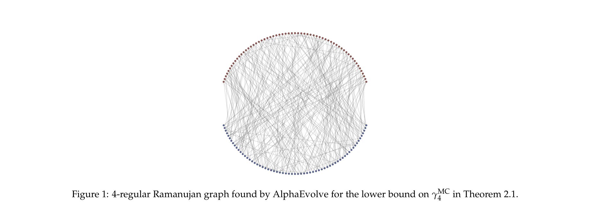
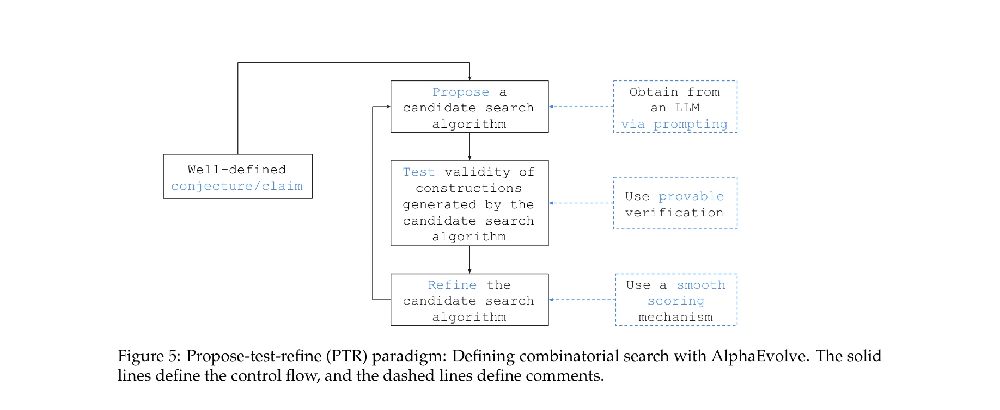

# Reinforced Generation of Combinatorial Structures: Hardness of Approximation

> **저자**: Ansh Nagda, Prabhakar Raghavan, Abhradeep Thakurta | **날짜**: 2025 | **DOI**: [10.48550/ARXIV.2509.18057](https://doi.org/10.48550/ARXIV.2509.18057)

---

## Essence

*Figure 1: 4-regular Ramanujan graph found by AlphaEvolve for the lower bound on γMC*

AlphaEvolve라는 LLM 기반 코드 변이 에이전트를 활용하여 MAX-CUT, MAX-k-CUT, 그리고 metric TSP의 근사 경계(approximation hardness) 문제에서 새로운 상한 및 하한을 발견함으로써 복잡도 이론의 진전을 이룸.

## Motivation

- **Known**: MAX-CUT, MAX-Independent Set, MAX-k-CUT, metric TSP 등의 근사 불가능성(inapproximability)은 복잡도 이론에서 잘 연구된 문제이며, 기존 작업들이 특정 경계값을 설정해왔음. 특히 gadget 기반 환원과 PCP(Probabilistically Checkable Proofs)를 통한 하한 증명이 표준 기법임.
- **Gap**: 기존 gadget 기반 증명들은 손으로 설계되거나 전통적인 계산 방법(SAT solver 등)으로만 탐색되었으며, 더 강한 경계를 찾기 위한 자동화된 방법론이 부족했음. 특히 gadget 검증의 계산 비용이 지수적으로 증가하여 탐색 효율성을 제한함.
- **Why**: 복잡도 이론의 경계 개선은 이론 컴퓨터과학의 근본적 질문을 해결하며, AI 기반 방법이 수학적 발견에 기여할 수 있음을 보이는 것은 AI-assisted mathematics의 가능성을 입증하는 데 중요함.
- **Approach**: AlphaEvolve 프레임워크를 사용하여 LLM이 gadget을 구성하는 코드를 반복적으로 변이시키고, 빠른 검증 함수를 통해 품질을 평가하며, AlphaEvolve 자신을 사용하여 검증 절차까지 최적화함으로써 탐색 효율성을 극대화함.

## Achievement

- **MAX-CUT와 MAX-IND-SET의 평균 경우 경계**: 163개 정점까지의 거의 극단적인 Ramanujan 그래프를 구성하여 Kunisky와 Yu의 결과를 개선하고, 해석적 논증으로 상한을 강화하여 소수 세 자리까지 경계를 정확히 함.
- **MAX-4-CUT 근사 불가능성**: 기존 SOTA 0.9883에서 0.987로 개선하는 새로운 gadget 환원을 발견.
- **MAX-3-CUT 근사 불가능성**: gadget 기반 결과를 기존 0.9853에서 0.9649로 개선 (표준 PCP 기반 SOTA 16/17에는 미달하지만 gadget 기법의 최선).
- **Metric TSP 근사 불가능성**: 117/116에서 111/110으로 개선하는 새로운 gadget을 발견하고, 3LIN(2)에서 TSP로의 환원에 대한 모듈식 건전성 및 완전성 논증을 제공.

## How

*Figure 5: Propose-test-refine (PTR) paradigm: Defining combinatorial search with AlphaEvolve. The solid*

- AlphaEvolve 프레임워크: (1) 조합 구조를 생성하는 코드 스니펫 C, (2) 구조를 검증하고 점수를 매기는 평가 함수(verifier), (3) 이전 결과와 히스토리를 바탕으로 새 코드를 제안하는 LLM으로 구성.
- Gadget 검증 최적화: 일반적으로 지수 시간이 필요한 검증 절차(MAX-k-CUT의 경우 Ω(k^m)개 제약)를 AlphaEvolve로 진화시켜 10,000배까지 가속화하면서 정확성 보장.
- Modular soundness/completeness 설계: 3LIN(k) 문제를 MAX-k-CUT으로 환원할 때 auxiliary variable을 통해 문제를 분해 가능하게 구조화하여 AlphaEvolve의 gadget 탐색을 효율화.
- Lifting arguments: 유한 구조(최대 163개 정점의 그래프, 19개 변수의 gadget)에서 발견한 결과를 ∀n에 대한 정리로 확장.
- 다단계 검증: AlphaEvolve 내부에서는 빠른 verifier 사용, 최종 gadget은 brute-force 알고리즘으로 재검증하여 정확성 보증.

## Originality

- LLM 기반 코드 변이를 조합 구조 탐색에 적용한 첫 사례로, 손 설계나 SAT solver보다 효과적인 방법을 입증함.
- 검증 함수 자체를 AlphaEvolve로 최적화하는 메타 접근법은 창의적이며, 지수적 복잡도 문제를 해결하는 새로운 기법을 제시함.
- Modular soundness/completeness 논증은 gadget 설계의 가능성을 확대하며 독립적인 가치를 가짐.
- 기존 복잡도 이론 결과(Ramanujan 그래프, Håstad PCP 등)와 AI 기법을 결합하여 새로운 경계를 동시에 달성함.

## Limitation & Further Study

- MAX-3-CUT 결과가 표준 PCP 기반 SOTA(16/17)에 미달하며, 이는 custom PCP 개발의 필요성을 시사함.
- AlphaEvolve 탐색의 성공은 문제별로 verifier 설계에 크게 의존하며, 모든 조합 문제에 쉽게 적용 가능한지 불명확함.
- 검증 함수 최적화 과정에서 합성 데이터에만 정확한 optimized verifier의 위험성이 있으나, 최종 검증은 brute-force로 완화함.
- 후속연구 방향: (1) MAX-3-CUT의 custom PCP 접근과 gadget 기법 결합, (2) 더 큰 규모 gadget 탐색 가능성, (3) 다른 NP-hard 문제로의 확장.

## Evaluation

- Novelty: 4/5
- Technical Soundness: 3/5
- Significance: 4/5
- Clarity: 4/5
- Overall: 4/5

**총평**: 이 논문은 LLM 기반 자동 탐색이 복잡도 이론의 구체적인 경계 개선에 성공적으로 적용될 수 있음을 최초로 보임으로써, AI-assisted mathematics의 가능성을 강력히 입증한다. 특히 검증 함수까지 최적화하는 메타 접근법과 modular 논증 개발은 창의적이며, 세 가지 고전 문제에서의 동시적 진전은 방법론의 범용성을 시사한다.