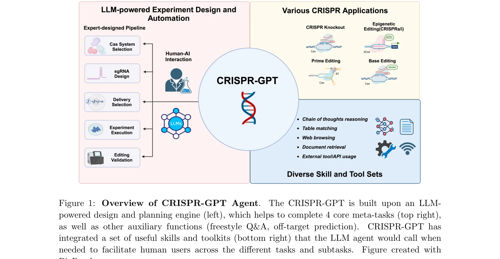

# CRISPR-GPT for agentic automation of gene-editing experiments

> **저자**: Yuanhao Qu, Kaixuan Huang, Ming Yin, Kanghong Zhan, Dyllan Liu | **날짜**: 2024 | **DOI**: [10.1038/s41551-025-01463-z](https://doi.org/10.1038/s41551-025-01463-z)

---

## Essence

*Figure 1: Overview of CRISPR-GPT Agent.*

CRISPR-GPT는 LLM을 도메인 지식과 외부 도구로 증강하여 CRISPR 유전자 편집 실험의 설계를 자동화하는 에이전트 시스템이다. gRNA 설계, 전달 방법 선택, 오프타겟 예측 등 복잡한 생물학적 설계 작업을 비전문가 연구자도 수행할 수 있도록 지원한다.

## Motivation

- **Known**: LLM들은 뛰어난 언어 능력과 방대한 세계 지식을 가지고 있으며, ChemCrow와 Coscientist 같은 도구 증강 LLM들이 화학 합성 및 최적화 문제에서 성공을 보였다.
- **Gap**: 범용 LLM들은 정확한 gRNA 서열 생성 시 환각 현상을 보이고, CRISPR 유전자 편집 실험 설계에 필요한 정밀한 도메인 지식과 실험적 세부사항을 제공하지 못한다.
- **Why**: CRISPR 기술은 낭포성 섬유증, 혈우병, 겸상적혈구병 등 유전 질환 치료에 혁신적 가능성을 제시하지만, 실험 설계의 복잡성으로 인해 전문가가 아닌 연구자의 접근이 어렵기 때문이다.
- **Approach**: CRISPR-GPT는 LLM 기반 설계·계획 엔진에 전문가 지식, 최신 문헌, gRNA 설계 도구(CRISPRPick, Broad Institute 라이브러리 등)를 통합하고, chain-of-thought 추론과 상태 머신을 활용하여 단계별 실험 설계를 자동화한다.

## Achievement

*Figure 1: Overview of CRISPR-GPT Agent.*

- **자동화된 멀티태스크 실험 설계**: CRISPR 시스템 선택, gRNA 설계, 세포 전달 방법 추천, 오프타겟 효과 예측, 프로토콜 작성, 검증 실험 설계를 통합적으로 수행
- **비전문가 접근성 향상**: 반복적 정제를 통해 유전자 편집 경험이 없는 연구자도 실험 가능한 프로토콜 생성 가능
- **실제 사용 사례 검증**: 실제 연구 환경에서의 에이전트 효과성 입증
- **윤리적·규제적 고려사항 논의**: 자동화된 유전자 편집 설계 도구의 책임 있고 투명한 사용 필요성 강조

## How

*Figure 3: Task decomposition process and state machine implementation algorithm.*

- LLM 기반 설계·계획 엔진을 중심으로 구성하여 상위 4가지 핵심 메타태스크 처리
- Broad Institute의 gRNA 라이브러리와 CRISPRPick 도구킷 통합으로 효율성과 특이성 최적화
- Chain-of-thought 추론 모델과 상태 머신(state machine) 알고리즘으로 복잡한 실험 설계 과정을 관리 가능한 단계로 분해
- 프리스타일 Q&A 모드와 오프타겟 예측 모드 제공으로 설계 중 추가 문제 해결
- 외부 도구(BLAST, 오프타겟 예측 알고리즘 등) 호출 메커니즘 통합

## Originality

- 범용 LLM의 환각 문제를 해결하기 위해 도메인 전문가 지식과 계산 도구를 체계적으로 결합한 최초의 CRISPR 전용 에이전트 시스템
- Chain-of-thought 추론과 상태 머신을 결합하여 복잡한 생물학적 실험 설계를 계층적으로 자동화
- CRISPR 실험 설계라는 고도로 전문화된 영역에서 LLM 에이전트의 실제 적용을 입증한 첫 사례
- 비전문가 연구자의 실험 접근성을 크게 향상시키는 인간-AI 협력 프레임워크 제시

## Limitation & Further Study

- 일반적 LLM의 근본적 한계인 환각 현상이 완전히 제거되지 않을 수 있으며, 새로운 CRISPR 기술이나 DB 업데이트에 대한 적응 메커니즘이 명확하지 않음
- 오프타겟 예측의 정확성이 기존 생물정보학 도구에 의존하므로, 이들 도구의 한계를 그대로 상속할 수 있음
- 실제 실험 수행 단계에서의 기술적 문제(세포 배양, 형질 전환 효율 등)에 대한 지원 부족
- 윤리적·규제적 고려사항을 논의했지만 구체적인 거버넌스 프레임워크 부재
- 후속 연구로 다양한 생물학적 도메인에 대한 일반화, 실험 피드백 루프 통합, 더 강력한 환각 방지 메커니즘 개발 필요

## Evaluation

- Novelty: 4/5
- Technical Soundness: 3/5
- Significance: 4/5
- Clarity: 4/5
- Overall: 4/5

**총평**: CRISPR-GPT는 LLM 에이전트를 생물학적 실험 설계에 체계적으로 적용한 혁신적 사례로, 범용 LLM의 한계를 도메인 지식과 도구 통합으로 극복하며 유전자 편집 기술의 민주화에 크게 기여할 수 있는 의미 있는 연구이다.

## Related Papers

- 🔄 다른 접근: [[papers/240_Crispr-gpt_An_llm_agent_for_automated_design_of_geneediting/review]] — CRISPR 유전자 편집 실험 자동화에서 동일한 시스템을 다른 관점에서 접근한 연구로 상호 보완적인 이해를 제공한다
- 🔗 후속 연구: [[papers/371_GeneAgent_self-verification_language_agent_for_gene-set_anal/review]] — CRISPR 실험 자동화에서 유전자 세트 분석이라는 더 포괄적인 유전학 연구 자동화로 확장된다
- 🏛 기반 연구: [[papers/681_Revisiting_Gene_Ontology_Knowledge_Discovery_with_Hierarchic/review]] — 계층적 강화학습을 통한 유전자 온톨로지 지식 발견을 CRISPR 실험 설계의 지식 기반으로 활용한다
- 🔄 다른 접근: [[papers/240_Crispr-gpt_An_llm_agent_for_automated_design_of_geneediting/review]] — 동일한 CRISPR-GPT 시스템에 대한 다른 관점의 연구로 유전자 편집 실험 자동화의 완전한 이해를 제공한다
