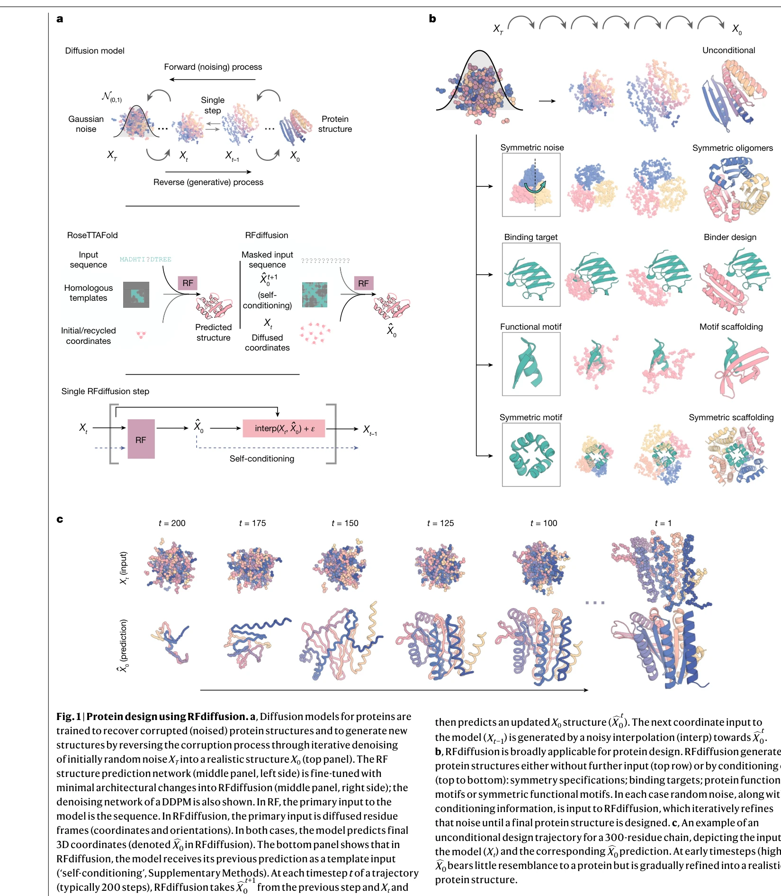
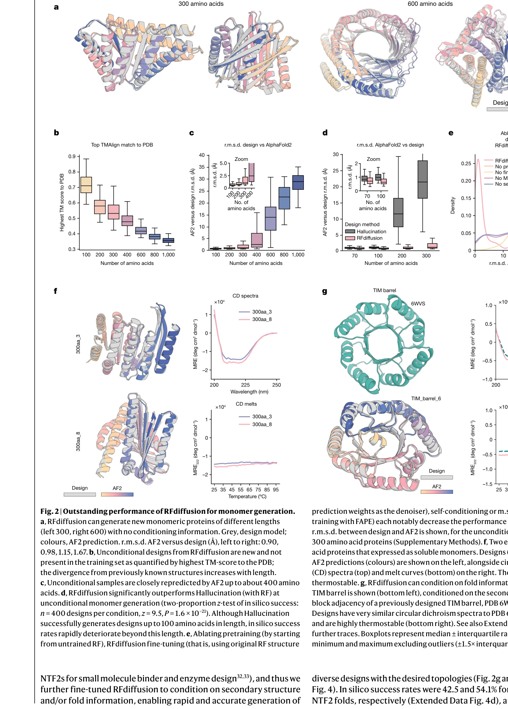

# De novo design of protein structure and function with RFdiffusion

> **저자**: Joseph L. Watson, David Juergens, Nathaniel R. Bennett, Brian L. Trippe, Jason Yim, Helen E. Eisenach, Woody Ahern, Andrew J. Borst, Robert J. Ragotte, Lukas F. Milles, Basile I. M. Wicky, Nikita Hanikel, Samuel J. Pellock, Alexis Courbet, William Sheffler, Jue Wang, Preetham Venkatesh, Isaac Sappington, Susana Vázquez Torres, Anna Lauko, Valentin De Bortoli, Emile Mathieu, Sergey Ovchinnikov, Regina Barzilay, Tommi S. Jaakkola, Frank DiMaio, Minkyung Baek, David Baker | **날짜**: 2023-08-31 | **DOI**: [10.1038/s41586-023-06415-8](https://doi.org/10.1038/s41586-023-06415-8)

---

## Essence

*Fig. 1 | Protein design using RFdiffusion. a, Diffusion models for proteins are*

RFdiffusion은 RoseTTAFold 구조 예측 네트워크를 단백질 구조 denoising 작업으로 fine-tuning하여 다양한 단백질 설계 문제(de novo binder, 대칭 올리고머, 효소 scaffolding 등)를 해결하는 생성형 diffusion model이다.

## Motivation

- **Known**: Deep learning 기반 단백질 설계가 최근 진전되고 있으며, diffusion model은 이미지와 언어 생성에서 성공했지만 단백질 모델링에는 제한적으로 적용되어 왔다.
- **Gap**: 단백질 backbone 기하학과 sequence-structure 관계의 복잡성으로 인해 광범위한 설계 과제를 통합적으로 해결하는 일반적인 deep learning 프레임워크가 부재하고, 기존 diffusion 기반 접근법은 현실적인 backbone 생성 능력이 제한적이다.
- **Why**: de novo 단백질 설계는 새로운 치료제, 촉매제, 바이오재료 개발에 혁신적 기술을 제공하며, RFdiffusion의 일반성과 정확성이 입증되면 단백질 기능 설계의 새로운 패러다임을 확립할 수 있다.
- **Approach**: RoseTTAFold의 rigid frame 표현과 rotational equivariance 특성을 활용하여 DDPM을 구성하고, PDB 구조에 Gaussian noise를 추가하여 학습한 후, self-conditioning 전략과 m.s.e. loss를 통해 progressive denoising으로 단백질 backbone을 생성한다.

## Achievement

*Fig. 2 | Outstanding performance of RFdiffusion for monomer generation.*

- **unconditional 및 topology-constrained monomer 설계**: RFdiffusion이 다양하고 현실적인 단백질 backbone을 생성
- **protein binder 설계**: influenza haemagglutinin과의 복합체에 대해 cryo-EM 구조로 검증된 거의 동일한 설계 모델 달성
- **symmetric oligomer 설계**: 수백 개의 대칭 어셈블리에 대한 실험적 특성화 성공
- **enzyme active site scaffolding**: 다양한 기능 위치(functional site)에 대한 minimalist 설명으로도 효과적 scaffolding
- **metal-binding 및 therapeutic protein 설계**: symmetric motif scaffolding을 통한 성공적 설계

## How

*Fig. 1 | Protein design using RFdiffusion. a, Diffusion models for proteins are*

- RoseTTAFold 기반 denoising 네트워크 구성 (updated RF18 사용, 다른 equivariant 구조 예측 네트워크도 대체 가능)
- Cα 좌표와 N-Cα-C rigid orientation으로 구성된 RF frame 표현 활용
- Translation은 3D Gaussian noise로, residue orientation은 rotation matrix manifold에서 Brownian motion으로 perturbation
- 평균제곱오차(m.s.e.) loss로 frame 예측과 true 단백질 구조 간 오류 최소화 (FAPE 대신 사용하여 global coordinate frame 연속성 보장)
- Self-conditioning 전략 도입으로 이전 timestep 예측에 조건화
- Fine-tuning from pretrained RF weights (untrained weights에서 학습보다 훨씬 효과적)
- ProteinMPNN 네트워크로 생성된 backbone으로부터 sequence 설계 (design당 8개 sequence sampling)
- AF2를 in silico 검증에 사용하여 설계 성공 정의

## Originality

- 구조 예측 네트워크의 내재적 단백질 구조 이해를 diffusion model에 활용하는 novel한 접근
- Self-conditioning 메커니즘 도입으로 AF2의 recycling 성공을 protein design diffusion에 적용
- Rotationally equivariant representation에서 global frame 연속성을 보장하는 m.s.e. loss의 창의적 사용
- Minimalist functional motif 설명만으로도 다양한 설계 문제 해결 가능한 일반화된 프레임워크 구현

## Limitation & Further Study

- 구조와 sequence를 동시에 설계하는 가능성이 제한적으로만 탐색됨 (ProteinMPNN 분리 사용이 더 효과적이었으나 통합 설계의 이론적 잠재력 미검증)
- 현재 최대 200 step noise 추가로 학습되어 더 깊은 denoising의 효과 미측정
- AlphaFold2, OmegaFold, ESMFold 등 다른 equivariant 구조 예측 네트워크의 substitutability는 이론적 가능성일 뿐 실증적 검증 부족
- **후속연구**: joint structure-sequence 생성 모델 개발, 더 깊은 diffusion step의 효과 분석, 다양한 구조 예측 backbone의 실제 성능 비교, 더 복잡한 multi-chain 복합체 설계 확장

## Evaluation

- Novelty: 4/5
- Technical Soundness: 3/5
- Significance: 4/5
- Clarity: 4/5
- Overall: 4/5

**총평**: RFdiffusion은 구조 예측 네트워크의 강력한 표현력을 generative diffusion model로 전환하여 단백질 설계의 다양한 도전을 통일적으로 해결하는 획기적 방법론이며, 광범위한 실험적 검증과 cryo-EM 구조 확인으로 그 실용성과 정확성을 입증한 매우 중요한 기여이다.