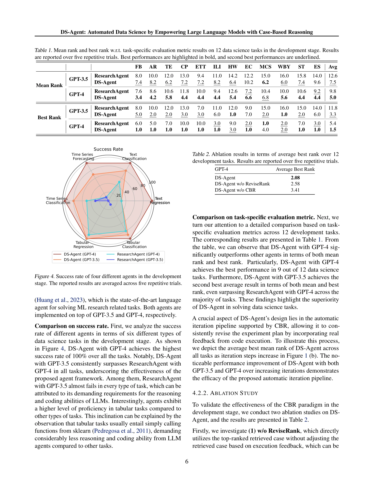

# Ds-agent: Automated data science by empowering large language models with case-based reasoning

> **저자**: Laith Alzubaidi, Jinglan Zhang, Amjad J. Humaidi, Ayad Q. Al-Dujaili, Ye Duan, Omran Al-Shamma, José Santamaría, Mohammed A. Fadhel, Muthana Al‐Amidie, Laith Farhan | **날짜**: 2024 | **URL**: [https://arxiv.org/abs/2402.17453](https://arxiv.org/abs/2402.17453)

---

## Essence

*Figure 1. (a) Overview of DS-Agent with CBR based LLMs. (b)*

DS-Agent는 LLM 에이전트와 case-based reasoning(CBR)을 결합하여 자동화된 데이터 사이언스 작업을 수행하는 프레임워크이다. 개발 단계에서 반복적 개선을 통해 최적의 ML 모델을 구축하고, 배포 단계에서 저자원 환경에 맞춰 과거 성공 사례를 재사용한다.

## Motivation

- **Known**: LLM 기반 에이전트는 다양한 작업을 자동화할 수 있지만, 데이터 사이언스 태스크에서 합리적인 실험 계획 생성과 hallucination 문제로 인해 높은 완료율을 달성하지 못한다. Kaggle은 데이터 사이언트들의 풍부한 지식과 코드를 보유한 대규모 플랫폼이다.
- **Gap**: 기존 LLM 에이전트들은 데이터 사이언스 작업에서 정상적인 실험 계획을 생성하지 못하며, 이를 해결하기 위한 finetuning은 막대한 계산 자원과 레이블 수집 시간을 요구한다. 따라서 Kaggle의 전문가 지식을 효율적으로 활용하면서도 저자원 환경에 적응할 수 있는 방법이 필요하다.
- **Why**: 자동화된 데이터 사이언스는 전문 지식 없이도 데이터 인사이트에 접근할 수 있게 하여 민주화를 실현한다. 효율적이고 비용 효과적인 솔루션은 실제 배포와 광범위한 사용을 가능하게 한다.
- **Approach**: DS-Agent는 개발 단계에서 CBR 프레임워크로 Kaggle 사례를 검색·재사용·피드백에 따라 수정하며, 배포 단계에서는 단순화된 CBR로 과거 성공 사례를 직접 코드로 생성한다.

## Achievement

*Figure 4. Success rate of four different agents in the development*

- **개발 단계 성능**: GPT-4를 사용한 DS-Agent는 12개 태스크에서 100% 성공률 달성
- **배포 단계 성능**: GPT-3.5와 GPT-4에서 각각 85%, 99% one pass rate로 최고 성능 달성 (기준 방법: 56%, 60%)
- **오픈소스 LLM 성능**: Mixtral-8x7b-Instruct의 one pass rate를 6%에서 31%로 5배 이상 향상
- **비용 효율성**: GPT-4 표준 시나리오 $1.60/실행에서 저자원 환경 $0.135/실행으로 감소, GPT-3.5는 $0.06에서 $0.0045로 감소
- **평균 one pass rate 개선**: 대체 LLM들에 대해 36% 평균 개선 달성

## How

*Figure 2. Comparison between (a) RAG based LLMs and (b) CBR*

- **Retriever 설계**: 태스크 τ와 이전 피드백 l_{t-1}을 기반으로 case bank에서 유사한 과거 사례를 검색하는 확률 분포 p_R 구현
- **LLM 기반 생성**: 검색된 사례 c, 태스크 τ, 피드백 l_{t-1}을 입력으로 하여 솔루션 y를 생성하는 조건부 분포 p_LLM 활용
- **Evaluator 구현**: 생성된 솔루션의 실행 결과를 평가하여 피드백 l을 생성하는 p_E 구성
- **반복 루프**: 식 (1)의 CBR 공식에 따라 피드백과 검색된 사례를 주변화하여 일관된 성능 개선 달성
- **Case bank 관리**: 최적 평가 성능을 보인 솔루션을 case bank에 저장하여 향후 재사용 가능하게 함
- **배포 단계 적응**: 개발 단계에서 수집한 성공 사례를 배포 단계에서 검색하고 최소한의 수정으로 재사용
- **RAG 대비 개선**: RAG는 단일 변수 c만 주변화하지만, CBR은 피드백 l_{t-1}도 함께 고려하여 반복적 개선 가능

## Originality

- CBR 패러다임을 LLM 에이전트에 통합하여 피드백 기반의 반복적 개선 메커니즘 구현 - 기존 RAG 접근법과 구별
- Kaggle의 전문가 지식을 체계적으로 활용하기 위해 CBR 프레임워크의 사례 검색·재사용·보유 구조를 적응
- 개발과 배포 단계의 이원화 구조로 고성능 개선과 저자원 효율성 동시 달성
- 식 (1)과 (2)의 확률적 공식화로 CBR 기반 LLM의 이론적 기초 제공
- 데이터 사이언스 태스크에 특화된 자동화 프레임워크로 기존의 범용 LLM 에이전트(AutoGPT, LangChain 등)와 차별화

## Limitation & Further Study

- **평가 제한**: 12개 개발 태스크와 18개 배포 태스크로 제한적이며, 더 다양한 데이터 사이언스 시나리오에 대한 평가 필요
- **배포 단계 가정**: 배포 태스크가 개발 단계와 유사한 분포를 가정하므로, 크게 다른 분포의 태스크에 대한 성능 미지수
- **Case bank 의존성**: Kaggle에서 수집한 사례 품질과 양에 크게 의존하므로, 사례 부족 시 성능 저하 가능성
- **LLM 비용 문제**: GPT-4 기반 개발 단계에는 여전히 비교적 높은 비용 ($1.60/실행) 소요
- **후속 연구**: (1) 더 효과적인 case 검색 및 랭킹 메커니즘 개발, (2) 도메인 외(out-of-distribution) 태스크에 대한 적응 능력 향상, (3) 더 큰 scale의 case bank 구축 및 관리 방안 연구

## Evaluation

- Novelty: 4/5
- Technical Soundness: 3/5
- Significance: 4/5
- Clarity: 4/5
- Overall: 4/5

**총평**: DS-Agent는 CBR과 LLM을 창의적으로 결합하여 데이터 사이언스 자동화에서 실질적인 성능 개선과 비용 효율성을 동시에 달성했다. Kaggle 지식 활용과 이원화된 파이프라인 설계는 실용적이며, 명확한 실험 결과와 오픈소스 공개로 후속 연구를 촉진할 수 있는 우수한 기여다.

## Related Papers

- 🔄 다른 접근: [[papers/549_Mlr-copilot_Autonomous_machine_learning_research_based_on_la/review]] — DS-Agent와 MLR-COPILOT 모두 LLM 기반으로 데이터 사이언스 작업을 자동화하지만 서로 다른 아키텍처 접근법을 사용함
- 🔗 후속 연구: [[papers/650_RD-Agent_Automating_Data-Driven_AI_Solution_Building_Through/review]] — R&D-Agent의 이중 에이전트 협력 구조는 DS-Agent의 CBR 기반 자동화를 더 체계화한 발전된 형태
- 🏛 기반 연구: [[papers/542_Mlagentbench_Evaluating_language_agents_on_machine_learning/review]] — MLAgentBench가 제공하는 머신러닝 에이전트 평가 프레임워크는 DS-Agent 같은 데이터 사이언스 자동화 시스템의 성능 측정 기반이 됨
- 🔗 후속 연구: [[papers/528_MedAgentGym_A_Scalable_Agentic_Training_Environment_for_Code/review]] — 데이터 과학 자동화를 생의학 특화 환경으로 확장한다
- 🔗 후속 연구: [[papers/253_Data_Interpreter_An_LLM_Agent_For_Data_Science/review]] — 데이터 과학 자동화를 더욱 포괄적인 LLM 에이전트 프레임워크로 발전시킨 연구
- 🏛 기반 연구: [[papers/069_Agentomics-ML_Autonomous_Machine_Learning_Experimentation_Ag/review]] — 데이터 과학 에이전트의 기본 구조와 LLM 활용 방법론에 대한 기초적 이해를 제공한다
- 🔗 후속 연구: [[papers/476_Large_language_models_orchestrating_structured_reasoning_ach/review]] — 대규모 언어 모델을 활용한 자동화된 데이터 과학 연구로, Kaggle 성능을 실제 데이터 과학 업무로 확장
- 🔗 후속 연구: [[papers/121_Autokaggle_A_multi-agent_framework_for_autonomous_data_scien/review]] — LLM을 통한 데이터 과학 자동화를 다루어 AutoKaggle의 Kaggle 특화 접근법을 더 광범위한 데이터 과학 작업 자동화로 확장함
- 🔄 다른 접근: [[papers/549_Mlr-copilot_Autonomous_machine_learning_research_based_on_la/review]] — MLR-COPILOT와 DS-Agent 모두 LLM 기반 머신러닝 연구 자동화를 목표로 하지만 서로 다른 아키텍처와 구현 방식 사용
- 🔗 후속 연구: [[papers/650_RD-Agent_Automating_Data-Driven_AI_Solution_Building_Through/review]] — R&D-Agent의 이중 에이전트 협력이 DS-Agent의 CBR 기반 데이터 사이언스 자동화를 더 정교한 피드백 시스템으로 발전시킴
- 🔄 다른 접근: [[papers/259_DeepAnalyze_Agentic_Large_Language_Models_for_Autonomous_Dat/review]] — 대규모 언어모델 기반 데이터 과학 자동화와 유사하지만 8B 파라미터로 효율적인 에이전틱 접근법을 제시한다.
- 🔗 후속 연구: [[papers/294_Dsbench_How_far_are_data_science_agents_to_becoming_data_sci/review]] — LLM 기반 데이터 과학 자동화가 벤치마킹을 넘어 실제 데이터 과학 에이전트 구현으로 확장한다
