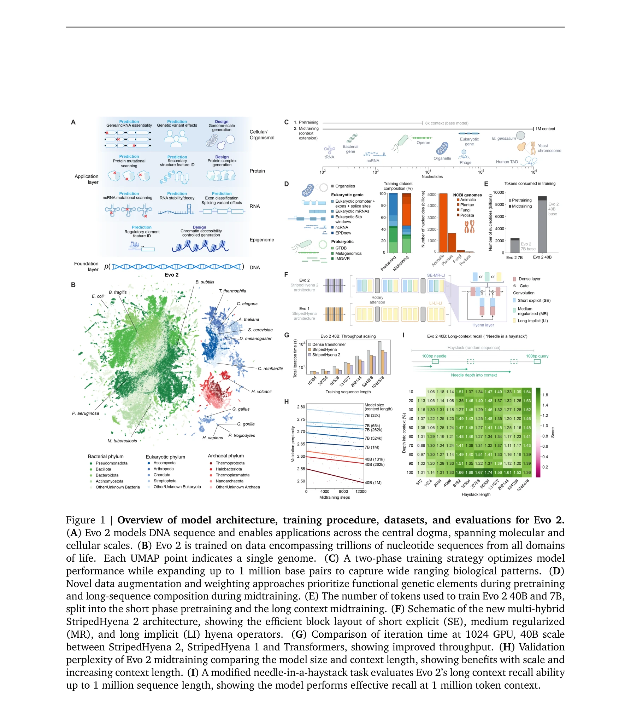

# Genome modeling and design across all domains of life with Evo 2

> **저자**: Garyk Brixi, Matthew G. Durrant, Jerome Ku, Michael Poli, Greg Brockman, Daniel Chang, Gabriel A. Gonzalez, Samuel H. King, David B. Li, Aditi T. Merchant, Mohsen Naghipourfar, Eric Nguyen, Chiara Ricci-Tam, David W. Romero, Gwanggyu Sun, Ali Taghibakshi, Anton Vorontsov, Brandon Yang, Myra Deng, Liv Gorton, Nam Nguyen, Nicholas K. Wang, Etowah Adams, Stephen A. Baccus, Steven Dillmann, Stefano Ermon, Daniel Guo, Rajesh Ilango, Ken Janik, Amy X. Lu, Reshma Mehta, Mohammad R.K. Mofrad, Madelena Y. Ng, Jaspreet Pannu, Christopher Ré, Jonathan C. Schmok, John St. John, Jeremy Sullivan, Kevin Zhu, Greg Zynda, Daniel Balsam, Patrick Collison, Anthony B. Costa, Tina Hernandez-Boussard, Eric Ho, Ming-Yu Liu, Thomas McGrath, Kimberly Powell, Dave P. Burke, Hani Goodarzi, Patrick D. Hsu, Brian L. Hie | **날짜**: 2025-02-21 | **DOI**: [10.1101/2025.02.18.638918](https://doi.org/10.1101/2025.02.18.638918)

---

## Essence

*Figure 1 | Overview of model architecture, training procedure, datasets, and evaluations for Evo 2.*

Evo 2는 9.3조 개의 DNA 염기쌍으로 훈련된 생물학적 기초 모델로, 7B와 40B 매개변수로 1백만 토큰 컨텍스트 윈도우를 가지며 모든 생명 영역에서 게놈 모델링 및 설계를 수행한다.

## Motivation

- **Known**: DNA 서열 기반 머신러닝은 단백질, RNA, 분자 상호작용을 모델링할 수 있으나, 기존 연구는 주로 원핵생물 게놈에 제한되었다. 진화의 전체 범위를 나타내는 게놈 기초 모델의 개발이 필요하다.
- **Gap**: 진핵생물의 복잡한 게놈 구조(비코딩 영역, alternative splicing, epigenomic 조절)를 모두 처리하는 통합 게놈 언어 모델의 부재와 1백만 토큰 규모의 장거리 문맥 이해 능력의 부족이 있다.
- **Why**: 게놈 설계와 합성생물학의 진전을 위해서는 유전적 변이의 기능적 영향을 정확히 예측하고 생물학적 복잡성을 이해하며 새로운 게놈 서열을 생성할 수 있는 통합 모델이 필수적이다.
- **Approach**: 9.3조 개의 DNA 염기쌍으로 구성된 curated genomic atlas에서 모든 생명 영역의 게놈을 학습하고, StripedHyena 2 아키텍처를 이용해 1백만 토큰 컨텍스트 윈도우와 단일 뉘클레오타이드 해상도를 달성했다.

## Achievement

- **유전 변이 효과 예측**: 비코딩 병인성 돌연변이와 BRCA1 임상적 유의 변이를 과제별 파인튜닝 없이 정확히 예측하는 최초의 언어 모델 달성
- **기계적 해석가능성**: Sparse autoencoders를 통해 exon-intron 경계, 전사인자 결합 부위, 단백질 구조 요소, prophage 영역 등 생물학적 특징을 자율적으로 학습함을 규명
- **게놈 규모 생성**: 이전 방법 대비 높은 자연성과 일관성으로 미토콘드리아, 원핵생물, 진핵생물 서열을 게놈 규모에서 생성
- **제어 가능 생성**: inference-time search를 통해 epigenomic 구조를 제어 가능하게 생성하며 생물학에서 최초의 inference-time scaling 결과 제시
- **완전 개방형 공개**: 모델 매개변수, 훈련 코드, 추론 코드, OpenGenome2 데이터셋을 모두 공개

## How

*Figure 1 | Overview of model architecture, training procedure, datasets, and evaluations for Evo 2.*

- 두 단계 훈련 전략: 단기 전처리 단계와 1백만 염기쌍까지 확장하는 장문맥 중간 훈련 단계를 순차적으로 수행
- 데이터 증강 및 가중화: 전처리 중 기능성 유전 요소를 우선시하고 중간 훈련에서 장거리 서열 구성을 강조
- StripedHyena 2 아키텍처: short explicit (SE), medium regularized (MR), long implicit (LI) hyena operators를 효율적인 블록 배치로 조합
- 기계적 해석가능성: Sparse autoencoders를 이용한 features 분해로 학습된 생물학적 개념 추출 및 annotation
- Inference-time search: guidance를 통한 제어 가능 생성으로 epigenomic 구조와 같은 복잡한 설계 과제 달성

## Originality

- 모든 생명 영역을 포함하는 9.3조 개 염기쌍 규모의 curated 게놈 데이터셋 구축 및 OpenGenome2 공개
- 1백만 토큰 컨텍스트 윈도우와 단일 뉘클레오타이드 해상도의 게놈 언어 모델로 기존 연구의 한계 극복
- 파인튜닝 없이 모든 유형의 변이에 대한 병인성과 splicing 영향을 동시에 예측 가능한 최초의 언어 모델
- 생물학 분야의 최초 inference-time scaling 결과와 epigenomic 구조 제어 생성 기술
- Sparse autoencoders를 통한 게놈 언어 모델의 기계적 해석가능성 규명

## Limitation & Further Study

- 모델 신뢰도 평가: 예측 정확성이 우수하나 생성된 서열의 기능적 검증이 충분하지 않을 가능성 (실험적 검증 필요)
- 데이터 편향: curated genomic atlas가 특정 생물학적 영역이나 조직에 대해 편향될 가능성 (표현성 제한)
- 계산 비용: 1백만 토큰 컨텍스트와 40B 매개변수 모델은 매우 높은 계산 자원을 요구하여 접근성 제약
- 해석가능성의 한계: SAE를 통한 features 추출이 모든 생물학적 현상을 완전히 설명하지 못할 가능성
- 후속 연구 필요: 실제 합성생물학 응용에서의 생성 서열 기능성 검증, 다른 생물학적 modality(단백질, 대사체 등)와의 통합, 더 큰 규모 데이터셋 구축

## Evaluation

- Novelty: 4/5
- Technical Soundness: 4/5
- Significance: 4/5
- Clarity: 4/5
- Overall: 4/5

**총평**: Evo 2는 게놈 기초 모델로서 unprecedented 규모(9.3조 토큰, 1백만 컨텍스트 윈도우)와 성능(변이 효과 예측, 게놈 규모 생성, 기계적 해석가능성)을 달성하였으며, 완전 공개 모델과 데이터셋으로 합성생물학과 게놈 설계 분야에 혁신적 기여를 제시한다.