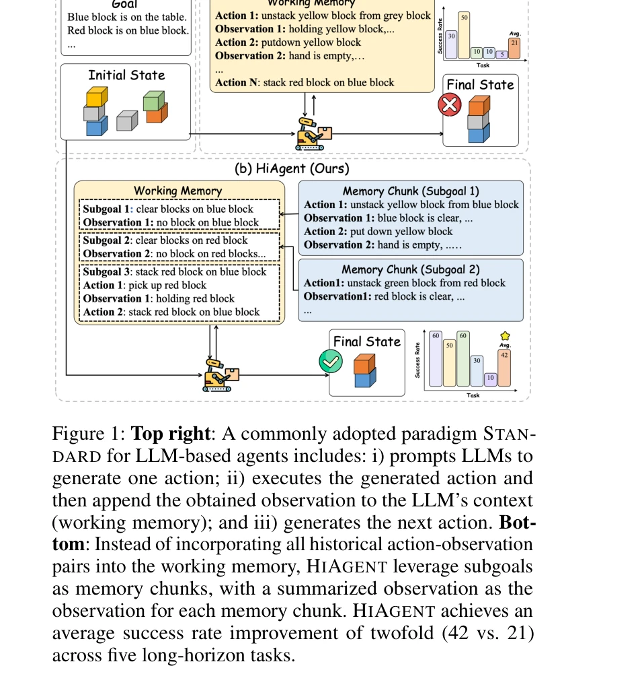

# Hiagent: Hierarchical working memory management for solving long-horizon agent tasks with large language model

> **저자**: Mengkang Hu, Tianxing Chen, Qiguang Chen, Yi Mu, Wenqi Shao, Ping Luo | **날짜**: 2024 | **URL**: [https://arxiv.org/abs/2408.09559](https://arxiv.org/abs/2408.09559)

---

## Essence

*Figure 2: An overview of the process of HIAGENT.*

HIAGENT는 LLM 기반 에이전트의 작업 메모리를 subgoal을 중심으로 계층적으로 관리하여 장기 작업에서 맥락 중복성을 줄이고 성능을 향상시키는 프레임워크이다.

## Motivation

- **Known**: LLM 기반 에이전트는 cross-trial 메모리와 in-trial 메모리(작업 메모리)로 구분되며, 기존 STANDARD 방식은 모든 action-observation 쌍을 맥락에 포함시킨다.
- **Gap**: 기존 연구는 cross-trial 메모리 최적화에 집중했으나, 작업 메모리의 효율적 활용 방법은 미흡하며, 장기 작업에서 긴 맥락이 LLM의 일관성 있는 전략 수립을 방해한다.
- **Why**: 장기 작업에서 발생하는 과도한 맥락 길이는 LLM의 성능 저하와 비효율성을 초래하므로, 인지 과학의 청킹(chunking) 원리를 활용한 효과적인 메모리 관리가 필수적이다.
- **Approach**: HIAGENT는 subgoal 생성을 유도하고, 각 subgoal 완료 시 action-observation 쌍을 요약하여 현재 subgoal만 상세 정보를 유지하도록 작업 메모리를 구조화하며, trajectory retrieval 모듈로 필요시 과거 정보를 검색 가능하게 한다.

## Achievement

*Figure 1: Top right: A commonly adopted paradigm STAN-*

- **성공률 2배 향상**: STANDARD 대비 성공률이 21%에서 42%로 증가
- **효율성 개선**: 평균 단계 수 3.8배 감소, 맥락 길이 35.02% 감소, 실행 시간 19.42% 감소
- **진행도 율 향상**: STANDARD 대비 23.94% 높은 progress rate 달성
- **강건성 입증**: 다양한 단계에서 일관된 성능 개선 및 생성 가능한 action의 비율 증가

## How

*Figure 2: An overview of the process of HIAGENT.*

- LLM에 현재 작업 완수를 위한 subgoal 생성 유도
- Subgoal 달성을 위한 action 생성 및 action-observation 쌍 저장
- Subgoal 완료 판정 시 해당 memory chunk의 action-observation 쌍을 요약된 observation으로 변환
- 현재 subgoal의 action-observation 쌍만 상세 유지, 과거 subgoal은 요약본만 작업 메모리에 포함
- 필요시 trajectory retrieval 모듈을 통해 특정 과거 subgoal의 상세 궤적 정보 검색 및 복원

## Originality

- 인지 과학의 chunking 원리를 LLM 기반 에이전트의 작업 메모리 관리에 처음 적용
- Subgoal 기반 계층적 메모리 구조로 맥락 중복성 문제를 체계적으로 해결
- 동적 메모리 조정을 통해 현재 작업과 과거 경험의 균형을 자동으로 조절하는 메커니즘 제안

## Limitation & Further Study

- Subgoal 생성의 정확성이 전체 성능에 미치는 영향에 대한 분석 부재
- 요약(summarization) 프로세스의 정보 손실과 품질에 관한 상세한 평가 필요
- 5개의 장기 작업 데이터셋만 사용으로 일반화 가능성 검증 제한
- 다양한 LLM 모델(GPT-4, Claude 등)에 대한 일반적 효과성 검증 필요
- 후속 연구: 자동 subgoal 생성 최적화, 다중 모달리티 환경 확장, 더 복잡한 실제 작업 적용

## Evaluation

- Novelty: 4/5
- Technical Soundness: 3/5
- Significance: 4/5
- Clarity: 4/5
- Overall: 4/5

**총평**: HIAGENT는 인지 과학 원리를 기반으로 LLM 에이전트의 작업 메모리 문제를 창의적으로 해결하며, 실험 결과가 뛰어나고 실용적 가치가 높다. 다만 subgoal 생성 메커니즘의 강건성과 다양한 환경에서의 일반화 가능성에 대한 추가 검증이 필요하다.

## Related Papers

- 🔄 다른 접근: [[papers/039_A-MEM_Agentic_Memory_for_LLM_Agents/review]] — 계층적 작업 메모리와 에이전틱 메모리가 서로 다른 방식으로 LLM 메모리 관리 문제를 해결한다
- 🔗 후속 연구: [[papers/854_Understanding_the_planning_of_LLM_agents_A_survey/review]] — LLM 에이전트 계획 수립에 계층적 메모리 관리를 통합하여 성능을 향상시킨다
- 🏛 기반 연구: [[papers/854_Understanding_the_planning_of_LLM_agents_A_survey/review]] — 계층적 메모리 관리가 LLM 에이전트 계획 수립의 핵심 구성요소가 된다
- 🔄 다른 접근: [[papers/039_A-MEM_Agentic_Memory_for_LLM_Agents/review]] — LLM 에이전트 메모리 관리에서 동적 연결 생성 방식과 계층적 작업 메모리 관리는 서로 다른 메모리 구조화 전략이다.
