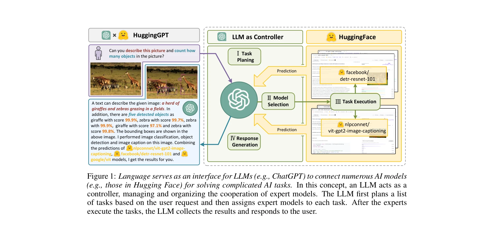
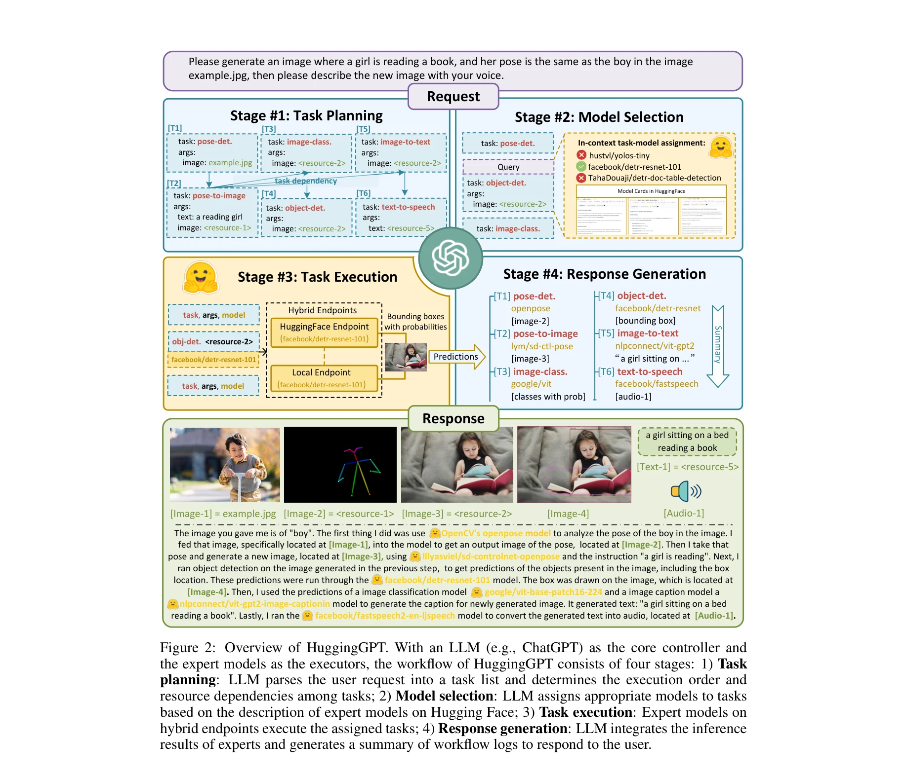

# HuggingGPT: Solving AI Tasks with ChatGPT and its Friends in Hugging Face

> **저자**: Yongliang Shen, Kaitao Song, Xu Tan, Dongsheng Li, Weiming Lu, Yueting Zhuang, A. Oh, T. Naumann, A. Globerson, K. Saenko, M. Hardt, S. Levine | **날짜**: 2023 | **URL**: [https://proceedings.neurips.cc/paper_files/paper/2023/file/77c33e6a367922d003ff102ffb92b658-Paper-Conference.pdf](https://proceedings.neurips.cc/paper_files/paper/2023/file/77c33e6a367922d003ff102ffb92b658-Paper-Conference.pdf)

---

## Essence

*Figure 1: Language serves as an interface for LLMs (e.g., ChatGPT) to connect numerous AI models*

HuggingGPT는 ChatGPT를 컨트롤러로 활용하여 Hugging Face의 다양한 AI 모델들을 자동으로 선택하고 조율함으로써 복잡한 멀티모달 AI 작업을 해결하는 LLM 기반 에이전트이다.

## Motivation

- **Known**: LLM은 언어 이해, 생성, 추론에서 우수한 능력을 보이지만 비전, 음성 등 다양한 모달리티를 처리할 수 없고, 복잡한 다중 태스크 조율도 어렵다.
- **Gap**: LLM과 domain-specific 전문 모델들 사이의 연결 고리가 부재하며, 이들을 효과적으로 통합하기 위한 일반적인 인터페이스가 없다.
- **Why**: Language를 generic interface로 활용하여 LLM이 다양한 modality와 domain의 복잡한 작업을 자동으로 계획하고 실행할 수 있게 함으로써 AGI 구현에 한 발 더 나아갈 수 있다.
- **Approach**: ChatGPT가 사용자 요청을 분석하여 task planning, model selection, task execution, response generation의 4단계를 거쳐 Hugging Face의 model description을 기반으로 적절한 모델을 선택하고 실행한다.

## Achievement

*Figure 2: Overview of HuggingGPT. With an LLM (e.g., ChatGPT) as the core controller and*

- **멀티모달 작업 처리**: 이미지, 텍스트, 음성 등 다양한 modality를 포함한 복잡한 AI 작업을 자동으로 해결
- **LLM-expert model 협력**: LLM을 뇌로, task-specific 모델을 실행자로 하는 새로운 협력 프로토콜 제시
- **확장성**: Hugging Face hub의 새로운 모델이 추가되면 자동으로 활용 가능하여 AI 능력의 지속적 성장 가능
- **자동 계획 및 실행**: 사용자 요청만으로 task dependencies를 자동 인식하고 실행 순서 결정

## How

*Figure 2: Overview of HuggingGPT. With an LLM (e.g., ChatGPT) as the core controller and*

- ChatGPT를 통한 task planning: 사용자 요청을 분석하여 하위 작업 목록으로 분해하고 실행 순서 결정
- Model selection: Hugging Face의 model cards에서 함수 설명(function descriptions)을 기반으로 각 task에 맞는 최적 모델 선택
- Task execution: 선택된 모델을 HuggingFace endpoint 또는 local endpoint에서 실행하고 결과 수집
- Response generation: 모든 모델의 예측 결과를 통합하여 사용자에게 최종 응답 생성
- In-context learning: task-model-args 쌍을 prompt에 포함시켜 ChatGPT의 선택 정확도 향상

## Originality

- Language를 LLM과 AI 모델 간의 일반적 인터페이스로 활용한 novel한 개념 제시
- 기존 Hugging Face hub의 model descriptions을 직접 활용하여 prompt engineering 비용 절감
- Task dependencies와 실행 순서를 LLM이 자동으로 결정하는 지능형 scheduling 메커니즘
- Hybrid endpoints(클라우드 + 로컬) 지원으로 실용적 배포 가능성 증대

## Limitation & Further Study

- ChatGPT의 context window 제한으로 많은 수의 model descriptions을 동시에 처리하기 어려울 수 있음
- LLM의 task planning 정확도가 완전하지 않아 잘못된 task 분해 가능성 존재
- Model selection 시 모델 성능 메타데이터가 부족하면 부최적의 선택 가능
- 각 task-specific 모델의 실행 시간과 비용에 대한 최적화 고려 부족
- 후속 연구로 더 강력한 LLM 활용, 동적 model description 업데이트, 실행 결과 피드백을 통한 지속적 개선 필요

## Evaluation

- Novelty: 4/5
- Technical Soundness: 3/5
- Significance: 4/5
- Clarity: 4/5
- Overall: 4/5

**총평**: HuggingGPT는 language를 universal interface로 활용하여 LLM과 다양한 domain-specific 모델을 효과적으로 연결하는 창의적이고 실용적인 접근법을 제시하며, 멀티모달 복잡 작업 해결과 AGI 구현에 중요한 기여를 한다.