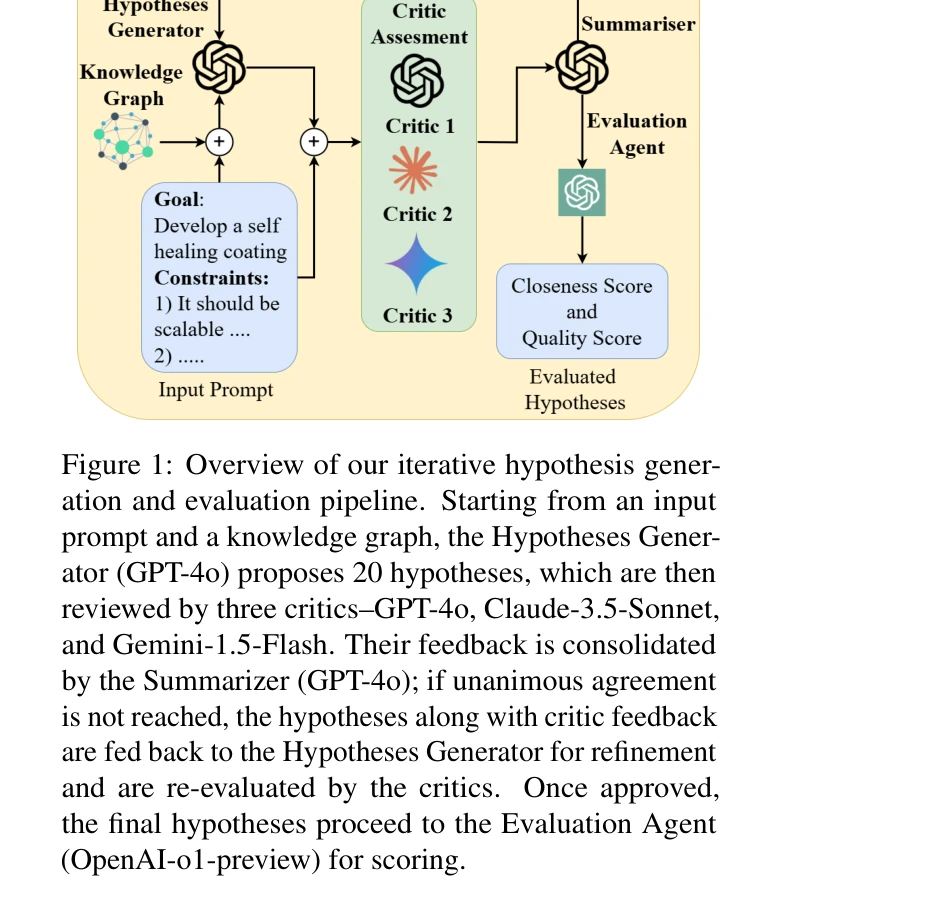
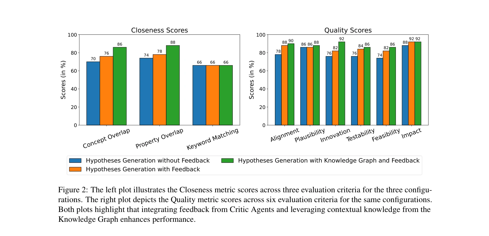

# Hypothesis Generation for Materials Discovery and Design Using Goal-Driven and Constraint-Guided LLM Agents

> **저자**: Shrinidhi Kumbhar, Venkatesh Mishra, Kevin Coutinho, Divij Handa, Ashif Iquebal | **날짜**: 2025 | **DOI**: [10.48550/arXiv.2501.13299](https://doi.org/10.48550/arXiv.2501.13299)

---

## Essence

*Figure 1: Overview of our iterative hypothesis gener-*

Materials discovery 가속화를 위해 목표 기반의 제약 조건이 있는 LLM agent를 설계하고, 실제 논문 데이터로 구성된 MATDESIGN 벤치마크와 함께 가설 생성 및 평가 프레임워크를 제시한다.

## Motivation

- **Known**: 기존 machine learning 기반의 materials discovery는 광범위한 학습 데이터가 필요하며 자연언어 처리가 제한적이다. 최근 LLM을 활용한 가설 생성 연구가 진행 중이지만 도메인 특화 도구 의존도가 높고 특정 물질이나 특성에만 제한된다.
- **Gap**: LLM 기반의 가설 생성 연구가 다양한 재료와 특성을 아우르면서도 외부 도메인 특화 도구에 의존하지 않으며, 실제 세계의 목표와 제약 조건을 반영한 벤치마크가 부족하다.
- **Why**: Materials discovery 프로세스를 자동화하면 시간과 자원을 크게 절약할 수 있으며, LLM의 자연언어 처리 능력을 활용하면 보다 유연하고 확장 가능한 시스템을 구축할 수 있어 산업 기술 발전에 필수적이다.
- **Approach**: GPT-4o, Claude-3.5-Sonnet, Gemini-1.5-Flash 등 다중 LLM을 활용한 critic 기반의 반복적 피드백 루프와 최종 평가 agent를 통해 가설을 생성 및 정제하며, 2024년 1월 이후 저널 논문 50개에서 추출한 MATDESIGN 벤치마크로 평가한다.

## Achievement

*Figure 2: The left plot illustrates the Closeness metric scores across three evaluation criteria for the three configu-*

- **MATDESIGN 벤치마크**: 50개의 최신 연구 논문(Nature, Nature Communications 등)에서 추출한 목표 진술, 제약 조건, 재료, 방법으로 구성된 실제 가설 생성 작업을 포함한 최초 벤치마크 개발
- **ACCELMAT 프레임워크**: 다중 LLM critic 시스템을 통한 반복적 가설 생성 및 정제 파이프라인으로 기존 도메인 특화 도구 의존 없이 다양한 재료와 특성을 지원
- **Closeness와 Quality 기반 평가 메트릭**: Alignment, Scientific Plausibility, Novelty, Feasibility, Scalability, Testability, Impact Potential을 포함하여 재료 과학자의 비판적 검증 프로세스를 모방한 확장 가능한 평가 체계 제안

## How

*Figure 1: Overview of our iterative hypothesis gener-*

- Hypotheses Generator (GPT-4o)가 입력 프롬프트와 knowledge graph를 기반으로 20개의 가설 생성
- 세 명의 critic (GPT-4o, Claude-3.5-Sonnet, Gemini-1.5-Flash)이 각 가설을 검토하고 피드백 제공
- Summarizer (GPT-4o)가 모든 피드백을 통합하고 만장일치에 이르지 않으면 Hypotheses Generator로 재귀적 피드백
- 승인된 최종 가설을 Evaluation Agent (OpenAI-o1-preview)로 Closeness와 Quality 점수 평가
- Materials Science 전문가와 협력하여 2024년 1월 이후 저널 논문 50개에서 수동 추출을 통한 벤치마크 구성

## Originality

- 도메인 특화 도구(simulation, API, database)에 의존하지 않으면서도 다양한 재료 과학 응용을 지원하는 최초의 tool-free LLM agent 설계
- LLM 사전학습 데이터 이후(January 2024 이후) 발표된 논문으로 구성된 벤치마크를 통해 데이터 유출 문제 해결
- 재료 과학자의 평가 프로세스를 반영한 Closeness와 Quality 메트릭의 이원 구조로 가설 생성의 타당성과 가치를 동시에 평가

## Limitation & Further Study

- 벤치마크 규모가 50개 논문으로 상대적으로 제한적이며 특정 저널(Nature 계열)에 편향될 가능성
- LLM agent의 성능이 기반 모델(GPT-4o, Claude 등)의 품질에 크게 의존하므로 모델 개선에 따른 영향 분석 필요
- 생성된 가설의 실제 실험적 검증 과정이 포함되지 않아 LLM 평가와 실제 물질 발견 간의 격차 검토 필요
- 다중 critic 기반 피드백 루프의 계산 비용이 높아 확장성 및 실용성 검증 필요
- 후속 연구: 벤치마크 확대, 실제 실험 데이터와의 통합, 계산 효율성 개선, 특정 재료 클래스 최적화 등

## Evaluation

- Novelty: 4/5
- Technical Soundness: 3/5
- Significance: 4/5
- Clarity: 4/5
- Overall: 4/5

**총평**: 본 논문은 materials discovery 가속화를 위한 tool-free LLM agent 프레임워크와 함께 데이터 유출 문제를 해결한 MATDESIGN 벤치마크, 그리고 재료 과학자의 평가 기준을 반영한 이원 메트릭을 제시하여 LLM 기반 가설 생성 연구의 중요한 진전을 이루었다.

## Related Papers

- 🧪 응용 사례: [[papers/025_A_Survey_of_AI_for_Materials_Science_Foundation_Models_LLM_A/review]] — 재료 발견을 위한 가설 생성이 재료과학 AI 서베이에서 제시한 LLM 에이전트 활용 방향의 구체적 사례
- 🔄 다른 접근: [[papers/194_Chain_of_ideas_Revolutionizing_research_via_novel_idea_devel/review]] — 둘 다 연구 아이디어 생성을 다루지만 418은 재료 발견에, Chain of Ideas는 일반적 연구 혁신에 특화
- 🔗 후속 연구: [[papers/729_Scipip_An_llm-based_scientific_paper_idea_proposer/review]] — 과학 논문 아이디어 제안과 재료 설계 가설 생성을 결합하여 포괄적인 연구 제안 시스템 구축
- 🔗 후속 연구: [[papers/788_Targeted_materials_discovery_using_Bayesian_algorithm_execut/review]] — 재료 발견을 위한 가설 생성과 BAX 기반 알고리즘 실행을 결합하면 더 효과적인 재료 설계 파이프라인을 구축할 수 있다.
- 🏛 기반 연구: [[papers/440_Inverse_designing_metamaterials_with_programmable_nonlinear/review]] — 메타물질 설계에 활용되는 재료 발견과 설계를 위한 기본적인 가설 생성 방법
- 🧪 응용 사례: [[papers/646_QH9_A_Quantum_Hamiltonian_Prediction_Benchmark_for_QM9_Molec/review]] — 재료 발견과 설계를 위한 가설 생성 연구가 QH9 데이터셋을 활용한 DFT 계산 가속화 ML 모델 개발에 실제 적용되었다
- 🔄 다른 접근: [[papers/112_Atomically_accurate_de_novo_design_of_antibodies_with_RFdiff/review]] — 재료 발견용 가설 생성과 항체 설계가 각각 다른 분야의 AI 기반 분자 설계 접근법이다
- 🏛 기반 연구: [[papers/024_A_sober_look_at_llms_for_material_discovery_Are_they_actuall/review]] — 재료 발견과 설계에서 LLM을 활용한 가설 생성이 베이지안 최적화 평가의 이론적 토대를 제공한다.
- 🔗 후속 연구: [[papers/505_Llm4grn_Discovering_causal_gene_regulatory_networks_with_llm/review]] — 재료 발견을 위한 가설 생성 연구를 생물학적 유전자 조절 네트워크로 확장하여 LLM의 과학적 발견 범위를 넓혔다.
- 🏛 기반 연구: [[papers/633_Prim_Principle-inspired_material_discovery_through_multi-age/review]] — 대규모 언어모델을 활용한 물질 발견 가설 생성이 Prim의 이론적 기반을 제공한다.
- 🔄 다른 접근: [[papers/533_Meta-designing_quantum_experiments_with_language_models/review]] — 재료 발견을 위한 가설 생성과 유사하지만 양자 상태 클래스 전체를 해결하는 메타 접근법으로 차별화한다.
- 🔗 후속 연구: [[papers/289_Drsr_Llm_based_scientific_equation_discovery_with_dual_reaso/review]] — 재료 발견을 위한 가설 생성 연구를 데이터 구조와 생성 이력을 활용한 기호 회귀로 확장한다.
