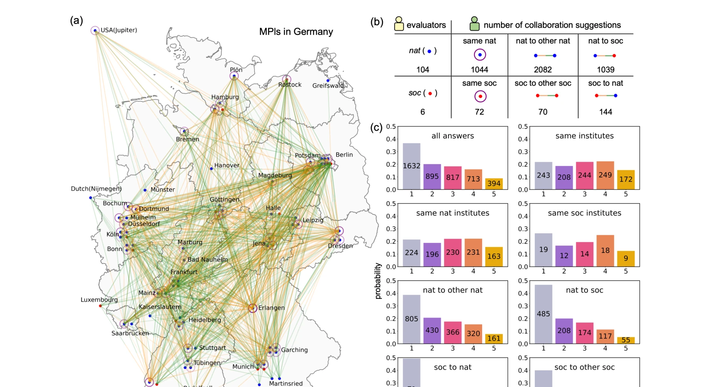

# Interesting Scientific Idea Generation using Knowledge Graphs and LLMs: Evaluations with 100 Research Group Leaders

> **저자**: Xuemei Gu, Mario Krenn | **날짜**: 2025-01-07 | **DOI**: [10.48550/arXiv.2405.17044](https://doi.org/10.48550/arXiv.2405.17044)

---

## Essence

*Fig. 1. SciMuse suggests research ideas or collaborations using a knowledge graph and GPT-4. (a), Knowledge*

SciMuse는 5,800만 개의 연구논문과 LLM을 활용하여 개인화된 연구 아이디어를 생성하고, 100명 이상의 연구 그룹 리더의 평가를 통해 AI 생성 아이디어의 흥미도를 예측하는 시스템을 제시한다.

## Motivation

- **Known**: 과학 문헌의 급속한 증가로 인해 연구자들이 새로운 아이디어를 발견하기 어려워졌으며, 기존 연구에서는 소규모 평가(6-10명의 박사과정 학생)만 수행되었다.
- **Gap**: 경험 많은 연구 리더(그룹장)의 관점에서 AI 생성 아이디어의 가치를 평가한 대규모 연구가 부족하며, 아이디어의 흥미도를 정확히 예측하는 방법론이 필요하다.
- **Why**: 효과적인 아이디어 발굴 시스템은 학제 간 협력을 촉진하고 연구의 영향력을 높일 수 있으며, AI가 과학 발견의 영감 원천으로 역할할 수 있는지 검증하는 것이 중요하다.
- **Approach**: 123,128개의 과학 개념으로 구성된 knowledge graph를 구축하고, GPT-4를 활용하여 개별 연구자의 관심사에 기반한 협력 연구 아이디어를 생성한 후, supervised neural network와 zero-shot LLM ranking으로 흥미도를 예측한다.

## Achievement

*Fig. 2. Large-scale human evaluation within the Max Planck Society. (a)-(b), The map of Germany, based on the*

**대규모 평가 데이터 구축**: 54개 막스플랑크 연구소의 110명 연구 그룹 리더가 4,451개의 개인화된 아이디어를 평가하여 약 25%가 흥미도 4-5를 받음
**흥미도 예측 모델 개발**: supervised neural network와 unsupervised zero-shot LLM ranking을 통해 새로운 아이디어의 흥미도를 정확히 예측 가능
**Knowledge graph 특성 분석**: 8가지 knowledge graph 특성(노드 중심성, 인용 지표, semantic distance 등)과 연구자 흥미도 간의 상관관계 규명
**학제 간 협력 기회 발굴**: 같은 분야 내 협력(institutional collaboration)보다 서로 다른 분야 간 협력 아이디어가 높은 흥미도를 보임

## How

*Fig. 1. SciMuse suggests research ideas or collaborations using a knowledge graph and GPT-4. (a), Knowledge*

- RAKE 알고리즘과 GPT, Wikipedia, 수동 검수를 통해 2.44백만 개 논문에서 123,128개 과학 개념 추출
- OpenAlex의 5,800만 개 논문에서 개념 간 공동 출현 및 인용 데이터를 활용하여 knowledge graph 구성
- 연구자의 최근 2년 논문에서 개념 추출 후 GPT-4로 정제하여 개인화된 서브그래프 구축
- GPT-4의 self-reflection 기법(3개 아이디어 생성 → 2회 반복 개선 → 최적 선택)으로 최종 연구 아이디어 생성
- 1-5점 척도의 인간 평가 데이터를 수집하여 supervised neural network 학습
- zero-shot LLM ranking을 통해 인간 평가 데이터 없이도 아이디어 흥미도 예측

## Originality

- **대규모 실증 평가의 혁신**: 기존 6-10명의 박사과정 학생 평가 대비 110명의 경험 많은 연구 리더 평가로 대폭 확대
- **Dual prediction 방식**: supervised와 unsupervised 방법을 병행하여 인간 평가 가용성 차이에 대응
- **Knowledge graph 기반 체계화**: 단순 prompt engineering이 아닌 명시적 knowledge graph를 통한 제어 가능한 아이디어 생성
- **Cross-disciplinary insight**: semantic distance와 협력 유형(기관 내/간)에 따른 흥미도 차이의 정량적 분석

## Limitation & Further Study

- **평가 대상의 편향**: 자연과학 연구자(104명) 대비 사회과학 연구자(6명)의 심각한 불균형으로 인한 일반화 한계
- **시간적 제약**: 2023년 2월 기준의 고정된 knowledge graph로 인한 최신 연구 동향 반영 부족
- **협력 형태의 제한**: 2명 간의 협력만 평가하여 다중 연구자 협력의 가능성 미탐색
- **예측 모델의 설명성 부족**: neural network 기반 예측의 black-box 특성으로 인해 어떤 요소가 흥미도를 결정하는지 상세 해석 제한
- **후속 연구 필요**: (1) 사회과학 및 인문학 영역에서의 추가 평가, (2) 시간 경과에 따른 아이디어 실제 구현 가능성 추적, (3) 다학제 협력 체계로의 확장, (4) knowledge graph 실시간 업데이트 방안 개발

## Evaluation

- Novelty: 4/5
- Technical Soundness: 3/5
- Significance: 4/5
- Clarity: 4/5
- Overall: 4/5

**총평**: 본 연구는 AI 생성 연구 아이디어의 가치를 대규모 실증 평가를 통해 검증한 획기적인 논문이며, dual prediction 방식과 knowledge graph 기반 체계화를 통해 실용성을 높였으나, 평가자 구성의 불균형과 시간적 제약이 일반화 가능성을 제한한다.

## Related Papers

- 🔄 다른 접근: [[papers/376_Generation_and_human-expert_evaluation_of_interesting_resear/review]] — 동일한 SciMuse 시스템을 다룬 논문으로 지식 그래프 기반 개인화 연구 아이디어 생성의 핵심 내용과 평가 결과를 공유한다.
- 🏛 기반 연구: [[papers/216_Chimera_A_knowledge_base_of_idea_recombination_in_scientific/review]] — 과학에서 아이디어 재결합 지식베이스가 새로운 연구 아이디어 생성의 이론적 기반과 창의적 조합 메커니즘을 제공한다.
- 🔗 후속 연구: [[papers/728_SciMON_Scientific_Inspiration_Machines_Optimized_for_Novelty/review]] — 참신성에 최적화된 과학적 영감 머신이 지식 그래프 기반 아이디어 생성을 참신성 중심으로 발전시킨 접근법이다.
- 🧪 응용 사례: [[papers/391_Graph_of_ai_ideas_Leveraging_knowledge_graphs_and_llms_for_a/review]] — AI 아이디어 그래프가 지식 그래프와 LLM을 활용한 연구 아이디어 생성의 실제 구현 사례를 제시한다.
- 🔗 후속 연구: [[papers/410_How_deep_do_large_language_models_internalize_scientific_lit/review]] — 지식 그래프를 활용한 과학 아이디어 생성이 인용 편향 문제 해결의 대안적 접근법을 제시한다.
- 🔄 다른 접근: [[papers/391_Graph_of_ai_ideas_Leveraging_knowledge_graphs_and_llms_for_a/review]] — 지식 그래프 기반 과학적 아이디어 생성의 다른 접근법을 제시합니다.
- 🔗 후속 연구: [[papers/216_Chimera_A_knowledge_base_of_idea_recombination_in_scientific/review]] — 지식그래프를 이용한 과학적 아이디어 생성 연구를 대규모 문헌의 아이디어 재조합 사례 분석으로 확장한다.
- 🔄 다른 접근: [[papers/376_Generation_and_human-expert_evaluation_of_interesting_resear/review]] — 동일한 SciMuse 시스템을 다룬 논문으로 지식 그래프와 LLM을 활용한 개인화 연구 아이디어 생성의 핵심 내용을 공유한다.
- 🔄 다른 접근: [[papers/132_Automating_psychological_hypothesis_generation_with_AI_when/review]] — 지식 그래프 기반의 과학적 아이디어 생성 접근법으로, 이 논문의 인과 지식 그래프 결합 방법과 유사하지만 더 범용적인 접근을 보여준다
