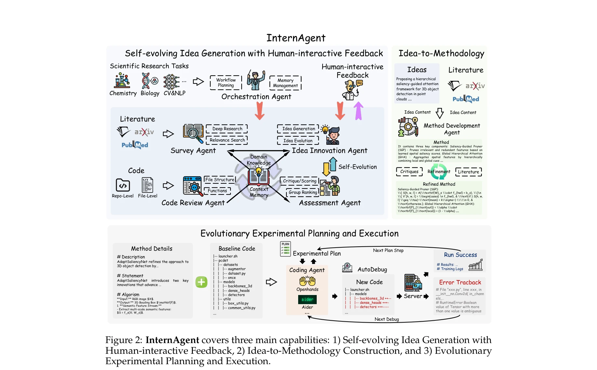
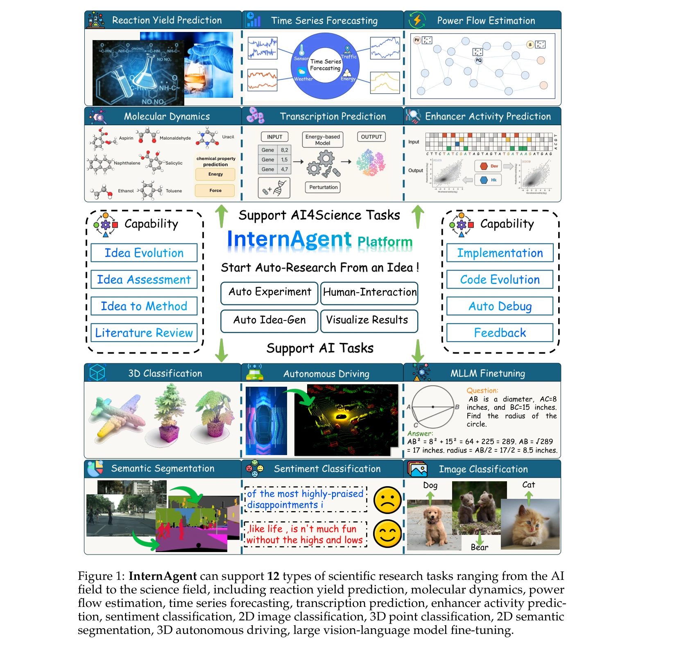

# InternAgent: When Agent Becomes the Scientist -- Building Closed-Loop System from Hypothesis to Verification

> **저자**: InternAgent Team, Bo Zhang, Shiyang Feng, Xiangchao Yan, Jiakang Yuan, Runmin Ma, Yusong Hu, Zhiyin Yu, Xiaohan He, Songtao Huang, Shaowei Hou, Zheng Nie, Zhilong Wang, Jinyao Liu, Tianshuo Peng, Peng Ye, Dongzhan Zhou, Shufei Zhang, Xiaosong Wang, Yilan Zhang | **날짜**: 2025-05-22 | **URL**: [https://arxiv.org/abs/2505.16938](https://arxiv.org/abs/2505.16938)

---

## Essence

*Figure 2: InternAgent covers three main capabilities: 1) Self-evolving Idea Generation with*

InternAgent는 가설 생성부터 검증까지 폐루프 구조를 가진 다중 에이전트 프레임워크로, 12가지 과학 연구 작업에서 자동화된 과학 연구(ASR)를 수행한다. 인간 전문가의 피드백 인터페이스를 통해 상호작용성을 제공하면서 수개월 소요되는 연구를 수십 시간 내에 완료한다.

## Motivation

- **Known**: LLM과 로봇을 활용한 자동 과학 발견(ASD)이 연구 효율성을 향상시킬 수 있다는 것이 알려져 있다. 기존 접근법들은 데이터 분석, 가설 생성, 실험 설계 등의 작업을 자동화하는 개별 모듈에 초점을 맞추어왔다.
- **Gap**: 자동 시스템은 효과적이면서도 새로운 제안을 생성하기 어렵고, 실험 검증을 위한 진정한 폐루프 피드백을 구현하는 데 어려움을 겪는다. 또한 다양한 과학 분야에 적용 가능한 통합 프레임워크의 부재가 문제이다.
- **Why**: 자동화된 과학 연구는 방대한 정보를 효율적으로 처리하고 인간 연구자가 놓치기 쉬운 패턴을 발견할 수 있으며, 다양한 과학 분야에서 발견 속도를 획기적으로 가속화할 수 있다.
- **Approach**: InternAgent는 자체 진화 아이디어 생성, 인간-상호작용 피드백, 아이디어-방법론 구성, 다중 라운드 실험 계획 및 실행의 4가지 주요 모듈로 구성된 폐루프 프레임워크를 제안한다. 특화된 에이전트들(Survey Agent, Idea Innovation Agent, Method Development Agent, Coding Agent 등)이 협업하여 과학 연구 사이클 전체를 자동화한다.

## Achievement

*Figure 1: InternAgent can support 12 types of scientific research tasks ranging from the AI*

- **12개 과학 연구 작업에 대한 확장성**: Reaction Yield Prediction, Molecular Dynamics, Power Flow Estimation, Time Series Forecasting, Transcription Prediction, Enhancer Activity Prediction, Sentiment Classification, 2D/3D Image Classification, 2D/3D Semantic Segmentation, Autonomous Driving, MLLM Finetuning 등 다양한 분야에 적용 가능
- **성능 향상 달성**: Reaction Yield Prediction에서 27.6%에서 35.4%로 증가(12시간), Enhancer Activity Prediction에서 Pearson correlation coefficient 0.65에서 0.79로 증가(4시간), 2D Semantic Segmentation에서 78.8%에서 81.0%로 증가(30시간)
- **인간-기계 협업 인터페이스**: 도메인 전문가 피드백을 위한 상호작용 인터페이스 제공으로 전문 지식의 seamless 통합 가능
- **효율성**: 인간 연구자가 수개월 소요되는 작업을 수십 시간 내에 완료하여 연구 효율성 극적 개선

## How

*Figure 2: InternAgent covers three main capabilities: 1) Self-evolving Idea Generation with*

- **Self-Evolving Idea Generation**: Survey Agent가 문헌 검색으로 도메인 지식 수집, Idea Innovation Agent가 창의적 아이디어 생성, Assessment Agent가 아이디어 평가 및 개선
- **Human-Interactive Feedback**: 전문가 평가 모드와 AI 평가 모드 선택 가능하며, 아이디어의 신성도(novelty) 점수 부여 및 반영
- **Idea-to-Methodology Construction**: Method Development Agent가 아이디어를 상세한 구현 가능한 방법론으로 변환하여 코드 구현 성공률 증대
- **Multi-Round Experimental Planning and Execution**: Coding Agent가 코드 자동 생성, AutoDebug Server(Openhands, Aider 등)가 에러 추적 및 디버깅, 실험 결과 분석을 통해 다중 라운드 반복
- **Orchestration Agent와 Memory Management**: 전체 워크플로우 계획 및 조정, 콘텍스트와 도메인 지식의 메모리 관리로 일관성 유지

## Originality

- **진정한 폐루프 구조의 실현**: 가설 생성에서 검증까지 완전한 자동화된 사이클을 구현하고, 실험 결과를 피드백으로 아이디어 진화에 반영하는 자체 진화 메커니즘
- **다중 전문 에이전트 협업**: Survey, Innovation, Development, Coding, Assessment, Debugging 등 각 단계별 특화된 에이전트를 조합하여 각 과정의 품질 향상
- **인간-기계 협업의 유연한 설계**: 완전 자동화와 전문가 피드백을 선택적으로 적용할 수 있는 상호작용 인터페이스 제공
- **광범위한 학제 간 적용성**: 화학, 생물학, CV&NLP, AI 등 다양한 분야의 12개 작업에서 통일된 프레임워크로 성과를 입증한 점
- **사람-AI 효율성 비교**: 도메인 전문가들을 통한 정성적 평가와 정량적 성능 비교로 신뢰성 확보

## Limitation & Further Study

- **제한된 도메인 깊이**: 12개 작업에서 성과를 보였으나, 각 과학 분야의 고도의 복잡성과 특수성을 완전히 다루는지 명확하지 않음
- **인간 피드백의 필요성**: 완전 자동화가 아니며, 성능 최적화를 위해서는 도메인 전문가의 개입이 필요한 경우가 있을 수 있음
- **생성 아이디어의 과학적 타당성**: LLM 기반 아이디어 생성이 기존 데이터 패턴에 의존하므로, 근본적으로 새로운 패러다임의 발견 가능성에 대한 검증 부족
- **실험 환경의 제약**: 코드 기반 실험 자동화에 초점을 맞추어, 물리적 실험실 환경의 복잡한 변수와 노이즈 처리에 대한 평가 부재
- **후속 연구 방향**: 더 복잡한 프로젝트 규모의 검증, 로봇 기반 물리적 실험과의 통합, 신성도 평가의 정량화 개선, 다양한 LLM 백엔드에 대한 성능 비교 필요

## Evaluation

- Novelty: 4/5
- Technical Soundness: 3/5
- Significance: 4/5
- Clarity: 4/5
- Overall: 4/5

**총평**: InternAgent는 자동 과학 연구의 폐루프 구현과 다중 도메인 적용성을 입증한 의미 있는 시스템으로, 인간-AI 협업 인터페이스와 광범위한 실험 검증을 통해 설득력 있는 성과를 보여준다. 다만 생성 아이디어의 과학적 근본성과 물리적 실험 환경으로의 확장 가능성에 대한 추가 검증이 필요하다.

## Related Papers

- 🔄 다른 접근: [[papers/578_Novelseek_When_agent_becomes_the_scientistbuilding_closed-lo/review]] — InternAgent와 NovelSeek은 동일한 폐루프 과학 연구 자동화를 목표로 하지만 서로 다른 구현 세부사항과 평가 방식 사용
- 🧪 응용 사례: [[papers/310_Embodied_Science_Closing_the_Discovery_Loop_with_Agentic_Emb/review]] — InternAgent는 Embodied Science의 이론적 폐루프 발견 패러다임을 실제 다중 에이전트 시스템으로 구현한 적용 사례
- 🔗 후속 연구: [[papers/795_The_AI_Scientist_Towards_Fully_Automated_Open-Ended_Scientif/review]] — AI Scientist의 완전 자동화 과학 발견 비전을 InternAgent가 다중 에이전트와 인간 피드백을 통해 실용적으로 구현함
- 🔗 후속 연구: [[papers/310_Embodied_Science_Closing_the_Discovery_Loop_with_Agentic_Emb/review]] — InternAgent의 폐루프 과학 연구 자동화는 Embodied Science의 물리적 상호작용 패러다임을 실제 구현한 확장형
- 🔄 다른 접근: [[papers/578_Novelseek_When_agent_becomes_the_scientistbuilding_closed-lo/review]] — NovelSeek과 InternAgent는 동일한 폐루프 과학 연구 자동화를 구현하지만 서로 다른 세부 아키텍처와 평가 방식을 채택함
