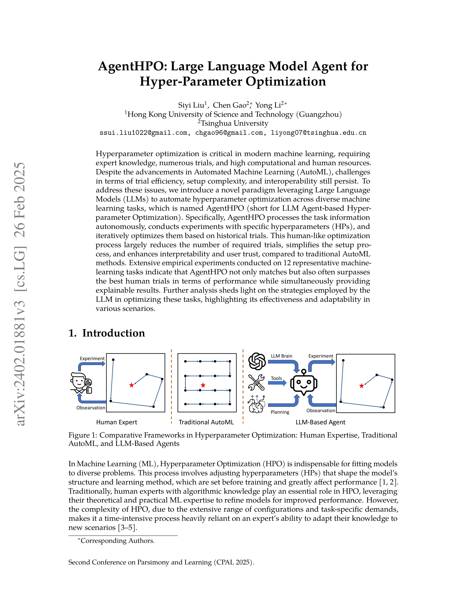
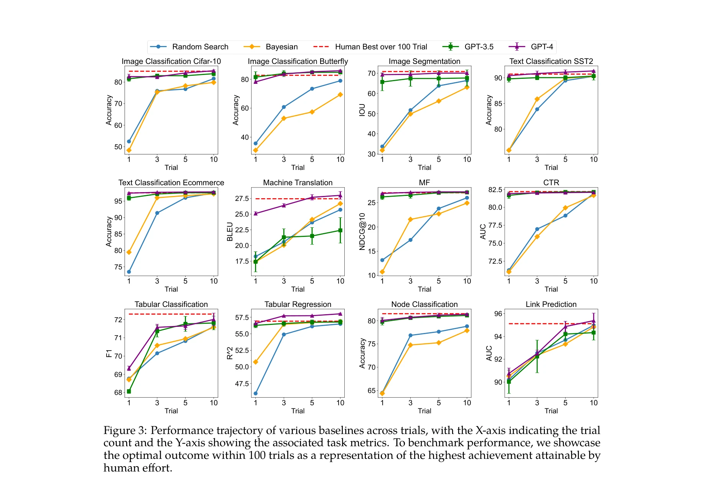
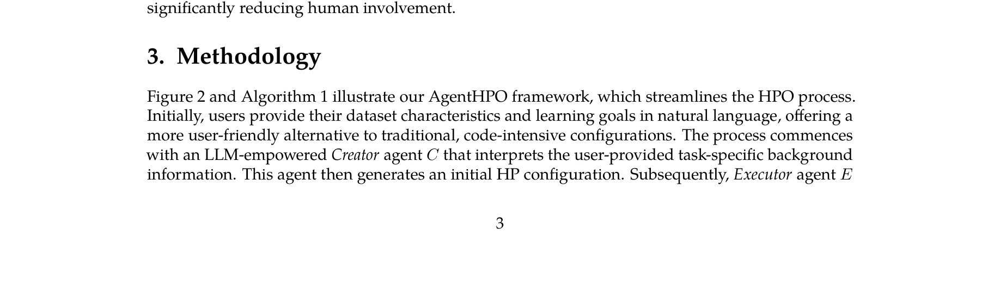

# Large language model agent for hyper-parameter optimization

> **저자**: Siyi Liu, Chen Gao, Yong Li | **날짜**: 2024 | **URL**: [https://arxiv.org/abs/2402.01881](https://arxiv.org/abs/2402.01881)

---

## Essence

*Figure 1: Comparative Frameworks in Hyperparameter Optimization: Human Expertise, Traditional*

AgentHPO는 LLM 기반의 자율 에이전트를 활용하여 하이퍼파라미터 최적화를 자동화하는 프레임워크이다. Creator와 Executor 두 개의 특화된 에이전트가 협력하여 시행착오를 줄이고 해석 가능성을 높인다.

## Motivation

- **Known**: AutoML은 Bayesian optimization 등을 통해 하이퍼파라미터 최적화를 자동화하지만, 많은 시행착오, 복잡한 설정, 낮은 해석 가능성의 문제가 있다. LLM 기반 에이전트는 MetaGPT, Voyager, Coscientist 등에서 복잡한 작업 자동화에 성공했다.
- **Gap**: 기존 LLM for AutoML 연구들은 실제 하이퍼파라미터 최적화에 직접 적용되지 않거나 학습 로그를 반복적으로 활용하지 못한다. OPRO 기반 방법들도 수동 코드 조정에 의존하며 높은 인적 개입을 요구한다.
- **Why**: 하이퍼파라미터 최적화는 현대 머신러닝에서 필수적이지만 전문가의 시간과 계산 자원이 많이 소모된다. LLM의 추론 능력과 도구 활용 능력을 활용하면 효율성, 설정 용이성, 해석 가능성을 동시에 개선할 수 있다.
- **Approach**: Creator 에이전트가 자연어 입력으로부터 초기 하이퍼파라미터를 생성하고, Executor 에이전트가 모델 학습과 결과 분석을 수행한 후 기록된 실험 로그를 기반으로 Creator가 반복적으로 하이퍼파라미터를 개선한다.

## Achievement

*Figure 3: Performance trajectory of various baselines across trials, with the X-axis indicating the trial*

- **시행착오 감소**: Creator와 Executor의 특화된 역할 분담을 통해 최소한의 시도로 높은 성능 달성
- **설정 단순화**: 자연어 입력으로 작업 정보를 지정하여 복잡한 하이퍼파라미터 공간 정의 제거
- **해석 가능성 향상**: 텍스트 기반 설명으로 하이퍼파라미터 선택 이유를 명확히 제시하여 사용자 신뢰도 증대
- **광범위한 검증**: 12개의 대표적인 머신러닝 작업에서 인간 전문가의 최고 성능과 동등하거나 우수한 결과 달성

## How

*Figure 2 and Algorithm 1 illustrate our AgentHPO framework, which streamlines the HPO process.*

- Creator 에이전트: 사용자 제공 데이터셋, 모델 구조, 최적화 목표 정보를 자연어로 해석하고 초기 하이퍼파라미터 설정 생성
- Executor 에이전트: 제시된 하이퍼파라미터로 모델 학습, 학습 로그 기록, 성능 분석 수행
- 반복 최적화: Executor의 학습 이력을 누적하여 Creator가 이를 기반으로 새로운 하이퍼파라미터 제안 및 정제
- 에이전트 간 협력: 두 에이전트의 상호작용을 통해 인간 전문가의 직관과 유사한 최적화 프로세스 구현

## Originality

- **첫 시도**: HPO 분야에 LLM 기반 자율 에이전트를 처음으로 체계적으로 도입한 연구
- **이중 에이전트 구조**: Creator와 Executor의 역할 분담으로 초기화와 반복 개선을 효과적으로 분리
- **실험 로그 활용**: 직접적인 학습 성능 데이터를 반복적으로 활용하여 기존 OPRO 기반 방법 대비 개선
- **자연어 인터페이스**: 코드 작성 없이 자연어로 작업 정의 가능하여 접근성 대폭 향상

## Limitation & Further Study

- **LLM 의존성**: GPT-4 등 고성능 LLM에 의존하며 모델 선택에 따른 성능 변동성 미분석
- **확장성 검증 부족**: 12개 작업으로 검증했으나 더 큰 규모 작업이나 매우 고차원 하이퍼파라미터 공간에서의 성능 미확인
- **비용 분석 부재**: LLM API 호출 비용과 실제 계산 절약의 경제성 비교 분석 미흡
- **후속 연구**: 경량 LLM 활용 가능성, 강화학습 기반 에이전트 개선, 다중 작업 전이 학습, 실시간 성능 추적 메커니즘 강화 필요

## Evaluation

- Novelty: 4/5
- Technical Soundness: 3/5
- Significance: 4/5
- Clarity: 4/5
- Overall: 4/5

**총평**: 본 논문은 LLM 기반 자율 에이전트를 하이퍼파라미터 최적화에 처음 적용한 창의적인 연구로, 설정 단순성과 해석 가능성에서 기존 AutoML을 개선했다. 광범위한 실험 검증과 명확한 프레임워크 설계가 강점이나, LLM 성능 의존성과 비용 분석이 보강될 필요가 있다.

## Related Papers

- 🔄 다른 접근: [[papers/549_Mlr-copilot_Autonomous_machine_learning_research_based_on_la/review]] — AgentHPO와 MLR-COPILOT 모두 머신러닝 연구 자동화를 목표로 하지만 각각 하이퍼파라미터 최적화와 전체 연구 프로세스에 특화됨
- 🏛 기반 연구: [[papers/469_Large_Language_Models_as_Evolutionary_Optimizers/review]] — LLM을 진화 최적화에 활용하는 연구가 AgentHPO의 협력적 하이퍼파라미터 최적화 접근법의 이론적 기반을 제공함
- 🔗 후속 연구: [[papers/542_Mlagentbench_Evaluating_language_agents_on_machine_learning/review]] — MLAgentBench의 머신러닝 에이전트 평가가 AgentHPO 같은 특화된 최적화 에이전트의 성능 검증으로 확장됨
- 🔗 후속 연구: [[papers/549_Mlr-copilot_Autonomous_machine_learning_research_based_on_la/review]] — MLR-COPILOT의 포괄적 연구 자동화가 AgentHPO의 하이퍼파라미터 최적화를 전체 연구 프로세스로 확장한 형태
