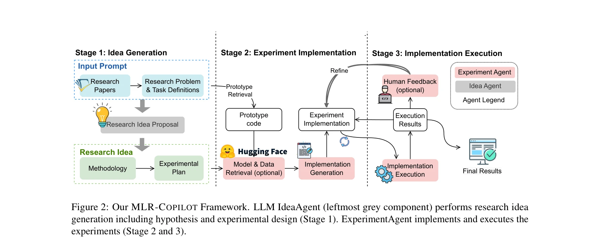

# Mlr-copilot: Autonomous machine learning research based on large language models agents

> **저자**: Ruochen Li, Teerth Patel, Qingyun Wang, Xinya Du | **날짜**: 2024 | **URL**: [https://arxiv.org/abs/2408.14033](https://arxiv.org/abs/2408.14033)

---

## Essence

*Figure 2: Our MLR-COPILOT Framework. LLM IdeaAgent (leftmost grey component) performs research idea*

MLR-COPILOT는 LLM 에이전트 기반의 자동화된 머신러닝 연구 프레임워크로, 아이디어 생성부터 실험 구현 및 실행까지 전 과정을 자동화한다.

## Motivation

- **Known**: 기존 연구는 아이디어 생성 또는 자동 실험 중 하나에만 집중했으며, 대부분 사전 정의된 작업과 코드 템플릿에서 출발하거나 단순한 하이퍼파라미터 조정에 그쳤다.
- **Gap**: 머신러닝 연구의 전체 파이프라인을 자동화하는 통합 프레임워크가 부재하며, 실제 연구 논문으로부터 출발하여 실행 가능한 결과를 얻기까지의 완전한 자동화 솔루션이 필요하다.
- **Why**: 현대 과학 연구의 복잡성 증가와 지식 확장으로 인한 연구 효율성 저하 문제를 해결하고, LLM의 텍스트·코드 생성 능력을 활용하여 연구자의 생산성을 향상시킬 수 있다.
- **Approach**: RL 기반 미세조정된 IdeaAgent가 연구 논문으로부터 방법론과 실험 계획을 생성하고, ExperimentAgent가 이를 실행 가능한 코드로 변환하여 실행 및 디버깅을 수행하는 3단계 프로세스를 구현한다.

## Achievement

*Figure 2: Our MLR-COPILOT Framework. LLM IdeaAgent (leftmost grey component) performs research idea*

- **완전한 자동화 파이프라인**: 논문 입력으로부터 실행된 연구 결과까지의 전체 ML 연구 프로세스를 자동화
- **RL 기반 최적화**: novelty, feasibility, effectiveness 등 다차원 피드백으로 IdeaAgent를 학습하여 고품질의 연구 아이디어 생성
- **지능형 검색 및 통합**: Semantic Scholar API를 통한 관련 문헌 검색과 HuggingFace로부터의 모델/데이터 자동 검색 기능
- **반복적 개선 메커니즘**: 실행 결과 기반 피드백과 선택적 인간 개입을 통한 실험 구현의 반복적 정제
- **실증적 검증**: 5개의 ML 연구 작업에 대한 수동 및 자동 평가를 통해 프레임워크의 실용성 입증

## How

*Figure 2: Our MLR-COPILOT Framework. LLM IdeaAgent (leftmost grey component) performs research idea*

- Stage 1 - 아이디어 생성: RL 기반으로 미세조정된 IdeaAgent가 입력 논문 P, 추출된 작업 t, 연구 갭 g으로부터 관련 문헌 R을 검색하고 방법론 h와 실험 계획 e를 생성
- Stage 2 - 실험 구현: ExperimentAgent가 원본 논문의 프로토타입 코드 I를 검색하여 적응하고, 필요시 HuggingFace에서 모델 M과 데이터를 검색하여 실행 가능한 코드 생성
- Stage 3 - 실행 및 디버깅: ExperimentAgent가 실험을 실행하고 디버깅 피드백 및 선택적 인간 피드백을 수집하여 Stage 2의 구현을 반복적으로 정제
- SFT 및 RL 학습: OpenReview에서 수집한 4,271개 논문 중 1,000개 논문의 연구 아이디어와 계획 데이터로 SFT 후 reward models를 통한 RL 최적화

## Originality

- 기존 도구와 달리 연구 논문을 직접 입력으로 받아 실제 연구 시나리오를 반영하는 엔드-투-엔드 자동화 프레임워크 구현
- RL 기반의 다차원 피드백(novelty, feasibility, effectiveness) 학습을 통해 ML 연구에 특화된 아이디어 생성 능력 획득
- 프로토타입 코드 검색, 모델/데이터 자동 검색, 실행 피드백 기반 반복 개선 등 여러 검색 및 개선 메커니즘의 통합
- 인간-기계 협업(human-in-the-loop) 구조로 자동화와 인간 지도의 균형 추구

## Limitation & Further Study

- 평가가 5개 ML 연구 작업에 한정되어 다양한 연구 분야에 대한 일반화 가능성 검증 필요
- 코드 생성 및 실행 과정에서의 오류율 및 수렴 성공률에 대한 상세 분석 부재
- 인간 피드백의 질과 빈도에 따른 성능 변화 분석 및 최적 피드백 전략 연구 필요
- 계산 비용, API 호출 횟수, 총 실행 시간 등 실용적 효율성 지표에 대한 정량적 비교 분석 부재
- 생성된 아이디어의 진정한 창의성과 과학적 가치에 대한 정성적 평가 심화 필요
- 다양한 LLM 모델과의 호환성 및 모델 크기에 따른 성능 변화 연구 필요

## Evaluation

- Novelty: 4/5
- Technical Soundness: 3/5
- Significance: 4/5
- Clarity: 4/5
- Overall: 4/5

**총평**: MLR-COPILOT는 LLM 에이전트를 활용하여 ML 연구의 전 과정을 자동화하는 혁신적인 프레임워크로, RL 기반 미세조정과 인간-기계 협업 메커니즘을 통해 고품질의 자동화 연구를 실현한다. 다만 평가 범위 확대, 성공률 분석, 실용적 효율성 지표 제시 등의 보완이 필요하다.

## Related Papers

- 🔄 다른 접근: [[papers/293_Ds-agent_Automated_data_science_by_empowering_large_language/review]] — MLR-COPILOT와 DS-Agent 모두 LLM 기반 머신러닝 연구 자동화를 목표로 하지만 서로 다른 아키텍처와 구현 방식 사용
- 🔗 후속 연구: [[papers/463_Large_language_model_agent_for_hyper-parameter_optimization/review]] — MLR-COPILOT의 포괄적 연구 자동화가 AgentHPO의 하이퍼파라미터 최적화를 전체 연구 프로세스로 확장한 형태
- 🏛 기반 연구: [[papers/548_Mlr-bench_Evaluating_ai_agents_on_open-ended_machine_learnin/review]] — MLR-Bench의 머신러닝 연구 평가가 MLR-COPILOT 같은 자동화 시스템의 성능 검증 기준을 제공함
- 🧪 응용 사례: [[papers/135_Automl_in_the_age_of_large_language_models_Current_challenge/review]] — AutoML과 LLM 통합을 기계학습 연구 자동화라는 구체적 영역에 실제 적용한 사례
- 🔄 다른 접근: [[papers/293_Ds-agent_Automated_data_science_by_empowering_large_language/review]] — DS-Agent와 MLR-COPILOT 모두 LLM 기반으로 데이터 사이언스 작업을 자동화하지만 서로 다른 아키텍처 접근법을 사용함
- 🔄 다른 접근: [[papers/463_Large_language_model_agent_for_hyper-parameter_optimization/review]] — AgentHPO와 MLR-COPILOT 모두 머신러닝 연구 자동화를 목표로 하지만 각각 하이퍼파라미터 최적화와 전체 연구 프로세스에 특화됨
- 🔄 다른 접근: [[papers/650_RD-Agent_Automating_Data-Driven_AI_Solution_Building_Through/review]] — R&D-Agent와 MLR-COPILOT 모두 연구 자동화를 목표로 하지만 각각 데이터 사이언스와 머신러닝 연구라는 다른 영역에 특화됨
- 🧪 응용 사례: [[papers/542_Mlagentbench_Evaluating_language_agents_on_machine_learning/review]] — LLM 기반 MLR 연구 자동화의 실제 적용 사례를 통해 벤치마크 결과의 실용성을 검증할 수 있다.
