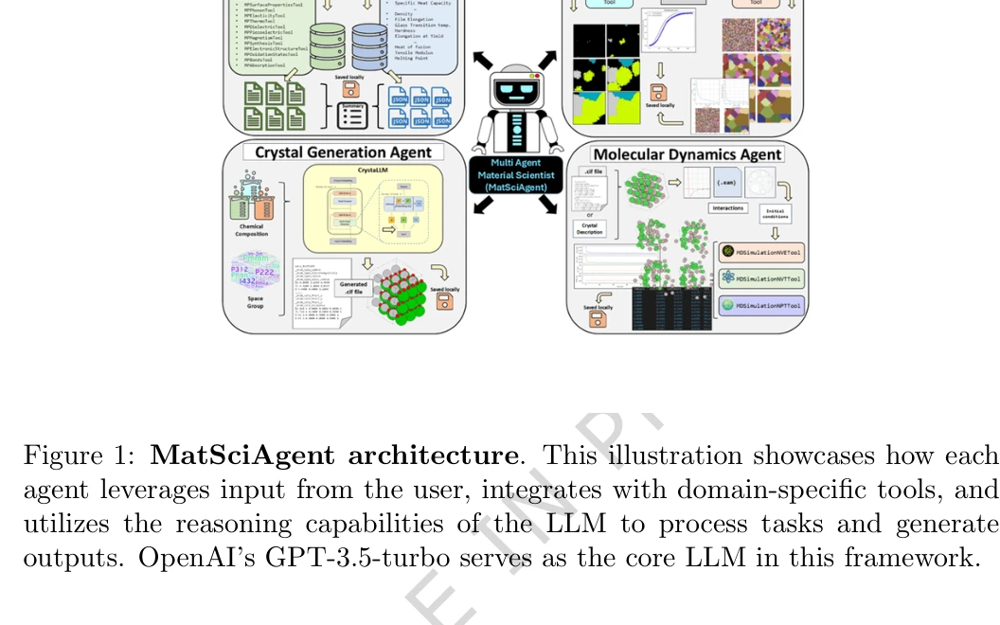
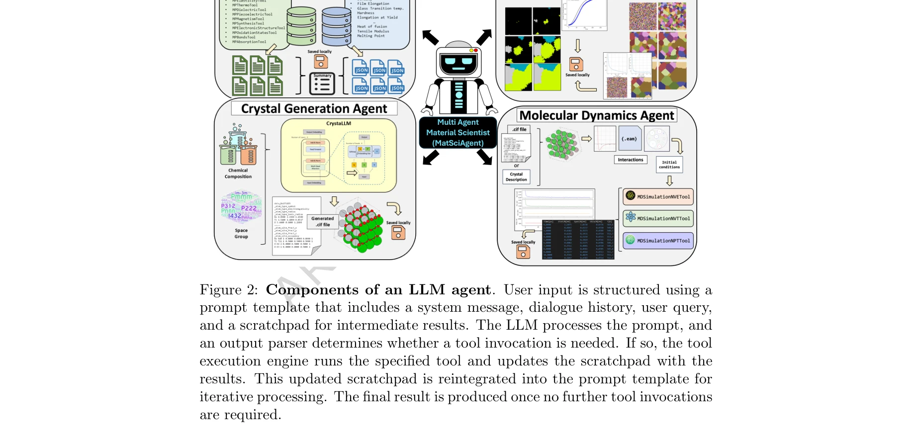

# Modular large language model agents for multi-task computational materials science

> **저자**: Akshat Chaudhari, Janghoon Ock, Amir Barati Farimani | **날짜**: 2026-03-26 | **DOI**: [10.1038/s43246-025-00994-x](https://doi.org/10.1038/s43246-025-00994-x)

---

## Essence

*Figure 1: MatSciAgent architecture. This illustration showcases how each*

MatSciAgent는 LLM 기반의 다중 에이전트 프레임워크로, 재료 데이터 검색, 연속체 시뮬레이션, 결정 구조 생성, 분자 동역학 시뮬레이션 등 다양한 전산 재료과학 작업을 자연어 쿼리로 자동화한다.

## Motivation

- **Known**: LLM은 자연어 처리와 일반적 추론 능력이 뛰어나며, 최근 agentic framework로 통합되어 ChemCrow, Coscientist 등 과학 문제 해결에 활용되고 있다. 또한 Materials Project, MatWeb 등 대규모 재료 데이터베이스가 구축되어 있다.
- **Gap**: 기존 LLM 기반 시스템들(LLaMP, HoneyComb, AtomAgents)은 주로 특정 작업(검색, 합금 개발)에 특화되어 있으며, 다양한 재료 시스템과 시뮬레이션 작업을 포괄하는 일반화된 모듈식 프레임워크가 부족하다.
- **Why**: 재료 설계의 복잡성과 반복적 특성으로 인해 다양한 전산 도구와 데이터 소스를 통합한 자동화 시스템이 필수적이며, 이는 연구 속도를 가속화하고 접근성을 개선할 수 있다.
- **Approach**: 마스터 에이전트가 사용자 쿼리를 분류하고 적절한 작업별 에이전트에 위임하는 계층적 다중 에이전트 구조를 도입하였으며, 각 에이전트는 GPT-3.5-turbo를 기반으로 도메인 특화 프롬프트와 도구를 갖추고 있다.

## Achievement

- **모듈식 아키텍처**: 재료 검색, 연속체 시뮬레이션, 결정 구조 생성, 분자 동역학 시뮬레이션 4가지 작업 유형을 지원하며 새로운 에이전트와 도구 추가에 용이
- **높은 안정성**: 파라미터 추출에서 5회 연속 100% 성공률, 재료 추출에서 10회 중 9회 일관성 달성
- **할루시네이션 완화**: Materials Project, MatWeb 등 검증된 데이터베이스를 활용하여 팩트 기반 응답 생성, vanilla LLM의 한계 극복
- **자동화 워크플로우**: 사용자가 자연어로 쿼리하면 시스템이 자동으로 도구 선택 및 실행을 수행

## How

*Figure 2: Components of an LLM agent. User input is structured using a*

- 마스터 에이전트가 자연어 쿼리를 받아 작업 유형 분류 및 라우팅 수행
- 작업별 에이전트(Materials Retrieval Agent, Continuum Simulation Agent, Crystal Structure Generation Agent, MD Simulation Agent)가 도메인 특화 도구 활용
- 각 에이전트는 scratchpad 기반의 공유 메모리로 상태 관리
- LLM 기반 reasoning으로 도구 선택 및 파라미터 추출 의사결정
- Materials Project, MatWeb 등 데이터베이스와 기존 소프트웨어/커스텀 코드 연동

## Originality

- 기존 특화된 시스템(AtomAgents, ChemCrow)과 달리, 4개 이상의 이질적 작업 유형(데이터 검색, 연속체 시뮬레이션, 구조 생성, 분자 동역학)을 단일 모듈식 프레임워크에서 지원
- 다중 에이전트 계층 구조(마스터 + 작업별 에이전트)로 확장성과 유지보수성 향상
- LLM 에이전트를 정량적으로 검증(파라미터 추출 100% 성공률, 재료 추출 90% 일관성)하여 신뢰성 입증

## Limitation & Further Study

- GPT-3.5-turbo 단일 모델만 사용되어, 오픈소스 LLaMA 등 다양한 LLM의 성능 비교 부재
- 현재 지원 시뮬레이션(연속체, MD)이 제한적이며, 상전이, 전자 구조 계산 등 추가 도메인으로의 확장 방안 미제시
- 할루시네이션이 완화되었으나 완전히 제거되지 않았으며, 데이터베이스 미포함 신규 물질에 대한 생성 모델의 정확도 검증 필요
- **후속 연구**: (1) 다양한 LLM 모델 벤치마킹, (2) 더 복잡한 다중 작업 워크플로우 자동화, (3) 사용자 피드백 기반 정학화 메커니즘 도입, (4) 재현성 및 일반화 성능을 위한 대규모 테스트 세트 구축

## Evaluation

- Novelty: 4/5
- Technical Soundness: 3/5
- Significance: 4/5
- Clarity: 4/5
- Overall: 4/5

**총평**: MatSciAgent는 LLM 기반 다중 에이전트 프레임워크로 재료과학 워크플로우를 효과적으로 자동화하며, 모듈식 설계와 높은 안정성을 입증하여 계산 재료과학 분야에 실질적 기여를 한다. 다만 더 광범위한 시뮬레이션 지원과 다양한 LLM 벤치마킹으로 보완하면 영향력이 배가될 것으로 예상된다.