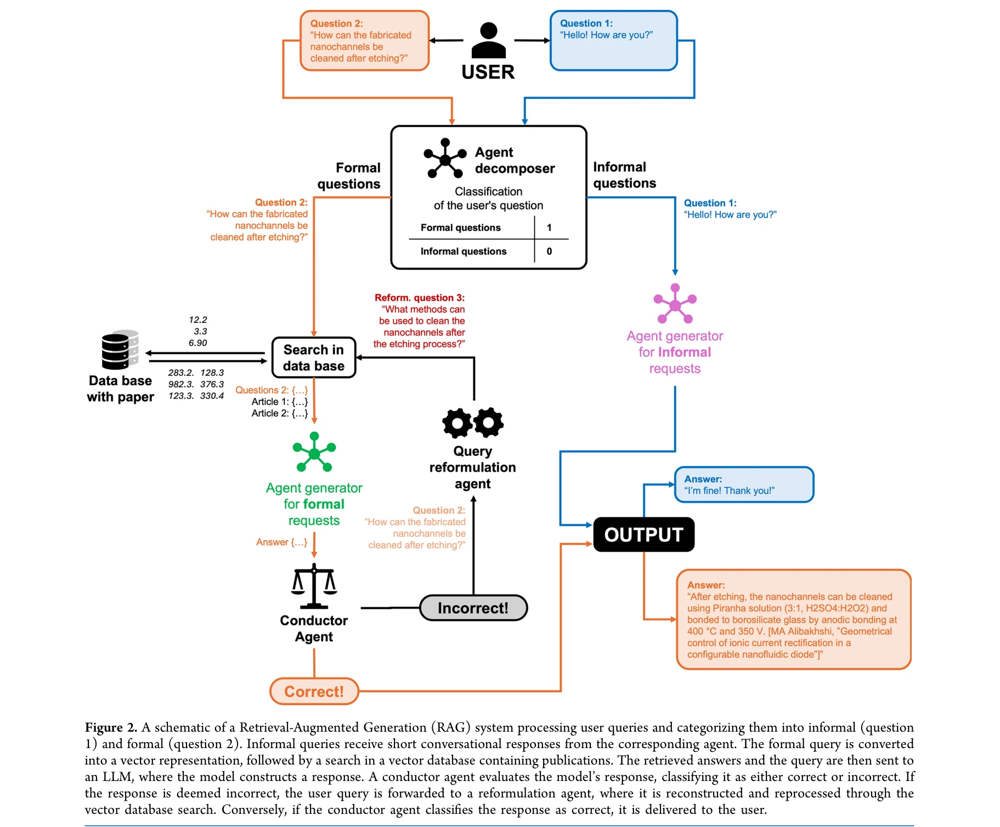
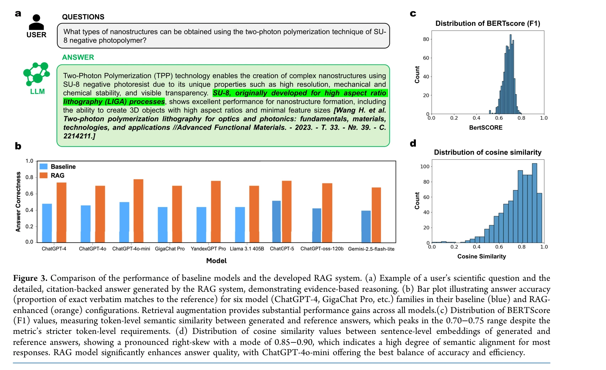

# Nanostructured Material Design via a Retrieval-Augmented Generation (RAG) Approach: Bridging Laboratory Practice and Scientific Literature

> **저자**: Nikita A. Krotkov, Dmitrii A. Sbytov, Anna A. Chakhoyan, Polina I. Kornienko, Anna A. Starikova, Maxim G. Stepanov, Anastasiia O. Piven, Timur A. Aliev, Tetiana Orlova, Mushegh S. Rafayelyan, Ekaterina V. Skorb | **날짜**: 2025-10-27 | **DOI**: [10.1021/acs.jcim.5c01897](https://doi.org/10.1021/acs.jcim.5c01897)

---

## Essence

*Figure 2. A schematic of a Retrieval-Augmented Generation (RAG) system processing user queries and categorizing them int*

이 연구는 Retrieval-Augmented Generation (RAG) 시스템과 LLM을 통합하여 나노구조 재료(특히 two-photon polymerization으로 제조된)의 설계를 자동화하고, 광대한 과학 문헌 데이터베이스에서 정보를 추출·분석하는 에이전트 기반 플랫폼을 제안한다.

## Motivation

- **Known**: Machine Learning과 Neural Network는 재료과학에서 복잡한 패턴 학습과 예측 모델 구축에 성공했으며, VAE, GAN, Diffusion Model, Transformer 등 다양한 생성 모델이 재료 설계에 활용되고 있다.
- **Gap**: 기존 LLM들은 깊이 있는 과학 지식의 상호연결성을 이해하고 기술적 세부사항의 정확성을 보장하는 데 한계가 있으며, 광대한 과학 문헌에서 구조화된 정보 추출이 어렵다.
- **Why**: 나노구조 재료의 복잡한 합성·처리 경로와 생체 적합성 상관관계를 이해하기 위해 수천 개의 논문을 수동으로 검토하는 것은 매우 노동집약적이므로, 자동화된 문헌 분석 시스템이 연구 효율성 극대화와 실험 비용 절감에 필수적이다.
- **Approach**: Agent 기반 RAG 시스템에 LLM을 통합하여 동적 쿼리 정제(dynamic query refinement) 메커니즘을 포함시키고, 의미론적 정확도와 작업 정밀도를 검증한 후 직관적 사용자 인터페이스를 제공하는 플랫폼을 구축했다.

## Achievement

*Figure 3 provides a comprehensive evaluation of baseline*

- **높은 의미론적 정확도**: 코사인 유사도 0.82로 검색된 정보의 의미론적 관련성을 확보
- **우수한 작업 정밀도**: 전체 작업 정밀도 0.81을 달성하여 오정보 가능성을 현저히 감소
- **동적 쿼리 정제 메커니즘**: 쿼리 자동 개선으로 검색 품질 향상
- **사용자 친화적 인터페이스**: 연구자들이 빠르게 관련 과학 데이터에 접근 가능
- **생산성 향상**: 수동 문헌 검토 시간을 대폭 단축하고 정확한 실험 계획 지원

## How

*Figure 4. Architecture and workflow of the microservice-based RAG web application. The diagram illustrates the complete *

- Retrieval-Augmented Generation (RAG) 아키텍처를 이용하여 LLM과 외부 문헌 데이터베이스 통합
- Agent 기반 시스템으로 자동 질의 생성 및 응답 정제
- Two-photon polymerization으로 제조된 나노구조 재료에 특화된 문헌 데이터 수집 및 인덱싱
- 세포-재료 상호작용 정보 추출 및 분석을 통한 생의학 응용 특성 파악
- 마이크로서비스 기반 웹 애플리케이션 아키텍처 구현
- 코사인 유사도 및 정밀도 메트릭을 통한 성능 평가

## Originality

- 두 경로 비교(Path 1 vs Path 2)를 통해 전통적 수동 검토와 LLM 기반 자동화 접근의 효율성 차이를 체계적으로 제시
- Domain-specific 나노재료 설계(2PP)에 RAG-LLM을 적용한 구체적 사례로, 기존 일반적 문헌 마이닝 연구를 특화시킴
- 세포 상호작용(cell-material interaction) 정보 추출을 생의학 응용 관점에서 강조하는 독창적 포커싱
- Agent 기반 동적 쿼리 정제 메커니즘의 도입으로 단순 RAG를 넘어 지능형 정보 검색 시스템으로 발전

## Limitation & Further Study

- **Domain-specific 용어 커버리지 제한**: 특정 전문 용어에 대한 이해 부족
- **Fine-tuning 필요성**: 더 높은 신뢰도를 위해 추가 미세 조정과 전문적 훈련 필요
- **데이터 품질 의존성**: 원본 문헌의 보고 품질과 일관성에 따라 추출 정확도가 크게 영향
- **제한된 일반화 능력**: 풍부한 데이터가 있는 잘 연구된 시스템에는 성능이 우수하나, 덜 탐색된 재료나 새로운 화학에서는 성능 저하 예상
- **계산 복잡도**: Diffusion Model 등 대규모 생성 모델의 높은 계산 비용 문제
- **후속 연구**: 특화된 재료과학 LLM(MatSci-LLM) 개발, 다중모드 데이터 통합, 실험실 자동화와의 더 깊은 연계

## Evaluation

- Novelty: 4/5
- Technical Soundness: 3/5
- Significance: 4/5
- Clarity: 4/5
- Overall: 4/5

**총평**: 이 연구는 RAG와 LLM을 활용하여 나노재료 설계 분야의 문헌 분석을 효과적으로 자동화하는 혁신적 플랫폼을 제시하며, 높은 정확도(0.82 cosine similarity, 0.81 precision)와 직관적 인터페이스로 연구 생산성을 크게 향상시킨다. 다만 domain-specific 용어 커버리지와 일반화 능력 개선이 필요하고, 향후 MatSci-LLM 개발과 실험실 자동화 통합이 중요한 과제이다.