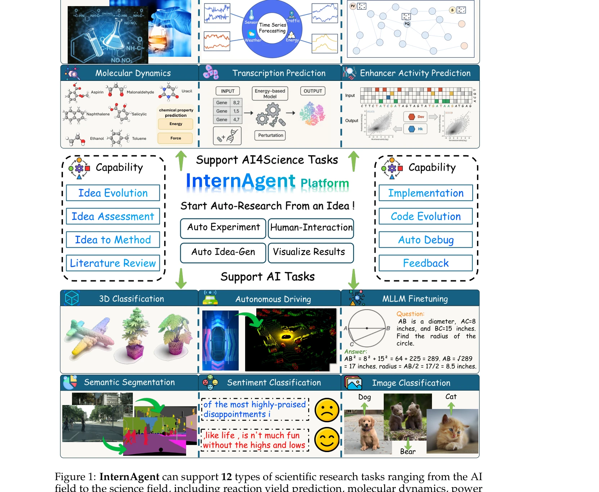

# Novelseek: When agent becomes the scientist–building closed-loop system from hypothesis to verification

> **저자**: Sylvain Kubler, Andrea Buda, Jérémy Robert, Kary Främling, Yves Le Traon | **날짜**: 2025 | **DOI**: [10.48550/arXiv.2505.16938](https://doi.org/10.48550/arXiv.2505.16938)

---

## Essence

*Figure 2: InternAgent covers three main capabilities: 1) Self-evolving Idea Generation with*

InternAgent는 자율 과학 연구(ASR)를 수행하기 위한 통합 다중 에이전트 폐루프 프레임워크로, 가설 생성부터 검증까지 12개 분야의 과학 연구 작업을 자동화한다.

## Motivation

- **Known**: LLM과 로봇공학을 이용한 자동 과학 발견(ASD)의 가능성이 알려져 있으며, 데이터 분석, 가설 생성, 실험 설계 자동화의 효율성이 입증되었다.
- **Gap**: 기존 자율 시스템은 효과적이고 새로운 제안 생성과 실험 검증을 위한 폐루프 피드백 구현에 어려움을 겪고 있으며, 실제 실험의 불확실성과 적응성 문제가 해결되지 않았다.
- **Why**: AI가 과학 연구 패러다임을 가속화하고 인간 연구자가 수개월 걸리는 성능 개선을 시간 단위로 달성할 수 있게 하여 연구 효율성과 혁신 속도를 획기적으로 향상시킬 수 있기 때문이다.
- **Approach**: InternAgent는 자기 진화형 아이디어 생성, 인간-상호작용 피드백, 아이디어-방법론 구성, 다중 라운드 실험 계획 및 실행의 네 가지 주요 모듈을 통해 폐루프 자동 연구 파이프라인을 구현한다.

## Achievement

*Figure 1: InternAgent can support 12 types of scientific research tasks ranging from the AI*

- **확장성**: Reaction Yield Prediction, Molecular Dynamics, Power Flow Estimation, Time Series Forecasting 등 12개 과학 연구 작업에서 검증되었으며, 기본 코드의 성능 향상을 위한 혁신적 아이디어 생성 가능
- **상호작용성**: 도메인 전문가 피드백과 다중 에이전트 상호작용을 위한 인터페이스를 제공하여 인간 전문가 지식의 통합을 지원
- **효율성**: Reaction Yield Prediction에서 12시간 내 27.6%→35.4% 향상, Enhancer Activity Prediction에서 4시간 내 Pearson correlation 0.65→0.79 향상, 2D Semantic Segmentation에서 30시간 내 정밀도 78.8%→81.0% 향상

## How

*Figure 2: InternAgent covers three main capabilities: 1) Self-evolving Idea Generation with*

- Self-evolving Idea Generation Agent: Survey Agent를 통한 관련 문헌 검색, Deep Research를 통한 도메인 지식 확보, Idea Innovation Agent를 통한 혁신적 아이디어 생성
- Human-interactive Feedback: Assessment Agent와 Code Review Agent를 통한 아이디어 평가 및 피드백 루프 구현
- Idea-to-Methodology Construction: Method Development Agent가 추상적 아이디어를 구현 가능한 상세 방법론으로 변환
- Evolutionary Experimental Planning and Execution: Coding Agent가 코드 생성 및 디버깅, AutoDebug Server (Openhands, Aider 등)를 통한 자동 오류 수정, 다중 라운드 실험 계획으로 각 모듈의 효과 검증
- Orchestration Agent: 워크플로우 계획과 메모리 관리를 통한 전체 프로세스 조율

## Originality

- 폐루프 자동 연구 시스템의 첫 통합 구현으로, 가설 생성에서 실험 검증까지 전체 과학 연구 사이클을 자동화
- 12개 이상의 다양한 과학 분야(화학, 생물학, 컴퓨터 비전, NLP 등)에 걸쳐 통합 프레임워크 적용 가능함을 입증
- 인간-AI 협력 모드를 통합하여 도메인 전문가 지식을 자동 시스템에 유연하게 반영 가능하게 설계
- Self-evolving idea generation 메커니즘으로 기존의 정적 아이디어 생성이 아닌 반복적 개선 과정 구현

## Limitation & Further Study

- 논문이 기술적 디테일을 충분히 제공하지 않아 각 에이전트의 구체적인 구현과 상호작용 메커니즘이 명확하지 않음
- 12개 작업 대부분에서 성능 지표가 명확하게 제시되지 않았으며, 통계적 유의성 검증이 부족함
- 인간 연구자와의 직접 비교가 제한적이며, 실제 연구 환경에서의 적용 가능성에 대한 평가가 부족
- 실패 사례나 시스템의 한계에 대한 분석이 거의 없어, 어떤 유형의 문제에서 성능이 저하되는지 파악 어려움
- 후속 연구로 각 모듈의 독립적 성능 분석, 다양한 실험 환경에서의 검증, 다른 자율 연구 시스템과의 비교 필요

## Evaluation

- Novelty: 4/5
- Technical Soundness: 3/5
- Significance: 4/5
- Clarity: 3/5
- Overall: 4/5

**총평**: InternAgent는 LLM 기반 자동 과학 연구의 폐루프 구현을 최초로 시도한 야심찬 프로젝트로, 다양한 과학 분야에서 인상적인 성능 향상을 시연했다. 다만 기술 상세 부족과 평가 방법론 미흡으로 인해 결과의 신뢰성과 일반화 가능성에 대한 의문이 남아있다.

## Related Papers

- 🔄 다른 접근: [[papers/436_InternAgent_When_Agent_Becomes_the_Scientist_--_Building_Clo/review]] — NovelSeek과 InternAgent는 동일한 폐루프 과학 연구 자동화를 구현하지만 서로 다른 세부 아키텍처와 평가 방식을 채택함
- 🔗 후속 연구: [[papers/795_The_AI_Scientist_Towards_Fully_Automated_Open-Ended_Scientif/review]] — AI Scientist의 완전 자동화 과학 발견을 NovelSeek이 다중 에이전트 협력을 통해 실용적으로 구현한 확장
- 🏛 기반 연구: [[papers/672_ResearchGym_Evaluating_Language_Model_Agents_on_Real-World_A/review]] — ResearchGym의 실제 연구 환경 시뮬레이션이 NovelSeek 같은 자동화 연구 시스템의 평가 기준을 제공함
- 🔄 다른 접근: [[papers/285_Dolphin_Closed-loop_open-ended_auto-research_through_thinkin/review]] — 폐쇄 루프 자동 연구와 과학자가 되는 에이전트라는 서로 다른 접근법으로 연구 자동화를 구현한다
- 🔄 다른 접근: [[papers/436_InternAgent_When_Agent_Becomes_the_Scientist_--_Building_Clo/review]] — InternAgent와 NovelSeek은 동일한 폐루프 과학 연구 자동화를 목표로 하지만 서로 다른 구현 세부사항과 평가 방식 사용
