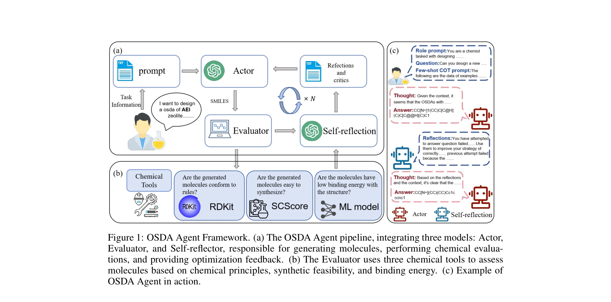
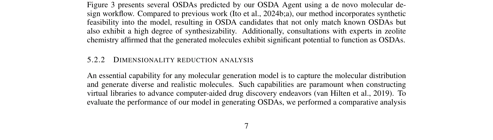
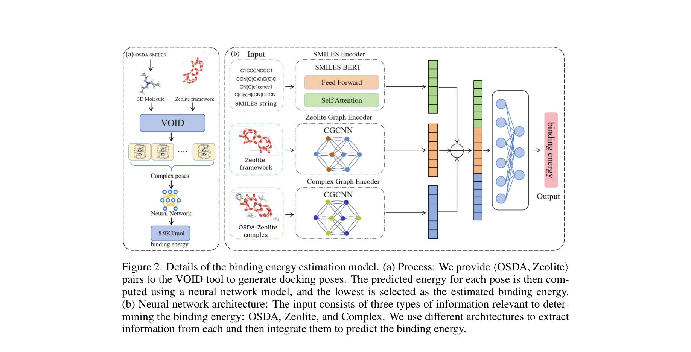

# OSDA Agent: Leveraging Large Language Models for De Novo Design of Organic Structure Directing Agents

> **저자**: Zhaolin Hu, Yixiao Zhou, Zhongan Wang, Xin Li, Weimin Yang | **날짜**: 2025 | **DOI**: N/A

---

## Essence

*Figure 1: OSDA Agent Framework. (a) The OSDA Agent pipeline, integrating three models: Actor,*

LLM을 핵심 지능으로 활용하고 계산화학 도구와 결합한 OSDA Agent 프레임워크를 제시하여, Actor-Evaluator-Self-reflector 구조로 제올라이트용 유기구조지향제의 de novo 설계를 수행한다.

## Motivation

- **Known**: 제올라이트 합성에는 공극 구조를 제어하는 OSDA 분자가 필수적이며, 기존 머신러닝과 휴리스틱 알고리즘은 OSDA 설계에 성공했으나 인터랙티브성이 부족하다. LLM은 뛰어난 추론과 소통 능력을 가지지만 화학 도메인 지식과 계산 능력이 제한적이다.
- **Gap**: LLM 기반 OSDA 생성은 피드백 통합 메커니즘이 없어 제어 불가능한 결과를 생성하며, 단순 텍스트-분자 변환 방식은 OSDA의 복잡성을 충분히 다루지 못한다.
- **Why**: 제올라이트는 석유화학 및 지속가능 화학의 핵심 소재이고, 효과적인 OSDA 설계는 기존의 시행착오 방식을 자동화하여 신약 개발 사이클을 단축할 수 있다.
- **Approach**: LLM의 생성 능력과 계산화학 도구(DFT, 분자역학)의 평가 능력을 iterative feedback loop로 통합하며, Self-reflector가 평가 결과를 요약하여 다음 생성 단계를 개선한다.

## Achievement

*Figure 3 presents several OSDAs predicted by our OSDA Agent using a de novo molecular de-*

- **OSDA Agent 프레임워크 제시**: Actor(구조 생성), Evaluator(계산화학 기반 평가), Self-reflector(반사적 요약)의 삼중 구조로 de novo 분자 설계를 수행
- **신규 binding energy 예측 모듈**: 복잡한 OSDA-제올라이트 상호작용을 capture하기 위한 기계학습 기반의 binding energy 추정 모듈 개발
- **실험 검증 OSDA와의 일치성**: 생성된 OSDA 후보가 실험적으로 검증된 기존 OSDA와 일관성을 보이며, 알려진 OSDA의 최적화에도 성공
- **반복 개선 메커니즘의 유효성**: generation-evaluation-reflection-refinement 워크플로우가 순수 LLM 모델 대비 우수한 생성 품질을 달성

## How

*Figure 2: Details of the binding energy estimation model. (a) Process: We provide ⟨OSDA, Zeolite⟩*

- **Actor 모듈**: GPT-4 등 LLM을 활용하여 제올라이트 구조와 설계 기준을 입력받아 다양한 OSDA 구조 생성
- **Evaluator 모듈**: RDKit 등 계산화학 도구로 생성된 분자의 화학적 타당성, 합성 복잡도(SCScore), binding energy를 정량 평가
- **Self-reflector 모듈**: Evaluator의 피드백을 종합 정리하여 설계 제약과 최적화 기준을 명확히 한 reflective summary 작성
- **Binding energy 예측 모델**: OSDB 데이터셋의 112,400개 OSDA-제올라이트 쌍과 구조 정보를 학습하여 계산 비용이 높은 DFT 없이 빠른 평가 가능하게 함
- **Iterative loop**: Actor → Evaluator → Self-reflector의 피드백 루프를 여러 라운드 반복하여 점진적으로 OSDA 품질 향상

## Originality

- LLM을 화학 도메인 도구와 결합하는 agent 아키텍처 설계가 선행 연구 대비 체계적 (ChemCrow 등은 독립적 도구 통합에 그침)
- Self-reflector의 반사적 요약 메커니즘으로 LLM의 제어 불가능성 문제를 해결하는 novel한 접근
- Binding energy 예측을 위한 hybrid 모듈 개발로 계산 효율과 정확성의 균형 달성
- OSDA 최적화와 de novo 설계를 동시에 수행하는 유연한 프레임워크

## Limitation & Further Study

- Binding energy 예측 모델이 학습 데이터셋(OSDB 112,400쌍)에 의존하므로 새로운 제올라이트 프레임워크에 대한 일반화 성능 불명확
- LLM의 화학 지식이 학습 데이터에 제한되어 있어 매우 novel한 분자 구조 제안에는 한계 가능성
- 계산화학 도구(RDKit, DFT)의 정확도에 의존하므로 도구 자체의 오류가 전체 시스템 성능에 영향
- 실제 합성 검증이 논문에서 보고되지 않아 in silico 평가와 실험적 타당성의 격차 확인 필요
- **후속 연구**: 더 큰 규모의 OSDA 데이터셋 수집, 다양한 제올라이트 프레임워크에 대한 성능 비교, 물리화학적 제약 조건의 더 엄밀한 통합, 실제 합성 단계로의 확장

## Evaluation

- Novelty: 4/5
- Technical Soundness: 3/5
- Significance: 4/5
- Clarity: 4/5
- Overall: 4/5

**총평**: LLM의 추론 능력과 계산화학 도구의 정확성을 systematic하게 결합한 novel한 agent 프레임워크로, OSDA 설계 자동화에 실질적 기여를 한다. 반사적 피드백 메커니즘이 LLM의 제어 불가능성을 효과적으로 완화하며, 실험 검증 데이터와의 일치성이 방법론의 타당성을 뒷받침한다.