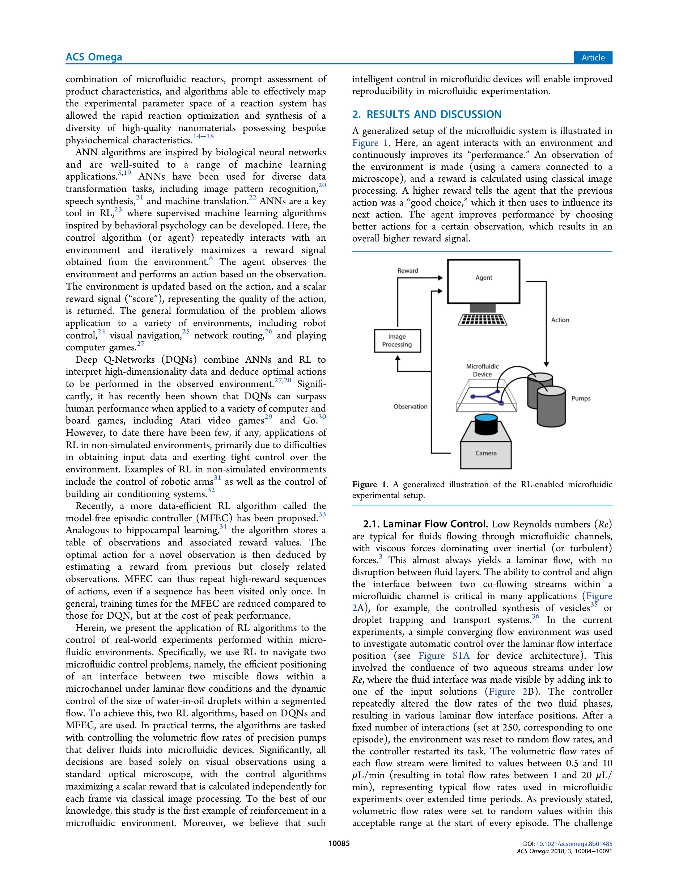

# Reinforcement Learning for Dynamic Microfluidic Control

> **저자**: Oliver J. Dressler, Philip D. Howes, Jaebum Choo, Andrew J. deMello | **날짜**: 2018-08-31 | **DOI**: [10.1021/acsomega.8b01485](https://doi.org/10.1021/acsomega.8b01485)

---

## Essence

*Figure 1. A generalized illustration of the RL-enabled microfluidic*

마이크로플루이딕 시스템의 동적 제어를 위해 Deep Q-Networks와 model-free episodic controller 기반의 reinforcement learning 알고리즘을 적용하여, 실제 실험 환경에서 laminar flow interface 위치 제어와 droplet 크기 제어를 자동화했다.

## Motivation

- **Known**: 마이크로플루이딕은 고속 실험에 강력한 도구이지만, 채널 fouling, 기판 변형, 온도/압력 변동으로 인해 장시간 운영 시 성능이 불안정하다. Machine learning은 이러한 문제를 완화할 가능성이 있다.
- **Gap**: 지금까지 RL은 주로 시뮬레이션 환경이나 로봇 제어 같은 제한된 실환경에만 적용되었으며, 실제 마이크로플루이딕 환경에서의 RL 기반 제어는 시도되지 않았다.
- **Why**: 마이크로플루이딕 실험의 자동화된 피드백 제어는 장시간 안정적인 운영과 높은 재현성을 가능하게 하여 고처리량 실험의 신뢰성과 효율성을 크게 향상시킬 수 있다.
- **Approach**: 광학 현미경으로 실시간 영상을 획득하고 고전적 이미지 처리로 스칼라 보상을 계산하여, DQN과 MFEC 알고리즘이 precision pump의 volumetric flow rate를 제어하도록 하는 reinforcement learning 프레임워크를 구축했다.

## Achievement

- **Laminar flow interface 제어**: DQN과 MFEC 모두 채널 너비의 30% 위치(목표)로 interface를 정확히 위치시키는 데 성공하여 인간 수준을 능가하는 성능을 달성했다.
- **Droplet 크기 제어**: 수중유적(water-in-oil) segmented flow에서 원하는 droplet 크기(30 μm)를 실시간으로 제어하는 데 성공했다.
- **실환경 RL 적용**: 마이크로플루이딕 환경에서 최초로 reinforcement learning을 비시뮬레이션 실험에 적용하였다.
- **알고리즘 비교**: DQN은 더 높은 최종 성능을, MFEC은 더 빠른 수렴을 보여 용도에 따른 선택 가능성을 입증했다.

## How

- 마이크로플루이딕 장치 설계: 수렴하는 채널에서 두 개의 aqueous stream을 co-flow시키고 잉크로 시각화
- 센서 시스템: 광학 현미경과 카메라로 실시간 영상 획득
- 보상 함수 설계: 고전적 이미지 처리를 통해 laminar flow interface 위치 또는 droplet 크기를 추출하고 목표값과의 근접도를 스칼라 보상으로 변환
- RL 알고리즘 구현: DQN (artificial neural network 기반)과 MFEC (hippocampal learning 영감)으로 flow rate 조절 정책을 학습
- 액션 공간: 5가지 이산 액션 (continuous phase flow rate 증가/감소, dispersed phase flow rate 증가/감소, 유지)
- 에피소드 구성: 250 상호작용 per 에피소드, 각 에피소드마다 random initial flow rate로 리셋
- Flow rate 범위: 0.5~10 μL/min (각 phase), 총 1~20 μL/min, step size 0.5 μL/min

## Originality

- 비시뮬레이션 실제 마이크로플루이딕 환경에서 RL을 처음 적용한 사례
- 광학 현미경 기반의 실시간 비전 피드백을 통한 closed-loop control 시스템 개발
- DQN과 MFEC이라는 서로 다른 특성의 RL 알고리즘을 동일한 마이크로플루이딕 제어 문제에 적용하여 비교 분석
- 고전적 이미지 처리와 deep RL의 결합으로 복잡한 유체 역학 문제를 자동 제어하는 실용적 방법론 제시

## Limitation & Further Study

- 두 가지 특정 제어 문제(laminar flow interface, droplet size)에만 적용되어 다른 마이크로플루이딕 작업으로의 일반화 가능성 미명확
- MFEC의 경우 DQN보다 최종 성능이 낮으므로 고정밀도가 필요한 응용에서는 제약이 있을 수 있음
- 장시간 실제 운영 중 fouling 및 기판 변형 같은 시간 의존적 성능 저하에 대한 적응 능력은 명시적으로 검증되지 않음
- 후속 연구: 다양한 마이크로플루이딕 응용(나노입자 합성, 세포 분류 등)으로 확장; online learning을 통한 장시간 드리프트 보정; transfer learning을 통한 device 간 일반화; 다변량 제어 문제(온도, 압력 포함) 확장

## Evaluation

- Novelty: 4/5
- Technical Soundness: 3/5
- Significance: 4/5
- Clarity: 4/5
- Overall: 4/5

**총평**: 마이크로플루이딕 분야에서 reinforcement learning을 처음 실제 실험에 적용한 선구적 연구로, DQN과 MFEC을 비교하며 실시간 비전 기반 자동 제어의 가능성을 명확히 입증했다. 마이크로플루이딕 실험의 자동화와 신뢰성 향상이라는 실질적 문제를 해결하는 중요한 기여이나, 범용성과 장시간 안정성에 대한 추가 검증이 필요하다.