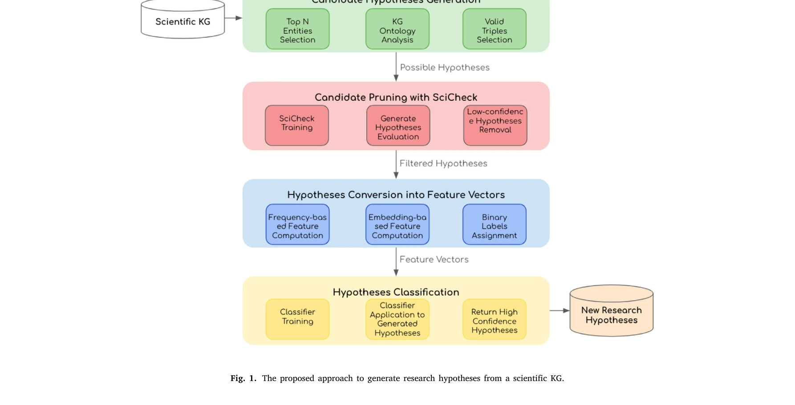
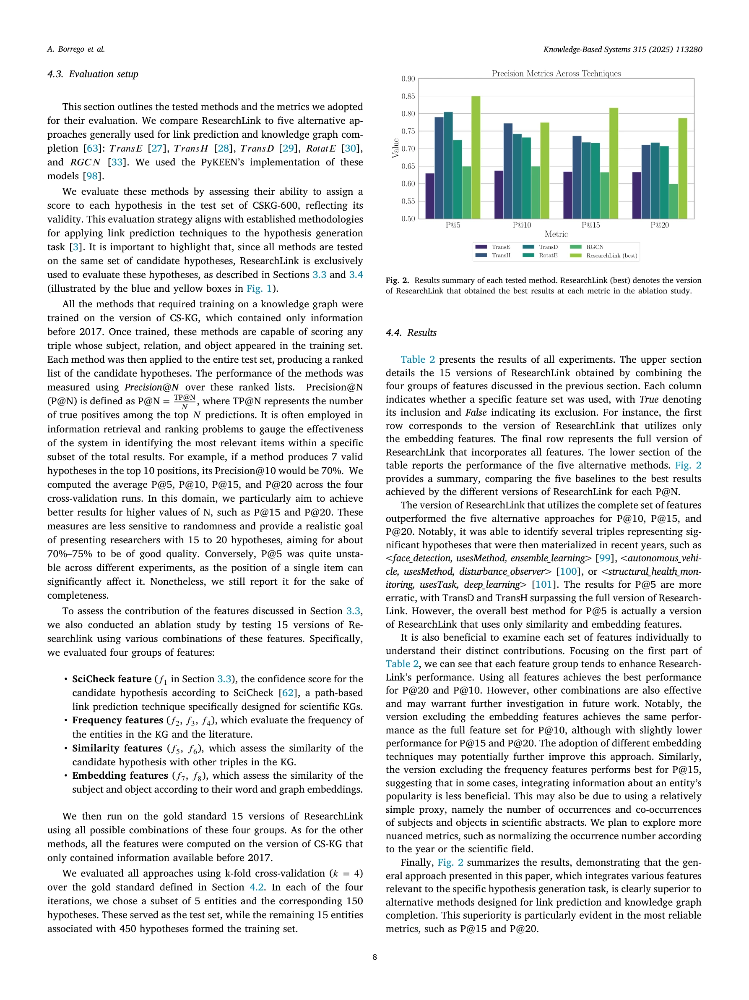

# Research hypothesis generation over scientific knowledge graphs

> **저자**: Agustín Borrego, Danilo Dessì, Daniel Ayala, Inma Hernández, Francesco Osborne, Diego Reforgiato Recupero, Davide Buscaldi, David Ruiz, Enrico Motta | **날짜**: 04/2025 | **DOI**: [10.1016/j.knosys.2025.113280](https://doi.org/10.1016/j.knosys.2025.113280)

---

## Essence

*Fig. 1. The proposed approach to generate research hypotheses from a scientific KG.*

ResearchLink는 knowledge graph의 경로 기반 특징, KGE, 텍스트 임베딩을 결합하여 과학 분야 전반에 걸쳐 도메인 독립적으로 연구 가설을 생성하는 방법론이다.

## Motivation

- **Known**: Link prediction은 knowledge graph 완성에 널리 사용되며, TransE, TransH, TransD, RotatE 등의 KGE 모델들이 표준적으로 적용되어 왔다. 가설 생성은 특히 생의학 분야에서 집중 연구되었으나 도메인 특화적 접근이 주를 이루었다.
- **Gap**: 기존 link prediction 방법들은 KG 완성에는 효과적이나 미래 연구 가설 예측에는 성능이 제한적이며, 텍스트 의미론적 맥락과 서지학적 정보를 충분히 활용하지 못한다. 또한 대부분의 가설 생성 연구가 생의학 분야에만 국한되어 있다.
- **Why**: 자동화된 가설 생성은 과학 발견을 가속화하고 다학제적 정보를 결합하여 혁신적 성과를 도출할 수 있으며, 도메인 독립적 방법론은 다양한 과학 분야에 적용 가능하다.
- **Approach**: ResearchLink는 path-based 특징과 KGE를 텍스트 임베딩(코퍼스에서의 엔티티 의미론적 맥락 포착) 및 서지학적 데이터베이스 정보와 통합하여 가설 생성을 수행한다.

## Achievement

*Fig. 2. Results summary of each tested method. ResearchLink (best) denotes the version*

- **ResearchLink 방법론**: path-based features, KGE, 텍스트 임베딩, 서지학적 정보를 종합적으로 결합한 도메인 독립적 가설 생성 프레임워크 제시
- **CSKG-600 데이터셋**: Computer Science Knowledge Graph에서 추출한 600개의 수동 검증된 가설 데이터셋 개발 및 공개
- **우수한 성능**: 78.7% P@20 달성으로 TransH (71.8%), TransD (71.7%), RotatE (70.7%) 등 기존 방법 대비 유의미한 성능 향상
- **재사용 가능한 오픈소스**: GitHub에 완전한 소스코드 공개로 다양한 도메인에 적용 가능하도록 함

## How

*Fig. 1. The proposed approach to generate research hypotheses from a scientific KG.*

- Knowledge graph의 경로 기반 특징 추출 (path-based features)
- TransE, TransH, TransD, RotatE 등 KGE 모델을 통한 엔티티 임베딩
- 과학 문헌 코퍼스에서 엔티티의 의미론적 맥락을 포착하는 텍스트 임베딩 통합
- 서지학적 데이터베이스에서의 엔티티 출현 빈도 및 연구 협력 정보 활용
- 다중 특징을 결합한 스코어링 함수로 가설 후보 순위 지정

## Originality

- 기존 KGE 모델 단독 사용에서 벗어나 path-based 특징, 텍스트 임베딩, 서지학적 정보를 종합적으로 통합하는 novel 조합 제시
- 완성'이 아닌 '미래 가설 예측'을 위해 trivial 예측을 필터링하고 의미 있는 가설을 생성하도록 설계", '도메인 특화 특징 없이도 다양한 과학 분야에 적용 가능한 도메인 독립적 방법론 개발
- 가설 생성을 위한 새로운 벤치마크 데이터셋 CSKG-600 구축 (기존 KG 완성 데이터셋과 구별)

## Limitation & Further Study

- 평가 시 Computer Science 분야만 대상으로 하여 다른 도메인에서의 일반화 가능성 미검증
- CSKG-600이 600개만 포함하여 대규모 데이터셋 대비 제한적 (다른 분야 데이터셋 부재)
- 텍스트 임베딩의 질이 사용된 코퍼스와 임베딩 모델에 의존하며, 새로운 영역에 대한 성능 저하 가능성
- 서지학적 정보 통합 과정에서 citation bias나 highly cited 연구에 대한 편향 가능성
- 후속 연구: 다양한 도메인(생의학, 물리학 등)에서의 평가 수행, LLM 기반 접근과의 비교, 시간 동적성을 고려한 가설 생성 방법 개발

## Evaluation

- Novelty: 4/5
- Technical Soundness: 3/5
- Significance: 4/5
- Clarity: 4/5
- Overall: 4/5

**총평**: ResearchLink는 기존의 단순 KGE 기반 link prediction 방법을 넘어 텍스트 의미론과 서지학적 맥락을 통합함으로써 실질적 연구 가설 생성에 적합한 창의적 방법론을 제시하며, 공개 데이터셋과 오픈소스를 통해 재현성과 확장성을 확보한 우수한 연구이다.